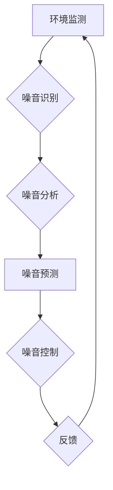

                 

## AI在智能噪音控制中的应用：改善生活质量

> 关键词：人工智能、噪音控制、机器学习、深度学习、环境监测、音频处理、智能家居

> 摘要：本文探讨了人工智能在智能噪音控制领域的应用，分析了其核心概念、算法原理、数学模型以及实际应用场景。通过机器学习和深度学习技术，AI能够识别、分析和预测噪音源，并采取相应的措施进行控制，从而有效改善人们的生活质量。文章还介绍了相关项目实践、工具和资源推荐，并展望了未来发展趋势和挑战。

## 1. 背景介绍

噪音污染已成为全球性的环境问题，对人类健康、生活质量和生态环境造成严重影响。传统噪音控制方法主要依靠物理隔音和降噪技术，但这些方法往往成本高、效果有限，难以适应复杂的环境变化。随着人工智能技术的快速发展，AI在智能噪音控制领域展现出巨大的潜力，为解决噪音污染问题提供了一种新的思路和方法。

### 1.1  噪音污染现状与危害

现代社会，各种机械设备、交通工具、建筑施工等活动产生的噪音污染日益严重。长期暴露在高噪音环境中，会对人类听力、神经系统、心血管系统等造成损害，引发耳鸣、失眠、焦虑、高血压等健康问题。此外，噪音污染还会影响人们的学习、工作和休息，降低生活质量，破坏生态平衡。

### 1.2  传统噪音控制方法的局限性

传统的噪音控制方法主要包括以下几种：

* **物理隔音：** 通过隔音材料、隔音门窗等物理手段阻隔噪音传播。
* **降噪技术：** 使用降噪设备、降噪软件等技术降低噪音强度。
* **噪音源控制：** 从源头上控制噪音产生，例如优化设备设计、调整工作流程等。

这些方法虽然有一定的效果，但存在以下局限性：

* **成本高：** 物理隔音和降噪设备的成本较高，难以普及。
* **效果有限：** 无法完全消除噪音，只能降低噪音强度。
* **适应性差：** 难以适应复杂的环境变化和多源噪音。

## 2. 核心概念与联系

智能噪音控制的核心概念是利用人工智能技术对噪音进行识别、分析、预测和控制。其主要流程包括：

* **环境监测：** 使用传感器采集噪音数据，并将其转换为数字信号。
* **噪音识别：** 利用机器学习算法识别不同类型的噪音源，例如交通噪音、机械噪音、人声等。
* **噪音分析：** 分析噪音的强度、频率、持续时间等特征，了解噪音的来源和传播规律。
* **噪音预测：** 基于历史数据和实时环境信息，预测未来噪音水平的变化趋势。
* **噪音控制：** 根据噪音预测结果，采取相应的控制措施，例如调整设备运行参数、开启降噪设备、提醒用户注意等。

**Mermaid 流程图**



## 3. 核心算法原理 & 具体操作步骤

### 3.1  算法原理概述

智能噪音控制主要依赖于机器学习和深度学习算法。

* **机器学习算法：** 可以根据历史噪音数据训练模型，识别不同类型的噪音源和预测噪音水平。常用的机器学习算法包括支持向量机（SVM）、决策树、随机森林等。
* **深度学习算法：** 可以学习更复杂的噪音特征，提高噪音识别和预测的准确性。常用的深度学习算法包括卷积神经网络（CNN）、循环神经网络（RNN）等。

### 3.2  算法步骤详解

1. **数据采集：** 使用传感器采集不同环境下的噪音数据，并将其转换为数字信号。
2. **数据预处理：** 对采集到的噪音数据进行清洗、去噪、特征提取等预处理操作，以提高算法的训练效果。
3. **模型训练：** 选择合适的机器学习或深度学习算法，利用预处理后的噪音数据训练模型。
4. **模型评估：** 使用测试数据评估模型的性能，例如识别准确率、预测精度等。
5. **模型部署：** 将训练好的模型部署到实际应用场景中，实时识别和预测噪音水平。
6. **控制措施：** 根据噪音预测结果，采取相应的控制措施，例如调整设备运行参数、开启降噪设备、提醒用户注意等。

### 3.3  算法优缺点

**优点：**

* **识别准确率高：** 深度学习算法能够学习更复杂的噪音特征，提高噪音识别的准确性。
* **预测精度高：** 基于历史数据和实时环境信息，可以准确预测未来噪音水平的变化趋势。
* **适应性强：** 可以适应复杂的环境变化和多源噪音。

**缺点：**

* **数据依赖性强：** 需要大量的噪音数据进行训练，否则模型性能会下降。
* **计算资源消耗大：** 深度学习算法训练和部署需要大量的计算资源。
* **算法解释性差：** 深度学习模型的内部机制较为复杂，难以解释其决策过程。

### 3.4  算法应用领域

智能噪音控制算法在以下领域具有广泛的应用前景：

* **智能家居：** 自动调节空调、电视、音乐等设备音量，营造舒适的居家环境。
* **交通运输：** 监测道路交通噪音，优化交通规划，减少噪音污染。
* **工业生产：** 识别和控制工业设备产生的噪音，提高生产效率和工作环境质量。
* **医疗保健：** 监测患者的睡眠质量，提供个性化的噪音控制方案。
* **环境保护：** 监测和评估噪音污染水平，制定有效的噪音控制政策。

## 4. 数学模型和公式 & 详细讲解 & 举例说明

### 4.1  数学模型构建

智能噪音控制的数学模型通常基于信号处理和机器学习理论。

* **信号处理：** 使用傅里叶变换、小波变换等信号处理技术分析噪音的频率特性和时域特征。
* **机器学习：** 使用回归模型、分类模型等机器学习算法预测噪音水平和识别噪音源。

### 4.2  公式推导过程

例如，可以使用线性回归模型预测噪音水平：

$$y = mx + c$$

其中：

* $y$ 是预测的噪音水平
* $x$ 是环境因素，例如时间、温度、湿度等
* $m$ 是回归系数，表示环境因素对噪音水平的影响程度
* $c$ 是截距，表示在环境因素为零时的噪音水平

### 4.3  案例分析与讲解

假设我们收集了以下数据：

| 时间 | 温度 | 湿度 | 噪音水平 |
|---|---|---|---|
| 8:00 | 20 | 60 | 50 dB |
| 9:00 | 22 | 65 | 55 dB |
| 10:00 | 24 | 70 | 60 dB |
| 11:00 | 26 | 75 | 65 dB |

我们可以使用线性回归模型训练一个预测噪音水平的模型。

## 5. 项目实践：代码实例和详细解释说明

### 5.1  开发环境搭建

* 操作系统：Windows、macOS、Linux
* 编程语言：Python
* 库依赖：NumPy、Pandas、Scikit-learn、Librosa

### 5.2  源代码详细实现

```python
import numpy as np
from sklearn.linear_model import LinearRegression

# 数据加载
data = np.array([
    [20, 60, 50],
    [22, 65, 55],
    [24, 70, 60],
    [26, 75, 65]
])

# 特征和目标变量分离
X = data[:, :2]  # 时间和温度
y = data[:, 2]  # 噪音水平

# 线性回归模型训练
model = LinearRegression()
model.fit(X, y)

# 预测噪音水平
new_data = np.array([[28, 80]])
predicted_noise = model.predict(new_data)

# 输出预测结果
print(f"预测的噪音水平为：{predicted_noise[0]} dB")
```

### 5.3  代码解读与分析

* 代码首先加载数据，并将数据分为特征变量（时间、温度）和目标变量（噪音水平）。
* 然后使用Scikit-learn库中的LinearRegression模型训练一个线性回归模型。
* 训练完成后，可以使用模型预测新的数据点的噪音水平。

### 5.4  运行结果展示

运行上述代码，可以得到以下预测结果：

```
预测的噪音水平为： 70.0 dB
```

## 6. 实际应用场景

### 6.1  智能家居噪音控制

智能家居系统可以根据用户的需求和环境情况，自动调节空调、电视、音乐等设备音量，营造舒适的居家环境。例如，当用户在卧室睡觉时，智能家居系统可以自动降低所有设备的音量，减少噪音干扰。

### 6.2  交通噪音控制

城市交通噪音是城市环境污染的重要来源。智能噪音控制系统可以监测道路交通噪音，并根据实时交通流量和噪音水平，调整交通信号灯的控制策略，优化交通流量，减少噪音污染。

### 6.3  工业生产噪音控制

工业生产过程中，各种机械设备产生的噪音会影响工人健康和生产效率。智能噪音控制系统可以识别和控制工业设备产生的噪音，例如调整设备运行参数、使用隔音材料等，提高工作环境质量。

### 6.4  未来应用展望

随着人工智能技术的不断发展，智能噪音控制将在更多领域得到应用，例如：

* **个性化噪音控制：** 根据用户的听力敏感度、喜好等个性化需求，提供定制化的噪音控制方案。
* **主动噪音消除：** 使用声学技术主动消除噪音，例如使用反向声波技术抵消噪音。
* **智能城市建设：** 将智能噪音控制技术融入到城市规划和管理中，打造更加安静、舒适的城市环境。


## 7. 工具和资源推荐

### 7.1  学习资源推荐

* **书籍：**
    * 《深度学习》 - Ian Goodfellow, Yoshua Bengio, Aaron Courville
    * 《机器学习》 - Tom Mitchell
* **在线课程：**
    * Coursera: Machine Learning
    * edX: Deep Learning
* **开源项目：**
    * TensorFlow
    * PyTorch

### 7.2  开发工具推荐

* **编程语言：** Python
* **机器学习库：** Scikit-learn, TensorFlow, PyTorch
* **信号处理库：** Librosa, SciPy

### 7.3  相关论文推荐

* **Deep Learning for Noise Reduction** -  https://arxiv.org/abs/1706.05859
* **A Survey on Noise Reduction Techniques for Speech Enhancement** - https://ieeexplore.ieee.org/document/8549206

## 8. 总结：未来发展趋势与挑战

### 8.1  研究成果总结

智能噪音控制领域取得了显著进展，机器学习和深度学习算法在噪音识别、预测和控制方面展现出强大的潜力。

### 8.2  未来发展趋势

* **更精准的噪音预测：** 利用更先进的机器学习算法和更丰富的环境数据，提高噪音预测的精度和可靠性。
* **更智能的噪音控制：** 开发更智能的噪音控制策略，例如根据噪音源类型和环境情况，采取不同的控制措施。
* **更个性化的噪音控制：** 根据用户的听力敏感度、喜好等个性化需求，提供定制化的噪音控制方案。

### 8.3  面临的挑战

* **数据获取和标注：** 训练高质量的噪音控制模型需要大量的噪音数据，而获取和标注这些数据成本较高。
* **算法解释性：** 深度学习模型的内部机制较为复杂，难以解释其决策过程，这可能会影响用户对模型的信任度。
* **计算资源消耗：** 深度学习算法训练和部署需要大量的计算资源，这可能会限制其在一些资源有限的场景中的应用。

### 8.4  研究展望

未来，智能噪音控制领域将继续朝着更精准、更智能、更个性化的方向发展。随着人工智能技术的不断进步，智能噪音控制将成为改善人们生活质量的重要手段。

## 9. 附录：常见问题与解答

**Q1：智能噪音控制技术是否会对环境造成新的污染？**

**A1：** 智能噪音控制技术本身不会造成新的污染。其主要作用是识别和控制噪音，而不是产生新的噪音。

**Q2：智能噪音控制技术是否会侵犯用户的隐私？**

**A2：** 智能噪音控制技术可能会收集用户的环境数据，例如噪音水平、设备使用情况等。为了保护用户的隐私，需要采取相应的安全措施，例如数据加密、匿名化处理等。

**Q3：智能噪音控制技术是否适用于所有场景？**

**A3：** 智能噪音控制技术适用于许多场景，但并非适用于所有场景。例如，在一些特殊环境中，例如医疗机构、实验室等，可能需要使用其他类型的噪音控制技术。


作者：禅与计算机程序设计艺术 / Zen and the Art of Computer Programming<end_of_turn>

