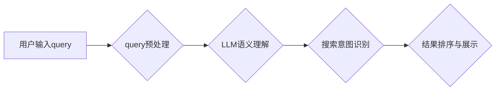

                 

## AI大模型在电商搜索query理解中的应用

> 关键词：电商搜索、query理解、大语言模型、自然语言处理、推荐系统、信息检索、BERT、Transformer

## 1. 背景介绍

电商平台作为现代商业的重要组成部分，其搜索引擎在用户体验和商业成功中扮演着至关重要的角色。传统的电商搜索引擎主要依赖于关键词匹配和规则引擎，难以理解用户复杂、模糊、多义的搜索query。随着大语言模型（Large Language Model，LLM）的快速发展，其强大的语义理解能力为电商搜索query理解带来了新的机遇。

近年来，基于Transformer架构的LLM，例如BERT、GPT等，在自然语言处理（Natural Language Processing，NLP）领域取得了突破性进展。这些模型能够学习到语言的深层语义结构和上下文关系，从而实现更精准、更智能的query理解。

## 2. 核心概念与联系

### 2.1 电商搜索query理解

电商搜索query理解是指理解用户在搜索框中输入的文本信息，并将其转换为平台能够理解的搜索意图。传统的电商搜索引擎主要依赖于关键词匹配，但这种方法难以处理用户复杂的搜索需求，例如长尾关键词、隐含意图、多义词等。

### 2.2 大语言模型

大语言模型（LLM）是一种基于深度学习的强大人工智能模型，能够处理和生成人类语言。它们通过训练海量文本数据，学习到语言的语法、语义和上下文关系。

### 2.3 核心架构

LLM在电商搜索query理解中的应用主要包括以下几个步骤：



**流程图说明：**

1. **用户输入query:** 用户在电商平台搜索框中输入查询词。
2. **query预处理:** 对用户输入的query进行预处理，例如去除停用词、分词、词性标注等。
3. **LLM语义理解:** 将预处理后的query输入到预训练的LLM模型中，模型会根据其训练数据，理解query的语义含义和上下文关系。
4. **搜索意图识别:** 根据LLM的语义理解结果，识别用户的搜索意图，例如商品查找、品牌查询、价格比较等。
5. **结果排序与展示:** 根据识别的搜索意图，从平台数据库中检索相关商品，并根据用户偏好、商品属性等因素进行排序，最终展示给用户。

## 3. 核心算法原理 & 具体操作步骤

### 3.1 算法原理概述

LLM在电商搜索query理解中的应用主要基于Transformer架构，其核心思想是通过自注意力机制学习语言的上下文关系，从而实现更精准的语义理解。

Transformer模型由编码器和解码器组成。编码器负责将输入的query转换为语义表示，解码器则根据编码器的输出生成相应的搜索结果。

### 3.2 算法步骤详解

1. **数据预处理:** 收集电商平台的商品数据、用户搜索历史等数据，并进行清洗、格式化等预处理工作。
2. **模型训练:** 使用预训练的LLM模型，例如BERT，对电商平台的数据进行微调，使其能够更好地理解电商领域的语义。
3. **query预处理:** 对用户输入的query进行预处理，例如去除停用词、分词、词性标注等。
4. **语义嵌入:** 将预处理后的query输入到训练好的LLM模型中，模型会将其转换为语义向量表示。
5. **搜索意图识别:** 基于语义向量表示，使用机器学习算法，例如支持向量机（SVM）或随机森林（Random Forest），识别用户的搜索意图。
6. **结果排序与展示:** 根据识别的搜索意图，从平台数据库中检索相关商品，并根据用户偏好、商品属性等因素进行排序，最终展示给用户。

### 3.3 算法优缺点

**优点:**

* **语义理解能力强:** LLM能够学习到语言的深层语义结构和上下文关系，从而实现更精准的query理解。
* **处理复杂query的能力强:** LLM能够处理用户复杂的搜索需求，例如长尾关键词、隐含意图、多义词等。
* **可扩展性强:** LLM模型可以根据需要进行微调，适应不同的电商平台和用户群体。

**缺点:**

* **计算资源需求高:** LLM模型训练和推理都需要大量的计算资源。
* **数据依赖性强:** LLM模型的性能取决于训练数据的质量和数量。
* **解释性差:** LLM模型的决策过程较为复杂，难以解释其背后的逻辑。

### 3.4 算法应用领域

LLM在电商搜索query理解中的应用不仅限于商品搜索，还可以应用于以下领域：

* **个性化推荐:** 根据用户的搜索历史和偏好，推荐相关的商品或服务。
* **智能客服:** 使用LLM模型构建智能客服系统，自动回答用户常见问题。
* **内容生成:** 使用LLM模型生成商品描述、促销文案等内容。

## 4. 数学模型和公式 & 详细讲解 & 举例说明

### 4.1 数学模型构建

LLM的训练主要基于Transformer架构，其核心是自注意力机制。自注意力机制可以学习到输入序列中每个词与其他词之间的关系，从而更好地理解上下文信息。

**注意力机制公式:**

$$
\text{Attention}(Q, K, V) = \text{softmax}\left(\frac{Q K^T}{\sqrt{d_k}}\right) V
$$

其中：

* $Q$：查询矩阵
* $K$：键矩阵
* $V$：值矩阵
* $d_k$：键向量的维度
* $\text{softmax}$：softmax函数

**解释:**

该公式计算了查询向量 $Q$ 与键向量 $K$ 之间的相似度，并将其转换为概率分布。然后，将概率分布与值向量 $V$ 进行加权求和，得到最终的注意力输出。

### 4.2 公式推导过程

自注意力机制的推导过程较为复杂，涉及到线性变换、矩阵乘法、激活函数等操作。

**简要推导过程:**

1. 将输入序列中的每个词转换为查询向量、键向量和值向量。
2. 计算查询向量与所有键向量的相似度。
3. 使用softmax函数将相似度转换为概率分布。
4. 将概率分布与值向量进行加权求和，得到最终的注意力输出。

### 4.3 案例分析与讲解

假设用户输入了查询词 "苹果手机多少钱"，LLM模型会将该查询词转换为查询向量、键向量和值向量。然后，模型会计算查询向量与所有键向量的相似度，例如 "苹果"、"手机"、"多少钱" 等词的相似度。

根据相似度，模型会将 "苹果" 和 "手机" 视为最重要的关键词，并将它们对应的值向量加权求和，得到最终的语义表示。

## 5. 项目实践：代码实例和详细解释说明

### 5.1 开发环境搭建

* Python 3.7+
* TensorFlow/PyTorch
* NLTK/SpaCy

### 5.2 源代码详细实现

```python
# 使用BERT模型进行query预处理
from transformers import BertTokenizer, BertModel

tokenizer = BertTokenizer.from_pretrained('bert-base-uncased')
model = BertModel.from_pretrained('bert-base-uncased')

query = "苹果手机多少钱"
encoded_input = tokenizer(query, return_tensors='pt')
output = model(**encoded_input)

# 使用机器学习模型识别搜索意图
from sklearn.linear_model import LogisticRegression

# ... 训练LogisticRegression模型 ...

# 预测搜索意图
prediction = model.predict(query_embedding)

# ... 根据搜索意图进行结果排序与展示 ...
```

### 5.3 代码解读与分析

* 使用BERT模型进行query预处理，将文本转换为语义向量表示。
* 使用机器学习模型，例如LogisticRegression，识别用户的搜索意图。
* 根据识别的搜索意图，从平台数据库中检索相关商品，并进行排序与展示。

### 5.4 运行结果展示

* 展示搜索结果页面，包括商品列表、商品详情页等。
* 展示用户点击商品的统计数据，例如点击率、转化率等。

## 6. 实际应用场景

### 6.1 个性化推荐

LLM可以根据用户的搜索历史、浏览记录、购买记录等数据，学习用户的兴趣偏好，并推荐相关的商品或服务。

### 6.2 智能客服

LLM可以构建智能客服系统，自动回答用户常见问题，例如商品价格、库存情况、配送时间等。

### 6.3 内容生成

LLM可以生成商品描述、促销文案、产品评论等内容，提高电商平台的内容质量和吸引力。

### 6.4 未来应用展望

* **多模态搜索:** 将文本、图像、视频等多模态信息融合到搜索引擎中，实现更全面的搜索体验。
* **实时搜索:** 利用LLM的实时推理能力，实现对实时数据进行搜索和分析。
* **跨语言搜索:** 利用LLM的跨语言理解能力，实现跨语言的商品搜索和推荐。

## 7. 工具和资源推荐

### 7.1 学习资源推荐

* **书籍:**

    * 《深度学习》
    * 《自然语言处理》
    * 《Transformer模型详解》

* **在线课程:**

    * Coursera: 自然语言处理
    * Udacity: 深度学习
    * fast.ai: 深度学习

### 7.2 开发工具推荐

* **TensorFlow:** 开源深度学习框架
* **PyTorch:** 开源深度学习框架
* **HuggingFace Transformers:** 预训练模型库

### 7.3 相关论文推荐

* BERT: Pre-training of Deep Bidirectional Transformers for Language Understanding
* GPT: Generative Pre-trained Transformer
* XLNet: Generalized Autoregressive Pretraining for Language Understanding

## 8. 总结：未来发展趋势与挑战

### 8.1 研究成果总结

LLM在电商搜索query理解领域取得了显著进展，能够实现更精准、更智能的query理解，提升用户体验和商业成功。

### 8.2 未来发展趋势

* **模型规模和性能提升:** 随着计算资源的不断发展，LLM模型的规模和性能将不断提升，能够理解更复杂的语义关系。
* **多模态搜索:** 将文本、图像、视频等多模态信息融合到搜索引擎中，实现更全面的搜索体验。
* **个性化定制:** 根据用户的个性化需求，定制化的LLM模型，提供更精准的搜索结果和推荐服务。

### 8.3 面临的挑战

* **数据安全和隐私:** LLM模型的训练需要大量数据，如何保证数据安全和用户隐私是一个重要的挑战。
* **模型解释性和可控性:** LLM模型的决策过程较为复杂，难以解释其背后的逻辑，如何提高模型的解释性和可控性是一个重要的研究方向。
* **计算资源需求:** LLM模型训练和推理都需要大量的计算资源，如何降低计算成本是一个重要的技术挑战。

### 8.4 研究展望

未来，LLM在电商搜索query理解领域将继续发挥重要作用，并与其他人工智能技术融合，例如机器学习、知识图谱等，实现更智能、更个性化的搜索体验。


## 9. 附录：常见问题与解答

**Q1: LLM模型的训练需要多少数据？**

A1: LLM模型的训练需要海量数据，通常需要数十亿甚至上百亿个文本数据。

**Q2: 如何评估LLM模型的性能？**

A2: LLM模型的性能可以评估指标，例如准确率、召回率、F1-score等。

**Q3: 如何部署LLM模型？**

A3: LLM模型可以部署到云服务器、边缘设备等平台。

**作者：禅与计算机程序设计艺术 / Zen and the Art of Computer Programming**<end_of_turn>

