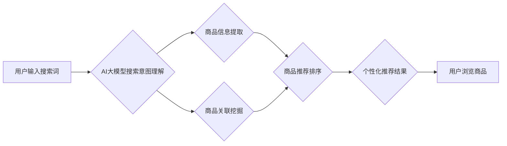

                 

## AI大模型赋能电商搜索推荐的商业价值分析

> 关键词：AI大模型、电商搜索、推荐系统、自然语言处理、深度学习、商业价值、用户体验

## 1. 背景介绍

随着电商行业的蓬勃发展，用户对商品搜索和推荐的需求日益增长。传统的基于关键词匹配和协同过滤的搜索推荐系统已经难以满足用户个性化、精准化的需求。近年来，大规模语言模型（LLM）的快速发展为电商搜索推荐领域带来了新的机遇。

AI大模型，特别是基于Transformer架构的模型，凭借其强大的语义理解和文本生成能力，能够更好地理解用户搜索意图，挖掘商品之间的潜在关联，并提供更精准、更个性化的推荐结果。

## 2. 核心概念与联系

### 2.1  电商搜索推荐系统

电商搜索推荐系统是电商平台的核心功能之一，旨在帮助用户快速找到所需商品，并提供个性化的商品推荐。传统的电商搜索推荐系统主要基于以下两种方法：

* **关键词匹配:** 根据用户输入的关键词，从商品数据库中检索出包含相关关键词的商品。
* **协同过滤:** 基于用户历史购买行为或浏览记录，推荐与用户相似用户购买或浏览过的商品。

### 2.2  AI大模型

AI大模型是指在海量数据上训练的深度学习模型，具有强大的泛化能力和学习能力。常见的AI大模型包括GPT-3、BERT、LaMDA等。

### 2.3  AI大模型赋能电商搜索推荐

AI大模型可以应用于电商搜索推荐系统的各个环节，例如：

* **搜索意图理解:** 利用AI大模型对用户搜索词进行语义分析，理解用户的真实需求。
* **商品信息提取:** 从商品描述、评论等文本数据中提取商品属性、特征等信息。
* **商品关联挖掘:** 利用AI大模型学习商品之间的语义关联，挖掘潜在的商品推荐关系。
* **个性化推荐:** 基于用户的历史行为、偏好等信息，利用AI大模型生成个性化的商品推荐列表。

**AI大模型赋能电商搜索推荐系统架构图**



## 3. 核心算法原理 & 具体操作步骤

### 3.1  算法原理概述

AI大模型赋能电商搜索推荐的核心算法主要基于深度学习技术，包括：

* **Transformer模型:** Transformer模型是一种基于注意力机制的深度学习模型，能够有效地捕捉文本序列中的长距离依赖关系，在自然语言处理任务中取得了优异的性能。
* **BERT模型:** BERT模型是一种预训练语言模型，通过在大量的文本数据上进行预训练，学习了丰富的语言知识，可以用于各种自然语言处理任务，包括搜索意图理解、商品信息提取等。
* **推荐算法:** 传统的推荐算法，如协同过滤、基于内容的推荐等，可以与AI大模型结合，提升推荐效果。

### 3.2  算法步骤详解

1. **数据预处理:** 收集电商平台的商品数据、用户行为数据等，进行清洗、格式化、特征提取等预处理工作。
2. **模型训练:** 利用预训练的AI大模型，对电商平台的数据进行训练，学习商品之间的语义关联、用户搜索意图等知识。
3. **模型评估:** 利用测试数据对训练好的模型进行评估，评估模型的性能，例如准确率、召回率、点击率等。
4. **模型部署:** 将训练好的模型部署到电商平台的搜索推荐系统中，实时处理用户搜索请求，提供个性化的商品推荐结果。

### 3.3  算法优缺点

**优点:**

* **提升搜索精准度:** AI大模型能够更好地理解用户搜索意图，提高搜索结果的精准度。
* **个性化推荐:** AI大模型可以根据用户的历史行为、偏好等信息，提供个性化的商品推荐，提升用户体验。
* **挖掘潜在关联:** AI大模型可以挖掘商品之间的潜在关联，推荐用户可能感兴趣但未曾搜索过的商品。

**缺点:**

* **数据依赖:** AI大模型的性能依赖于训练数据的质量和数量。
* **计算资源消耗:** 训练大型AI模型需要大量的计算资源。
* **模型解释性:** AI大模型的决策过程较为复杂，难以解释模型的决策逻辑。

### 3.4  算法应用领域

AI大模型赋能电商搜索推荐的应用领域广泛，包括：

* **商品搜索:** 提升商品搜索的精准度和效率。
* **商品推荐:** 提供个性化、精准的商品推荐。
* **用户画像:** 建立用户画像，了解用户的兴趣爱好和消费习惯。
* **内容推荐:** 推荐与用户兴趣相关的商品资讯、优惠活动等。

## 4. 数学模型和公式 & 详细讲解 & 举例说明

### 4.1  数学模型构建

AI大模型的训练过程本质上是一个优化问题，目标是找到一个模型参数，使得模型在训练数据上的损失函数最小。常用的损失函数包括交叉熵损失函数、均方误差损失函数等。

**交叉熵损失函数:**

$$
H(p,q) = -\sum_{i=1}^{n} p(i) \log q(i)
$$

其中：

* $p(i)$ 是真实标签的概率分布。
* $q(i)$ 是模型预测的概率分布。

**均方误差损失函数:**

$$
MSE(p,q) = \frac{1}{n} \sum_{i=1}^{n} (p(i) - q(i))^2
$$

其中：

* $p(i)$ 是真实标签。
* $q(i)$ 是模型预测值。

### 4.2  公式推导过程

AI大模型的训练过程通常使用梯度下降算法进行优化。梯度下降算法的基本思想是：沿着梯度方向更新模型参数，使得损失函数不断减小。

**梯度下降算法公式:**

$$
\theta = \theta - \alpha \nabla_{\theta} L(\theta)
$$

其中：

* $\theta$ 是模型参数。
* $\alpha$ 是学习率。
* $\nabla_{\theta} L(\theta)$ 是损失函数对模型参数的梯度。

### 4.3  案例分析与讲解

假设我们训练一个AI大模型用于商品推荐，目标是预测用户对商品的点击概率。我们可以使用交叉熵损失函数作为损失函数，并使用梯度下降算法进行模型训练。

在训练过程中，模型会不断更新参数，使得预测的点击概率与真实点击概率之间的差距最小化。最终训练出来的模型能够根据用户的历史行为和商品信息，预测用户对商品的点击概率，并推荐用户可能感兴趣的商品。

## 5. 项目实践：代码实例和详细解释说明

### 5.1  开发环境搭建

为了实现AI大模型赋能电商搜索推荐，需要搭建相应的开发环境。常用的开发环境包括：

* **Python:** Python是一种流行的编程语言，广泛应用于数据科学、机器学习等领域。
* **深度学习框架:** TensorFlow、PyTorch等深度学习框架提供了丰富的工具和库，方便进行AI模型的开发和训练。
* **云计算平台:** AWS、Azure、GCP等云计算平台提供了强大的计算资源和存储服务，可以用于训练大型AI模型。

### 5.2  源代码详细实现

以下是一个使用PyTorch框架实现商品推荐的简单代码示例：

```python
import torch
import torch.nn as nn

class RecommenderModel(nn.Module):
    def __init__(self, embedding_dim, num_users, num_items):
        super(RecommenderModel, self).__init__()
        self.user_embedding = nn.Embedding(num_users, embedding_dim)
        self.item_embedding = nn.Embedding(num_items, embedding_dim)
        self.fc = nn.Linear(embedding_dim * 2, 1)

    def forward(self, user_id, item_id):
        user_embedding = self.user_embedding(user_id)
        item_embedding = self.item_embedding(item_id)
        combined_embedding = torch.cat((user_embedding, item_embedding), dim=1)
        output = self.fc(combined_embedding)
        return output

# ... (数据加载、模型训练、评估等代码)
```

### 5.3  代码解读与分析

该代码定义了一个简单的商品推荐模型，该模型使用嵌入层将用户和商品ID映射到低维向量空间，然后使用全连接层计算用户对商品的点击概率。

### 5.4  运行结果展示

训练好的模型可以用于预测用户对商品的点击概率，并根据预测结果生成商品推荐列表。

## 6. 实际应用场景

### 6.1  电商平台搜索推荐

AI大模型可以应用于电商平台的商品搜索和推荐系统，提升用户搜索体验和转化率。

### 6.2  个性化营销

AI大模型可以分析用户的行为数据，构建用户画像，并进行个性化营销，例如推荐用户感兴趣的商品、优惠活动等。

### 6.3  内容推荐

AI大模型可以分析用户的兴趣爱好，推荐与用户相关的商品资讯、优惠活动等内容。

### 6.4  未来应用展望

随着AI技术的不断发展，AI大模型在电商搜索推荐领域的应用场景将更加广泛，例如：

* **多模态推荐:** 将文本、图像、视频等多模态数据融合，提供更丰富的商品推荐。
* **实时推荐:** 利用实时数据流，进行动态的商品推荐。
* **跨平台推荐:** 将用户行为数据整合，实现跨平台的个性化推荐。

## 7. 工具和资源推荐

### 7.1  学习资源推荐

* **课程:** Coursera、edX等平台提供深度学习相关的课程。
* **书籍:** 《深度学习》、《自然语言处理》等书籍。
* **博客:** TensorFlow博客、PyTorch博客等。

### 7.2  开发工具推荐

* **深度学习框架:** TensorFlow、PyTorch、Keras等。
* **云计算平台:** AWS、Azure、GCP等。
* **数据处理工具:** Pandas、NumPy等。

### 7.3  相关论文推荐

* **BERT:** Devlin et al. (2018). BERT: Pre-training of Deep Bidirectional Transformers for Language Understanding.
* **Transformer:** Vaswani et al. (2017). Attention Is All You Need.

## 8. 总结：未来发展趋势与挑战

### 8.1  研究成果总结

AI大模型赋能电商搜索推荐取得了显著的成果，提升了搜索精准度、个性化推荐效果，并为电商平台带来了新的商业价值。

### 8.2  未来发展趋势

未来，AI大模型在电商搜索推荐领域将继续发展，主要趋势包括：

* **模型规模和能力提升:** 模型规模将进一步扩大，模型能力将更加强大，能够处理更复杂的任务。
* **多模态融合:** 将文本、图像、视频等多模态数据融合，提供更丰富的商品推荐。
* **实时推荐:** 利用实时数据流，进行动态的商品推荐。
* **解释性增强:** 提升AI模型的解释性，使得模型决策更加透明。

### 8.3  面临的挑战

AI大模型在电商搜索推荐领域也面临一些挑战，例如：

* **数据质量:** AI模型的性能依赖于训练数据的质量，需要不断收集和清洗高质量的数据。
* **计算资源:** 训练大型AI模型需要大量的计算资源，成本较高。
* **模型解释性:** AI模型的决策过程较为复杂，难以解释模型的决策逻辑，需要进一步研究模型解释性问题。

### 8.4  研究展望

未来，需要继续研究AI大模型在电商搜索推荐领域的应用，探索新的应用场景，提升模型性能，解决模型面临的挑战，推动AI技术在电商领域的落地应用。

## 9. 附录：常见问题与解答

### 9.1  常见问题

* **AI大模型训练需要多少数据？**

AI模型训练的数据量取决于模型的复杂度和任务的难度。一般来说，训练大型AI模型需要海量数据，例如数十亿甚至上百亿条数据。

* **AI大模型训练需要多少计算资源？**

训练大型AI模型需要大量的计算资源，例如高性能GPU、TPU等。

* **如何评估AI大模型的性能？**

常用的评估指标包括准确率、召回率、F1-score、AUC等。

* **如何解释AI大模型的决策逻辑？**

目前，解释AI模型决策逻辑的方法包括：

* **可解释性模型:** 使用可解释性模型，例如线性回归模型，进行预测。
* **模型可视化:** 使用可视化工具，例如TensorBoard，可视化模型的结构和参数。
* **特征重要性分析:** 分析模型对哪些特征更加敏感，从而理解模型的决策逻辑。


作者：禅与计算机程序设计艺术 / Zen and the Art of Computer Programming<end_of_turn>

