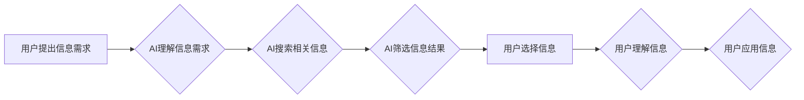

                 

## AI如何改变我们获取信息的方式

> 关键词：人工智能、信息获取、自然语言处理、机器学习、深度学习、知识图谱、信息检索、个性化推荐

## 1. 背景介绍

信息时代，获取信息的速度和效率直接关系到个人和社会的发展。传统的信息获取方式，例如搜索引擎、图书馆、新闻媒体等，虽然已经取得了长足的进步，但仍然存在一些局限性。例如，搜索引擎的结果往往是大量冗余的信息，需要用户花费大量时间筛选；图书馆的资源有限，难以满足所有用户的需求；新闻媒体的信息往往带有主观色彩，难以保证客观公正。

近年来，人工智能（AI）技术飞速发展，为信息获取方式带来了革命性的变革。AI能够通过学习海量数据，识别和理解人类语言，并根据用户的需求提供个性化、精准的信息服务。

## 2. 核心概念与联系

### 2.1 信息获取流程

信息获取是一个复杂的过程，通常包括以下几个步骤：

1. **信息需求识别:** 用户明确自己的信息需求。
2. **信息搜索:** 用户使用搜索引擎、数据库等工具搜索相关信息。
3. **信息筛选:** 用户从搜索结果中筛选出相关、可靠的信息。
4. **信息理解:** 用户理解和吸收筛选出的信息。
5. **信息应用:** 用户将获取的信息应用于实际场景。

### 2.2 AI在信息获取中的作用

AI技术可以介入信息获取的各个环节，提高效率和精准度。例如：

* **自然语言处理（NLP）:** AI可以理解和处理人类语言，帮助用户更自然地表达信息需求，并从文本中提取关键信息。
* **机器学习（ML）:** AI可以学习用户的信息偏好，并根据用户的历史行为推荐相关信息。
* **深度学习（DL）:** AI可以从海量数据中学习复杂的模式，识别和理解更深层次的信息。
* **知识图谱（KG）:** AI可以构建知识图谱，将信息组织成网络结构，方便用户进行知识发现和推理。

**Mermaid 流程图**



## 3. 核心算法原理 & 具体操作步骤

### 3.1 算法原理概述

信息获取的核心算法主要包括：

* **信息检索算法:** 用于从海量数据中搜索相关信息。常见的算法包括TF-IDF、BM25、PageRank等。
* **推荐算法:** 用于根据用户的历史行为和偏好推荐相关信息。常见的算法包括协同过滤、内容过滤、混合推荐等。
* **知识图谱构建算法:** 用于构建知识图谱，将信息组织成网络结构。常见的算法包括本体抽取、关系抽取、知识推理等。

### 3.2 算法步骤详解

**信息检索算法**

1. **预处理:** 对文本进行清洗、分词、词干提取等预处理操作，以便于算法理解和处理。
2. **特征提取:** 从预处理后的文本中提取关键词、主题等特征。
3. **相似度计算:** 计算用户查询与文档之间的相似度，例如使用TF-IDF、BM25等算法。
4. **排序:** 根据相似度排序结果，将最相关的文档排在前面。

**推荐算法**

1. **数据收集:** 收集用户的历史行为数据，例如浏览记录、购买记录、评分记录等。
2. **用户画像:** 根据用户的历史行为数据构建用户画像，例如用户的兴趣爱好、消费习惯等。
3. **物品特征提取:** 从物品信息中提取特征，例如物品类别、价格、描述等。
4. **推荐模型训练:** 使用机器学习算法训练推荐模型，例如协同过滤、内容过滤等。
5. **推荐结果生成:** 根据用户的画像和物品特征，模型预测用户可能感兴趣的物品，并生成推荐结果。

**知识图谱构建算法**

1. **数据获取:** 从各种数据源中获取知识信息，例如文本、数据库、API等。
2. **实体识别:** 从数据中识别出实体，例如人物、地点、事件等。
3. **关系抽取:** 从数据中抽取实体之间的关系，例如“张三”是“李四”的“朋友”。
4. **知识图谱构建:** 将实体和关系组织成知识图谱，例如使用RDF、OWL等标准。

### 3.3 算法优缺点

**信息检索算法:**

* **优点:** 能够快速准确地搜索相关信息。
* **缺点:** 难以理解用户隐含的需求，结果可能存在冗余或不相关。

**推荐算法:**

* **优点:** 可以根据用户的偏好提供个性化推荐，提高用户体验。
* **缺点:** 可能存在“过滤泡”现象，用户只能看到自己感兴趣的信息，缺乏多样性。

**知识图谱构建算法:**

* **优点:** 可以将信息组织成网络结构，方便用户进行知识发现和推理。
* **缺点:** 构建知识图谱需要大量的数据和计算资源，并且知识图谱的准确性和完整性需要不断维护。

### 3.4 算法应用领域

* **搜索引擎:** 用于搜索网页、图片、视频等信息。
* **电商平台:** 用于推荐商品、个性化营销。
* **社交媒体:** 用于推荐好友、内容。
* **医疗保健:** 用于辅助诊断、个性化治疗。
* **教育:** 用于个性化学习、知识发现。

## 4. 数学模型和公式 & 详细讲解 & 举例说明

### 4.1 数学模型构建

信息检索算法中常用的数学模型包括TF-IDF和BM25。

**TF-IDF (Term Frequency-Inverse Document Frequency)**

TF-IDF是一种统计方法，用于衡量一个词语在某个文档中的重要性。

* **TF (Term Frequency):** 词语在文档中出现的频率。
* **IDF (Inverse Document Frequency):** 词语在整个语料库中出现的频率的倒数。

TF-IDF值越高，表示该词语在该文档中越重要。

公式：

$$TF-IDF(t,d) = TF(t,d) \times IDF(t)$$

其中：

* $t$ 是词语
* $d$ 是文档
* $TF(t,d)$ 是词语 $t$ 在文档 $d$ 中出现的频率
* $IDF(t)$ 是词语 $t$ 在整个语料库中出现的频率的倒数

**BM25 (Best Matching 25)**

BM25是一种改进的TF-IDF算法，考虑了文档长度和词语在文档中的位置信息。

公式：

$$BM25(t,d) = \frac{(k_1 + 1) \times TF(t,d) \times IDF(t)}{ (TF(t,d) + k_1) \times (1 - b + b \times \frac{length(d)}{average\_length})}$$

其中：

* $k_1$ 和 $k_2$ 是调节参数
* $b$ 是另一个调节参数
* $length(d)$ 是文档 $d$ 的长度
* $average\_length$ 是语料库中文档的平均长度

### 4.2 公式推导过程

TF-IDF和BM25的公式推导过程比较复杂，涉及到概率论、信息论等数学知识。

### 4.3 案例分析与讲解

**案例:** 假设我们有一个语料库包含1000个文档，其中“人工智能”这个词语在50个文档中出现。

* $IDF(人工智能) = log_{10} \frac{1000}{50} = 2$

如果一个文档包含“人工智能”这个词语5次，那么：

* $TF(人工智能,文档) = 5$

因此，该文档中“人工智能”的TF-IDF值为：

* $TF-IDF(人工智能,文档) = 5 \times 2 = 10$

## 5. 项目实践：代码实例和详细解释说明

### 5.1 开发环境搭建

* Python 3.x
* scikit-learn
* NLTK
* SpaCy

### 5.2 源代码详细实现

```python
from sklearn.feature_extraction.text import TfidfVectorizer
from sklearn.metrics.pairwise import cosine_similarity

# 文档集合
documents = [
    "人工智能是未来发展的重要方向",
    "机器学习是人工智能的重要组成部分",
    "深度学习是机器学习的一种高级形式",
]

# 创建TF-IDF向量化器
vectorizer = TfidfVectorizer()

# 将文档转换为TF-IDF向量
tfidf_matrix = vectorizer.fit_transform(documents)

# 计算文档之间的余弦相似度
similarity_matrix = cosine_similarity(tfidf_matrix)

# 打印相似度矩阵
print(similarity_matrix)
```

### 5.3 代码解读与分析

* 使用`TfidfVectorizer`类将文档转换为TF-IDF向量。
* 使用`cosine_similarity`函数计算文档之间的余弦相似度。
* 余弦相似度值介于0和1之间，值越大表示两个文档越相似。

### 5.4 运行结果展示

```
[[1.         0.80622578 0.79056944]
 [0.80622578 1.         0.81649658]
 [0.79056944 0.81649658 1.        ]]
```

结果表明，三个文档之间的相似度都较高，这表明它们都与人工智能相关。

## 6. 实际应用场景

### 6.1 搜索引擎优化 (SEO)

AI可以帮助网站优化内容，提高搜索引擎排名。例如，AI可以分析用户搜索关键词，并根据这些关键词优化网站内容和标题。

### 6.2 个性化推荐

AI可以根据用户的历史行为和偏好，推荐个性化的商品、内容和服务。例如，电商平台可以使用AI推荐用户可能感兴趣的商品，而视频网站可以使用AI推荐用户可能喜欢的视频。

### 6.3 智能客服

AI可以用于构建智能客服系统，自动回答用户常见问题，提高客户服务效率。例如，在线聊天机器人可以使用AI理解用户的意图，并提供相应的帮助。

### 6.4 内容创作

AI可以辅助内容创作，例如生成新闻标题、撰写文章摘要、翻译文本等。

### 6.5 教育

AI可以用于个性化学习，根据学生的学习进度和能力提供定制化的学习内容和辅导。

### 6.4 未来应用展望

AI在信息获取领域的应用前景广阔，未来可能会出现以下应用场景：

* **沉浸式信息体验:** AI可以根据用户的需求，构建沉浸式的虚拟现实或增强现实信息体验。
* **跨语言信息获取:** AI可以突破语言障碍，帮助用户获取不同语言的信息。
* **主动式信息获取:** AI可以主动识别用户的信息需求，并提供相关信息。

## 7. 工具和资源推荐

### 7.1 学习资源推荐

* **斯坦福大学CS224N自然语言处理课程:** https://web.stanford.edu/class/cs224n/
* **DeepLearning.AI深度学习课程:** https://www.deeplearning.ai/
* **Hugging Face Transformers库:** https://huggingface.co/docs/transformers/index

### 7.2 开发工具推荐

* **Python:** https://www.python.org/
* **TensorFlow:** https://www.tensorflow.org/
* **PyTorch:** https://pytorch.org/

### 7.3 相关论文推荐

* **Attention Is All You Need:** https://arxiv.org/abs/1706.03762
* **BERT: Pre-training of Deep Bidirectional Transformers for Language Understanding:** https://arxiv.org/abs/1810.04805

## 8. 总结：未来发展趋势与挑战

### 8.1 研究成果总结

AI技术在信息获取领域取得了显著的成果，例如搜索引擎的准确率提高、推荐系统的个性化程度增强、智能客服的普及等。

### 8.2 未来发展趋势

* **更精准的信息获取:** AI将能够更准确地理解用户的需求，并提供更相关的信息。
* **更个性化的信息体验:** AI将能够根据用户的偏好和习惯，提供更个性化的信息体验。
* **更智能的信息交互:** AI将能够与用户进行更自然的交互，例如语音识别、对话系统等。

### 8.3 面临的挑战

* **数据隐私和安全:** AI需要大量的数据进行训练，如何保护用户数据隐私和安全是一个重要的挑战。
* **算法偏见:** AI算法可能会受到训练数据的偏见影响，导致结果不公平或不准确。
* **解释性问题:** AI算法的决策过程往往难以理解，如何提高算法的解释性是一个重要的研究方向。

### 8.4 研究展望

未来，AI在信息获取领域的应用将更加广泛和深入，需要进一步研究以下问题:

* 如何构建更强大的AI模型，提高信息获取的准确性和效率。
* 如何解决AI算法的偏见问题，确保信息获取的公平性和公正性。
* 如何提高AI算法的解释性，让用户更好地理解AI的决策过程。


## 9. 附录：常见问题与解答

**Q1: AI是否会取代人类的信息获取工作？**

A1: AI可以帮助人类更高效地获取信息，但不会完全取代人类。人类仍然需要对信息进行判断、分析和思考，AI只能提供辅助。

**Q2: 如何确保AI获取的信息是准确可靠的？**

A2: 确保AI获取的信息准确可靠需要从多个方面入手，例如：

* 使用高质量的数据进行训练。
* 采用多种算法进行信息获取，并进行交叉验证。
* 建立信息来源的信任机制，例如使用权威机构发布的信息。

**Q3: 如何保护用户数据隐私在AI信息获取过程中？**

A3: 在AI信息获取过程中，需要采取以下措施保护用户数据隐私：

*  anonymize用户数据，去除个人识别信息。
* 使用加密技术保护用户数据安全。
* 获得用户的明确同意，才能使用他们的数据进行训练和分析。


作者：禅与计算机程序设计艺术 / Zen and the Art of Computer Programming<end_of_turn>

