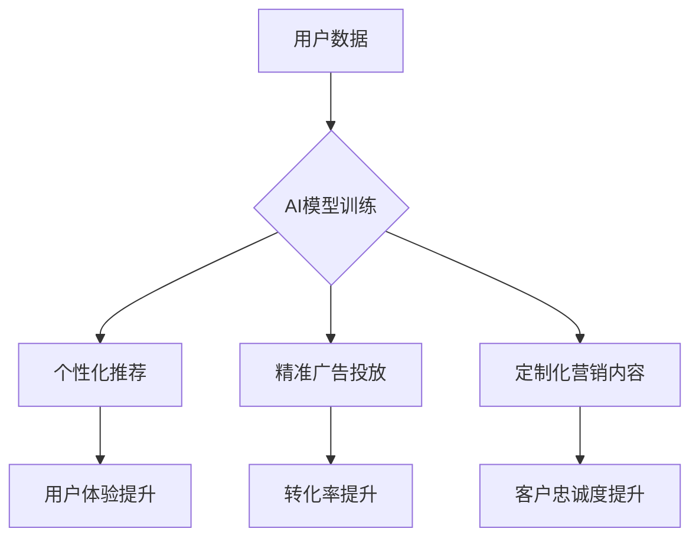

                 

##  AI技术在电商个性化营销中的应用

> 关键词：人工智能、电商、个性化营销、推荐系统、机器学习、深度学习、自然语言处理

## 1. 背景介绍

随着电商行业的蓬勃发展，消费者对个性化购物体验的需求日益增长。传统电商平台的营销策略往往采用“一刀切”的方式，无法满足不同用户个性化的需求，导致营销效果不佳。人工智能（AI）技术的出现为电商个性化营销提供了强大的工具和手段。

AI技术能够通过对海量用户数据进行分析和学习，精准识别用户的兴趣、偏好和行为模式，从而实现个性化商品推荐、精准广告投放、定制化营销内容等，提升用户购物体验，提高转化率和客户忠诚度。

## 2. 核心概念与联系

### 2.1  电商个性化营销

电商个性化营销是指根据用户的个人特征、行为数据和偏好，定制化地提供商品推荐、广告推送、促销活动等营销服务，以满足用户的个性化需求，提升用户体验和营销效果。

### 2.2  人工智能技术

人工智能（AI）是指模拟人类智能行为的计算机系统。AI技术涵盖了机器学习、深度学习、自然语言处理等多个领域，能够通过学习和分析数据，自动完成复杂的决策和预测任务。

### 2.3  核心概念联系

电商个性化营销的核心是利用AI技术对用户数据进行分析和挖掘，从而实现个性化服务。

**Mermaid 流程图：**



## 3. 核心算法原理 & 具体操作步骤

### 3.1  算法原理概述

在电商个性化营销中，常用的AI算法包括协同过滤、内容过滤、基于知识的推荐以及深度学习算法等。

* **协同过滤:** 基于用户的历史行为数据，预测用户对商品的喜好。
* **内容过滤:** 基于商品的特征信息，推荐与用户兴趣相符的商品。
* **基于知识的推荐:** 利用商品的属性、类别、描述等知识信息，推荐符合用户需求的商品。
* **深度学习算法:** 利用深度神经网络，从海量用户数据中学习更复杂的特征，实现更精准的推荐。

### 3.2  算法步骤详解

以协同过滤算法为例，其具体操作步骤如下：

1. **数据收集:** 收集用户对商品的评分、购买记录、浏览历史等数据。
2. **数据预处理:** 对数据进行清洗、去噪、转换等处理，使其适合算法训练。
3. **相似度计算:** 计算用户之间的相似度或商品之间的相似度。常用的相似度计算方法包括余弦相似度、皮尔逊相关系数等。
4. **推荐生成:** 根据用户与其他用户的相似度，推荐与相似用户喜欢的商品。

### 3.3  算法优缺点

**协同过滤算法:**

* **优点:** 能够发现用户隐性偏好，推荐个性化商品。
* **缺点:** 数据稀疏性问题，新用户和新商品推荐效果较差。

### 3.4  算法应用领域

协同过滤算法广泛应用于电商推荐系统、音乐推荐系统、电影推荐系统等领域。

## 4. 数学模型和公式 & 详细讲解 & 举例说明

### 4.1  数学模型构建

协同过滤算法的核心是计算用户之间的相似度或商品之间的相似度。常用的相似度计算方法是余弦相似度。

**余弦相似度公式:**

$$
\text{相似度} = \frac{\mathbf{u} \cdot \mathbf{v}}{\|\mathbf{u}\| \|\mathbf{v}\|}
$$

其中：

* $\mathbf{u}$ 和 $\mathbf{v}$ 是两个向量的表示，例如用户或商品的特征向量。
* $\mathbf{u} \cdot \mathbf{v}$ 是两个向量的点积。
* $\|\mathbf{u}\|$ 和 $\|\mathbf{v}\|$ 是两个向量的模长。

### 4.2  公式推导过程

余弦相似度公式的推导过程如下：

1. 两个向量的点积表示两个向量在同一方向上的投影长度。
2. 向量的模长表示向量的长度。
3. 将点积除以两个向量的模长乘积，可以得到两个向量在同一方向上的投影长度与两个向量长度的比值，即余弦相似度。

### 4.3  案例分析与讲解

假设有两个用户，用户A的特征向量为[1, 2, 3]，用户B的特征向量为[2, 3, 1]。

则用户A和用户B的余弦相似度为：

$$
\text{相似度} = \frac{(1 \times 2) + (2 \times 3) + (3 \times 1)}{( \sqrt{1^2 + 2^2 + 3^2}) ( \sqrt{2^2 + 3^2 + 1^2})} = \frac{2 + 6 + 3}{(\sqrt{14})(\sqrt{14})} = \frac{11}{14}
$$

因此，用户A和用户B的余弦相似度为0.786，说明这两个用户在特征上比较相似。

## 5. 项目实践：代码实例和详细解释说明

### 5.1  开发环境搭建

本项目使用Python语言开发，所需的库包括pandas、numpy、scikit-learn等。

### 5.2  源代码详细实现

```python
import pandas as pd
from sklearn.metrics.pairwise import cosine_similarity

# 加载用户评分数据
ratings_data = pd.read_csv('ratings.csv')

# 计算用户之间的余弦相似度
user_similarity = cosine_similarity(ratings_data)

# 获取用户ID
user_id = 'user1'

# 获取与用户ID相似的用户
similar_users = user_similarity[ratings_data.index.get_loc(user_id)].argsort()[:-6:-1]

# 推荐与相似用户喜欢的商品
recommended_items = ratings_data.loc[similar_users].mean().sort_values(ascending=False)

# 打印推荐结果
print(recommended_items)
```

### 5.3  代码解读与分析

1. 首先，加载用户评分数据。
2. 使用scikit-learn库中的cosine_similarity函数计算用户之间的余弦相似度。
3. 获取用户ID，并使用相似度矩阵找到与该用户相似的用户。
4. 从相似用户的评分数据中计算出平均评分，并根据平均评分排序，得到推荐商品。

### 5.4  运行结果展示

运行代码后，将输出一个包含推荐商品及其平均评分的列表。

## 6. 实际应用场景

### 6.1  商品推荐

电商平台可以利用AI技术，根据用户的浏览历史、购买记录、评分等数据，推荐与用户兴趣相符的商品。

### 6.2  精准广告投放

电商平台可以利用AI技术，分析用户的兴趣爱好、消费习惯等数据，精准投放广告，提高广告转化率。

### 6.3  定制化营销内容

电商平台可以利用AI技术，根据用户的个性化需求，定制化地提供营销内容，例如个性化优惠券、定制化促销活动等。

### 6.4  未来应用展望

随着AI技术的不断发展，电商个性化营销将更加智能化、精准化。未来，AI技术将应用于更多电商场景，例如：

* **智能客服:** 利用自然语言处理技术，提供智能化的客户服务。
* **虚拟试衣间:** 利用计算机视觉技术，实现虚拟试衣间功能。
* **个性化物流:** 根据用户的地理位置、时间安排等信息，提供个性化的物流服务。

## 7. 工具和资源推荐

### 7.1  学习资源推荐

* **书籍:**
    * 《深度学习》
    * 《机器学习实战》
    * 《Python机器学习》
* **在线课程:**
    * Coursera
    * edX
    * Udacity

### 7.2  开发工具推荐

* **Python:** 
    * pandas
    * numpy
    * scikit-learn
    * TensorFlow
    * PyTorch

### 7.3  相关论文推荐

* **协同过滤算法:**
    * "Collaborative Filtering: A User-Based Approach"
    * "Memory-Based Collaborative Filtering"
* **深度学习推荐系统:**
    * "Neural Collaborative Filtering"
    * "Deep Learning for Recommender Systems"

## 8. 总结：未来发展趋势与挑战

### 8.1  研究成果总结

AI技术在电商个性化营销领域取得了显著成果，能够有效提升用户体验、提高转化率和客户忠诚度。

### 8.2  未来发展趋势

未来，电商个性化营销将更加智能化、精准化、个性化。

* **多模态数据融合:** 将文本、图像、视频等多模态数据融合，实现更全面的用户画像。
* **个性化推荐模型:** 开发更精准的个性化推荐模型，例如基于用户的行为轨迹、情感分析等。
* **实时个性化营销:** 利用实时数据分析，实现动态调整营销策略，提供更个性化的营销服务。

### 8.3  面临的挑战

* **数据隐私保护:** 

电商个性化营销需要大量用户数据，如何保护用户隐私是一个重要的挑战。
* **算法可解释性:** 许多AI算法是黑箱模型，难以解释其推荐结果，这可能会导致用户信任度下降。
* **算法公平性:** 算法模型可能存在偏见，导致某些用户受到不公平的对待。

### 8.4  研究展望

未来，需要进一步研究如何解决数据隐私保护、算法可解释性和算法公平性等挑战，推动AI技术在电商个性化营销领域的健康发展。

## 9. 附录：常见问题与解答

### 9.1  Q1: 如何评估AI推荐系统的效果？

**A1:** 常见的评估指标包括准确率、召回率、F1-score、点击率、转化率等。

### 9.2  Q2: 如何处理数据稀疏性问题？

**A2:** 可以采用矩阵分解、协同过滤等算法，从稀疏数据中挖掘潜在的模式。

### 9.3  Q3: 如何保证AI推荐系统的公平性？

**A3:** 可以采用公平性算法、数据去偏置等方法，确保推荐结果公平公正。


作者：禅与计算机程序设计艺术 / Zen and the Art of Computer Programming 
<end_of_turn>

