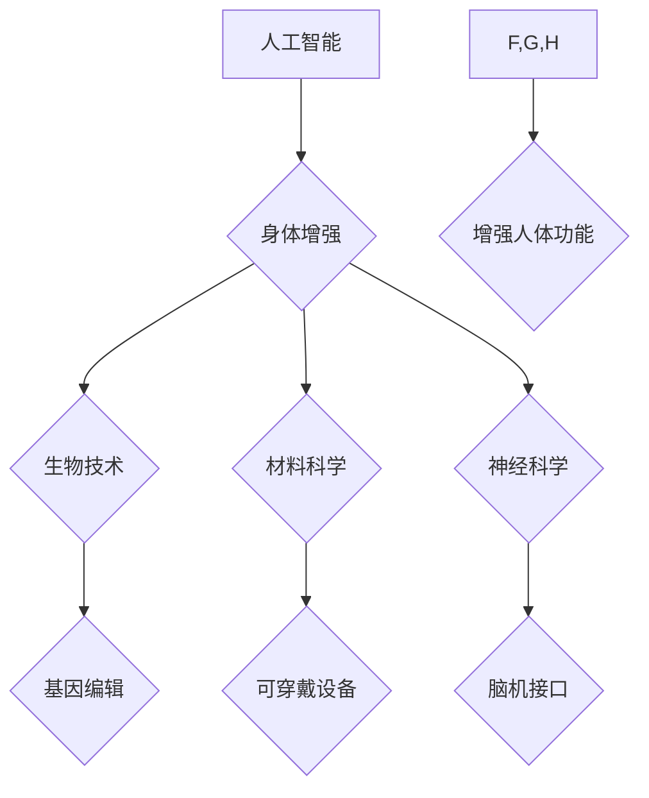

                 

## AI时代的人类增强：道德考虑与身体增强的未来发展机遇分析机遇挑战预测

> 关键词：人工智能、人类增强、身体增强、道德伦理、未来趋势、机遇挑战

## 1. 背景介绍

人工智能（AI）技术的飞速发展正在深刻地改变着人类社会，其影响范围从日常生活到未来发展都不可忽视。其中，AI驱动的“人类增强”概念正逐渐成为一个备受关注的议题。人类增强是指利用技术手段提升人类的认知能力、物理能力、情感体验等方面的概念，其目标是帮助人类克服自身的局限性，实现更广阔的发展潜力。

身体增强作为人类增强的重要组成部分，旨在通过技术手段改造和提升人类的身体机能。从机械义肢到脑机接口，从基因编辑到纳米机器人，各种技术都在为身体增强提供可能。随着生物技术、材料科学、神经科学等领域的不断突破，身体增强技术将更加成熟，并逐渐融入到人们的生活中。

## 2. 核心概念与联系

### 2.1 人类增强与身体增强的关系

人类增强是一个广义的概念，涵盖了认知增强、情感增强、社会增强等多个方面。身体增强则是人类增强的一个具体分支，它专注于提升人类的身体机能和功能。

### 2.2 核心概念原理和架构

**Mermaid 流程图：**



**图示说明：**

* 人工智能（AI）作为核心技术，为身体增强提供了强大的支持。
* 身体增强通过生物技术、材料科学、神经科学等领域的突破，实现对人体功能的改造和提升。
* 基因编辑可以改变人类的基因序列，从而增强身体机能。
* 可穿戴设备可以监测和调节人体状态，提供辅助功能。
* 脑机接口可以实现人脑与外部设备的直接连接，控制prosthetic limbs或增强认知能力。

## 3. 核心算法原理 & 具体操作步骤

### 3.1 算法原理概述

身体增强技术涉及到多种算法，例如机器学习、深度学习、强化学习等。这些算法可以帮助AI系统理解人体数据，预测人体需求，并控制增强设备。

* **机器学习:** 用于从大量数据中学习模式，例如识别人体运动轨迹、预测人体疲劳程度等。
* **深度学习:** 用于处理复杂数据，例如识别人体图像、分析脑电信号等。
* **强化学习:** 用于训练AI系统在特定环境中做出最佳决策，例如控制机械义肢的运动轨迹、优化人体运动效率等。

### 3.2 算法步骤详解

以机器学习算法为例，其步骤如下：

1. **数据收集:** 收集大量人体数据，例如运动轨迹、生理指标、脑电信号等。
2. **数据预处理:** 对收集到的数据进行清洗、转换、特征提取等操作，使其适合机器学习算法的训练。
3. **模型选择:** 选择合适的机器学习算法，例如支持向量机、决策树、神经网络等。
4. **模型训练:** 使用预处理后的数据训练机器学习模型，使其能够学习人体数据中的模式。
5. **模型评估:** 使用测试数据评估模型的性能，例如准确率、召回率、F1-score等。
6. **模型优化:** 根据评估结果，调整模型参数或选择更合适的算法，提高模型性能。
7. **模型部署:** 将训练好的模型部署到实际应用场景中，例如控制增强设备、提供个性化健康建议等。

### 3.3 算法优缺点

**优点:**

* 能够从大量数据中学习模式，提高预测精度。
* 可以处理复杂数据，例如图像、文本、音频等。
* 可以不断学习和改进，随着数据量的增加，模型性能会不断提升。

**缺点:**

* 需要大量数据进行训练，数据质量对模型性能有很大影响。
* 训练过程可能需要很长时间，计算资源消耗较大。
* 模型解释性较差，难以理解模型的决策过程。

### 3.4 算法应用领域

* **医疗保健:** 辅助诊断疾病、预测患者风险、个性化治疗方案。
* **运动训练:** 分析运动轨迹、优化运动效率、预防运动损伤。
* **机器人技术:** 控制机器人运动、增强机器人感知能力。
* **虚拟现实:** 创建更逼真的虚拟环境，增强用户体验。

## 4. 数学模型和公式 & 详细讲解 & 举例说明

### 4.1 数学模型构建

身体增强技术涉及到多个数学模型，例如控制模型、优化模型、预测模型等。

* **控制模型:** 用于控制增强设备的运动轨迹、参数调节等。
* **优化模型:** 用于优化人体功能，例如提高运动效率、增强肌肉力量等。
* **预测模型:** 用于预测人体状态，例如疲劳程度、疾病风险等。

### 4.2 公式推导过程

以控制模型为例，其目标是根据人体指令，控制增强设备的运动轨迹。

假设人体指令为 $u(t)$，增强设备的运动轨迹为 $x(t)$，则控制模型可以表示为：

$$
\dot{x}(t) = f(x(t), u(t))
$$

其中，$f(x(t), u(t))$ 为控制律，描述了人体指令对增强设备运动轨迹的影响。

### 4.3 案例分析与讲解

例如，控制机械义肢的运动轨迹，可以使用PID控制算法。PID控制算法通过调节比例、积分、微分三个参数，来控制机械义肢的运动速度、位置和加速度，使其能够准确地执行人体指令。

## 5. 项目实践：代码实例和详细解释说明

### 5.1 开发环境搭建

* 操作系统: Ubuntu 20.04
* 编程语言: Python 3.8
* 库依赖: TensorFlow, PyTorch, OpenCV, NumPy

### 5.2 源代码详细实现

```python
import tensorflow as tf

# 定义神经网络模型
model = tf.keras.models.Sequential([
    tf.keras.layers.Dense(128, activation='relu', input_shape=(10,)),
    tf.keras.layers.Dense(64, activation='relu'),
    tf.keras.layers.Dense(1)
])

# 编译模型
model.compile(optimizer='adam', loss='mse')

# 训练模型
model.fit(X_train, y_train, epochs=10)

# 评估模型
loss = model.evaluate(X_test, y_test)
print('Loss:', loss)
```

### 5.3 代码解读与分析

* 代码首先定义了一个简单的多层感知机模型，用于预测人体运动轨迹。
* 模型输入为人体运动数据，输出为预测的运动轨迹。
* 模型使用Adam优化器和均方误差损失函数进行训练。
* 训练完成后，使用测试数据评估模型的性能。

### 5.4 运行结果展示

训练完成后，可以将模型应用于实际场景，例如控制机械义肢的运动轨迹。

## 6. 实际应用场景

### 6.1 医疗保健

* **辅助诊断疾病:** AI算法可以分析患者的医疗影像数据，例如X光片、CT扫描、MRI等，辅助医生诊断疾病。
* **预测患者风险:** AI算法可以分析患者的医疗历史、生活习惯、基因信息等数据，预测患者患病风险，帮助医生进行预防和干预。
* **个性化治疗方案:** AI算法可以根据患者的个体特征，推荐个性化的治疗方案，提高治疗效果。

### 6.2 运动训练

* **分析运动轨迹:** AI算法可以分析运动员的运动轨迹，识别动作错误，提供改进建议。
* **优化运动效率:** AI算法可以根据运动员的体能状况和训练目标，制定个性化的训练计划，提高运动效率。
* **预防运动损伤:** AI算法可以监测运动员的身体状态，预测运动损伤风险，及时采取预防措施。

### 6.3 其他应用场景

* **机器人技术:** AI算法可以增强机器人的感知能力、决策能力和运动能力，使其能够更好地完成复杂任务。
* **虚拟现实:** AI算法可以创建更逼真的虚拟环境，增强用户的沉浸感和体验。

### 6.4 未来应用展望

随着AI技术的不断发展，身体增强技术将应用于更多领域，例如：

* **增强人类认知能力:** 通过脑机接口技术，增强人类的记忆力、注意力、学习能力等。
* **延长人类寿命:** 通过基因编辑技术，修复人体细胞损伤，延缓衰老过程。
* **创造新的人类形态:** 通过生物打印技术，构建新的身体器官和组织，实现人类形态的突破。

## 7. 工具和资源推荐

### 7.1 学习资源推荐

* **在线课程:** Coursera, edX, Udacity
* **书籍:**
    * 深度学习
    * 人工智能：一种现代方法
    * 人工智能：理论与实践
* **开源项目:** TensorFlow, PyTorch, OpenAI Gym

### 7.2 开发工具推荐

* **编程语言:** Python, C++, Java
* **深度学习框架:** TensorFlow, PyTorch, Keras
* **数据处理工具:** Pandas, NumPy, Scikit-learn
* **可视化工具:** Matplotlib, Seaborn, Plotly

### 7.3 相关论文推荐

* **AlphaGo论文:** Mastering the game of Go with deep neural networks and tree search
* **GPT-3论文:** Language Models are Few-Shot Learners
* **BERT论文:** BERT: Pre-training of Deep Bidirectional Transformers for Language Understanding

## 8. 总结：未来发展趋势与挑战

### 8.1 研究成果总结

AI驱动的身体增强技术取得了显著进展，例如机械义肢、脑机接口、基因编辑等领域都取得了突破性进展。这些技术为人类提供了新的可能性，可以帮助我们克服身体的局限性，实现更广阔的发展潜力。

### 8.2 未来发展趋势

* **更智能的增强设备:** 未来增强设备将更加智能化，能够更好地理解人体需求，提供更个性化的服务。
* **更广泛的应用场景:** 身体增强技术将应用于更多领域，例如医疗保健、教育、娱乐等。
* **更安全的增强技术:** 随着身体增强技术的普及，安全问题将更加重要，需要开发更安全的增强技术，避免潜在的风险。

### 8.3 面临的挑战

* **伦理问题:** 身体增强技术可能会带来伦理问题，例如公平性、隐私性、人性的本质等。
* **技术挑战:** 身体增强技术还面临着许多技术挑战，例如生物相容性、可靠性、可负担性等。
* **社会接受度:** 身体增强技术可能会引发社会争议，需要加强公众教育和宣传，提高社会对身体增强技术的接受度。

### 8.4 研究展望

未来，我们需要继续加强对身体增强技术的研发，探索其更广泛的应用场景，并积极应对其带来的伦理和社会挑战。同时，还需要加强公众教育和宣传，提高社会对身体增强技术的理解和接受度。


## 9. 附录：常见问题与解答

**1. 身体增强技术会取代人类吗？**

身体增强技术旨在帮助人类克服自身的局限性，而不是取代人类。AI技术可以辅助人类完成一些任务，但人类的创造力、情感、伦理判断等方面仍然是不可替代的。

**2. 身体增强技术会带来哪些伦理问题？**

身体增强技术可能会带来一些伦理问题，例如：

* **公平性:** 身体增强技术可能导致社会分化，富人能够获得更好的增强，而穷人则无法负担。
* **隐私性:** 身体增强技术可能会收集大量的个人数据，需要确保数据的安全和隐私。
* **人性的本质:** 身体增强技术可能会改变人类的生理和心理特征，需要思考其对人性的影响。

**3. 身体增强技术的安全问题有哪些？**

身体增强技术的安全问题包括：

* **设备故障:** 增强设备可能会出现故障，导致意外伤害。
* **数据安全:** 增强设备可能会收集大量的个人数据，需要确保数据的安全。
* **伦理滥用:** 身体增强技术可能会被用于非法目的，例如增强犯罪能力。

**4. 身体增强技术的发展前景如何？**

身体增强技术的发展前景非常广阔，它将改变人类的生活方式，带来许多新的可能性。但同时也需要我们认真思考其带来的伦理和社会挑战，并采取相应的措施，确保其健康、安全、可持续发展。


作者：禅与计算机程序设计艺术 / Zen and the Art of Computer Programming 
<end_of_turn>

