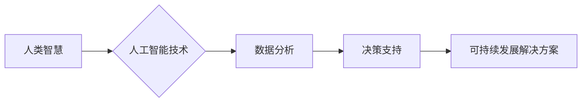

                 

## AI时代的人类计算：打造可持续发展解决方案

> 关键词：人工智能、人类计算、可持续发展、算法、机器学习、数据分析、未来趋势

> 摘要：本文探讨了人工智能时代人类计算的新模式，分析了其核心概念、算法原理、数学模型以及实际应用场景。通过深入解读AI技术与可持续发展之间的联系，提出构建可持续发展解决方案的思路，并展望了未来发展趋势和面临的挑战。

## 1. 背景介绍

随着人工智能技术的飞速发展，我们正处于一个前所未有的技术变革时代。人工智能已经渗透到生活的方方面面，从智能手机、自动驾驶汽车到医疗诊断、金融交易，人工智能正在改变着人类的生活方式和工作模式。

然而，人工智能的发展也带来了新的挑战。一方面，人工智能算法的训练需要大量的计算资源和能源消耗，这加剧了环境污染和资源枯竭的压力。另一方面，人工智能技术的应用也可能导致就业岗位的减少、数据隐私的泄露以及算法偏见的放大等社会问题。

因此，如何在人工智能的快速发展中兼顾可持续发展，成为一个亟待解决的课题。人类计算作为一种新的计算模式，为构建可持续发展解决方案提供了新的思路。

## 2. 核心概念与联系

人类计算是指将人类的智慧和创造力与人工智能技术相结合，共同完成复杂的任务。它强调人机协作，充分利用人类的认知能力、情感智能和社会智慧，弥补人工智能技术的局限性。

**人类计算与可持续发展之间的联系**

* **资源优化:** 人类计算可以帮助我们更有效地利用资源，例如通过优化能源消耗、减少浪费和促进循环经济。
* **环境保护:** 人类计算可以帮助我们监测环境变化、预测自然灾害和开发可持续的能源技术。
* **社会公平:** 人类计算可以帮助我们解决社会问题，例如促进教育公平、改善医疗服务和减少贫富差距。

**Mermaid 流程图**



## 3. 核心算法原理 & 具体操作步骤

### 3.1  算法原理概述

人类计算的核心算法原理是基于机器学习和深度学习技术，通过训练模型来模拟人类的认知过程，例如决策、推理、语言理解和图像识别。

### 3.2  算法步骤详解

1. **数据收集和预处理:** 收集与可持续发展相关的各种数据，例如环境数据、社会经济数据和能源消耗数据，并进行清洗、转换和格式化。
2. **模型选择和训练:** 选择合适的机器学习算法，例如支持向量机、决策树或深度神经网络，并利用收集到的数据进行模型训练。
3. **模型评估和优化:** 对训练好的模型进行评估，例如使用准确率、召回率和F1-score等指标，并根据评估结果进行模型优化。
4. **模型部署和应用:** 将训练好的模型部署到实际应用场景中，例如用于预测环境变化、优化能源消耗或制定可持续发展政策。

### 3.3  算法优缺点

**优点:**

* **高效性:** 人工智能算法可以处理海量数据，并快速进行分析和决策。
* **准确性:** 经过训练的机器学习模型可以达到很高的准确率，例如在图像识别、自然语言处理等领域。
* **可扩展性:** 人工智能算法可以轻松扩展到新的数据和应用场景。

**缺点:**

* **数据依赖性:** 人工智能算法的性能取决于训练数据的质量和数量。
* **黑盒效应:** 一些复杂的机器学习模型难以解释其决策过程，这可能导致信任问题。
* **伦理风险:** 人工智能技术的应用可能带来伦理风险，例如算法偏见、隐私泄露和就业岗位减少。

### 3.4  算法应用领域

* **环境保护:** 预测自然灾害、监测环境污染、优化能源消耗。
* **可持续农业:** 提高农业生产效率、减少农药和化肥使用、监测作物生长。
* **可持续城市规划:** 优化交通流量、规划绿色空间、提高城市能源效率。
* **可持续消费:** 推广绿色产品、减少消费浪费、促进循环经济。

## 4. 数学模型和公式 & 详细讲解 & 举例说明

### 4.1  数学模型构建

在人类计算中，我们可以使用各种数学模型来描述和分析可持续发展问题。例如，我们可以使用线性规划模型来优化资源分配，使用非线性规划模型来预测环境变化，使用动态系统模型来模拟社会经济发展。

### 4.2  公式推导过程

假设我们想要构建一个模型来预测城市能源消耗。我们可以使用以下公式：

$$E = f(P, T, I)$$

其中：

* $E$ 表示城市能源消耗
* $P$ 表示城市人口
* $T$ 表示平均气温
* $I$ 表示工业生产水平

我们可以通过收集历史数据，使用回归分析等方法来推导公式中的函数 $f$。

### 4.3  案例分析与讲解

我们可以使用收集到的城市人口、气温和工业生产水平数据，训练一个机器学习模型来预测城市能源消耗。例如，我们可以使用线性回归模型，并根据模型的预测结果，制定相应的节能减排政策。

## 5. 项目实践：代码实例和详细解释说明

### 5.1  开发环境搭建

我们可以使用 Python 语言和相关的机器学习库，例如 scikit-learn 和 TensorFlow，来实现人类计算项目。

### 5.2  源代码详细实现

```python
from sklearn.linear_model import LinearRegression

# 加载数据
data = pd.read_csv('energy_consumption_data.csv')

# 划分训练集和测试集
X_train, X_test, y_train, y_test = train_test_split(data[['population', 'temperature', 'industry']], data['energy_consumption'], test_size=0.2)

# 创建线性回归模型
model = LinearRegression()

# 训练模型
model.fit(X_train, y_train)

# 预测测试集数据
y_pred = model.predict(X_test)

# 评估模型性能
print('R-squared:', model.score(X_test, y_test))
```

### 5.3  代码解读与分析

这段代码首先加载了城市能源消耗数据，然后将数据划分成训练集和测试集。接着，创建了一个线性回归模型，并使用训练集数据训练模型。最后，使用测试集数据预测能源消耗，并评估模型的性能。

### 5.4  运行结果展示

运行结果会显示模型的 R-squared 值，该值表示模型对测试集数据的拟合程度。

## 6. 实际应用场景

### 6.1  环境监测与预测

人类计算可以帮助我们监测环境变化，例如空气质量、水质和气候变化。通过分析历史数据和实时数据，我们可以预测环境问题的发生和发展趋势，并制定相应的应对措施。

### 6.2  可持续农业

人类计算可以帮助我们提高农业生产效率，减少农药和化肥使用，并监测作物生长。例如，我们可以使用无人机和传感器收集作物生长数据，并利用机器学习算法来预测作物产量和病虫害风险。

### 6.3  可持续城市规划

人类计算可以帮助我们优化城市交通流量、规划绿色空间、提高城市能源效率。例如，我们可以使用大数据分析来预测交通拥堵情况，并制定相应的交通管理策略。

### 6.4  未来应用展望

随着人工智能技术的不断发展，人类计算在可持续发展领域的应用将更加广泛和深入。例如，我们可以利用人工智能技术来开发更智能的能源管理系统、更精准的农业生产模式和更可持续的城市规划方案。

## 7. 工具和资源推荐

### 7.1  学习资源推荐

* **在线课程:** Coursera、edX、Udacity 等平台提供丰富的机器学习和人工智能课程。
* **书籍:** 《深度学习》、《机器学习实战》等书籍可以帮助你深入了解人工智能技术。
* **开源项目:** TensorFlow、PyTorch 等开源项目可以让你实践人工智能算法。

### 7.2  开发工具推荐

* **Python:** Python 语言是人工智能开发的常用语言，拥有丰富的机器学习库。
* **Jupyter Notebook:** Jupyter Notebook 是一个交互式编程环境，方便进行数据分析和模型开发。
* **云计算平台:** AWS、Azure、GCP 等云计算平台提供强大的计算资源和机器学习服务。

### 7.3  相关论文推荐

* **Nature:** https://www.nature.com/
* **Science:** https://www.science.org/
* **arXiv:** https://arxiv.org/

## 8. 总结：未来发展趋势与挑战

### 8.1  研究成果总结

人类计算为构建可持续发展解决方案提供了新的思路和方法。通过将人工智能技术与人类智慧相结合，我们可以更有效地解决环境保护、资源优化、社会公平等问题。

### 8.2  未来发展趋势

* **更智能的人机交互:** 未来的人类计算系统将更加智能，能够更好地理解和响应人类的需求。
* **更广泛的应用场景:** 人类计算将应用于更多领域，例如医疗保健、教育和金融。
* **更注重伦理和社会影响:** 人类计算的发展需要更加注重伦理和社会影响，确保其应用能够造福人类。

### 8.3  面临的挑战

* **数据获取和隐私保护:** 人类计算需要大量数据，如何获取高质量数据并保护数据隐私是一个挑战。
* **算法解释性和可信度:** 一些复杂的机器学习模型难以解释其决策过程，这可能导致信任问题。
* **技术可访问性和公平性:** 人类计算技术需要更加普及，并确保其应用能够公平地惠及所有人。

### 8.4  研究展望

未来，我们需要继续深入研究人类计算的原理和方法，开发更智能、更安全、更可持续的人类计算系统，并将其应用于解决人类面临的重大挑战。

## 9. 附录：常见问题与解答

**Q1: 人类计算与传统计算有什么区别？**

**A1:** 人类计算强调人机协作，充分利用人类的智慧和创造力，而传统计算则主要依靠计算机的计算能力。

**Q2: 人类计算有哪些应用场景？**

**A2:** 人类计算可以应用于环境保护、可持续农业、可持续城市规划、医疗保健、教育和金融等领域。

**Q3: 如何学习人类计算？**

**A3:** 可以通过在线课程、书籍、开源项目等方式学习人类计算。

**Q4: 人类计算有哪些伦理风险？**

**A4:** 人类计算可能带来算法偏见、隐私泄露和就业岗位减少等伦理风险。


作者：禅与计算机程序设计艺术 / Zen and the Art of Computer Programming 
<end_of_turn>

