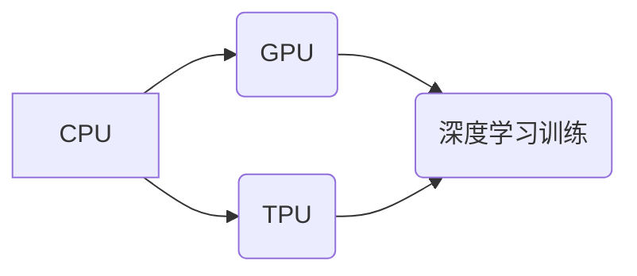

                 

## AI芯片革命：从GPU到TPU的演进

> 关键词：AI芯片、GPU、TPU、深度学习、神经网络、并行计算、高性能计算

### 1. 背景介绍

人工智能（AI）的蓬勃发展，特别是深度学习技术的兴起，对计算能力提出了前所未有的挑战。传统CPU架构在处理海量数据和复杂的模型计算时显得力不从心。为了满足AI训练和推理的巨大需求，专门设计的AI芯片应运而生，其中GPU和TPU是代表性的例子。

**1.1 GPU的崛起**

图形处理单元（GPU）最初被设计用于处理图形渲染，其并行计算能力远超传统CPU。随着深度学习算法的兴起，GPU的并行计算优势被充分挖掘，成为深度学习训练的利器。

**1.2 TPU的出现**

谷歌开发的Tensor Processing Unit（TPU）专为深度学习训练而设计，其架构和算法都针对深度学习任务进行了优化。TPU拥有更高的计算密度、更低的功耗和更快的训练速度，在处理大型深度学习模型方面表现出色。

### 2. 核心概念与联系

**2.1 核心概念**

* **GPU（图形处理单元）：** 专门用于处理图形渲染的处理器，具有强大的并行计算能力。
* **TPU（Tensor Processing Unit）：** 专为深度学习训练而设计的处理器，具有更高的计算密度、更低的功耗和更快的训练速度。
* **深度学习：** 一种机器学习方法，利用多层神经网络学习数据特征，实现复杂的模式识别和预测任务。
* **神经网络：** 仿照人脑神经网络结构的算法模型，通过连接的节点和权重进行数据处理和学习。

**2.2 架构关系**



**2.3 联系分析**

CPU是通用处理器，可以执行各种任务，但其并行计算能力有限。GPU和TPU都是专门设计的加速器，可以大幅提升深度学习训练的速度。GPU更通用，可以用于各种图形和计算任务，而TPU更专注于深度学习训练，其架构和算法都针对深度学习进行了优化。

### 3. 核心算法原理 & 具体操作步骤

**3.1 算法原理概述**

深度学习算法的核心是神经网络，它由多个层级的神经元组成，每个神经元接收输入信号，进行计算并输出信号。通过调整神经元之间的权重，神经网络可以学习数据特征并进行预测。

**3.2 算法步骤详解**

1. **数据预处理:** 将原始数据转换为神经网络可以理解的格式，例如归一化、编码等。
2. **网络结构设计:** 根据任务需求设计神经网络的层数、神经元数量和激活函数等参数。
3. **权重初始化:** 为神经网络中的权重赋予初始值。
4. **前向传播:** 将输入数据通过神经网络传递，计算输出结果。
5. **反向传播:** 计算输出结果与真实值的误差，并根据误差调整神经网络的权重。
6. **优化算法:** 使用优化算法，例如梯度下降，更新神经网络的权重，降低误差。
7. **训练和评估:** 循环进行前向传播、反向传播和权重更新，直到模型达到预期的性能。

**3.3 算法优缺点**

* **优点:** 能够学习复杂数据模式，性能优于传统机器学习算法。
* **缺点:** 需要大量数据进行训练，训练时间长，参数调整复杂。

**3.4 算法应用领域**

* **图像识别:** 人脸识别、物体检测、图像分类等。
* **自然语言处理:** 机器翻译、文本摘要、情感分析等。
* **语音识别:** 语音转文本、语音助手等。
* **推荐系统:** 商品推荐、内容推荐等。

### 4. 数学模型和公式 & 详细讲解 & 举例说明

**4.1 数学模型构建**

深度学习模型的核心是神经网络，其数学模型可以表示为一系列的矩阵运算和激活函数。

**4.2 公式推导过程**

* **激活函数:** 激活函数将神经元的输入信号转换为输出信号，常用的激活函数包括 sigmoid、ReLU、tanh 等。
* **损失函数:** 损失函数衡量模型预测结果与真实值的差异，常用的损失函数包括均方误差、交叉熵等。
* **梯度下降:** 梯度下降算法用于更新神经网络的权重，使其朝着降低损失函数的方向进行调整。

**4.3 案例分析与讲解**

以线性回归为例，其数学模型可以表示为：

$$y = wx + b$$

其中，$y$ 是预测值，$x$ 是输入特征，$w$ 是权重，$b$ 是偏置。

损失函数为均方误差：

$$L = \frac{1}{n}\sum_{i=1}^{n}(y_i - \hat{y}_i)^2$$

其中，$n$ 是样本数量，$y_i$ 是真实值，$\hat{y}_i$ 是预测值。

梯度下降算法用于更新权重和偏置：

$$w = w - \alpha \frac{\partial L}{\partial w}$$

$$b = b - \alpha \frac{\partial L}{\partial b}$$

其中，$\alpha$ 是学习率。

### 5. 项目实践：代码实例和详细解释说明

**5.1 开发环境搭建**

使用Python语言和深度学习框架TensorFlow或PyTorch进行开发。

**5.2 源代码详细实现**

```python
import tensorflow as tf

# 定义线性回归模型
model = tf.keras.Sequential([
    tf.keras.layers.Dense(units=1, input_shape=[1])
])

# 编译模型
model.compile(optimizer='sgd', loss='mean_squared_error')

# 训练模型
model.fit(x_train, y_train, epochs=100)

# 评估模型
loss = model.evaluate(x_test, y_test)
```

**5.3 代码解读与分析**

* 使用TensorFlow框架构建线性回归模型。
* 使用随机梯度下降算法进行模型训练。
* 使用均方误差作为损失函数。
* 训练模型100个epochs。
* 使用测试数据评估模型性能。

**5.4 运行结果展示**

训练完成后，可以查看模型的损失值和准确率等指标，评估模型的性能。

### 6. 实际应用场景

**6.1 图像识别**

* **人脸识别:** 用于解锁手机、身份验证等。
* **物体检测:** 用于自动驾驶、安防监控等。
* **图像分类:** 用于医疗诊断、产品识别等。

**6.2 自然语言处理**

* **机器翻译:** 将文本从一种语言翻译成另一种语言。
* **文本摘要:** 自动生成文本的简短摘要。
* **情感分析:** 分析文本的情感倾向，用于市场调研、客户服务等。

**6.3 语音识别**

* **语音转文本:** 将语音转换为文本，用于语音助手、听写软件等。
* **语音助手:** 例如Siri、Alexa，可以理解用户的语音指令并执行相应的操作。

**6.4 未来应用展望**

* **个性化推荐:** 基于用户的行为数据和偏好，提供个性化的商品、内容推荐等。
* **医疗诊断:** 利用AI辅助医生进行疾病诊断，提高诊断准确率。
* **科学研究:** 加速科学研究，例如药物研发、材料科学等。

### 7. 工具和资源推荐

**7.1 学习资源推荐**

* **书籍:**
    * 《深度学习》
    * 《动手学深度学习》
* **在线课程:**
    * Coursera深度学习课程
    * fast.ai深度学习课程

**7.2 开发工具推荐**

* **深度学习框架:** TensorFlow、PyTorch、Keras
* **编程语言:** Python
* **云平台:** Google Cloud Platform、Amazon Web Services、Microsoft Azure

**7.3 相关论文推荐**

* **AlexNet:** ImageNet Classification with Deep Convolutional Neural Networks
* **VGGNet:** Very Deep Convolutional Networks for Large-Scale Image Recognition
* **ResNet:** Deep Residual Learning for Image Recognition

### 8. 总结：未来发展趋势与挑战

**8.1 研究成果总结**

AI芯片的不断发展，推动了深度学习技术的进步，在图像识别、自然语言处理、语音识别等领域取得了突破性进展。

**8.2 未来发展趋势**

* **更高效的架构设计:** 探索新的芯片架构，提高计算密度和效率。
* **更强大的计算能力:** 开发更强大的AI芯片，支持更大的模型训练和推理。
* **更低的功耗:** 降低AI芯片的功耗，使其更适合移动设备和嵌入式系统。
* **更广泛的应用场景:** 将AI芯片应用于更多领域，例如医疗、教育、金融等。

**8.3 面临的挑战**

* **算法创新:** 需要不断开发新的深度学习算法，以充分利用AI芯片的计算能力。
* **数据获取和标注:** 深度学习算法需要大量数据进行训练，数据获取和标注成本高昂。
* **伦理和安全问题:** AI技术的应用需要考虑伦理和安全问题，例如算法偏见、数据隐私等。

**8.4 研究展望**

未来，AI芯片将继续朝着更高效、更强大、更安全的方向发展，推动人工智能技术的进步，为人类社会带来更多福祉。

### 9. 附录：常见问题与解答

* **Q: GPU和TPU有什么区别？**
* **A:** GPU更通用，可以用于各种图形和计算任务，而TPU更专注于深度学习训练，其架构和算法都针对深度学习进行了优化。

* **Q: 如何选择合适的AI芯片？**
* **A:** 需要根据具体的应用场景和需求选择合适的AI芯片，例如模型大小、训练速度、功耗等。

* **Q: 如何学习深度学习和AI芯片？**
* **A:** 可以参考上述学习资源推荐，学习深度学习基础知识和AI芯片相关技术。


作者：禅与计算机程序设计艺术 / Zen and the Art of Computer Programming 
<end_of_turn>

