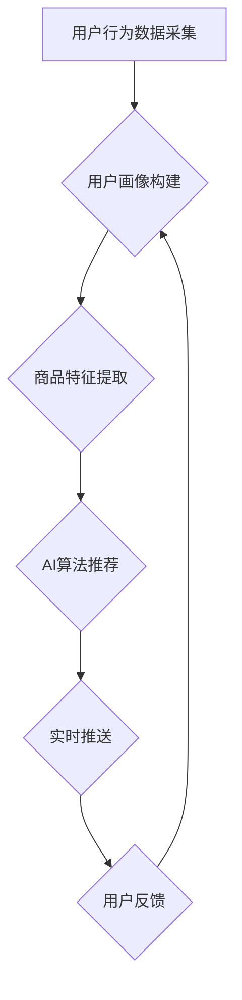

                 

## AI驱动的电商平台实时个性化推送

> 关键词：电商平台、个性化推荐、AI算法、机器学习、深度学习、实时推送、用户行为分析、推荐系统

> 摘要：本文深入探讨了AI驱动的电商平台实时个性化推送技术，从核心概念和原理到算法实现、数学模型、代码实例以及实际应用场景，全面分析了该技术的构建和应用。同时，文章还展望了未来发展趋势和面临的挑战，为读者提供了一个全面的技术指南。

## 1. 背景介绍

随着电商平台的蓬勃发展，用户对个性化购物体验的需求日益增长。传统的商品推荐方式，例如基于规则或协同过滤，往往难以满足用户多样化的需求，推荐结果缺乏精准性和时效性。因此，基于人工智能的个性化推荐技术成为电商平台提升用户体验和商业效益的关键驱动力。

AI驱动的个性化推荐技术通过分析用户的历史行为、偏好、兴趣等数据，构建用户画像，并利用机器学习和深度学习算法，预测用户对商品的潜在兴趣，从而提供更精准、更个性化的商品推荐。实时个性化推送则进一步提升了推荐的时效性，将推荐结果及时推送给用户，增强用户参与度和转化率。

## 2. 核心概念与联系

### 2.1  个性化推荐

个性化推荐是指根据用户的个人特征、行为模式和偏好，定制化地推荐商品或服务，以满足用户的独特需求。

### 2.2  AI算法

人工智能算法是实现个性化推荐的核心技术，主要包括：

* **协同过滤:** 基于用户或商品之间的相似性进行推荐。
* **内容过滤:** 基于商品的属性和用户偏好的匹配度进行推荐。
* **基于知识的推荐:** 利用商品的知识图谱和用户兴趣进行推荐。
* **深度学习推荐:** 利用深度神经网络学习用户行为模式和商品特征，进行更精准的推荐。

### 2.3  实时推送

实时推送是指将推荐结果及时推送给用户，例如在用户浏览商品页面时，根据用户的行为数据实时推荐相关商品。

**核心架构流程图:**



## 3. 核心算法原理 & 具体操作步骤

### 3.1  算法原理概述

本文将重点介绍基于深度学习的个性化推荐算法，例如**深度协同过滤**和**深度内容过滤**。

* **深度协同过滤:** 利用深度神经网络学习用户-商品交互矩阵的潜在特征，并预测用户对未交互商品的兴趣。
* **深度内容过滤:** 利用深度神经网络学习商品的文本描述、图像特征等内容信息，并预测用户对商品的兴趣。

### 3.2  算法步骤详解

**深度协同过滤算法步骤:**

1. **数据预处理:** 对用户-商品交互数据进行清洗、去噪和特征工程，例如将用户评分转换为one-hot编码。
2. **模型构建:** 使用深度神经网络，例如多层感知机（MLP）或卷积神经网络（CNN），构建用户-商品交互矩阵的潜在特征表示。
3. **模型训练:** 使用用户-商品交互数据训练深度神经网络模型，优化模型参数。
4. **预测和推荐:** 将新用户的特征输入模型，预测用户对商品的兴趣评分，并根据评分排序推荐商品。

**深度内容过滤算法步骤:**

1. **数据预处理:** 对商品的文本描述、图像特征等内容信息进行预处理，例如文本词嵌入、图像特征提取。
2. **模型构建:** 使用深度神经网络，例如循环神经网络（RNN）或Transformer，构建商品内容特征表示。
3. **模型训练:** 使用用户-商品交互数据训练深度神经网络模型，优化模型参数。
4. **预测和推荐:** 将新商品的内容特征输入模型，预测用户对商品的兴趣评分，并根据评分排序推荐商品。

### 3.3  算法优缺点

**深度协同过滤算法:**

* **优点:** 可以学习到用户和商品之间的复杂关系，推荐结果更精准。
* **缺点:** 需要大量的用户-商品交互数据才能训练出有效的模型，对冷启动问题敏感。

**深度内容过滤算法:**

* **优点:** 不需要大量的用户-商品交互数据，可以利用商品本身的内容信息进行推荐。
* **缺点:** 难以学习到用户之间的关系，推荐结果可能缺乏个性化。

### 3.4  算法应用领域

深度学习个性化推荐算法广泛应用于电商平台、社交媒体、音乐流媒体等领域，例如：

* **商品推荐:** 根据用户的历史购买记录、浏览记录、收藏记录等数据，推荐用户可能感兴趣的商品。
* **内容推荐:** 根据用户的阅读习惯、观看历史、点赞记录等数据，推荐用户可能感兴趣的文章、视频、音乐等内容。
* **广告推荐:** 根据用户的兴趣爱好、行为模式等数据，推荐用户可能感兴趣的广告。

## 4. 数学模型和公式 & 详细讲解 & 举例说明

### 4.1  数学模型构建

**深度协同过滤模型:**

假设用户集合为U，商品集合为I，用户-商品交互矩阵为R，其中R(u,i)表示用户u对商品i的评分。深度协同过滤模型的目标是学习用户和商品的潜在特征表示，并预测用户对未交互商品的评分。

模型可以使用多层感知机（MLP）或卷积神经网络（CNN）构建，输入用户和商品的特征向量，输出用户对商品的评分预测。

**深度内容过滤模型:**

假设商品集合为I，商品内容特征向量为X，用户集合为U，用户偏好向量为Y。深度内容过滤模型的目标是学习商品内容特征和用户偏好之间的关系，并预测用户对商品的评分。

模型可以使用循环神经网络（RNN）或Transformer构建，输入商品内容特征向量和用户偏好向量，输出用户对商品的评分预测。

### 4.2  公式推导过程

**深度协同过滤模型损失函数:**

$$
L = \sum_{u \in U, i \in I} (R(u,i) - \hat{R}(u,i))^2
$$

其中，$\hat{R}(u,i)$是模型预测的用户u对商品i的评分，R(u,i)是真实评分。

**深度内容过滤模型损失函数:**

$$
L = \sum_{u \in U, i \in I} (R(u,i) - \hat{R}(u,i))^2
$$

其中，$\hat{R}(u,i)$是模型预测的用户u对商品i的评分，R(u,i)是真实评分。

### 4.3  案例分析与讲解

**案例:** 假设一个电商平台要推荐用户喜欢的书籍。

**深度协同过滤:**

* 训练模型：使用用户对书籍的评分数据，学习用户和书籍的潜在特征表示。
* 预测推荐：根据用户的评分历史和书籍的特征，预测用户对未读书籍的评分，并推荐评分较高的书籍。

**深度内容过滤:**

* 训练模型：使用书籍的文本描述、作者信息、评论等内容数据，学习书籍的特征表示。
* 预测推荐：根据用户的阅读历史和书籍的特征，预测用户对书籍的兴趣，并推荐符合用户兴趣的书籍。

## 5. 项目实践：代码实例和详细解释说明

### 5.1  开发环境搭建

* Python 3.x
* TensorFlow 或 PyTorch 深度学习框架
* Jupyter Notebook 或 VS Code 代码编辑器

### 5.2  源代码详细实现

```python
# 使用 TensorFlow 构建深度协同过滤模型

import tensorflow as tf

# 定义模型结构
model = tf.keras.Sequential([
    tf.keras.layers.Embedding(input_dim=num_users, output_dim=embedding_dim),
    tf.keras.layers.Embedding(input_dim=num_items, output_dim=embedding_dim),
    tf.keras.layers.Multiply(),
    tf.keras.layers.Flatten(),
    tf.keras.layers.Dense(1)
])

# 编译模型
model.compile(optimizer='adam', loss='mse')

# 训练模型
model.fit(user_ids, item_ids, ratings, epochs=10)

# 预测评分
predictions = model.predict([user_id, item_id])
```

### 5.3  代码解读与分析

* **Embedding层:** 将用户和商品ID转换为稠密的向量表示，捕捉用户和商品之间的潜在关系。
* **Multiply层:** 将用户向量和商品向量相乘，得到用户对商品的兴趣评分。
* **Flatten层:** 将多维向量转换为一维向量。
* **Dense层:** 全连接层，输出用户对商品的评分预测。

### 5.4  运行结果展示

训练完成后，可以使用模型预测用户对未交互商品的评分，并根据评分排序推荐商品。

## 6. 实际应用场景

### 6.1  电商平台商品推荐

* **个性化商品推荐:** 根据用户的浏览历史、购买记录、收藏记录等数据，推荐用户可能感兴趣的商品。
* **新品推荐:** 推送给用户新上架的商品，提高新品曝光率和销量。
* **关联推荐:** 根据用户浏览或购买的商品，推荐相关联的商品，例如“顾客也购买了”。

### 6.2  社交媒体内容推荐

* **个性化内容推荐:** 根据用户的兴趣爱好、阅读习惯、点赞记录等数据，推荐用户可能感兴趣的文章、视频、图片等内容。
* **热点话题推荐:** 推送给用户当前热门的话题和讨论，提高用户参与度和互动性。
* **好友推荐:** 根据用户的社交关系，推荐用户可能认识的朋友或关注的人。

### 6.3  音乐流媒体音乐推荐

* **个性化音乐推荐:** 根据用户的听歌历史、播放记录、收藏歌曲等数据，推荐用户可能喜欢的音乐。
* **新歌推荐:** 推送给用户新上架的音乐，提高新歌曝光率和销量。
* **相似音乐推荐:** 根据用户喜欢的音乐，推荐风格相似的音乐。

### 6.4  未来应用展望

AI驱动的个性化推荐技术将继续发展，并应用于更多领域，例如：

* **医疗保健:** 根据用户的病史、症状、基因信息等数据，推荐个性化的医疗方案和健康建议。
* **教育:** 根据学生的学习进度、兴趣爱好、学习风格等数据，推荐个性化的学习资源和教学方法。
* **金融:** 根据用户的财务状况、投资偏好、风险承受能力等数据，推荐个性化的理财产品和投资建议。

## 7. 工具和资源推荐

### 7.1  学习资源推荐

* **书籍:**
    * 《推荐系统实践》
    * 《深度学习》
    * 《机器学习》
* **在线课程:**
    * Coursera: 机器学习、深度学习
    * Udacity: 机器学习工程师
    * edX: 数据科学

### 7.2  开发工具推荐

* **Python:** 广泛用于机器学习和深度学习开发。
* **TensorFlow:** 开源深度学习框架，提供丰富的模型构建和训练工具。
* **PyTorch:** 开源深度学习框架，以其灵活性和易用性而闻名。
* **Scikit-learn:** Python机器学习库，提供各种传统机器学习算法。

### 7.3  相关论文推荐

* **Collaborative Filtering for Implicit Feedback Datasets**
* **Deep Learning for Recommender Systems**
* **Neural Collaborative Filtering**

## 8. 总结：未来发展趋势与挑战

### 8.1  研究成果总结

AI驱动的个性化推荐技术取得了显著的成果，能够提供更精准、更个性化的推荐结果，提升用户体验和商业效益。

### 8.2  未来发展趋势

* **多模态推荐:** 融合文本、图像、音频等多模态数据，构建更全面的用户画像和商品特征表示。
* **联邦学习:** 在保护用户隐私的前提下，利用分布式数据训练推荐模型。
* **个性化解释:** 为用户解释推荐结果背后的逻辑，增强用户信任度。

### 8.3  面临的挑战

* **数据稀疏性:** 用户-商品交互数据往往稀疏，难以训练出有效的推荐模型。
* **冷启动问题:** 新用户和新商品难以获得推荐，需要开发新的算法和策略解决。
* **用户隐私保护:** 个性化推荐需要收集和使用用户的个人数据，需要采取有效的措施保护用户隐私。

### 8.4  研究展望

未来，AI驱动的个性化推荐技术将继续发展，并应用于更多领域，为用户提供更智能、更便捷的体验。


## 9. 附录：常见问题与解答

**Q1: 如何解决数据稀疏性问题？**

**A1:** 可以使用以下方法解决数据稀疏性问题：

* **协同过滤矩阵分解:** 将用户-商品交互矩阵分解成用户特征和商品特征矩阵，学习潜在的低维特征表示。
* **内容过滤:** 利用商品的文本描述、图像特征等内容信息进行推荐，减少对用户-商品交互数据的依赖。
* **混合推荐:** 将协同过滤和内容过滤相结合，利用两种方法的优势，提高推荐效果。

**Q2: 如何解决冷启动问题？**

**A2:** 可以使用以下方法解决冷启动问题：

* **基于内容的推荐:** 利用新用户的基本信息和新商品的特征进行推荐。
* **基于规则的推荐:** 根据预先设定的规则，推荐新用户和新商品。
* **用户反馈引导:** 鼓励用户对新商品进行评分或反馈，收集更多数据用于训练推荐模型。


作者：禅与计算机程序设计艺术 / Zen and the Art of Computer Programming<end_of_turn>

