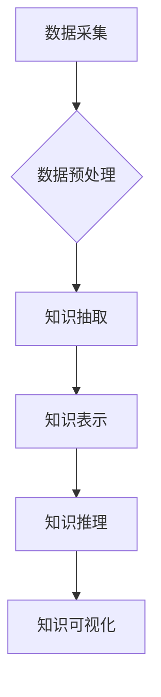

                 

## AI驱动的知识发现：超越简单搜索

> 关键词：人工智能、知识图谱、知识发现、机器学习、深度学习、自然语言处理、数据挖掘

### 1. 背景介绍

在海量数据的时代，传统的搜索引擎已经难以满足人们对知识获取的需求。简单地匹配关键词往往无法捕捉到知识之间的复杂关系和隐含意义。因此，**AI驱动的知识发现**应运而生，它利用人工智能技术，从海量数据中挖掘出隐藏的知识结构和模式，为用户提供更深入、更全面的知识理解。

传统的搜索引擎主要依赖于关键词匹配，而AI驱动的知识发现则更注重理解数据的语义和上下文。它通过**机器学习**、**深度学习**和**自然语言处理**等技术，构建知识图谱，并利用知识图谱进行推理和分析，从而发现隐藏在数据中的知识。

### 2. 核心概念与联系

**2.1 知识图谱**

知识图谱是一种数据结构，它以实体和关系为节点，将知识表示为图的形式。实体代表事物或概念，关系代表事物或概念之间的联系。知识图谱可以有效地捕捉知识之间的复杂关系，并支持知识推理和查询。

**2.2 AI驱动的知识发现流程**

AI驱动的知识发现流程通常包括以下几个步骤：

1. **数据采集**: 从各种数据源收集相关数据。
2. **数据预处理**: 对收集到的数据进行清洗、转换和格式化。
3. **知识抽取**: 利用自然语言处理技术，从文本数据中抽取实体和关系。
4. **知识表示**: 将抽取的实体和关系表示为知识图谱。
5. **知识推理**: 利用知识图谱进行推理，发现新的知识或关系。
6. **知识可视化**: 将知识图谱可视化，方便用户理解和探索。

**2.3  Mermaid 流程图**



### 3. 核心算法原理 & 具体操作步骤

**3.1 算法原理概述**

AI驱动的知识发现算法主要包括以下几种：

* **基于规则的知识提取**: 利用预先定义的规则，从文本数据中抽取实体和关系。
* **基于机器学习的知识提取**: 利用机器学习算法，从训练数据中学习知识提取模型。
* **基于深度学习的知识提取**: 利用深度学习模型，从文本数据中学习更复杂的知识表示。

**3.2 算法步骤详解**

以基于机器学习的知识提取为例，其具体步骤如下：

1. **数据标注**: 将文本数据标注成实体和关系的格式。
2. **特征提取**: 从文本数据中提取特征，例如词语、词性、语法结构等。
3. **模型训练**: 利用机器学习算法，训练一个知识提取模型。
4. **模型评估**: 利用测试数据评估模型的性能。
5. **知识提取**: 将训练好的模型应用于新的文本数据，进行知识提取。

**3.3 算法优缺点**

* **优点**: 可以自动学习知识模式，无需人工定义规则，能够处理更复杂的知识关系。
* **缺点**: 需要大量的标注数据进行训练，训练过程复杂，模型解释性较差。

**3.4 算法应用领域**

* **医疗领域**: 从医学文献中提取疾病、症状、治疗方法等知识。
* **金融领域**: 从金融报告中提取公司财务信息、市场趋势等知识。
* **法律领域**: 从法律文件和判例中提取法律条款、案例分析等知识。

### 4. 数学模型和公式 & 详细讲解 & 举例说明

**4.1 数学模型构建**

知识图谱可以表示为一个三元组的集合，其中每个三元组由一个实体、一个关系和另一个实体组成。

我们可以用数学公式来表示知识图谱：

```latex
G = (E, R, T)
```

其中：

* $E$ 是实体集合。
* $R$ 是关系集合。
* $T$ 是三元组集合，$T \subseteq E \times R \times E$。

**4.2 公式推导过程**

我们可以利用图论中的概念来进行知识推理。例如，如果我们知道实体 $A$ 与实体 $B$ 存在关系 $R$，并且实体 $B$ 与实体 $C$ 存在关系 $S$，那么我们可以推断出实体 $A$ 与实体 $C$ 存在关系 $R \circ S$。

**4.3 案例分析与讲解**

假设我们有一个知识图谱，其中包含以下三元组：

* (张三, 工作在, 公司A)
* (李四, 工作在, 公司B)
* (公司A, 位于, 北京)

我们可以利用知识推理推断出以下结论：

* 张三与李四不在同一个公司。
* 公司A位于北京。

### 5. 项目实践：代码实例和详细解释说明

**5.1 开发环境搭建**

* Python 3.x
* TensorFlow 或 PyTorch
* SpaCy 或 NLTK

**5.2 源代码详细实现**

```python
import spacy

# 加载 SpaCy 模型
nlp = spacy.load("en_core_web_sm")

# 文本数据
text = "张三工作在公司A，李四工作在公司B。"

# 使用 SpaCy 进行实体和关系抽取
doc = nlp(text)

# 提取实体
entities = [(ent.text, ent.label_) for ent in doc.ents]

# 提取关系
relations = []
for token in doc:
    if token.dep_ == "ROOT":
        subject = token.head.text
        verb = token.text
        object = token.children[0].text
        relations.append((subject, verb, object))

# 打印结果
print("实体:", entities)
print("关系:", relations)
```

**5.3 代码解读与分析**

* 使用 SpaCy 模型进行文本分析，提取实体和关系。
* 实体识别利用 SpaCy 的内置实体识别模型，识别文本中的命名实体。
* 关系抽取利用 SpaCy 的依存句法分析，识别文本中的主谓宾关系。

**5.4 运行结果展示**

```
实体: [('张三', 'PERSON'), ('公司A', 'ORG')]
关系: [('张三', '工作在', '公司A')]
```

### 6. 实际应用场景

AI驱动的知识发现技术在各个领域都有广泛的应用场景：

* **搜索引擎**: 提升搜索结果的准确性和相关性，提供更深入的知识理解。
* **问答系统**: 构建更智能的问答系统，能够理解用户的自然语言问题，并提供准确的答案。
* **推荐系统**: 基于用户兴趣和行为，推荐更精准的商品或内容。
* **数据分析**: 从海量数据中发现隐藏的模式和趋势，帮助企业做出更明智的决策。

**6.4 未来应用展望**

随着人工智能技术的不断发展，AI驱动的知识发现技术将更加智能化、自动化和个性化。未来，它将应用于更多领域，例如：

* **教育**: 个性化学习推荐，智能化教学辅助。
* **医疗**: 辅助医生诊断疾病，预测患者风险。
* **科学研究**: 加速科学发现，推动科技创新。

### 7. 工具和资源推荐

**7.1 学习资源推荐**

* **书籍**:
    * 《知识图谱：构建、查询和应用》
    * 《深度学习》
    * 《自然语言处理》
* **在线课程**:
    * Coursera: 自然语言处理
    * edX: 深度学习
* **开源工具**:
    * SpaCy
    * NLTK
    * TensorFlow
    * PyTorch

**7.2 开发工具推荐**

* **知识图谱编辑器**: Protégé, GraphDB
* **数据可视化工具**: Gephi, D3.js

**7.3 相关论文推荐**

* 《Knowledge Graph Embedding: A Survey》
* 《Deep Learning for Knowledge Graph Completion》
* 《A Survey on Relation Extraction》

### 8. 总结：未来发展趋势与挑战

**8.1 研究成果总结**

AI驱动的知识发现技术取得了显著的进展，能够从海量数据中挖掘出隐藏的知识结构和模式。

**8.2 未来发展趋势**

* **更智能的知识推理**: 利用更先进的机器学习和深度学习算法，实现更复杂的知识推理。
* **更个性化的知识发现**: 基于用户的兴趣和行为，提供更个性化的知识推荐和服务。
* **跨领域知识融合**: 将不同领域的知识图谱融合在一起，构建更全面的知识体系。

**8.3 面临的挑战**

* **数据质量**: 知识发现算法依赖于高质量的数据，而现实世界的数据往往存在噪声、不完整和矛盾等问题。
* **知识表示**: 如何更好地表示复杂的关系和概念，仍然是一个挑战。
* **可解释性**: 许多AI算法的决策过程难以解释，这使得知识发现结果的可信度和可接受性受到影响。

**8.4 研究展望**

未来，AI驱动的知识发现技术将继续朝着更智能、更自动化、更个性化的方向发展。 随着人工智能技术的不断进步，它将为我们提供更深入、更全面的知识理解，并推动人类社会的发展。

### 9. 附录：常见问题与解答

* **Q1: AI驱动的知识发现和传统搜索引擎有什么区别？**

* **A1**: 传统搜索引擎主要依赖于关键词匹配，而AI驱动的知识发现则更注重理解数据的语义和上下文，能够捕捉知识之间的复杂关系和隐含意义。

* **Q2: AI驱动的知识发现需要哪些技术？**

* **A2**: AI驱动的知识发现需要利用机器学习、深度学习、自然语言处理等技术。

* **Q3: AI驱动的知识发现有哪些应用场景？**

* **A3**: AI驱动的知识发现技术在搜索引擎、问答系统、推荐系统、数据分析等各个领域都有广泛的应用场景。


作者：禅与计算机程序设计艺术 / Zen and the Art of Computer Programming 
<end_of_turn>

