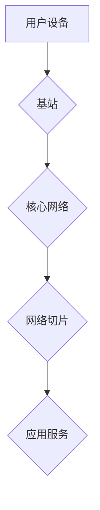

                 

## 5G 技术革命：速度和容量

> 关键词：5G, 毫米波, Massive MIMO, Beamforming, 网络切片, 低延迟, 高带宽, 物联网

### 1. 背景介绍

随着物联网、人工智能、云计算等技术的蓬勃发展，对网络带宽和延迟的要求越来越高。4G网络已经无法满足日益增长的需求，5G技术应运而生，成为连接万物、推动数字经济发展的关键技术。

5G技术相比于4G技术，在速度、容量、延迟等方面都有显著提升。它利用了毫米波频段、Massive MIMO技术、Beamforming技术等先进技术，为用户提供更高速、更低延迟、更高容量的网络体验。

### 2. 核心概念与联系

#### 2.1 核心概念

* **毫米波 (mmWave):** 5G网络利用高频毫米波频段 (24 GHz - 100 GHz) 进行通信，其频率范围比传统蜂窝网络高得多，拥有更大的带宽资源，可以支持更高的数据传输速率。
* **Massive MIMO (多输入多输出):** Massive MIMO技术利用大量天线阵列，可以同时发送和接收多个数据流，提高信道容量和信号质量。
* **Beamforming:** Beamforming技术通过对信号进行方向性控制，将信号集中发送到目标用户，提高信号强度和覆盖范围，降低干扰。
* **网络切片:** 网络切片技术将物理网络划分为多个逻辑网络，每个逻辑网络可以根据不同的应用需求进行定制化配置，例如低延迟、高带宽、高可靠性等。

#### 2.2 架构关系



### 3. 核心算法原理 & 具体操作步骤

#### 3.1 算法原理概述

5G网络的核心算法主要包括：

* **信道估计算法:** 用于估计信道状态信息，以便进行信道编码和解码。
* **功率控制算法:** 用于控制发射功率，以保证信号质量和覆盖范围。
* **调度算法:** 用于分配资源，例如带宽和时间片，以提高网络效率。
* **数据传输算法:** 用于实现高效的数据传输，例如OFDM (正交频分复用) 和 LDPC (低密度奇偶校验) 等。

#### 3.2 算法步骤详解

以信道估计算法为例，其具体步骤如下：

1. **数据采集:** 基站接收用户设备发送的信号，并采集相关数据。
2. **特征提取:** 从采集的数据中提取信道特征，例如信道衰落、多径效应等。
3. **模型训练:** 利用训练数据，训练信道估计模型，例如基于深度学习的模型。
4. **信道估计:** 将用户设备发送的信号输入到训练好的模型中，得到信道状态信息。

#### 3.3 算法优缺点

* **优点:** 提高信道利用率、降低误码率、提高网络容量。
* **缺点:** 计算复杂度高、需要大量训练数据。

#### 3.4 算法应用领域

信道估计算法广泛应用于无线通信领域，例如：

* **蜂窝网络:** 用于估计无线信道状态，提高数据传输速率和可靠性。
* **卫星通信:** 用于估计卫星信道状态，克服卫星通信的衰落和延迟问题。
* **无线传感器网络:** 用于估计无线信道状态，提高传感器网络的可靠性和覆盖范围。

### 4. 数学模型和公式 & 详细讲解 & 举例说明

#### 4.1 数学模型构建

信道估计模型可以表示为：

$$
\mathbf{y} = \mathbf{H} \mathbf{x} + \mathbf{n}
$$

其中：

* $\mathbf{y}$: 接收信号向量
* $\mathbf{H}$: 信道矩阵
* $\mathbf{x}$: 发送信号向量
* $\mathbf{n}$: 噪声向量

#### 4.2 公式推导过程

信道矩阵 $\mathbf{H}$ 可以表示为：

$$
\mathbf{H} = \mathbf{A} \mathbf{B}
$$

其中：

* $\mathbf{A}$: 发送天线阵列的权重矩阵
* $\mathbf{B}$: 接收天线阵列的权重矩阵

#### 4.3 案例分析与讲解

假设用户设备发送一个数据包，包含 $N$ 个符号。接收信号向量 $\mathbf{y}$ 包含 $M$ 个样本，其中 $M$ 是接收天线数量。信道矩阵 $\mathbf{H}$ 是一个 $M \times N$ 的矩阵，表示信道状态信息。

通过对接收信号 $\mathbf{y}$ 进行处理，例如最小二乘法，可以估计信道矩阵 $\mathbf{H}$，从而获得信道状态信息。

### 5. 项目实践：代码实例和详细解释说明

#### 5.1 开发环境搭建

* 操作系统: Ubuntu 20.04
* 编程语言: Python 3.8
* 软件包: NumPy, SciPy, Matplotlib

#### 5.2 源代码详细实现

```python
import numpy as np

# 生成发送信号
x = np.random.randn(100)

# 生成信道矩阵
H = np.random.randn(10, 100)

# 生成接收信号
y = H @ x + np.random.randn(10, 100)

# 使用最小二乘法估计信道矩阵
H_est = np.linalg.lstsq(y, x, rcond=None)[0]

# 显示估计结果
print(H_est)
```

#### 5.3 代码解读与分析

* 代码首先生成发送信号和信道矩阵。
* 然后，根据信道矩阵和发送信号，生成接收信号，并加入噪声。
* 最后，使用最小二乘法估计信道矩阵，并显示估计结果。

#### 5.4 运行结果展示

运行代码后，会输出估计的信道矩阵 $\mathbf{H}$。

### 6. 实际应用场景

#### 6.1 物联网

5G技术为物联网提供了高速、低延迟、高可靠性的连接，支持海量设备的连接和数据传输，推动物联网应用的快速发展。

#### 6.2 自动驾驶

自动驾驶汽车需要实时获取路况信息和进行决策，5G技术的低延迟和高带宽可以满足自动驾驶汽车对网络连接的需求。

#### 6.3 云游戏

云游戏需要将游戏画面和数据实时传输到用户设备，5G技术的低延迟和高带宽可以提供流畅的游戏体验。

#### 6.4 未来应用展望

5G技术将继续推动人工智能、虚拟现实、增强现实等新兴技术的应用，为人们的生活带来更多便利和改变。

### 7. 工具和资源推荐

#### 7.1 学习资源推荐

* **书籍:**
    * 5G技术原理与应用
    * 5G网络架构与设计
* **网站:**
    * 3GPP (3rd Generation Partnership Project)
    * ETSI (European Telecommunications Standards Institute)

#### 7.2 开发工具推荐

* **网络模拟器:**
    * ns-3
    * SUMO
* **编程语言:**
    * Python
    * C++

#### 7.3 相关论文推荐

* 5G NR Physical Layer: Overview and Key Features
* Massive MIMO for 5G: A Comprehensive Survey

### 8. 总结：未来发展趋势与挑战

#### 8.1 研究成果总结

5G技术已经取得了显著的成果，为用户提供了更高速、更低延迟、更高容量的网络体验。

#### 8.2 未来发展趋势

* **更高速的网络:** 6G技术将进一步提升网络速度，支持更高的数据传输速率。
* **更低延迟的网络:** 6G技术将进一步降低网络延迟，满足对实时交互应用的需求。
* **更智能的网络:** 6G技术将更加智能化，能够自动优化网络资源分配和网络性能。

#### 8.3 面临的挑战

* **频谱资源:** 5G技术需要更多的频谱资源，如何有效利用频谱资源是一个挑战。
* **网络安全:** 5G网络更加复杂，网络安全问题更加突出，需要加强网络安全防护。
* **成本问题:** 5G网络建设成本较高，如何降低成本是一个挑战。

#### 8.4 研究展望

未来，5G技术将继续发展，推动数字经济的发展，为人们的生活带来更多便利和改变。

### 9. 附录：常见问题与解答

* **5G和4G的区别是什么？**

5G和4G都是蜂窝网络技术，但5G技术相比于4G技术，在速度、容量、延迟等方面都有显著提升。

* **5G技术有哪些应用场景？**

5G技术广泛应用于物联网、自动驾驶、云游戏、虚拟现实、增强现实等领域。

* **5G技术有哪些挑战？**

5G技术面临着频谱资源、网络安全、成本问题等挑战。


作者：禅与计算机程序设计艺术 / Zen and the Art of Computer Programming 
<end_of_turn>

