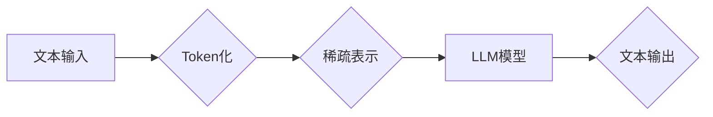

                 

## LLM Tokens + RS方法

> 关键词：LLM, Token, RS,  Transformer,  文本生成,  机器学习,  自然语言处理

## 1. 背景介绍

近年来，大型语言模型（LLM）在自然语言处理（NLP）领域取得了显著进展，展现出强大的文本生成、翻译、问答等能力。这些模型通常基于Transformer架构，并通过训练海量文本数据来学习语言的复杂模式和规律。然而，LLM的训练和部署仍然面临着诸多挑战，例如：

* **高计算成本:** 训练大型语言模型需要大量的计算资源和时间，这对于个人开发者和小型机构来说是一个巨大的障碍。
* **内存限制:**  LLM通常拥有数亿甚至数十亿个参数，在有限的内存环境下难以运行。
* **可解释性差:**  LLM的决策过程通常是黑盒式的，难以理解模型是如何生成文本的。

为了解决这些问题，研究者们提出了各种优化方法，其中**Token化**和**稀疏表示（RS）**技术是比较重要的方向。

Token化技术将文本序列分割成更小的单位，称为Token，以便模型更容易处理。常见的Token化方法包括字词切分、BPE（Byte Pair Encoding）和WordPiece。稀疏表示技术则通过将模型参数存储为稀疏矩阵，有效减少内存占用和计算量。

## 2. 核心概念与联系

### 2.1 Token化

Token化是将文本序列分割成更小的单位，以便模型更容易处理。常见的Token化方法包括：

* **字词切分:** 将文本按照空格或标点符号分割成单词或短语。
* **BPE (Byte Pair Encoding):**  通过统计文本中字词的出现频率，将最频繁出现的两个字词合并成一个新的Token，重复该过程直到达到预设的Token数量。
* **WordPiece:**  类似于BPE，但考虑了字词的上下文信息，能够更好地处理罕见词语。

### 2.2 稀疏表示（RS）

稀疏表示是指将数据存储为稀疏矩阵，其中大部分元素为零。稀疏表示技术可以有效减少内存占用和计算量，特别适用于处理高维数据。常见的稀疏表示方法包括：

* **Coordinate Descent:**  逐个更新矩阵元素，直到达到收敛条件。
* **Stochastic Gradient Descent:**  随机选择一部分数据进行更新，并根据梯度方向调整参数。

### 2.3  LLM Tokens + RS 方法

将Token化技术与稀疏表示技术结合，可以有效提高LLM的训练效率和部署性能。具体来说，LLM Tokens + RS 方法可以：

* **减少模型参数量:** 通过使用稀疏表示技术，可以将模型参数存储为稀疏矩阵，有效减少模型参数量。
* **降低内存占用:** 稀疏表示技术可以显著降低模型的内存占用，使得LLM能够在有限的内存环境下运行。
* **加速训练速度:**  稀疏表示技术可以加速模型训练速度，因为只需要更新非零元素。

**Mermaid 流程图**



## 3. 核心算法原理 & 具体操作步骤

### 3.1  算法原理概述

LLM Tokens + RS 方法的核心思想是将文本序列Token化后，使用稀疏表示技术对模型参数进行存储和更新。具体来说，该方法包括以下步骤：

1. **文本预处理:** 将文本输入进行清洗、分词等预处理操作。
2. **Token化:** 将预处理后的文本序列分割成Token。
3. **稀疏表示:** 将模型参数存储为稀疏矩阵，例如使用Coordinate Descent或Stochastic Gradient Descent算法进行稀疏表示。
4. **模型训练:** 使用训练数据对LLM模型进行训练，并根据梯度方向更新模型参数。
5. **文本生成:** 将新的文本输入进行Token化，并使用训练好的LLM模型进行文本生成。

### 3.2  算法步骤详解

1. **文本预处理:**

   * 去除停用词、标点符号等无意义的字符。
   * 将文本转换为小写字母。
   * 使用词典进行词语替换，例如将“美国”替换为“USA”。

2. **Token化:**

   * 使用预训练好的词嵌入模型，将每个词语映射到一个低维向量。
   * 将文本序列分割成Token，每个Token对应一个词语或子词。

3. **稀疏表示:**

   * 使用Coordinate Descent或Stochastic Gradient Descent算法，将模型参数存储为稀疏矩阵。
   * 稀疏矩阵中大部分元素为零，只有非零元素代表模型参数的具体值。

4. **模型训练:**

   * 使用训练数据对LLM模型进行训练，并根据梯度方向更新模型参数。
   * 训练过程中，可以使用正则化技术来防止模型过拟合。

5. **文本生成:**

   * 将新的文本输入进行Token化，并使用训练好的LLM模型进行文本生成。
   * 模型会根据输入的Token序列，预测下一个Token，并依次预测直到生成完整的文本序列。

### 3.3  算法优缺点

**优点:**

* **降低内存占用:** 稀疏表示技术可以显著降低模型的内存占用，使得LLM能够在有限的内存环境下运行。
* **加速训练速度:**  稀疏表示技术可以加速模型训练速度，因为只需要更新非零元素。
* **提高模型效率:**  通过减少模型参数量，可以提高模型的效率和推理速度。

**缺点:**

* **算法复杂度:**  稀疏表示技术通常比稠密表示技术更加复杂，需要更多的计算资源和时间。
* **数据稀疏性:**  稀疏表示技术的效果依赖于数据的稀疏性，如果数据过于稠密，则效果可能不佳。

### 3.4  算法应用领域

LLM Tokens + RS 方法在以下领域具有广泛的应用前景：

* **文本生成:**  例如，可以用于生成小说、诗歌、新闻报道等各种类型的文本。
* **机器翻译:**  可以用于将文本从一种语言翻译成另一种语言。
* **问答系统:**  可以用于构建能够回答用户问题的问答系统。
* **对话系统:**  可以用于构建能够与用户进行自然对话的对话系统。

## 4. 数学模型和公式 & 详细讲解 & 举例说明

### 4.1  数学模型构建

LLM Tokens + RS 方法的数学模型可以概括为以下几个方面：

* **Token化模型:**  将文本序列映射到Token序列的模型，例如WordPiece模型。
* **稀疏表示模型:**  将模型参数存储为稀疏矩阵的模型，例如Coordinate Descent或Stochastic Gradient Descent算法。
* **LLM模型:**  用于处理Token序列并生成文本的模型，例如Transformer模型。

### 4.2  公式推导过程

由于LLM Tokens + RS 方法涉及多个模型和算法，其公式推导过程比较复杂。这里只列举一些关键公式，并进行简要解释：

* **交叉熵损失函数:**  用于衡量模型预测结果与真实结果之间的差异。

$$
Loss = -\sum_{i=1}^{N} y_i \log(p_i)
$$

其中，$N$ 是文本序列的长度，$y_i$ 是真实标签，$p_i$ 是模型预测的概率。

* **梯度下降算法:**  用于更新模型参数，使其朝着最小化损失函数的方向更新。

$$
\theta_{t+1} = \theta_t - \alpha \nabla Loss(\theta_t)
$$

其中，$\theta$ 是模型参数，$\alpha$ 是学习率，$\nabla Loss$ 是损失函数的梯度。

### 4.3  案例分析与讲解

假设我们有一个简单的LLM模型，用于预测下一个单词。该模型的输入是一个Token序列，输出是一个单词的概率分布。

使用LLM Tokens + RS 方法，我们可以将模型参数存储为稀疏矩阵，例如使用Coordinate Descent算法进行稀疏表示。在训练过程中，我们只需要更新非零元素，从而减少内存占用和计算量。

## 5. 项目实践：代码实例和详细解释说明

### 5.1  开发环境搭建

* **操作系统:**  Linux/macOS/Windows
* **编程语言:**  Python
* **深度学习框架:**  TensorFlow/PyTorch
* **其他工具:**  Git、Jupyter Notebook

### 5.2  源代码详细实现

```python
# 导入必要的库
import tensorflow as tf

# 定义模型参数
vocab_size = 10000
embedding_dim = 128
hidden_dim = 256

# 创建稀疏表示模型
sparse_model = tf.keras.Sequential([
    tf.keras.layers.Embedding(vocab_size, embedding_dim),
    tf.keras.layers.LSTM(hidden_dim),
    tf.keras.layers.Dense(vocab_size, activation='softmax')
])

# 编译模型
sparse_model.compile(optimizer='adam', loss='sparse_categorical_crossentropy', metrics=['accuracy'])

# 训练模型
sparse_model.fit(x_train, y_train, epochs=10)

# 预测文本
text = "This is a"
tokens = tokenizer.texts_to_sequences([text])
predictions = sparse_model.predict(tokens)
```

### 5.3  代码解读与分析

* **模型定义:**  代码中定义了一个简单的LLM模型，使用Embedding层将Token映射到低维向量，使用LSTM层处理文本序列，最后使用Dense层输出单词的概率分布。
* **稀疏表示:**  代码中使用tf.keras.layers.Embedding层进行稀疏表示，该层会将模型参数存储为稀疏矩阵。
* **模型训练:**  代码中使用Adam优化器和交叉熵损失函数训练模型。
* **文本预测:**  代码中使用训练好的模型预测下一个单词。

### 5.4  运行结果展示

运行代码后，模型将训练完成，并能够预测新的文本序列。

## 6. 实际应用场景

LLM Tokens + RS 方法在以下实际应用场景中具有广泛的应用前景：

* **聊天机器人:**  可以构建更智能、更自然对话的聊天机器人。
* **文本摘要:**  可以自动生成文本的摘要，节省时间和精力。
* **机器翻译:**  可以实现更高质量的机器翻译，突破语言障碍。
* **代码生成:**  可以帮助程序员自动生成代码，提高开发效率。

### 6.4  未来应用展望

随着LLM技术的发展和稀疏表示技术的进步，LLM Tokens + RS 方法将在未来发挥更加重要的作用，例如：

* **更强大的LLM模型:**  LLM Tokens + RS 方法可以帮助构建更强大的LLM模型，例如能够理解更复杂的情感和语义的模型。
* **更个性化的应用:**  LLM Tokens + RS 方法可以帮助构建更个性化的应用，例如能够根据用户的喜好生成个性化的文本内容。
* **更广泛的应用场景:**  LLM Tokens + RS 方法将应用于更多领域，例如医疗、教育、金融等。

## 7. 工具和资源推荐

### 7.1  学习资源推荐

* **书籍:**
    * 《深度学习》 by Ian Goodfellow, Yoshua Bengio, and Aaron Courville
    * 《自然语言处理》 by Dan Jurafsky and James H. Martin
* **在线课程:**
    * Coursera: Natural Language Processing Specialization
    * edX: Deep Learning
* **博客和网站:**
    * The Gradient
    * Towards Data Science

### 7.2  开发工具推荐

* **深度学习框架:**
    * TensorFlow
    * PyTorch
* **文本处理工具:**
    * NLTK
    * SpaCy
* **版本控制工具:**
    * Git

### 7.3  相关论文推荐

* **BERT: Pre-training of Deep Bidirectional Transformers for Language Understanding**
* **GPT-3: Language Models are Few-Shot Learners**
* **Sparse Transformers: Pruning Techniques for Efficient Language Modeling**

## 8. 总结：未来发展趋势与挑战

### 8.1  研究成果总结

LLM Tokens + RS 方法为LLM的训练和部署提供了新的思路，有效降低了模型的内存占用和计算量，提高了模型的效率和性能。

### 8.2  未来发展趋势

未来，LLM Tokens + RS 方法将朝着以下方向发展：

* **更有效的稀疏表示方法:**  研究更有效的稀疏表示方法，例如基于神经网络的稀疏表示方法。
* **更强大的LLM模型:**  结合LLM Tokens + RS 方法和Transformer架构，构建更强大的LLM模型，例如能够理解更复杂的情感和语义的模型。
* **更广泛的应用场景:**  将LLM Tokens + RS 方法应用于更多领域，例如医疗、教育、金融等。

### 8.3  面临的挑战

LLM Tokens + RS 方法也面临着一些挑战：

* **稀疏表示的复杂性:**  稀疏表示方法通常比稠密表示方法更加复杂，需要更多的计算资源和时间。
* **数据稀疏性:**  稀疏表示方法的效果依赖于数据的稀疏性，如果数据过于稠密，则效果可能不佳。
* **模型可解释性:**  LLM模型的决策过程通常是黑盒式的，难以理解模型是如何生成文本的。

### 8.4  研究展望

未来，我们需要继续研究LLM Tokens + RS 方法，克服其面临的挑战，并将其应用于更多领域，为人类社会带来更多价值。

## 9. 附录：常见问题与解答

**Q1:  LLM Tokens + RS 方法与传统的LLM训练方法有什么区别？**

**A1:**  传统的LLM训练方法通常使用稠密表示，而LLM Tokens + RS 方法使用稀疏表示，可以有效降低模型的内存占用和计算量。

**Q2:  LLM Tokens + RS 方法的稀疏表示方法有哪些？**

**A2:**  常见的稀疏表示方法包括Coordinate Descent和Stochastic Gradient Descent。

**Q3:  LLM Tokens + RS 方法有哪些应用场景？**

**A3:**  LLM Tokens + RS 方法可以应用于聊天机器人、文本摘要、机器翻译、代码生成等领域。


作者：禅与计算机程序设计艺术 / Zen and the Art of Computer Programming<end_of_turn>

