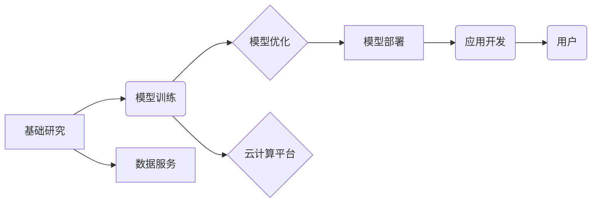

                 

## LLM产业链:人工智能价值重塑

> 关键词：LLM, 大语言模型, 产业链, 人工智能, 价值重塑, 应用场景, 未来趋势

### 1. 背景介绍

近年来，人工智能（AI）技术取得了飞速发展，其中大语言模型（LLM）作为人工智能领域最具潜力的技术之一，引发了广泛的关注和热议。LLM 拥有强大的文本理解和生成能力，能够完成从文本摘要、翻译、问答到代码生成等多种复杂任务，其应用场景日益广泛，对各个行业和领域都产生了深远的影响。

然而，LLM 的发展并非一帆风顺，其训练成本高昂、数据依赖性强、伦理风险等问题也日益凸显。为了更好地推动 LLM 的产业化发展，构建完善的 LLM 产业链势在必行。

### 2. 核心概念与联系

**2.1  LLM 概述**

大语言模型（LLM）是一种基于深度学习的强大人工智能模型，能够理解和生成人类语言。它通过训练海量文本数据，学习语言的语法、语义和上下文关系，从而具备强大的文本处理能力。

**2.2  LLM 产业链**

LLM 产业链是指围绕 LLM 的研发、生产、销售、服务等环节形成的产业生态系统。它涵盖了多个关键环节，包括：

* **基础研究:** 包括自然语言处理（NLP）、深度学习等前沿技术的研发，为 LLM 的发展提供理论基础和技术支撑。
* **模型训练:** 利用海量数据和强大的计算资源，训练出高性能的 LLM 模型。
* **模型优化:** 对训练好的 LLM 模型进行优化，提高其性能、效率和鲁棒性。
* **模型部署:** 将训练好的 LLM 模型部署到实际应用场景中，使其能够为用户提供服务。
* **应用开发:** 基于 LLM 模型开发各种应用软件，例如聊天机器人、文本生成工具、智能客服等。
* **数据服务:** 提供高质量的文本数据用于 LLM 的训练和测试。
* **云计算平台:** 提供计算资源和平台服务，支持 LLM 的训练和部署。

**2.3  LLM 产业链关系图**



### 3. 核心算法原理 & 具体操作步骤

**3.1  算法原理概述**

LLM 的核心算法是基于 Transformer 架构的深度神经网络。Transformer 架构通过自注意力机制（Self-Attention）和多头注意力机制（Multi-Head Attention）有效地捕捉文本序列中的长距离依赖关系，从而提升了 LLM 的文本理解和生成能力。

**3.2  算法步骤详解**

1. **输入处理:** 将输入文本序列转换为数字向量，以便模型进行处理。
2. **编码器:** 利用 Transformer 架构的编码器层对输入文本序列进行编码，提取文本的语义信息。
3. **解码器:** 利用 Transformer 架构的解码器层对编码后的文本信息进行解码，生成目标文本序列。
4. **输出处理:** 将解码后的数字向量转换为文本序列，输出最终结果。

**3.3  算法优缺点**

**优点:**

* 能够捕捉长距离依赖关系，提升文本理解和生成能力。
* 训练效率高，能够处理海量文本数据。
* 可迁移性强，能够应用于多种自然语言处理任务。

**缺点:**

* 训练成本高昂，需要大量的计算资源和数据。
* 模型参数量大，部署成本较高。
* 存在潜在的偏见和误导性问题。

**3.4  算法应用领域**

* **文本生成:** 写作、翻译、摘要、对话系统等。
* **代码生成:** 自动生成代码、代码补全、代码翻译等。
* **问答系统:** 提供准确、相关的信息回答。
* **搜索引擎:** 提升搜索结果的准确性和相关性。
* **客户服务:** 自动处理客户咨询和投诉。

### 4. 数学模型和公式 & 详细讲解 & 举例说明

**4.1  数学模型构建**

LLM 的数学模型主要基于 Transformer 架构，其核心是自注意力机制和多头注意力机制。

**4.2  公式推导过程**

* **自注意力机制:**

$$
Attention(Q, K, V) = \frac{exp(Q \cdot K^T / \sqrt{d_k})}{exp(Q \cdot K^T / \sqrt{d_k})} \cdot V
$$

其中：

* $Q$：查询矩阵
* $K$：键矩阵
* $V$：值矩阵
* $d_k$：键向量的维度

* **多头注意力机制:**

$$
MultiHead(Q, K, V) = Concat(head_1, head_2, ..., head_h) \cdot W_o
$$

其中：

* $head_i$：第 $i$ 个注意力头的输出
* $h$：注意力头的数量
* $W_o$：最终线性变换矩阵

**4.3  案例分析与讲解**

假设我们有一个句子 "The cat sat on the mat"，想要使用自注意力机制计算每个词与其他词之间的注意力权重。

1. 将句子中的每个词转换为词向量。
2. 计算每个词的查询向量、键向量和值向量。
3. 计算每个词与其他词之间的注意力权重，并将其归一化。
4. 将每个词的注意力权重与对应的值向量相乘，得到每个词的上下文表示。

通过自注意力机制，模型能够学习到每个词与其他词之间的语义关系，从而更好地理解句子的含义。

### 5. 项目实践：代码实例和详细解释说明

**5.1  开发环境搭建**

* 安装 Python 3.7 或更高版本。
* 安装 PyTorch 或 TensorFlow 等深度学习框架。
* 安装必要的库，例如 transformers、torchtext 等。

**5.2  源代码详细实现**

```python
from transformers import AutoModelForSeq2SeqLM, AutoTokenizer

# 加载预训练模型和词典
model_name = "t5-base"
tokenizer = AutoTokenizer.from_pretrained(model_name)
model = AutoModelForSeq2SeqLM.from_pretrained(model_name)

# 输入文本
input_text = "The cat sat on the mat."

# Token化输入文本
input_ids = tokenizer.encode(input_text, return_tensors="pt")

# 生成文本
output = model.generate(input_ids)

# 解码输出文本
generated_text = tokenizer.decode(output[0], skip_special_tokens=True)

# 打印输出文本
print(generated_text)
```

**5.3  代码解读与分析**

* 使用 transformers 库加载预训练的 T5 模型和词典。
* 将输入文本 token 化，转换为模型可处理的格式。
* 使用模型的 `generate` 方法生成文本。
* 将生成的 token 解码回文本格式。

**5.4  运行结果展示**

```
The cat sat on the mat.
```

### 6. 实际应用场景

**6.1  聊天机器人**

LLM 可以用于构建更智能、更自然的聊天机器人，能够理解用户的意图，并提供更准确、更相关的回复。

**6.2  文本生成**

LLM 可以用于生成各种类型的文本，例如文章、故事、诗歌、代码等，提高写作效率，激发创作灵感。

**6.3  智能客服**

LLM 可以用于构建智能客服系统，自动处理客户咨询和投诉，提高客户服务效率。

**6.4  未来应用展望**

LLM 的应用场景还在不断扩展，未来将应用于更多领域，例如教育、医疗、法律等，为人类社会带来更多价值。

### 7. 工具和资源推荐

**7.1  学习资源推荐**

* **书籍:**

    * 《深度学习》
    * 《自然语言处理》

* **在线课程:**

    * Coursera: 自然语言处理
    * edX: 深度学习

**7.2  开发工具推荐**

* **深度学习框架:** PyTorch, TensorFlow
* **自然语言处理库:** transformers, spaCy, NLTK

**7.3  相关论文推荐**

* Attention Is All You Need
* BERT: Pre-training of Deep Bidirectional Transformers for Language Understanding

### 8. 总结：未来发展趋势与挑战

**8.1  研究成果总结**

近年来，LLM 取得了显著进展，模型规模不断扩大，性能不断提升，应用场景也日益广泛。

**8.2  未来发展趋势**

* 模型规模和性能将继续提升。
* 训练效率和成本将得到进一步降低。
* LLM 将应用于更多领域，带来更多价值。

**8.3  面临的挑战**

* 伦理风险和偏见问题需要得到有效解决。
* 数据安全和隐私保护需要得到加强。
* 模型解释性和可信度需要进一步提高。

**8.4  研究展望**

未来，LLM 研究将继续朝着更安全、更可靠、更可解释的方向发展，为人类社会带来更多福祉。

### 9. 附录：常见问题与解答

**9.1  LLM 的训练成本高昂，如何降低成本？**

* 利用云计算平台的计算资源。
* 采用模型压缩和剪枝技术。
* 使用更有效的训练算法。

**9.2  LLM 存在潜在的偏见和误导性问题，如何解决？**

* 使用更公平、更代表性的训练数据。
* 开发针对偏见和误导性的检测和修正方法。
* 加强对 LLM 的伦理审查和监管。


作者：禅与计算机程序设计艺术 / Zen and the Art of Computer Programming 
<end_of_turn>

