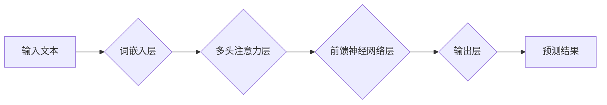

                 

## LLM在各行业应用中的潜力

> 关键词：大型语言模型 (LLM)、自然语言处理 (NLP)、人工智能 (AI)、行业应用、潜力、未来趋势

## 1. 背景介绍

近年来，人工智能（AI）领域取得了令人瞩目的进展，其中大型语言模型（LLM）作为一种强大的工具，展现出巨大的潜力。LLM 是一种基于深度学习的模型，能够理解和生成人类语言，其能力涵盖文本生成、翻译、摘要、问答等多个方面。随着算法的不断改进和计算资源的增加，LLM 的性能不断提升，并开始在各个行业得到广泛应用。

### 1.1  LLM的兴起

LLM 的兴起得益于以下几个关键因素：

* **深度学习的进步:** 深度学习算法，特别是 Transformer 架构，为 LLM 的训练提供了强大的基础。
* **海量数据:**  互联网时代产生的海量文本数据为 LLM 的训练提供了充足的素材。
* **计算资源的提升:**  GPU 和 TPU 等高性能计算设备的出现，使得 LLM 的训练成为可能。

### 1.2  LLM的优势

LLM 拥有以下优势：

* **强大的语言理解能力:** LLM 可以理解复杂的语法结构和语义关系，并能够从文本中提取关键信息。
* **灵活的文本生成能力:** LLM 可以生成各种类型的文本，例如文章、故事、对话等。
* **跨语言能力:** 一些 LLM 能够处理多种语言，实现跨语言的文本理解和生成。

## 2. 核心概念与联系

LLM 的核心概念是**神经网络**和**深度学习**。

**2.1  神经网络**

神经网络是一种模仿人脑神经元结构的计算模型。它由多个层组成，每层包含多个神经元。每个神经元接收来自上一层的输入，并通过权重进行计算，输出到下一层。通过训练，神经网络可以学习到数据的特征和规律。

**2.2  深度学习**

深度学习是利用多层神经网络进行学习的一种机器学习方法。与传统机器学习方法相比，深度学习能够学习到更复杂的特征，并具有更强的泛化能力。

**2.3  LLM的架构**

LLM 通常基于 Transformer 架构，它是一种专门用于处理序列数据的网络结构。Transformer 架构的核心是**注意力机制**，它能够学习到文本中不同词语之间的关系，从而更好地理解文本的语义。

**Mermaid 流程图**



## 3. 核心算法原理 & 具体操作步骤

### 3.1  算法原理概述

LLM 的训练主要基于**自回归语言模型**的原理。自回归语言模型的目标是预测文本序列中的下一个词，根据上下文信息。训练过程通过**最大似然估计**来优化模型参数，使得模型能够生成更符合语义的文本。

### 3.2  算法步骤详解

1. **数据预处理:** 将文本数据进行清洗、分词、标记等预处理操作，使其适合模型训练。
2. **词嵌入:** 将每个词语映射到一个低维向量空间，使得词语之间的语义关系能够被捕捉到。
3. **模型训练:** 使用训练数据，通过反向传播算法，优化模型参数，使得模型能够预测下一个词语。
4. **模型评估:** 使用测试数据，评估模型的性能，例如困惑度、BLEU 等指标。
5. **模型部署:** 将训练好的模型部署到实际应用场景中。

### 3.3  算法优缺点

**优点:**

* 能够生成高质量的文本。
* 能够理解和生成多种类型的文本。
* 能够进行跨语言的文本处理。

**缺点:**

* 训练成本高，需要大量的计算资源和数据。
* 模型参数量大，部署成本较高。
* 容易受到训练数据的影响，可能生成带有偏见或错误的信息。

### 3.4  算法应用领域

LLM 在各个领域都有广泛的应用，例如：

* **自然语言处理:** 文本分类、情感分析、机器翻译、问答系统等。
* **人工智能助手:** 聊天机器人、虚拟助理等。
* **内容创作:** 文章写作、故事生成、诗歌创作等。
* **代码生成:** 代码自动补全、代码生成等。

## 4. 数学模型和公式 & 详细讲解 & 举例说明

### 4.1  数学模型构建

LLM 的数学模型通常基于**概率图模型**。概率图模型是一种用于表示随机变量之间的依赖关系的图形模型。LLM 的概率图模型通常包含以下几个关键节点：

* **输入词:** 表示模型输入的词语。
* **词嵌入:** 表示每个词语的向量表示。
* **隐藏状态:** 表示模型对输入文本的理解。
* **输出概率:** 表示模型预测下一个词语的概率分布。

### 4.2  公式推导过程

LLM 的训练目标是最大化模型输出的下一个词语的概率。可以使用**交叉熵损失函数**来衡量模型的预测结果与真实值的差距。

$$
Loss = -\sum_{t=1}^{T} \log p(w_t | w_{<t})
$$

其中：

* $T$ 是文本序列的长度。
* $w_t$ 是文本序列中的第 $t$ 个词语。
* $p(w_t | w_{<t})$ 是模型预测第 $t$ 个词语的概率，给定前 $t-1$ 个词语的上下文。

### 4.3  案例分析与讲解

假设我们有一个文本序列 "The cat sat on the mat"，我们想要预测下一个词语。LLM 会根据上下文信息 "The cat sat on the"，预测下一个词语可能是 "mat"。

$$
p(mat | The, cat, sat, on, the) > p(dog | The, cat, sat, on, the)
$$

## 5. 项目实践：代码实例和详细解释说明

### 5.1  开发环境搭建

LLM 的开发环境通常需要以下软件：

* Python 编程语言
* TensorFlow 或 PyTorch 深度学习框架
* CUDA 和 cuDNN GPU 驱动程序

### 5.2  源代码详细实现

LLM 的源代码实现通常比较复杂，需要大量的代码和参数配置。这里只提供一个简单的例子，展示如何使用 TensorFlow 来构建一个简单的文本生成模型。

```python
import tensorflow as tf

# 定义模型结构
model = tf.keras.Sequential([
    tf.keras.layers.Embedding(input_dim=10000, output_dim=128),
    tf.keras.layers.LSTM(units=128),
    tf.keras.layers.Dense(units=10000, activation='softmax')
])

# 编译模型
model.compile(loss='sparse_categorical_crossentropy', optimizer='adam')

# 训练模型
model.fit(x_train, y_train, epochs=10)

# 生成文本
text = "The quick brown fox"
for _ in range(10):
    prediction = model.predict(tf.expand_dims(text, axis=0))
    next_word_index = tf.argmax(prediction[0]).numpy()
    next_word = vocabulary[next_word_index]
    text += " " + next_word
```

### 5.3  代码解读与分析

* **Embedding 层:** 将每个词语映射到一个低维向量空间。
* **LSTM 层:** 用于处理文本序列，学习文本中的上下文信息。
* **Dense 层:** 用于预测下一个词语的概率分布。
* **训练过程:** 使用训练数据，通过反向传播算法，优化模型参数。
* **文本生成:** 使用训练好的模型，根据输入文本，预测下一个词语，并生成新的文本。

### 5.4  运行结果展示

运行上述代码，可以生成一些基于输入文本的续写文本。

## 6. 实际应用场景

### 6.1  医疗保健

* **疾病诊断:** LLM 可以分析患者的病历和症状，辅助医生进行疾病诊断。
* **药物研发:** LLM 可以分析大量的生物医学文献，帮助科学家发现新的药物靶点。
* **个性化医疗:** LLM 可以根据患者的基因信息和生活习惯，提供个性化的医疗建议。

### 6.2  教育

* **智能辅导:** LLM 可以为学生提供个性化的学习辅导，解答学生的问题，并提供学习建议。
* **自动批改:** LLM 可以自动批改学生的作业，节省教师的时间和精力。
* **语言学习:** LLM 可以帮助学生学习新的语言，提供翻译、对话练习等功能。

### 6.3  金融

* **欺诈检测:** LLM 可以分析交易数据，识别潜在的欺诈行为。
* **风险评估:** LLM 可以分析客户的信用信息，评估客户的贷款风险。
* **投资建议:** LLM 可以分析市场数据，提供投资建议。

### 6.4  未来应用展望

LLM 的应用场景还在不断扩展，未来可能会在以下领域得到更广泛的应用：

* **自动驾驶:** LLM 可以帮助自动驾驶汽车理解道路环境，做出更安全的决策。
* **机器人:** LLM 可以赋予机器人更强的语言理解和生成能力，使其能够更好地与人类交互。
* **虚拟现实:** LLM 可以为虚拟现实体验提供更逼真的对话和互动。

## 7. 工具和资源推荐

### 7.1  学习资源推荐

* **书籍:**
    * 《深度学习》 by Ian Goodfellow, Yoshua Bengio, and Aaron Courville
    * 《自然语言处理》 by Dan Jurafsky and James H. Martin
* **在线课程:**
    * Coursera: Natural Language Processing Specialization
    * edX: Deep Learning
* **博客和论坛:**
    * Towards Data Science
    * Reddit: r/MachineLearning

### 7.2  开发工具推荐

* **TensorFlow:** https://www.tensorflow.org/
* **PyTorch:** https://pytorch.org/
* **Hugging Face Transformers:** https://huggingface.co/transformers/

### 7.3  相关论文推荐

* **Attention Is All You Need:** https://arxiv.org/abs/1706.03762
* **BERT: Pre-training of Deep Bidirectional Transformers for Language Understanding:** https://arxiv.org/abs/1810.04805
* **GPT-3: Language Models are Few-Shot Learners:** https://arxiv.org/abs/2005.14165

## 8. 总结：未来发展趋势与挑战

### 8.1  研究成果总结

LLM 在过去几年取得了显著的进展，其性能不断提升，应用场景也越来越广泛。

### 8.2  未来发展趋势

LLM 的未来发展趋势包括：

* **模型规模的进一步扩大:** 更大的模型能够学习到更复杂的特征，从而提高模型的性能。
* **训练数据的多样化:** 使用更丰富的训练数据，可以帮助模型更好地理解不同的语言和文化。
* **模型的解释性和可控性:** 研究如何提高模型的解释性和可控性，使其能够更好地服务于人类。

### 8.3  面临的挑战

LLM 还面临着一些挑战：

* **训练成本高:** 训练大型 LLMs 需要大量的计算资源和时间。
* **数据偏见:** 训练数据可能存在偏见，导致模型生成带有偏见的结果。
* **安全性和隐私性:** LLMs 可能被用于恶意目的，例如生成虚假信息或侵犯隐私。

### 8.4  研究展望

未来，LLM 研究将继续朝着更强大、更安全、更可控的方向发展。

## 9. 附录：常见问题与解答

**Q1: LLM 和 RNN 的区别是什么？**

**A1:** RNN (循环神经网络) 是一种专门用于处理序列数据的网络结构，但其能力有限，难以处理长序列数据。LLM 基于 Transformer 架构，能够更好地处理长序列数据，并具有更强的性能。

**Q2: 如何评估 LLM 的性能？**

**A2:** LLM 的性能通常使用困惑度 (perplexity) 和 BLEU 等指标来评估。困惑度越低，模型的预测结果越好。BLEU 是衡量机器翻译质量的指标。

**Q3: LLM 的应用场景有哪些？**

**A3:** LLM 的应用场景非常广泛，例如自然语言处理、人工智能助手、内容创作、代码生成等。

**作者：禅与计算机程序设计艺术 / Zen and the Art of Computer Programming**<end_of_turn>

