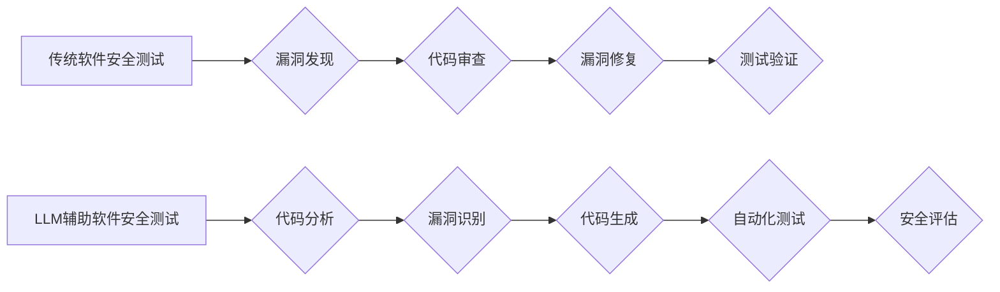

                 

## LLM对传统软件安全测试的挑战与改进

> 关键词：大型语言模型 (LLM)、软件安全测试、漏洞发现、代码生成、自动化测试、安全评估

## 1. 背景介绍

随着软件系统日益复杂化和智能化，软件安全问题日益突出。传统软件安全测试方法，例如静态分析、动态分析和渗透测试，虽然在一定程度上能够发现软件漏洞，但面对快速迭代的开发节奏和庞大的代码规模，这些方法存在着局限性。

近年来，大型语言模型 (LLM) 作为一种强大的人工智能技术，在自然语言处理、代码生成等领域取得了突破性进展。LLM 的强大能力为软件安全测试领域带来了新的机遇和挑战。

## 2. 核心概念与联系

### 2.1  大型语言模型 (LLM)

LLM 是指能够理解和生成人类语言的深度学习模型。它们通过训练海量文本数据，学习语言的语法、语义和上下文关系，从而具备强大的文本处理能力。

### 2.2  传统软件安全测试

传统软件安全测试主要包括以下几种方法：

* **静态分析:** 对软件代码进行静态分析，识别潜在的安全漏洞。
* **动态分析:** 对运行中的软件进行分析，检测安全漏洞的触发和利用。
* **渗透测试:** 模拟攻击者对软件系统的攻击，发现安全漏洞。

### 2.3  LLM在软件安全测试中的应用

LLM 可以应用于软件安全测试的各个环节，例如：

* **漏洞发现:** LLM 可以分析代码，识别常见的安全漏洞模式。
* **代码生成:** LLM 可以生成安全的代码片段，帮助开发人员编写更安全的代码。
* **自动化测试:** LLM 可以自动生成测试用例，提高测试效率。
* **安全评估:** LLM 可以对软件系统进行安全评估，识别潜在的安全风险。

**Mermaid 流程图**



## 3. 核心算法原理 & 具体操作步骤

### 3.1  算法原理概述

LLM 在软件安全测试中的应用主要基于以下核心算法原理：

* **自然语言处理 (NLP):** LLM 能够理解和处理自然语言，可以分析代码中的文本注释、文档和错误信息，识别潜在的安全漏洞。
* **机器学习 (ML):** LLM 可以通过训练大量的安全代码和漏洞数据，学习识别安全漏洞的模式和特征。
* **深度学习 (DL):** LLM 通常基于深度神经网络架构，能够学习复杂的代码结构和语义关系，提高漏洞发现的准确率。

### 3.2  算法步骤详解

LLM 在软件安全测试中的应用流程可以概括为以下步骤：

1. **数据预处理:** 收集和预处理安全代码和漏洞数据，例如清洗数据、格式化代码、标记漏洞信息。
2. **模型训练:** 使用训练数据训练 LLM 模型，学习识别安全漏洞的模式和特征。
3. **代码分析:** 将待测试代码输入到训练好的 LLM 模型中，进行分析和识别潜在的安全漏洞。
4. **漏洞报告:** 将识别到的漏洞信息生成报告，并提供修复建议。

### 3.3  算法优缺点

**优点:**

* **自动化能力强:** LLM 可以自动化许多安全测试任务，提高测试效率。
* **发现新漏洞:** LLM 可以识别传统方法难以发现的新型漏洞。
* **提高测试覆盖率:** LLM 可以生成大量的测试用例，提高测试覆盖率。

**缺点:**

* **数据依赖性强:** LLM 的性能取决于训练数据的质量和数量。
* **解释性差:** LLM 的决策过程难以解释，难以理解其发现漏洞的依据。
* **误报率高:** LLM 可能产生一些误报，需要进行人工验证。

### 3.4  算法应用领域

LLM 在软件安全测试领域具有广泛的应用前景，例如：

* **Web应用程序安全测试:** 识别 SQL 注入、跨站脚本攻击等漏洞。
* **移动应用程序安全测试:** 识别越权访问、数据泄露等漏洞。
* **嵌入式系统安全测试:** 识别缓冲区溢出、代码执行等漏洞。
* **开源软件安全测试:** 识别开源软件中的安全漏洞。

## 4. 数学模型和公式 & 详细讲解 & 举例说明

### 4.1  数学模型构建

LLM 的训练过程可以看作是一个优化问题的求解过程。目标函数通常是交叉熵损失函数，用于衡量模型预测结果与真实标签之间的差异。

**公式:**

$$
Loss = -\sum_{i=1}^{N} y_i \log(p_i)
$$

其中：

* $N$ 是样本数量
* $y_i$ 是真实标签
* $p_i$ 是模型预测概率

### 4.2  公式推导过程

交叉熵损失函数的推导过程基于信息论的原理。信息熵度量了随机变量的不确定性，而交叉熵度量了两个概率分布之间的差异。

### 4.3  案例分析与讲解

假设我们训练一个 LLM 模型用于识别 SQL 注入漏洞。训练数据包含大量安全代码和 SQL 注入漏洞代码。模型训练完成后，可以将新的代码输入到模型中，模型会输出一个概率值，表示该代码是否包含 SQL 注入漏洞。

**举例说明:**

如果模型输出的概率值为 0.9，则表示该代码很可能包含 SQL 注入漏洞。反之，如果模型输出的概率值为 0.1，则表示该代码不太可能包含 SQL 注入漏洞。

## 5. 项目实践：代码实例和详细解释说明

### 5.1  开发环境搭建

LLM 在软件安全测试中的应用需要搭建相应的开发环境。

* **硬件:** 需要配置强大的计算资源，例如 GPU，以支持 LLM 模型的训练和推理。
* **软件:** 需要安装深度学习框架，例如 TensorFlow 或 PyTorch，以及其他必要的软件工具。

### 5.2  源代码详细实现

以下是一个简单的代码示例，演示了如何使用 LLM 模型识别 SQL 注入漏洞：

```python
import transformers

# 加载预训练的 LLM 模型
model = transformers.AutoModelForSequenceClassification.from_pretrained("bert-base-uncased")

# 定义输入文本
text = "SELECT * FROM users WHERE username = 'admin' AND password = '123456'"

# 将文本转换为模型输入格式
inputs = tokenizer(text, return_tensors="pt")

# 使用模型进行预测
outputs = model(**inputs)

# 获取预测结果
prediction = outputs.logits.argmax().item()

# 输出预测结果
if prediction == 1:
    print("代码可能包含 SQL 注入漏洞")
else:
    print("代码可能不包含 SQL 注入漏洞")
```

### 5.3  代码解读与分析

* **加载预训练模型:** 使用 `transformers` 库加载预训练的 LLM 模型，例如 BERT。
* **文本预处理:** 将输入文本转换为模型输入格式，例如 tokenization。
* **模型预测:** 使用模型对输入文本进行预测，得到一个概率值。
* **结果输出:** 根据预测结果，判断代码是否可能包含 SQL 注入漏洞。

### 5.4  运行结果展示

运行上述代码，如果输入文本包含 SQL 注入漏洞，则输出 "代码可能包含 SQL 注入漏洞"。否则，输出 "代码可能不包含 SQL 注入漏洞"。

## 6. 实际应用场景

LLM 在软件安全测试领域已经有一些实际应用场景。

* **GitHub 的 CodeQL:** 使用 LLM 技术识别开源软件中的安全漏洞。
* **Snyk 的漏洞扫描工具:** 使用 LLM 技术扫描代码库，识别潜在的安全漏洞。
* **Checkmarx 的安全分析平台:** 使用 LLM 技术进行代码静态分析，识别安全漏洞。

### 6.4  未来应用展望

LLM 在软件安全测试领域具有巨大的发展潜力，未来可能应用于以下场景：

* **更精准的漏洞发现:** LLM 可以学习更复杂的漏洞模式，提高漏洞发现的准确率。
* **更智能的自动化测试:** LLM 可以自动生成更有效的测试用例，提高测试效率。
* **更全面的安全评估:** LLM 可以对软件系统进行更全面的安全评估，识别潜在的安全风险。

## 7. 工具和资源推荐

### 7.1  学习资源推荐

* **Hugging Face:** https://huggingface.co/
* **OpenAI:** https://openai.com/
* **Stanford NLP Group:** https://nlp.stanford.edu/

### 7.2  开发工具推荐

* **TensorFlow:** https://www.tensorflow.org/
* **PyTorch:** https://pytorch.org/
* **Transformers:** https://huggingface.co/docs/transformers/index

### 7.3  相关论文推荐

* **BERT: Pre-training of Deep Bidirectional Transformers for Language Understanding**
* **GPT-3: Language Models are Few-Shot Learners**
* **CodeBERT: A Pre-trained Language Model for Code**

## 8. 总结：未来发展趋势与挑战

### 8.1  研究成果总结

LLM 在软件安全测试领域取得了显著的进展，能够自动化许多安全测试任务，提高测试效率和准确率。

### 8.2  未来发展趋势

未来，LLM 在软件安全测试领域将朝着以下方向发展：

* **更强大的模型:** 开发更强大的 LLM 模型，能够识别更复杂的漏洞模式。
* **更精准的预测:** 提高 LLM 模型的预测精度，减少误报率。
* **更智能的自动化:** 开发更智能的自动化测试工具，能够自动生成更有效的测试用例。

### 8.3  面临的挑战

LLM 在软件安全测试领域也面临一些挑战：

* **数据依赖性:** LLM 的性能取决于训练数据的质量和数量。
* **解释性差:** LLM 的决策过程难以解释，难以理解其发现漏洞的依据。
* **误报率高:** LLM 可能产生一些误报，需要进行人工验证。

### 8.4  研究展望

未来，需要进一步研究以下问题：

* 如何提高 LLM 模型的训练效率和数据利用率。
* 如何提高 LLM 模型的解释性和可信度。
* 如何将 LLM 与其他安全测试技术相结合，形成更有效的安全测试体系。

## 9. 附录：常见问题与解答

**常见问题:**

* **LLM 是否可以完全替代传统软件安全测试方法？**

**解答:** 

LLM 可以自动化许多安全测试任务，提高测试效率和准确率，但目前还不能完全替代传统软件安全测试方法。传统方法仍然在某些方面具有优势，例如对特定漏洞的检测和对代码的深入分析。

* **如何评估 LLM 在软件安全测试中的性能？**

**解答:** 

可以采用多种方法评估 LLM 在软件安全测试中的性能，例如使用公开的漏洞数据集进行测试，比较 LLM 与传统方法的检测准确率和召回率。

* **LLM 的训练数据如何获取？**

**解答:** 

LLM 的训练数据可以从公开的代码库、漏洞数据库和安全研究报告中获取。


作者：禅与计算机程序设计艺术 / Zen and the Art of Computer Programming 
<end_of_turn>

