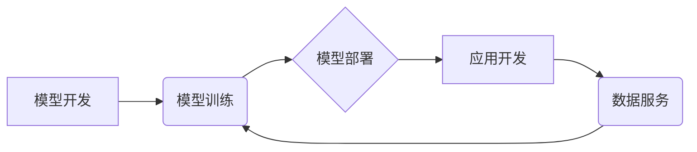

                 

## LLM生态圈：AI产业的新蓝图

> 关键词：大型语言模型 (LLM)、AI生态圈、自然语言处理 (NLP)、深度学习、迁移学习、应用场景、伦理挑战

### 1. 背景介绍

近年来，人工智能（AI）技术取得了飞速发展，其中大型语言模型（LLM）作为AI领域最具潜力的技术之一，引发了广泛关注。LLM 拥有强大的文本理解和生成能力，能够完成从文本摘要、翻译到代码生成等多种复杂任务。随着技术的不断进步，LLM 的应用场景日益拓展，并逐渐形成一个庞大而复杂的生态系统。

### 2. 核心概念与联系

**2.1  LLM 的定义和特点**

大型语言模型 (LLM) 是一种基于深度学习的强大人工智能模型，通过训练海量文本数据，学习语言的结构、语法和语义。其特点包括：

* **规模庞大:** LLM 通常拥有数十亿甚至数千亿个参数，使其能够捕捉语言的复杂性。
* **多任务学习:** LLM 可以进行多种自然语言处理 (NLP) 任务，例如文本分类、问答、机器翻译、文本生成等。
* **迁移学习能力:** LLM 可以通过微调在特定任务上进行训练，从而实现高效的迁移学习。

**2.2  LLM 生态圈的构成**

LLM 生态圈涵盖了多个关键环节，包括：

* **模型开发:** 研究机构和企业不断开发新的 LLM 模型，提升模型性能和功能。
* **模型训练:** 需要大量的计算资源和数据来训练 LLM 模型。
* **模型部署:** 将训练好的模型部署到云端或边缘设备，以便用户使用。
* **应用开发:** 开发者利用 LLM 模型构建各种应用，例如聊天机器人、智能写作助手、代码生成工具等。
* **数据服务:** 提供高质量的文本数据用于模型训练和评估。

**2.3  LLM 生态圈的架构**

### 3. 核心算法原理 & 具体操作步骤

**3.1  算法原理概述**

LLM 的核心算法是基于 Transformer 架构的深度神经网络。Transformer 模型通过自注意力机制学习文本序列之间的关系，能够捕捉长距离依赖关系，从而实现更准确的文本理解和生成。

**3.2  算法步骤详解**

1. **输入处理:** 将输入文本序列转换为数字向量，以便模型处理。
2. **编码器:** 使用多层 Transformer 块对输入文本进行编码，提取文本的语义特征。
3. **解码器:** 使用多层 Transformer 块对编码后的文本进行解码，生成目标文本序列。
4. **输出处理:** 将解码后的数字向量转换为文本序列。

**3.3  算法优缺点**

**优点:**

* 能够捕捉长距离依赖关系，提高文本理解和生成能力。
* 具有良好的迁移学习能力，可以应用于多种 NLP 任务。

**缺点:**

* 训练成本高，需要大量的计算资源和数据。
* 模型参数量大，部署成本较高。

**3.4  算法应用领域**

* **自然语言理解:** 文本分类、问答、情感分析、文本摘要等。
* **自然语言生成:** 机器翻译、文本生成、对话系统等。
* **代码生成:** 自动生成代码、代码补全等。

### 4. 数学模型和公式 & 详细讲解 & 举例说明

**4.1  数学模型构建**

LLM 的数学模型主要基于 Transformer 架构，其核心是自注意力机制。自注意力机制通过计算每个词与其他词之间的相关性，学习文本序列之间的关系。

**4.2  公式推导过程**

自注意力机制的计算公式如下：

$$
Attention(Q, K, V) = softmax(\frac{QK^T}{\sqrt{d_k}})V
$$

其中：

* $Q$：查询矩阵
* $K$：键矩阵
* $V$：值矩阵
* $d_k$：键向量的维度
* $softmax$：softmax 函数

**4.3  案例分析与讲解**

假设我们有一个句子 "The cat sat on the mat"，其词向量表示为：

* The: [0.1, 0.2, 0.3]
* cat: [0.4, 0.5, 0.6]
* sat: [0.7, 0.8, 0.9]
* on: [1.0, 1.1, 1.2]
* the: [0.1, 0.2, 0.3]
* mat: [1.3, 1.4, 1.5]

使用自注意力机制计算每个词与其他词之间的相关性，可以得到一个注意力矩阵，该矩阵反映了每个词对其他词的影响程度。例如，"cat" 与 "sat" 之间的相关性较高，因为它们在语义上紧密相关。

### 5. 项目实践：代码实例和详细解释说明

**5.1  开发环境搭建**

使用 Python 语言和深度学习框架 TensorFlow 或 PyTorch 搭建开发环境。

**5.2  源代码详细实现**

使用预训练的 LLM 模型，例如 BERT 或 GPT-3，并进行微调以实现特定任务。

**5.3  代码解读与分析**

解释代码中使用的 Transformer 块、自注意力机制、激活函数等关键组件。

**5.4  运行结果展示**

展示模型在特定任务上的性能，例如文本分类、机器翻译等。

### 6. 实际应用场景

**6.1  聊天机器人**

LLM 可以用于构建更智能、更自然的聊天机器人，能够理解用户意图并提供更精准的回复。

**6.2  智能写作助手**

LLM 可以帮助用户完成写作任务，例如生成文章标题、段落内容、修改语法错误等。

**6.3  代码生成工具**

LLM 可以根据用户需求自动生成代码，提高开发效率。

**6.4  未来应用展望**

LLM 的应用场景还在不断拓展，未来可能应用于教育、医疗、金融等领域，为人类社会带来更多便利。

### 7. 工具和资源推荐

**7.1  学习资源推荐**

* **书籍:**《深度学习》、《自然语言处理》
* **在线课程:** Coursera、edX、Udacity 等平台提供有关 LLM 和 NLP 的课程。
* **博客和论坛:** Hugging Face、Towards Data Science 等平台提供有关 LLM 的最新资讯和讨论。

**7.2  开发工具推荐**

* **深度学习框架:** TensorFlow、PyTorch
* **自然语言处理库:** NLTK、spaCy
* **云平台:** AWS、Google Cloud、Azure 等平台提供 LLM 模型和服务。

**7.3  相关论文推荐**

* **BERT:** Devlin et al., "BERT: Pre-training of Deep Bidirectional Transformers for Language Understanding"
* **GPT-3:** Brown et al., "Language Models are Few-Shot Learners"
* **T5:** Raffel et al., "Exploring the Limits of Transfer Learning with a Unified Text-to-Text Transformer"

### 8. 总结：未来发展趋势与挑战

**8.1  研究成果总结**

近年来，LLM 技术取得了显著进展，模型性能不断提升，应用场景日益拓展。

**8.2  未来发展趋势**

* **模型规模进一步扩大:** 随着计算资源的不断发展，LLM 模型规模将继续扩大，性能将进一步提升。
* **多模态学习:** LLM 将与其他模态数据，例如图像、音频、视频等进行融合，实现更全面的理解和生成能力。
* **可解释性增强:** 研究人员将致力于提高 LLM 的可解释性，使模型决策更加透明。

**8.3  面临的挑战**

* **数据安全和隐私:** LLM 的训练需要大量数据，如何保证数据安全和隐私是一个重要挑战。
* **模型偏见和歧视:** LLM 模型可能存在偏见和歧视，需要采取措施进行缓解。
* **伦理问题:** LLM 的应用可能引发伦理问题，例如虚假信息生成、滥用等，需要进行深入探讨和规范。

**8.4  研究展望**

未来，LLM 技术将继续发展，为人类社会带来更多创新和变革。研究人员将继续探索新的模型架构、训练方法和应用场景，推动 LLM 技术的健康发展。

### 9. 附录：常见问题与解答

**9.1  LLM 模型训练需要多少数据？**

LLM 模型的训练数据量通常非常庞大，可能需要数十亿甚至数千亿个文本数据。

**9.2  LLM 模型的部署成本高吗？**

是的，LLM 模型的参数量大，部署成本较高，需要强大的计算资源和存储空间。

**9.3  LLM 模型是否可以用于所有 NLP 任务？**

LLM 模型可以应用于多种 NLP 任务，但并非所有任务都适合使用 LLM 模型。

**9.4  如何解决 LLM 模型的偏见和歧视问题？**

可以通过多种方法缓解 LLM 模型的偏见和歧视，例如使用更公平的数据集、进行模型调优、添加公平性约束等。

作者：禅与计算机程序设计艺术 / Zen and the Art of Computer Programming 
<end_of_turn>

