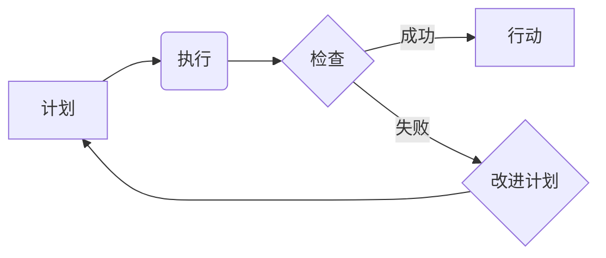

                 

## PDCA循环与持续改进管理

> 关键词：PDCA循环, 持续改进, 软件开发, 项目管理, 质量管理, 流程优化, 迭代开发

### 1. 背景介绍

在瞬息万变的科技时代，软件开发和技术创新日新月异。为了在激烈的竞争环境中保持领先地位，企业和个人必须不断追求卓越，持续改进自身的产品、服务和流程。PDCA循环，全称为Plan-Do-Check-Act（计划-执行-检查-行动），是一种经典的管理方法，被广泛应用于各个领域，包括软件开发、项目管理、质量管理等。它提供了一个循环框架，帮助我们系统地进行改进，不断提升效率和质量。

### 2. 核心概念与联系

PDCA循环的核心在于不断迭代改进的过程。它将改进工作分解成四个阶段，每个阶段都有其特定的目标和任务。

**2.1  计划（Plan）**

计划阶段是整个循环的起点，在这个阶段，我们需要明确改进的目标，分析现状，制定详细的改进方案。

* **明确目标：** 首先要明确需要改进的具体问题或目标，并将其量化，以便于后续的评估和衡量。
* **分析现状：** 对当前的流程、产品或服务进行深入分析，找出存在的问题和潜在的改进点。
* **制定方案：** 根据分析结果，制定具体的改进方案，包括改进措施、预期效果、资源需求等。

**2.2  执行（Do）**

执行阶段是将计划付诸实践的阶段，在这个阶段，我们需要按照制定的方案进行操作，并收集相关数据。

* **实施方案：** 将改进方案逐步实施，并记录下执行过程中的细节和遇到的问题。
* **数据收集：** 在执行过程中，需要收集相关数据，以便于后续的检查和评估。

**2.3  检查（Check）**

检查阶段是评估改进效果的阶段，在这个阶段，我们需要分析收集到的数据，判断改进方案是否有效，并找出需要改进的地方。

* **数据分析：** 对收集到的数据进行分析，评估改进方案的效果，并与预期的目标进行比较。
* **问题识别：** 找出改进过程中遇到的问题和不足，并记录下来。

**2.4  行动（Act）**

行动阶段是根据检查结果进行调整和优化，并将其纳入日常工作流程的阶段。

* **改进方案：** 根据检查结果，对改进方案进行调整和优化，使其更加完善。
* **流程优化：** 将改进后的方案纳入日常工作流程，并进行持续的监控和改进。

**2.2  PDCA循环流程图**



### 3. 核心算法原理 & 具体操作步骤

PDCA循环本身不是一个算法，而是一种管理方法。它提供了一个框架，指导我们进行持续改进。

**3.1  算法原理概述**

PDCA循环的核心原理是通过循环迭代的方式，不断改进和优化流程、产品或服务。它强调了计划、执行、检查和行动四个阶段的相互关联和循环性。

**3.2  算法步骤详解**

1. **计划阶段：** 明确改进目标，分析现状，制定改进方案。
2. **执行阶段：** 按照计划实施改进方案，并收集相关数据。
3. **检查阶段：** 分析数据，评估改进效果，识别问题。
4. **行动阶段：** 根据检查结果，调整改进方案，并将其纳入日常工作流程。

**3.3  算法优缺点**

* **优点：**
    * 简单易懂，易于实施。
    * 适用于各种领域和场景。
    * 能够促进持续改进，提升效率和质量。
* **缺点：**
    * 需要投入时间和精力进行实施。
    * 如果没有有效的监控和评估机制，可能会导致改进效果不明显。

**3.4  算法应用领域**

PDCA循环广泛应用于以下领域：

* 软件开发：用于改进软件开发流程，提高软件质量和开发效率。
* 项目管理：用于管理项目进度，控制项目风险，提高项目成功率。
* 质量管理：用于识别和解决质量问题，提高产品和服务的质量水平。
* 运营管理：用于优化运营流程，提高运营效率和效益。

### 4. 数学模型和公式 & 详细讲解 & 举例说明

PDCA循环本身没有固定的数学模型和公式，但我们可以用数学模型来描述和分析其各个阶段的流程和效果。例如，我们可以用以下公式来描述改进效果的评估：

$$
Improvement Rate = \frac{After - Before}{Before} \times 100\%
$$

其中：

* **Improvement Rate**：改进率
* **After**：改进后的指标值
* **Before**：改进前的指标值

**4.1  数学模型构建**

我们可以构建一个更复杂的数学模型，来描述PDCA循环的各个阶段之间的关系，以及改进效果随时间的变化趋势。例如，我们可以使用差分方程来描述改进率随时间的变化，或者使用回归分析来预测改进效果。

**4.2  公式推导过程**

具体的公式推导过程取决于我们所构建的数学模型。例如，如果我们使用差分方程来描述改进率随时间的变化，那么我们需要根据改进方案的特性，以及数据收集的频率，来推导相应的差分方程。

**4.3  案例分析与讲解**

假设我们想用PDCA循环来改进软件开发团队的代码质量。我们可以设定以下指标：代码缺陷率。

* **计划阶段：** 我们分析了代码缺陷的原因，制定了改进方案，例如加强代码审查、使用静态代码分析工具等。
* **执行阶段：** 我们按照改进方案实施，并记录了代码缺陷率的变化趋势。
* **检查阶段：** 我们分析了代码缺陷率的变化趋势，发现代码缺陷率有所下降，但仍然存在一些问题。
* **行动阶段：** 我们根据检查结果，调整了改进方案，例如加强代码规范培训、引入自动化测试等。

通过不断循环迭代，我们最终可以实现代码质量的持续改进。

### 5. 项目实践：代码实例和详细解释说明

为了更好地理解PDCA循环的应用，我们可以通过一个具体的代码实例来进行说明。

**5.1  开发环境搭建**

我们假设要使用Python语言进行开发，需要安装Python解释器和相关库。

**5.2  源代码详细实现**

```python
def calculate_average(numbers):
  """
  计算列表中数字的平均值。
  """
  if not numbers:
    return 0
  return sum(numbers) / len(numbers)

# 测试代码
numbers = [1, 2, 3, 4, 5]
average = calculate_average(numbers)
print(f"平均值: {average}")
```

**5.3  代码解读与分析**

这段代码定义了一个名为`calculate_average`的函数，该函数接受一个数字列表作为参数，并返回列表中数字的平均值。

* **计划阶段：** 我们需要明确目标，例如提高代码的效率和可读性。
* **执行阶段：** 我们根据目标，对代码进行优化，例如使用更简洁的语法、添加注释等。
* **检查阶段：** 我们测试优化后的代码，并分析其性能和可读性。
* **行动阶段：** 我们根据检查结果，对代码进行进一步的优化。

**5.4  运行结果展示**

运行这段代码，输出结果为：

```
平均值: 3.0
```

### 6. 实际应用场景

PDCA循环在软件开发领域有着广泛的应用场景，例如：

* **敏捷开发：** PDCA循环是敏捷开发的核心原则之一，它指导团队进行迭代开发，不断改进产品。
* **缺陷管理：** PDCA循环可以用于管理软件缺陷，通过分析缺陷的原因，制定改进方案，减少缺陷的发生。
* **流程优化：** PDCA循环可以用于优化软件开发流程，提高开发效率和产品质量。

**6.4  未来应用展望**

随着人工智能和自动化技术的不断发展，PDCA循环的应用场景将会更加广泛。例如，我们可以利用人工智能技术自动分析代码缺陷，并自动生成改进方案，从而提高代码质量和开发效率。

### 7. 工具和资源推荐

**7.1  学习资源推荐**

* **书籍：**
    * 《持续改进》
    * 《PDCA循环：管理的黄金法则》
* **网站：**
    * ASQ (American Society for Quality)
    * Lean Enterprise Institute

**7.2  开发工具推荐**

* **代码审查工具：**
    * Gerrit
    * GitHub
* **静态代码分析工具：**
    * SonarQube
    * pylint

**7.3  相关论文推荐**

* **The PDCA Cycle: A Framework for Continuous Improvement**
* **Applying the PDCA Cycle to Software Development**

### 8. 总结：未来发展趋势与挑战

**8.1  研究成果总结**

PDCA循环是一种成熟的管理方法，已经被广泛应用于各个领域。它提供了一个简单易懂的框架，帮助我们进行持续改进，提升效率和质量。

**8.2  未来发展趋势**

未来，PDCA循环将会与人工智能、自动化技术等新技术更加融合，从而实现更加智能化、自动化化的持续改进。

**8.3  面临的挑战**

* **文化阻力：** 许多企业和个人对PDCA循环的理解不够深入，缺乏持续改进的意识。
* **缺乏数据支持：** 许多企业缺乏有效的监控和评估机制，无法准确地评估改进效果。
* **技术瓶颈：** 随着技术的不断发展，PDCA循环需要不断适应新的技术环境，并与新技术进行融合。

**8.4  研究展望**

未来，我们需要继续研究PDCA循环的应用方法，并将其与新技术进行融合，使其更加高效、智能化。


### 9. 附录：常见问题与解答

**9.1  PDCA循环的实施需要投入多少时间和精力？**

PDCA循环的实施时间和精力投入取决于项目的复杂程度和改进目标的具体情况。一般来说，需要投入一定的时间和精力进行计划、执行、检查和行动四个阶段的工作。

**9.2  如何评估PDCA循环的改进效果？**

评估PDCA循环的改进效果需要根据具体的改进目标和指标进行评估。例如，如果改进目标是提高代码质量，那么可以评估代码缺陷率的变化趋势。

**9.3  PDCA循环适用于哪些领域？**

PDCA循环适用于各种领域和场景，例如软件开发、项目管理、质量管理、运营管理等。

**9.4  如何克服PDCA循环的实施过程中遇到的挑战？**

* **文化阻力：** 通过培训和宣传，提高员工对PDCA循环的理解和认识。
* **缺乏数据支持：** 建立有效的监控和评估机制，收集相关数据，并进行分析和评估。
* **技术瓶颈：** 积极学习新技术，并将其应用到PDCA循环的实施过程中。


作者：禅与计算机程序设计艺术 / Zen and the Art of Computer Programming 
<end_of_turn>

