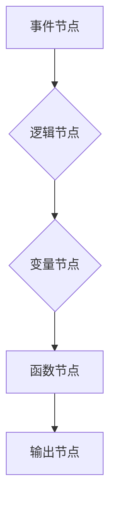

                 

## Unreal Engine 蓝图：可视化编程

> 关键词：Unreal Engine, 蓝图, 可视化编程, 游戏开发, 逻辑流程, 节点连接

> 摘要：本文深入探讨了 Unreal Engine 中的蓝图系统，一种强大的可视化编程工具，它为游戏开发人员提供了无需编写代码就能实现游戏逻辑和交互的便捷方式。我们将从蓝图的基础概念、核心算法原理到实际应用场景，全面解析蓝图的优势、局限性以及未来发展趋势，帮助读者理解并掌握蓝图编程，加速游戏开发进程。

## 1. 背景介绍

Unreal Engine 作为一款业界领先的游戏引擎，以其逼真的图形渲染、强大的物理引擎和丰富的功能库而闻名。然而，传统的 C++ 代码开发对开发者门槛较高，需要较深的编程知识和经验。为了降低开发门槛，提升开发效率，Epic Games 推出了蓝图系统，一种基于节点连接的可视化编程工具。

蓝图系统允许开发者通过拖放节点、连接节点来构建游戏逻辑，无需编写一行代码。它提供了一套丰富的节点库，涵盖了游戏开发中常见的各种功能，例如角色控制、动画播放、事件响应、数据处理等。蓝图系统极大地降低了游戏开发的门槛，让更多人能够参与到游戏开发中来。

## 2. 核心概念与联系

### 2.1 蓝图基础概念

蓝图系统的核心概念是“节点”。每个节点代表一个特定的功能或操作，开发者可以通过拖放节点、连接节点来构建逻辑流程。

* **节点类型:** 蓝图节点分为多种类型，例如：
    * **事件节点:** 代表游戏中的事件，例如按键按下、碰撞检测等。
    * **逻辑节点:** 代表逻辑运算，例如判断、循环、分支等。
    * **变量节点:** 代表游戏中的数据，例如角色位置、生命值等。
    * **函数节点:** 代表自定义函数，可以封装复杂的逻辑操作。

* **节点连接:** 节点之间通过连接线进行连接，连接线代表数据流或控制流。

* **蓝图执行:** 当游戏运行时，蓝图系统会按照节点的连接顺序执行逻辑流程。

### 2.2 蓝图流程图



**图 1：蓝图流程图示例**

该流程图展示了一个简单的蓝图逻辑流程，事件节点触发逻辑节点，逻辑节点处理数据并赋值给变量节点，变量节点作为函数节点的输入，函数节点执行操作并输出结果。

## 3. 核心算法原理 & 具体操作步骤

### 3.1 算法原理概述

蓝图系统本质上是一种基于图论的编程模型。它将游戏逻辑抽象成一系列节点和连接线，通过节点的连接和执行顺序来实现逻辑流程。

* **图论基础:** 蓝图系统利用图论中的概念，例如节点、边、路径、拓扑排序等，来构建和执行游戏逻辑。
* **数据流:** 节点之间通过连接线传递数据，数据流的顺序决定了逻辑流程的执行顺序。
* **控制流:** 逻辑节点可以包含分支、循环等控制结构，控制数据流的执行路径。

### 3.2 算法步骤详解

1. **节点定义:** 开发者定义各种类型的节点，每个节点代表一个特定的功能或操作。
2. **节点连接:** 开发者通过拖放节点、连接节点来构建逻辑流程。
3. **拓扑排序:** 蓝图系统使用拓扑排序算法来确定节点的执行顺序。
4. **数据传递:** 节点之间通过连接线传递数据，数据流按照拓扑排序的顺序流动。
5. **逻辑执行:** 蓝图系统按照节点的执行顺序执行逻辑操作，处理数据并产生结果。

### 3.3 算法优缺点

**优点:**

* **易于学习:** 蓝图系统基于可视化编程，无需编写代码，易于学习和使用。
* **快速迭代:** 蓝图系统可以快速构建和修改游戏逻辑，方便快速迭代开发。
* **协作开发:** 蓝图系统支持多人协作开发，方便团队合作。

**缺点:**

* **功能有限:** 蓝图系统无法实现所有 C++ 代码的功能，对于复杂的逻辑操作可能需要使用 C++ 代码。
* **性能问题:** 蓝图系统执行效率可能低于 C++ 代码，对于性能要求高的游戏可能需要优化。
* **可读性问题:** 蓝图逻辑流程可能难以理解和维护，特别是对于复杂的逻辑。

### 3.4 算法应用领域

蓝图系统广泛应用于游戏开发、交互设计、虚拟现实等领域。

* **游戏开发:** 蓝图系统可以用于实现游戏逻辑、角色控制、事件响应、AI行为等。
* **交互设计:** 蓝图系统可以用于构建交互原型、实现用户界面逻辑、设计游戏玩法等。
* **虚拟现实:** 蓝图系统可以用于开发虚拟现实体验，实现用户交互、环境模拟等。

## 4. 数学模型和公式 & 详细讲解 & 举例说明

### 4.1 数学模型构建

蓝图系统虽然基于可视化编程，但其内部逻辑仍然依赖于数学模型和公式。例如，角色运动的轨迹计算、碰撞检测的判断、动画播放的控制等，都依赖于数学模型和公式的实现。

### 4.2 公式推导过程

* **角色运动轨迹:** 角色的运动轨迹可以利用向量加速度和速度的公式进行计算。

$$
\vec{v} = \vec{v_0} + \vec{a}t
$$

$$
\vec{x} = \vec{x_0} + \vec{v_0}t + \frac{1}{2}\vec{a}t^2
$$

其中：

* $\vec{v}$: 角色速度向量
* $\vec{v_0}$: 初始速度向量
* $\vec{a}$: 加速度向量
* $t$: 时间
* $\vec{x}$: 角色位置向量
* $\vec{x_0}$: 初始位置向量

* **碰撞检测:** 碰撞检测通常利用几何图形的交集判断，例如圆形碰撞检测可以使用圆心距离和半径的公式进行判断。

$$
d = \sqrt{(x_2 - x_1)^2 + (y_2 - y_1)^2}
$$

其中：

* $d$: 圆心距离
* $(x_1, y_1)$: 第一个圆形的圆心坐标
* $(x_2, y_2)$: 第二个圆形的圆心坐标

### 4.3 案例分析与讲解

* **角色移动:** 通过蓝图节点，开发者可以设置角色的移动速度、方向等参数，并利用上述公式计算角色的运动轨迹。
* **碰撞响应:** 当角色与障碍物碰撞时，蓝图系统会触发碰撞事件，并根据碰撞检测结果执行相应的逻辑操作，例如角色反弹、播放碰撞动画等。

## 5. 项目实践：代码实例和详细解释说明

### 5.1 开发环境搭建

* 安装 Unreal Engine 4.27 或更高版本。
* 创建新的 Unreal Engine 项目。

### 5.2 源代码详细实现

```
// 蓝图节点代码示例
// 角色移动节点
void MoveCharacter(float Speed)
{
    // 获取角色组件
    CharacterMovementComponent* MovementComponent = GetCharacterMovement();

    // 设置角色移动速度
    MovementComponent->MaxWalkSpeed = Speed;

    // 移动角色
    AddMovementInput(GetActorForwardVector(), 1.0f);
}

// 碰撞检测节点
void OnComponentHit(UPrimitiveComponent* HitComponent, AActor* OtherActor, UPrimitiveComponent* OtherComponent, FVector NormalImpulse, const FHitResult& Hit)
{
    // 判断碰撞对象类型
    if (OtherActor->IsA(AStaticMeshActor::StaticClass()))
    {
        // 播放碰撞动画
        PlayAnimation(FName("Collision"));
    }
}
```

### 5.3 代码解读与分析

* **MoveCharacter 函数:** 该函数接收角色移动速度作为参数，获取角色的移动组件，设置角色的最大移动速度，并使用 AddMovementInput 函数移动角色。
* **OnComponentHit 函数:** 该函数触发角色与其他组件碰撞时，判断碰撞对象的类型，如果是静态网格，则播放碰撞动画。

### 5.4 运行结果展示

在 Unreal Engine 编辑器中，开发者可以将蓝图节点连接起来，构建游戏逻辑，并运行游戏进行测试。

## 6. 实际应用场景

### 6.1 游戏开发

蓝图系统广泛应用于各种类型的游戏开发，例如：

* **动作游戏:** 实现角色控制、攻击、防御、技能等逻辑。
* **角色扮演游戏:** 实现角色属性、技能、对话、任务等逻辑。
* **策略游戏:** 实现单位控制、资源管理、战斗策略等逻辑。

### 6.2 交互设计

蓝图系统可以用于构建交互原型，实现用户界面逻辑，设计游戏玩法等。

### 6.3 虚拟现实

蓝图系统可以用于开发虚拟现实体验，实现用户交互、环境模拟等。

### 6.4 未来应用展望

随着 Unreal Engine 的不断发展，蓝图系统也将不断完善和扩展，应用场景也将更加广泛。

## 7. 工具和资源推荐

### 7.1 学习资源推荐

* **Unreal Engine 官方文档:** https://docs.unrealengine.com/
* **Unreal Engine 蓝图教程:** https://www.youtube.com/playlist?list=PLZlv_N0_O1gY999m7v8h7t8k8l73t_z7w
* **Unreal Engine 蓝图社区:** https://forums.unrealengine.com/

### 7.2 开发工具推荐

* **Unreal Engine 4.27 或更高版本:** https://www.unrealengine.com/en-US/download

### 7.3 相关论文推荐

* **A Survey of Visual Programming Languages:** https://dl.acm.org/doi/10.1145/1048977.1048980

## 8. 总结：未来发展趋势与挑战

### 8.1 研究成果总结

蓝图系统为游戏开发提供了便捷高效的编程方式，降低了开发门槛，加速了游戏开发进程。

### 8.2 未来发展趋势

* **更强大的功能:** 蓝图系统将继续扩展功能，支持更复杂的逻辑操作和数据处理。
* **更智能的辅助:** 蓝图系统将引入更智能的辅助功能，例如代码生成、错误提示、性能优化等。
* **更广泛的应用:** 蓝图系统将应用于更多领域，例如教育、科学研究、艺术创作等。

### 8.3 面临的挑战

* **性能优化:** 蓝图系统执行效率仍需进一步提升，特别是对于大型复杂的游戏项目。
* **可读性和维护性:** 蓝图逻辑流程可能难以理解和维护，需要改进可读性和可维护性。
* **功能扩展:** 蓝图系统需要不断扩展功能，以满足开发者不断增长的需求。

### 8.4 研究展望

未来，蓝图系统将朝着更智能、更强大、更易用、更广泛应用的方向发展。

## 9. 附录：常见问题与解答

* **Q: 蓝图系统可以实现所有 C++ 代码的功能吗？**

A: 蓝图系统无法实现所有 C++ 代码的功能，对于复杂的逻辑操作可能需要使用 C++ 代码。

* **Q: 蓝图系统的性能如何？**

A: 蓝图系统的执行效率可能低于 C++ 代码，对于性能要求高的游戏可能需要优化。

* **Q: 如何学习蓝图系统？**

A: 可以参考 Unreal Engine 官方文档、教程和社区资源。


作者：禅与计算机程序设计艺术 / Zen and the Art of Computer Programming<end_of_turn>

