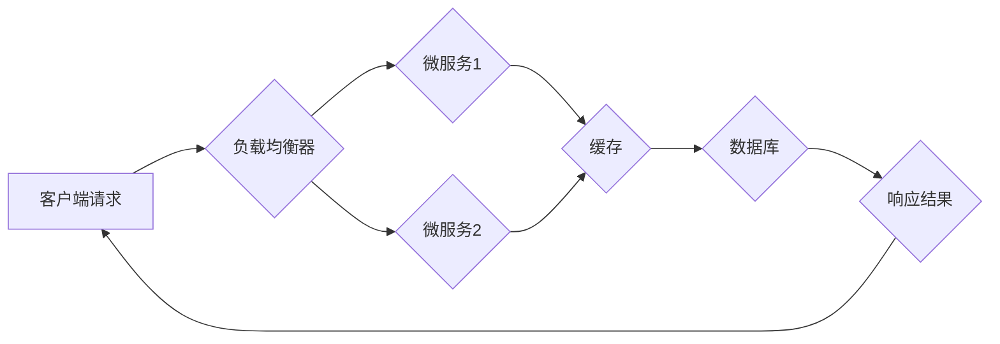

                 

## Web架构设计：可扩展和高性能系统的构建

> 关键词：Web架构、高性能、可扩展性、微服务、负载均衡、缓存、数据库、API设计

## 1. 背景介绍

随着互联网的蓬勃发展，Web应用的需求量呈指数级增长。用户对Web应用的速度、可靠性和功能的期望也越来越高。如何构建一个能够满足这些需求的Web架构，成为Web开发人员面临的重大挑战。

传统的单体架构在面对海量用户和复杂业务逻辑时，往往会出现性能瓶颈、维护困难等问题。为了解决这些问题，微服务架构应运而生。微服务架构将大型应用程序拆分成多个小型、独立的服务，每个服务负责处理特定的业务功能。这种架构模式具有高可扩展性、高可用性和易于维护等优点，能够更好地应对现代Web应用的挑战。

## 2. 核心概念与联系

### 2.1  微服务架构

微服务架构是一种将应用程序拆分成多个小型、独立的服务的架构模式。每个微服务专注于处理特定的业务功能，并通过轻量级的通信协议（如RESTful API）进行交互。

**优点：**

* **可扩展性:** 每个微服务可以独立部署和扩展，无需影响其他服务。
* **高可用性:** 某个微服务出现故障时，不会影响整个应用程序的运行。
* **易于维护:** 每个微服务相对独立，开发、测试和部署都更加容易。
* **技术多样性:** 每个微服务可以使用不同的技术栈，根据业务需求进行选择。

**缺点：**

* **复杂性:** 微服务架构的管理和维护比单体架构更加复杂。
* **分布式系统问题:** 微服务之间需要进行通信和数据同步，需要解决分布式系统带来的挑战。

### 2.2  负载均衡

负载均衡是一种将请求分发到多个服务器的技术，以提高应用程序的可用性和性能。

**工作原理:**

负载均衡器接收客户端的请求，根据预设的策略将请求分发到不同的服务器上处理。

**类型:**

* **轮询:** 轮流将请求分发到不同的服务器。
* **加权轮询:** 根据服务器的性能或负载，分配不同的请求权重。
* **IP哈希:** 根据客户端的IP地址将请求分发到特定的服务器。

### 2.3  缓存

缓存是一种将数据临时存储在内存中，以便快速访问的技术。

**作用:**

* **提高性能:** 减少数据库访问次数，提高应用程序的响应速度。
* **减轻数据库压力:** 分担数据库的负载，提高数据库的可用性和稳定性。

**类型:**

* **内存缓存:** 数据存储在内存中，访问速度最快。
* **磁盘缓存:** 数据存储在磁盘中，容量更大，但访问速度较慢。

### 2.4  数据库

数据库是用于存储和管理数据的系统。

**类型:**

* **关系型数据库:** 数据以表的形式存储，并通过关系进行连接。
* **非关系型数据库:** 数据以其他形式存储，例如文档、键值对或图。

**选择数据库:**

需要根据应用程序的业务需求和数据特性选择合适的数据库类型。

**Mermaid 流程图:**



## 3. 核心算法原理 & 具体操作步骤

### 3.1  算法原理概述

微服务架构的核心算法原理是将大型应用程序拆分成多个小型、独立的服务，并通过轻量级的通信协议进行交互。每个微服务专注于处理特定的业务功能，并通过API进行通信。

### 3.2  算法步骤详解

1. **拆分应用程序:** 将大型应用程序拆分成多个小型、独立的服务，每个服务负责处理特定的业务功能。
2. **设计API:** 为每个微服务设计API，用于其他服务进行调用。
3. **部署服务:** 将每个微服务独立部署到不同的服务器上。
4. **负载均衡:** 使用负载均衡器将请求分发到不同的微服务上。
5. **数据管理:** 使用数据库或其他数据存储系统来管理微服务的共享数据。
6. **监控和管理:** 使用监控工具和管理平台来监控微服务的运行状态和性能。

### 3.3  算法优缺点

**优点:**

* **可扩展性:** 每个微服务可以独立部署和扩展，无需影响其他服务。
* **高可用性:** 某个微服务出现故障时，不会影响整个应用程序的运行。
* **易于维护:** 每个微服务相对独立，开发、测试和部署都更加容易。
* **技术多样性:** 每个微服务可以使用不同的技术栈，根据业务需求进行选择。

**缺点:**

* **复杂性:** 微服务架构的管理和维护比单体架构更加复杂。
* **分布式系统问题:** 微服务之间需要进行通信和数据同步，需要解决分布式系统带来的挑战。

### 3.4  算法应用领域

微服务架构广泛应用于各种领域，例如：

* **电商平台:** 将商品展示、购物车、订单处理等功能拆分成不同的微服务。
* **社交网络:** 将用户管理、消息推送、好友关系等功能拆分成不同的微服务。
* **金融系统:** 将账户管理、交易处理、风险控制等功能拆分成不同的微服务。

## 4. 数学模型和公式 & 详细讲解 & 举例说明

### 4.1  数学模型构建

微服务架构的性能可以利用数学模型进行评估和优化。例如，可以使用队列理论来分析微服务之间的通信延迟和吞吐量。

**队列理论:**

队列理论是一种用于分析排队系统性能的数学工具。在微服务架构中，可以将微服务之间的通信视为一个排队系统。

**关键指标:**

* **平均等待时间:** 客户端请求等待微服务响应的平均时间。
* **吞吐量:** 微服务每单位时间处理的请求数量。

### 4.2  公式推导过程

**平均等待时间公式:**

$$W = \frac{L}{\mu - \lambda}$$

其中:

* $W$ 是平均等待时间
* $L$ 是系统中平均请求数
* $\mu$ 是微服务处理请求的速率
* $\lambda$ 是请求到达速率

**吞吐量公式:**

$$\text{吞吐量} = \frac{\lambda}{1 + \frac{\lambda}{\mu}}$$

### 4.3  案例分析与讲解

假设一个电商平台的订单处理微服务，处理请求的速率为每秒100个，请求到达速率为每秒80个。

**平均等待时间:**

$$W = \frac{L}{\mu - \lambda} = \frac{L}{100 - 80} = \frac{L}{20}$$

**吞吐量:**

$$\text{吞吐量} = \frac{\lambda}{1 + \frac{\lambda}{\mu}} = \frac{80}{1 + \frac{80}{100}} = \frac{80}{1.8} \approx 44.44$$

## 5. 项目实践：代码实例和详细解释说明

### 5.1  开发环境搭建

* **操作系统:** Linux
* **编程语言:** Go
* **框架:** Gin
* **数据库:** MySQL

### 5.2  源代码详细实现

```go
package main

import (
	"net/http"

	"github.com/gin-gonic/gin"
)

func main() {
	router := gin.Default()

	router.GET("/orders", getOrders)

	router.Run(":8080")
}

func getOrders(c *gin.Context) {
	// 从数据库获取订单数据
	// ...

	// 返回订单数据
	c.JSON(http.StatusOK, orders)
}
```

### 5.3  代码解读与分析

* **Gin框架:** 使用Gin框架简化了Web服务的开发。
* **GET请求:** 使用GET请求获取订单数据。
* **数据库交互:** 代码中省略了数据库交互的具体实现，实际开发中需要连接数据库并查询订单数据。
* **JSON响应:** 使用JSON格式返回订单数据。

### 5.4  运行结果展示

启动服务后，访问`http://localhost:8080/orders`，可以获取订单数据。

## 6. 实际应用场景

微服务架构广泛应用于各种领域，例如：

* **电商平台:** 将商品展示、购物车、订单处理等功能拆分成不同的微服务。
* **社交网络:** 将用户管理、消息推送、好友关系等功能拆分成不同的微服务。
* **金融系统:** 将账户管理、交易处理、风险控制等功能拆分成不同的微服务。

### 6.4  未来应用展望

随着云计算、容器化和人工智能技术的不断发展，微服务架构将更加成熟和完善。未来，微服务架构将更加注重自动化、弹性、安全和可观测性。

## 7. 工具和资源推荐

### 7.1  学习资源推荐

* **书籍:**
    * "Building Microservices" by Sam Newman
    * "Microservices Patterns" by Chris Richardson
* **博客:**
    * https://microservices.io/
    * https://martinfowler.com/articles/microservices.html

### 7.2  开发工具推荐

* **Docker:** 用于容器化微服务
* **Kubernetes:** 用于容器编排和管理
* **Consul:** 用于服务发现和配置管理
* **Prometheus:** 用于监控和告警

### 7.3  相关论文推荐

* "Microservices: An Architectural Style for the Cloud" by Sam Newman
* "Microservice Architectures: A Survey" by Michael T. Rosner

## 8. 总结：未来发展趋势与挑战

### 8.1  研究成果总结

微服务架构是一种有效的应对现代Web应用挑战的架构模式。它具有高可扩展性、高可用性和易于维护等优点。

### 8.2  未来发展趋势

* **自动化:** 微服务架构的自动化部署、监控和管理将更加重要。
* **弹性:** 微服务架构需要能够应对突发流量和资源变化。
* **安全:** 微服务架构的安全性和隐私保护需要得到加强。
* **可观测性:** 微服务架构的监控和日志分析需要更加完善。

### 8.3  面临的挑战

* **复杂性:** 微服务架构的管理和维护比单体架构更加复杂。
* **分布式系统问题:** 微服务之间需要进行通信和数据同步，需要解决分布式系统带来的挑战。
* **人才缺口:** 微服务架构的开发和运维需要具备相关技能的专业人才。

### 8.4  研究展望

未来，微服务架构的研究将更加注重自动化、弹性、安全和可观测性。


## 9. 附录：常见问题与解答

**问题:** 微服务架构的部署和维护比单体架构更加复杂吗？

**答案:** 是的，微服务架构的部署和维护比单体架构更加复杂。因为微服务架构需要管理多个独立的服务，以及它们之间的通信和数据同步。

**问题:** 微服务架构适合所有类型的应用程序吗？

**答案:** 不一定。微服务架构更适合于大型、复杂、业务逻辑清晰的应用程序。对于小型、简单的应用程序，单体架构可能更合适。


作者：禅与计算机程序设计艺术 / Zen and the Art of Computer Programming 
<end_of_turn>

