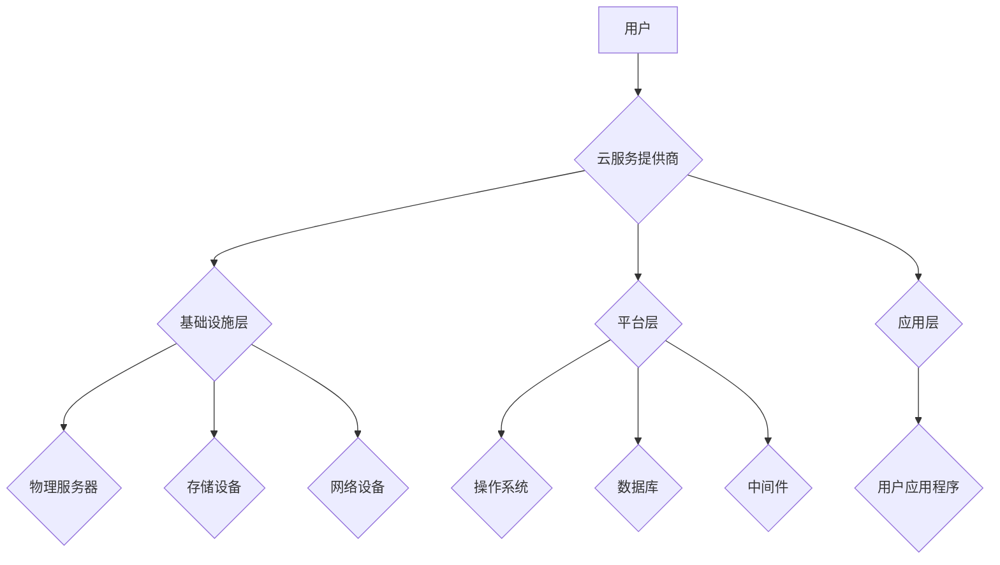

                 

## 云计算架构：AWS、Azure和GCP的对比分析

> 关键词：云计算、AWS、Azure、GCP、云服务、云架构、IaaS、PaaS、SaaS

## 1. 背景介绍

云计算已经成为当今数字经济的核心基础设施，为企业和个人提供了弹性、可扩展和经济高效的 IT 资源。亚马逊云计算服务 (AWS)、微软 Azure 和谷歌云平台 (GCP) 是三大云计算巨头，它们提供广泛的云服务，涵盖基础设施即服务 (IaaS)、平台即服务 (PaaS) 和软件即服务 (SaaS)。

随着云计算技术的不断发展，企业在选择云服务提供商时面临着越来越多的选择。本文将对 AWS、Azure 和 GCP 进行深入对比分析，帮助读者了解三大云平台的优势、劣势和适用场景，从而做出更明智的决策。

## 2. 核心概念与联系

### 2.1 云计算核心概念

云计算的核心概念包括：

* **按需自服务:** 用户可以随时随地访问和使用云资源，无需人工干预。
* **弹性伸缩:** 云资源可以根据需求动态调整，满足瞬时流量变化。
* **资源池化:** 云资源被池化，并根据用户需求进行分配。
* **快速部署:** 云资源可以快速部署，缩短部署时间。
* **付费按需:** 用户只为使用的资源付费，无需购买和维护昂贵的硬件设备。

### 2.2 云计算架构

云计算架构通常分为三层：

* **基础设施层:** 包含物理服务器、存储设备、网络设备等硬件资源。
* **平台层:** 提供运行应用程序的软件环境，包括操作系统、数据库、中间件等。
* **应用层:** 用户部署和运行自己的应用程序。

**Mermaid 流程图:**



## 3. 核心算法原理 & 具体操作步骤

### 3.1 算法原理概述

云计算平台使用各种算法来实现其核心功能，例如资源调度、负载均衡、数据存储和安全保护。这些算法通常基于以下原则：

* **优化资源利用率:** 通过高效地分配和调度资源，最大限度地提高资源利用率。
* **保证服务可用性:** 通过冗余和故障转移机制，确保服务的高可用性。
* **保障数据安全:** 通过加密、身份验证和访问控制等措施，保护数据安全。

### 3.2 算法步骤详解

具体算法步骤因平台和功能而异，但一般包括以下步骤：

1. **数据收集:** 收集有关资源使用情况、用户需求和系统状态等数据。
2. **数据分析:** 对收集到的数据进行分析，识别趋势和模式。
3. **决策制定:** 根据分析结果，制定资源分配、负载均衡和安全策略等决策。
4. **资源调度:** 根据决策结果，调度资源，满足用户需求。
5. **性能监控:** 持续监控系统性能，并根据需要调整算法参数。

### 3.3 算法优缺点

云计算平台使用的算法具有以下优点：

* **自动化:** 算法可以自动执行任务，减少人工干预。
* **效率:** 算法可以优化资源利用率，提高系统效率。
* **可扩展性:** 算法可以根据需求动态调整，满足系统可扩展性要求。

但也存在一些缺点：

* **复杂性:** 算法可能非常复杂，需要专业的技术人员进行设计和维护。
* **透明度:** 算法决策过程可能缺乏透明度，难以理解算法是如何工作的。
* **偏差:** 算法可能存在偏差，导致不公平的结果。

### 3.4 算法应用领域

云计算平台使用的算法广泛应用于以下领域：

* **资源调度:** 优化虚拟机、存储和网络资源的分配。
* **负载均衡:** 将流量均匀分配到多个服务器，提高系统可用性。
* **数据存储:** 优化数据存储和检索效率。
* **安全保护:** 检测和防御网络攻击，保护数据安全。

## 4. 数学模型和公式 & 详细讲解 & 举例说明

### 4.1 数学模型构建

云计算平台的资源调度可以使用数学模型来优化资源分配。例如，可以使用线性规划模型来确定如何分配虚拟机到物理服务器，以最大限度地提高资源利用率。

### 4.2 公式推导过程

线性规划模型的目标函数通常是最大化资源利用率，约束条件包括资源容量、虚拟机需求和性能要求等。

**目标函数:**

```latex
max Z = \sum_{i=1}^{n} \sum_{j=1}^{m} x_{ij}
```

其中：

* $Z$ 是资源利用率
* $n$ 是虚拟机数量
* $m$ 是物理服务器数量
* $x_{ij}$ 是虚拟机 $i$ 在物理服务器 $j$ 上运行的指示变量

**约束条件:**

```latex
\sum_{j=1}^{m} x_{ij} \leq 1, \quad i = 1, 2, ..., n
```

```latex
\sum_{i=1}^{n} a_{ij} x_{ij} \leq b_j, \quad j = 1, 2, ..., m
```

其中：

* $a_{ij}$ 是虚拟机 $i$ 在物理服务器 $j$ 上的资源需求
* $b_j$ 是物理服务器 $j$ 的资源容量

### 4.3 案例分析与讲解

假设有 3 个虚拟机和 2 个物理服务器，每个虚拟机需要 2 个 CPU 核，每个物理服务器有 4 个 CPU 核。

使用线性规划模型可以求解虚拟机分配方案，以最大化资源利用率。

## 5. 项目实践：代码实例和详细解释说明

### 5.1 开发环境搭建

使用 AWS、Azure 或 GCP 的官方 SDK 和工具进行开发。

### 5.2 源代码详细实现

使用编程语言 (例如 Python) 实现资源调度算法。

### 5.3 代码解读与分析

解释代码逻辑，包括数据收集、分析、决策制定和资源调度等步骤。

### 5.4 运行结果展示

展示代码运行结果，例如资源分配方案和资源利用率。

## 6. 实际应用场景

### 6.1  电商平台

云计算平台可以帮助电商平台实现弹性伸缩、高可用性和数据安全。

### 6.2  金融服务

云计算平台可以帮助金融服务机构实现快速部署、数据分析和风险管理。

### 6.3  医疗保健

云计算平台可以帮助医疗保健机构实现电子病历管理、远程医疗和基因组学研究。

### 6.4  未来应用展望

云计算平台将继续在更多领域得到应用，例如物联网、人工智能和区块链。

## 7. 工具和资源推荐

### 7.1 学习资源推荐

* AWS 官方文档: https://docs.aws.amazon.com/
* Azure 官方文档: https://docs.microsoft.com/en-us/azure/
* GCP 官方文档: https://cloud.google.com/docs/

### 7.2 开发工具推荐

* AWS CLI: https://aws.amazon.com/cli/
* Azure CLI: https://docs.microsoft.com/en-us/cli/azure/
* GCP gcloud CLI: https://cloud.google.com/sdk/docs/install

### 7.3 相关论文推荐

* "The Economics of Cloud Computing" by Mell and Grance
* "Cloud Computing: Concepts, Technology & Architecture" by Buyya et al.

## 8. 总结：未来发展趋势与挑战

### 8.1 研究成果总结

云计算平台已经取得了显著的成果，为企业和个人提供了弹性、可扩展和经济高效的 IT 资源。

### 8.2 未来发展趋势

云计算平台将继续朝着以下方向发展：

* **更智能化:** 使用人工智能和机器学习技术，提高资源调度和服务交付的智能化水平。
* **更安全:** 加强安全防护措施，保护数据安全和系统稳定性。
* **更可持续:** 采用绿色能源和节能技术，降低云计算平台的碳排放。

### 8.3 面临的挑战

云计算平台也面临一些挑战：

* **数据隐私和安全:** 如何保护用户数据隐私和安全，是云计算平台面临的重大挑战。
* **网络安全:** 云计算平台需要应对不断升级的网络攻击，保障系统安全。
* **成本控制:** 如何控制云计算平台的成本，是企业需要考虑的重要因素。

### 8.4 研究展望

未来，云计算平台的研究将继续关注以下方面：

* **新型云计算架构:** 研究更灵活、更安全、更可扩展的云计算架构。
* **云计算安全技术:** 开发更先进的云计算安全技术，保障数据安全和系统稳定性。
* **云计算应用创新:** 探索云计算在更多领域的应用，推动数字经济发展。

## 9. 附录：常见问题与解答

### 9.1  常见问题

* 云计算平台有哪些类型？
* 如何选择合适的云计算平台？
* 云计算平台的安全性如何？
* 云计算平台的成本如何控制？

### 9.2  解答

* 云计算平台主要分为 IaaS、PaaS 和 SaaS 三种类型。
* 选择云计算平台时需要考虑企业的业务需求、技术架构、预算和安全要求等因素。
* 云计算平台采用多种安全措施，例如加密、身份验证和访问控制，保障数据安全和系统稳定性。
* 云计算平台的成本可以通过优化资源配置、选择合适的服务套餐和使用云计算工具进行成本控制。


作者：禅与计算机程序设计艺术 / Zen and the Art of Computer Programming 
<end_of_turn>

