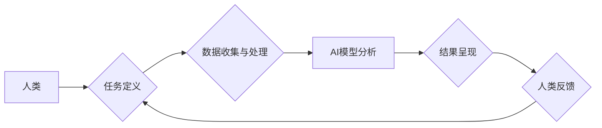

                 

## 人类-AI协作：增强人类与AI之间的信任和理解

> 关键词：人工智能、协作、信任、理解、人类-AI交互、算法、模型、应用场景

### 1. 背景介绍

人工智能（AI）技术近年来发展迅速，已渗透到各个领域，从医疗保健到金融，从交通运输到娱乐，AI正在改变着我们的生活方式。然而，AI技术的发展也引发了一些担忧，例如算法偏见、数据隐私和工作岗位替代等。 

为了更好地利用AI技术，并规避其潜在风险，人类与AI之间的协作成为一个至关重要的议题。人类拥有创造力、批判性思维和情感智能等优势，而AI则擅长处理大量数据、识别模式和执行重复性任务。通过将人类和AI的优势结合起来，我们可以实现更有效的、更智能的解决方案。

### 2. 核心概念与联系

**2.1 人类-AI协作的本质**

人类-AI协作是指人类和人工智能系统共同完成任务的过程。在这个过程中，人类和AI扮演着不同的角色，相互补充，共同实现目标。

**2.2 协作模式**

人类-AI协作模式多种多样，常见的有：

* **监督式协作:** 人类提供指导和反馈，AI根据反馈进行学习和改进。
* **自主式协作:** AI独立完成任务，人类在必要时进行干预。
* **伙伴式协作:** 人类和AI共同制定策略，并协同执行任务。

**2.3 构建信任和理解的要素**

* **透明度:** AI系统的决策过程应该清晰可解释，以便人类能够理解其背后的逻辑。
* **可控性:** 人类应该能够控制AI系统的行为，并及时干预潜在的风险。
* **可靠性:** AI系统应该能够稳定地执行任务，并提供准确的结果。
* **公平性:** AI系统应该公平公正地对待所有用户，避免算法偏见。

**2.4 Mermaid 流程图**



### 3. 核心算法原理 & 具体操作步骤

**3.1 算法原理概述**

人类-AI协作的核心算法通常基于机器学习和深度学习技术。这些算法能够从数据中学习模式和规律，并根据学习到的知识进行预测和决策。

**3.2 算法步骤详解**

1. **数据收集与预处理:** 收集与任务相关的各种数据，并进行清洗、转换和特征提取等预处理操作。
2. **模型选择与训练:** 选择合适的机器学习模型，并根据训练数据进行模型训练。
3. **模型评估与优化:** 使用测试数据评估模型的性能，并根据评估结果进行模型优化。
4. **部署与应用:** 将训练好的模型部署到实际应用场景中，并根据用户需求进行调整和改进。

**3.3 算法优缺点**

* **优点:** 能够自动学习和改进，适应不断变化的环境，提高效率和准确性。
* **缺点:** 需要大量的数据进行训练，容易受到数据质量的影响，解释性较差。

**3.4 算法应用领域**

* **医疗诊断:** 基于患者的病史、检查结果等数据，辅助医生进行疾病诊断。
* **金融风险评估:** 分析客户的信用记录、交易行为等数据，评估其贷款风险。
* **个性化推荐:** 根据用户的兴趣爱好、购买历史等数据，推荐个性化的商品或服务。

### 4. 数学模型和公式 & 详细讲解 & 举例说明

**4.1 数学模型构建**

人类-AI协作的数学模型通常基于概率论和统计学，例如贝叶斯网络、决策树和支持向量机等。这些模型能够量化人类和AI的知识和决策，并进行概率预测。

**4.2 公式推导过程**

例如，在贝叶斯网络模型中，可以使用贝叶斯公式来计算事件发生的概率：

$$P(A|B) = \frac{P(B|A)P(A)}{P(B)}$$

其中：

* $P(A|B)$ 是事件 A 在事件 B 发生的条件概率。
* $P(B|A)$ 是事件 B 在事件 A 发生的条件概率。
* $P(A)$ 是事件 A 的概率。
* $P(B)$ 是事件 B 的概率。

**4.3 案例分析与讲解**

假设我们有一个医疗诊断系统，需要根据患者的症状和检查结果预测其患病概率。我们可以使用贝叶斯网络模型来构建这个系统。

* 节点 A 代表“患者患病”，节点 B 代表“患者出现症状 X”。
* $P(B|A)$ 是患者出现症状 X 的概率，如果患病，则概率较高。
* $P(A)$ 是患者患病的概率，根据流行病学数据可以得到。
* $P(B)$ 是患者出现症状 X 的概率，可以根据总体数据得到。

通过贝叶斯公式，我们可以计算出患者患病的概率 $P(A|B)$。

### 5. 项目实践：代码实例和详细解释说明

**5.1 开发环境搭建**

* Python 3.x
* TensorFlow 或 PyTorch 等深度学习框架
* Jupyter Notebook 或 VS Code 等代码编辑器

**5.2 源代码详细实现**

```python
import tensorflow as tf

# 定义模型结构
model = tf.keras.models.Sequential([
    tf.keras.layers.Dense(64, activation='relu', input_shape=(10,)),
    tf.keras.layers.Dense(32, activation='relu'),
    tf.keras.layers.Dense(1, activation='sigmoid')
])

# 编译模型
model.compile(optimizer='adam', loss='binary_crossentropy', metrics=['accuracy'])

# 训练模型
model.fit(x_train, y_train, epochs=10)

# 评估模型
loss, accuracy = model.evaluate(x_test, y_test)
print('Loss:', loss)
print('Accuracy:', accuracy)
```

**5.3 代码解读与分析**

这段代码定义了一个简单的深度学习模型，用于二分类任务。

* `tf.keras.models.Sequential` 创建了一个顺序模型，即层级结构。
* `tf.keras.layers.Dense` 定义了全连接层，每个层都有64或32个神经元，使用ReLU激活函数。
* `tf.keras.layers.Dense(1, activation='sigmoid')` 定义了输出层，只有一个神经元，使用sigmoid激活函数，输出0到1之间的概率值。
* `model.compile` 编译模型，指定优化器、损失函数和评估指标。
* `model.fit` 训练模型，使用训练数据进行训练，训练10个epochs。
* `model.evaluate` 评估模型，使用测试数据评估模型的性能。

**5.4 运行结果展示**

训练完成后，可以查看模型的损失值和准确率。

### 6. 实际应用场景

**6.1 医疗保健**

* 辅助医生诊断疾病
* 预测患者的风险
* 个性化治疗方案

**6.2 金融服务**

* 风险评估和欺诈检测
* 个性化金融产品推荐
* 自动化交易

**6.3 制造业**

* 预测设备故障
* 优化生产流程
* 自动化生产线

**6.4 未来应用展望**

* 人工智能助手
* 智能家居
* 自动驾驶汽车

### 7. 工具和资源推荐

**7.1 学习资源推荐**

* **书籍:**
    * 《深度学习》
    * 《机器学习》
* **在线课程:**
    * Coursera
    * edX
    * Udacity

**7.2 开发工具推荐**

* **Python:** 
    * TensorFlow
    * PyTorch
    * scikit-learn
* **云平台:**
    * AWS
    * Azure
    * Google Cloud

**7.3 相关论文推荐**

* **AlphaGo:** Mastering the game of Go with deep neural networks and tree search
* **BERT:** Pre-training of deep bidirectional transformers for language understanding

### 8. 总结：未来发展趋势与挑战

**8.1 研究成果总结**

近年来，人类-AI协作取得了显著进展，在多个领域取得了突破性成果。

**8.2 未来发展趋势**

* **更智能的AI:** 发展更强大的AI算法，使其能够更好地理解人类需求和意图。
* **更安全的AI:** 确保AI系统的安全性和可靠性，避免算法偏见和数据泄露等风险。
* **更广泛的应用:** 将AI技术应用到更多领域，解决更复杂的问题。

**8.3 面临的挑战**

* **伦理问题:** AI技术的应用引发了一些伦理问题，例如算法偏见、隐私保护和工作岗位替代等。
* **技术挑战:** 发展更智能、更安全的AI算法仍然面临着技术挑战。
* **社会接受度:** 提高公众对AI技术的理解和接受度。

**8.4 研究展望**

未来，人类-AI协作将继续是一个重要的研究方向。我们需要不断探索新的算法和模型，并解决伦理和社会问题，才能真正实现AI技术的普惠发展。

### 9. 附录：常见问题与解答

**9.1 如何提高AI系统的透明度？**

可以通过使用可解释的机器学习模型，并提供模型决策过程的解释性报告来提高AI系统的透明度。

**9.2 如何避免AI系统的算法偏见？**

可以通过使用多样化的训练数据，并对模型进行公平性评估来避免AI系统的算法偏见。

**9.3 如何确保AI系统的安全性和可靠性？**

可以通过进行严格的测试和验证，并采用安全防护措施来确保AI系统的安全性和可靠性。


作者：禅与计算机程序设计艺术 / Zen and the Art of Computer Programming 
<end_of_turn>

