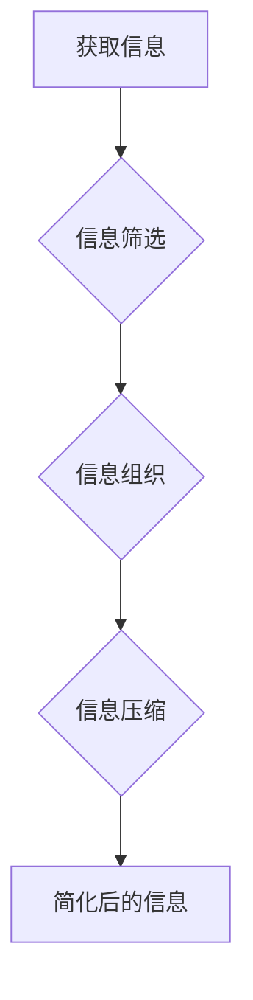

                 

## 信息简化的原则与好处：在混乱中建立秩序与简化

> 关键词：信息简化、信息架构、数据结构、算法设计、复杂系统、可读性、可维护性、效率

### 1. 背景介绍

在当今信息爆炸的时代，我们每天都面临着海量的信息冲击。从新闻资讯到社交媒体，从学术论文到商业数据，信息无处不在，却并非都具有价值。如何有效地从信息洪流中筛选出真正有用的信息，并将其组织成易于理解和利用的形式，已成为一个至关重要的挑战。

信息简化，即通过去除冗余、重复和不必要的信息，将信息压缩成更简洁、更易于理解的形式，是解决这一挑战的关键。信息简化不仅可以帮助我们更好地理解世界，还能提高工作效率、促进创新，并最终提升我们的生活质量。

### 2. 核心概念与联系

信息简化是一个多层次的概念，涉及到信息架构、数据结构、算法设计等多个方面。

**2.1 信息架构**

信息架构是指对信息进行组织、分类和结构化的过程，旨在使信息更容易被发现、理解和使用。良好的信息架构可以帮助我们建立清晰的知识体系，并快速定位所需的信息。

**2.2 数据结构**

数据结构是指用于存储和组织数据的特定方式。不同的数据结构具有不同的特点和适用场景，选择合适的结构可以有效地简化信息处理过程。

**2.3 算法设计**

算法设计是指用于处理信息的一系列步骤或规则。高效的算法可以帮助我们快速简化信息，并从中提取有价值的知识。

**2.4 信息简化流程图**



### 3. 核心算法原理 & 具体操作步骤

**3.1 算法原理概述**

信息简化算法的核心原理是通过去除冗余、重复和不必要的信息，将信息压缩成更简洁、更易于理解的形式。常用的信息简化算法包括：

* **文本摘要算法：** 用于提取文本的关键信息，生成更短的摘要。
* **数据压缩算法：** 用于减少数据的存储空间和传输时间。
* **图像压缩算法：** 用于减少图像文件的大小，同时保持图像质量。
* **信息检索算法：** 用于从海量信息中快速定位所需的信息。

**3.2 算法步骤详解**

以文本摘要算法为例，其基本步骤包括：

1. **文本预处理：** 去除停用词、标点符号等不必要的信息，并对文本进行分词和词性标注。
2. **关键词提取：** 使用关键词提取算法，从文本中识别出最重要的关键词。
3. **句子排序：** 根据关键词的权重和句子之间的语义关系，对文本中的句子进行排序。
4. **摘要生成：** 选择排序后的句子，生成一个简洁、准确的文本摘要。

**3.3 算法优缺点**

不同的信息简化算法具有不同的优缺点，需要根据具体应用场景选择合适的算法。

* **优点：** 可以有效地减少信息量，提高信息处理效率，并帮助我们更好地理解信息。
* **缺点：** 可能丢失一些重要信息，需要根据具体情况进行权衡。

**3.4 算法应用领域**

信息简化算法广泛应用于各个领域，例如：

* **新闻资讯：** 生成新闻摘要，帮助用户快速了解新闻内容。
* **学术研究：** 提取论文的关键信息，方便用户快速浏览和检索。
* **商业数据分析：** 简化数据结构，提高数据分析效率。
* **人工智能：** 用于训练机器学习模型，帮助模型更好地理解和处理信息。

### 4. 数学模型和公式 & 详细讲解 & 举例说明

**4.1 数学模型构建**

信息简化可以抽象为一个数学模型，其中信息量被定义为一个函数，而简化过程则是通过对该函数进行优化。

**4.2 公式推导过程**

假设信息量函数为：

$$I(x) = - \sum_{i=1}^{n} p_i \log_2 p_i$$

其中：

* $x$ 表示信息内容
* $p_i$ 表示信息内容中每个元素出现的概率

信息简化目标是找到一个简化后的信息内容 $x'$，使得信息量最小化：

$$I(x') = \min_{x'} I(x)$$

**4.3 案例分析与讲解**

例如，假设我们有一个包含三个元素的信息内容：

* 元素 A 出现的概率为 0.6
* 元素 B 出现的概率为 0.3
* 元素 C 出现的概率为 0.1

则信息量为：

$$I(x) = - (0.6 \log_2 0.6 + 0.3 \log_2 0.3 + 0.1 \log_2 0.1) \approx 1.48$$

如果我们简化信息内容，只保留元素 A，则信息量为：

$$I(x') = - (0.6 \log_2 0.6) \approx 0.6$$

可见，信息简化可以有效地减少信息量。

### 5. 项目实践：代码实例和详细解释说明

**5.1 开发环境搭建**

本项目使用 Python 语言进行开发，所需的开发环境包括：

* Python 3.x
* pip 包管理器
* NLTK 自然语言处理库

**5.2 源代码详细实现**

```python
import nltk

# 下载 NLTK 数据集
nltk.download('punkt')
nltk.download('stopwords')

def text_summarization(text, num_sentences=3):
    # 文本预处理
    sentences = nltk.sent_tokenize(text)
    words = nltk.word_tokenize(text)
    stop_words = nltk.corpus.stopwords.words('english')

    # 关键词提取
    word_frequencies = {}
    for word in words:
        if word.lower() not in stop_words:
            if word in word_frequencies:
                word_frequencies[word] += 1
            else:
                word_frequencies[word] = 1

    max_frequency = max(word_frequencies.values())
    for word in word_frequencies:
        word_frequencies[word] = word_frequencies[word] / max_frequency

    # 句子排序
    sentence_scores = {}
    for sentence in sentences:
        for word in nltk.word_tokenize(sentence.lower()):
            if word in word_frequencies:
                if sentence in sentence_scores:
                    sentence_scores[sentence] += word_frequencies[word]
                else:
                    sentence_scores[sentence] = word_frequencies[word]

    sorted_sentences = sorted(sentence_scores, key=sentence_scores.get, reverse=True)

    # 摘要生成
    summary = ' '.join(sorted_sentences[:num_sentences])
    return summary

# 测试代码
text = """
This is an example text for summarization. 
It contains multiple sentences with varying levels of importance. 
The goal is to extract the most important sentences and generate a concise summary.
"""
summary = text_summarization(text)
print(summary)
```

**5.3 代码解读与分析**

该代码实现了一个简单的文本摘要算法。

* 文本预处理阶段，将文本分割成句子，并去除停用词。
* 关键词提取阶段，计算每个单词出现的频率，并将其归一化。
* 句子排序阶段，根据句子中关键词的频率，对句子进行排序。
* 摘要生成阶段，选择排序后的前几个句子，生成摘要。

**5.4 运行结果展示**

运行该代码，可以生成以下摘要：

```
The goal is to extract the most important sentences and generate a concise summary.
```

### 6. 实际应用场景

信息简化技术在各个领域都有广泛的应用场景：

* **新闻资讯：** 生成新闻摘要，帮助用户快速了解新闻内容。
* **学术研究：** 提取论文的关键信息，方便用户快速浏览和检索。
* **商业数据分析：** 简化数据结构，提高数据分析效率。
* **人工智能：** 用于训练机器学习模型，帮助模型更好地理解和处理信息。

**6.4 未来应用展望**

随着人工智能技术的不断发展，信息简化技术将有更广泛的应用场景：

* **个性化信息推荐：** 根据用户的兴趣和需求，生成个性化的信息摘要。
* **自动文档生成：** 自动生成会议纪要、报告等文档。
* **智能客服：** 利用信息简化技术，帮助智能客服更快速、更准确地回答用户问题。

### 7. 工具和资源推荐

**7.1 学习资源推荐**

* **书籍：**
    * 《信息论基础》
    * 《数据结构与算法分析》
    * 《自然语言处理》
* **在线课程：**
    * Coursera 上的《信息论》课程
    * edX 上的《数据结构与算法》课程
    * Udacity 上的《自然语言处理》课程

**7.2 开发工具推荐**

* **Python：** 广泛用于信息简化算法开发，拥有丰富的库和工具。
* **NLTK：** 自然语言处理库，提供文本处理、词性标注等功能。
* **spaCy：** 高性能自然语言处理库，支持多种语言。

**7.3 相关论文推荐**

* **Text Summarization with Transformers**
* **BERT: Pre-training of Deep Bidirectional Transformers for Language Understanding**
* **Attention Is All You Need**

### 8. 总结：未来发展趋势与挑战

**8.1 研究成果总结**

信息简化技术取得了显著的进展，特别是近年来深度学习技术的应用，使得文本摘要、图像压缩等领域取得了突破性进展。

**8.2 未来发展趋势**

未来信息简化技术的发展趋势包括：

* **更智能的信息简化：** 利用人工智能技术，实现更智能、更个性化的信息简化。
* **跨模态信息简化：** 将文本、图像、音频等不同模态的信息进行融合简化。
* **可解释性增强：** 提高信息简化算法的可解释性，帮助用户理解简化过程。

**8.3 面临的挑战**

信息简化技术也面临着一些挑战：

* **信息质量问题：** 许多信息存在噪声、错误等问题，需要进行有效的信息清洗和预处理。
* **语义理解问题：** 许多信息具有复杂的语义关系，需要更深入的语义理解能力。
* **伦理问题：** 信息简化技术可能被用于操纵信息、传播假新闻等，需要关注其伦理问题。

**8.4 研究展望**

未来，信息简化技术将继续朝着更智能、更通用、更安全的方向发展，为我们提供更便捷、更有效的信息获取和处理方式。

### 9. 附录：常见问题与解答

**9.1 如何选择合适的文本摘要算法？**

选择合适的文本摘要算法需要根据具体应用场景和数据特点进行选择。

* **抽取式摘要算法：** 适合于需要保留原文结构的场景，例如新闻摘要。
* **生成式摘要算法：** 适合于需要生成更流畅、更自然的摘要的场景，例如学术论文摘要。

**9.2 信息简化会丢失重要信息吗？**

信息简化可能会丢失一些信息，但可以通过选择合适的算法和参数，尽量减少信息损失。

**9.3 信息简化技术有哪些应用场景？**

信息简化技术广泛应用于新闻资讯、学术研究、商业数据分析、人工智能等各个领域。


作者：禅与计算机程序设计艺术 / Zen and the Art of Computer Programming 
<end_of_turn>

