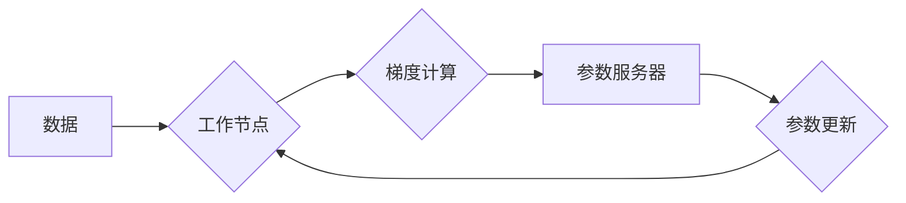

                 

## 分布式优化的挑战和策略

> 关键词：分布式系统、优化算法、机器学习、并行计算、数据一致性、容错机制、性能优化

### 1. 背景介绍

随着数据规模的不断膨胀和计算需求的日益增长，分布式系统已成为处理海量数据和复杂任务的必要选择。然而，分布式系统的优化问题也日益凸显。传统集中式优化算法难以有效应对分布式环境下的挑战，因此，分布式优化算法的研究成为一个重要的研究方向。

分布式优化是指在分布式系统中，将优化问题分解成多个子问题，并由各个节点协同完成。这种方法可以充分利用分布式系统的并行计算能力，提高优化效率。然而，分布式优化也面临着诸多挑战，例如：

* **数据一致性:** 在分布式系统中，数据可能分布在多个节点上，如何保证数据的一致性是关键问题。
* **通信开销:** 分布式优化算法需要节点之间进行频繁的通信，这会带来通信开销，影响优化效率。
* **容错机制:** 分布式系统节点可能出现故障，如何设计容错机制，保证优化算法的稳定运行，也是一个重要问题。
* **性能优化:** 如何设计高效的分布式优化算法，并将其应用于实际场景，是分布式优化研究的最终目标。

### 2. 核心概念与联系

分布式优化算法的核心概念包括：

* **分布式参数服务器:**  负责存储和更新模型参数，并协调各个节点的计算。
* **工作节点:**  负责对数据进行局部计算，并向参数服务器发送更新参数。
* **梯度下降:**  最常用的分布式优化算法，通过迭代更新模型参数，最小化损失函数。

**Mermaid 流程图:**



### 3. 核心算法原理 & 具体操作步骤

#### 3.1  算法原理概述

梯度下降算法是分布式优化中最常用的算法之一。其原理是通过迭代更新模型参数，最小化损失函数。在分布式环境下，梯度下降算法可以分为以下步骤：

1. **数据分片:** 将原始数据划分为多个子集，每个子集分配给一个工作节点进行处理。
2. **局部梯度计算:** 每个工作节点对其分配的数据进行计算，得到局部梯度。
3. **梯度聚合:** 所有工作节点将局部梯度发送到参数服务器，参数服务器对所有梯度进行聚合，得到全局梯度。
4. **参数更新:** 参数服务器根据全局梯度更新模型参数，并将更新后的参数广播回所有工作节点。
5. **重复步骤2-4:** 直到模型参数收敛，或者达到预设的迭代次数。

#### 3.2  算法步骤详解

1. **初始化:** 初始化模型参数，并随机分配数据到各个工作节点。
2. **数据并行处理:** 每个工作节点对其分配的数据进行计算，并计算局部梯度。
3. **梯度聚合:** 所有工作节点将局部梯度发送到参数服务器。参数服务器使用平均方法、随机梯度下降等方法对所有梯度进行聚合，得到全局梯度。
4. **参数更新:** 参数服务器根据全局梯度更新模型参数，并将其广播回所有工作节点。
5. **迭代:** 重复步骤2-4，直到模型参数收敛，或者达到预设的迭代次数。

#### 3.3  算法优缺点

**优点:**

* **并行计算:** 能够充分利用分布式系统的并行计算能力，提高优化效率。
* **数据分布:** 可以处理海量数据，不受单个节点内存限制。
* **容错性:** 可以容忍部分节点故障，保证整体系统的稳定运行。

**缺点:**

* **通信开销:** 节点之间需要频繁通信，会带来通信开销。
* **数据一致性:** 需要保证数据的一致性，这可能会增加算法复杂度。
* **参数更新策略:** 不同的参数更新策略会影响算法收敛速度和最终结果。

#### 3.4  算法应用领域

梯度下降算法广泛应用于机器学习、深度学习、推荐系统、自然语言处理等领域。

### 4. 数学模型和公式 & 详细讲解 & 举例说明

#### 4.1  数学模型构建

假设我们有一个优化问题，目标函数为 $f(w)$，其中 $w$ 是模型参数。我们的目标是找到最优参数 $w^*$，使得 $f(w^*)$ 最小。

在分布式环境下，我们可以将目标函数分解成多个子函数 $f_i(w)$，每个子函数对应一个工作节点。

#### 4.2  公式推导过程

梯度下降算法的基本公式为：

$$w_{t+1} = w_t - \eta \nabla f(w_t)$$

其中：

* $w_t$ 是模型参数在第 $t$ 次迭代的值。
* $\eta$ 是学习率，控制参数更新的步长。
* $\nabla f(w_t)$ 是目标函数在 $w_t$ 处的梯度。

在分布式环境下，我们可以使用平均梯度下降算法，将全局梯度计算为所有局部梯度的平均值：

$$\nabla f(w_t) = \frac{1}{N} \sum_{i=1}^{N} \nabla f_i(w_t)$$

其中 $N$ 是工作节点的数量。

#### 4.3  案例分析与讲解

假设我们有一个包含 1000 个样本的数据集，将其均匀分配到 10 个工作节点上。每个工作节点对其分配的数据进行计算，得到局部梯度。参数服务器将所有局部梯度进行平均，得到全局梯度，并根据全局梯度更新模型参数。

### 5. 项目实践：代码实例和详细解释说明

#### 5.1  开发环境搭建

* 操作系统: Ubuntu 20.04
* Python 版本: 3.8
* 框架: TensorFlow 2.x

#### 5.2  源代码详细实现

```python
import tensorflow as tf

# 定义模型
model = tf.keras.models.Sequential([
    tf.keras.layers.Dense(128, activation='relu'),
    tf.keras.layers.Dense(10, activation='softmax')
])

# 定义损失函数和优化器
loss_fn = tf.keras.losses.CategoricalCrossentropy()
optimizer = tf.keras.optimizers.SGD(learning_rate=0.01)

# 定义分布式训练函数
def distributed_train(dataset, epochs):
    # 获取工作节点数量
    num_workers = tf.distribute.MirroredStrategy().num_replicas_in_sync

    # 创建分布式训练策略
    strategy = tf.distribute.MirroredStrategy()

    # 进入分布式训练模式
    with strategy.scope():
        # 训练模型
        for epoch in range(epochs):
            for batch in dataset:
                with tf.GradientTape() as tape:
                    # 计算损失
                    loss = loss_fn(labels, model(inputs))
                # 计算梯度
                gradients = tape.gradient(loss, model.trainable_variables)
                # 更新参数
                optimizer.apply_gradients(zip(gradients, model.trainable_variables))
            # 打印训练进度
            print(f'Epoch {epoch+1}/{epochs}, Loss: {loss.numpy()}')

# 数据加载和预处理
# ...

# 分布式训练
distributed_train(dataset, epochs=10)
```

#### 5.3  代码解读与分析

* 代码首先定义了模型、损失函数和优化器。
* 然后，定义了一个 `distributed_train` 函数，用于进行分布式训练。
* 在 `distributed_train` 函数中，首先获取工作节点数量，并创建分布式训练策略。
* 然后，进入分布式训练模式，并使用 `tf.GradientTape` 记录梯度信息。
* 计算损失后，使用 `tape.gradient` 计算梯度，并使用 `optimizer.apply_gradients` 更新模型参数。
* 最后，打印训练进度。

#### 5.4  运行结果展示

运行代码后，会输出每个 epoch 的训练损失值，可以观察到训练损失随着 epoch 的增加而逐渐降低。

### 6. 实际应用场景

分布式优化算法广泛应用于各种实际场景，例如：

* **机器学习模型训练:**  训练大型机器学习模型，例如深度神经网络，需要处理海量数据，分布式优化算法可以有效提高训练效率。
* **推荐系统:**  推荐系统需要根据用户的历史行为数据，预测用户可能感兴趣的内容，分布式优化算法可以帮助构建更精准的推荐模型。
* **自然语言处理:**  自然语言处理任务，例如机器翻译、文本摘要等，需要处理大量的文本数据，分布式优化算法可以帮助构建更强大的自然语言处理模型。

### 6.4  未来应用展望

随着数据规模和计算需求的不断增长，分布式优化算法将发挥越来越重要的作用。未来，分布式优化算法的研究方向包括：

* **更高效的算法设计:**  设计更有效的分布式优化算法，提高优化效率和收敛速度。
* **更鲁棒的容错机制:**  设计更鲁棒的容错机制，保证分布式系统的稳定运行。
* **更广泛的应用场景:**  将分布式优化算法应用于更多领域，例如强化学习、联邦学习等。

### 7. 工具和资源推荐

#### 7.1  学习资源推荐

* **书籍:**
    * "Distributed Machine Learning with Python" by  A. K. Singh
    * "Deep Learning with Python" by Francois Chollet
* **在线课程:**
    * Coursera: "Distributed Machine Learning" by Stanford University
    * Udacity: "Deep Learning Nanodegree"

#### 7.2  开发工具推荐

* **TensorFlow:**  开源深度学习框架，支持分布式训练。
* **PyTorch:**  开源深度学习框架，支持分布式训练。
* **Horovod:**  分布式深度学习训练框架，可以与 TensorFlow 和 PyTorch 集成。

#### 7.3  相关论文推荐

* "Parameter Server: A Distributed Machine Learning Architecture" by Dean et al.
* "Asynchronous Stochastic Gradient Descent" by Recht et al.
* "Communication-Efficient Learning of Deep Networks from Decentralized Data" by McMahan et al.

### 8. 总结：未来发展趋势与挑战

#### 8.1  研究成果总结

分布式优化算法取得了显著的进展，为处理海量数据和复杂任务提供了有效解决方案。

#### 8.2  未来发展趋势

未来，分布式优化算法将朝着以下方向发展：

* **更智能的算法设计:**  利用人工智能技术，设计更智能的分布式优化算法，自动调整参数和策略，提高优化效率。
* **更普适的应用场景:**  将分布式优化算法应用于更多领域，例如边缘计算、物联网等。
* **更安全的分布式系统:**  设计更安全的分布式系统，防止数据泄露和攻击。

#### 8.3  面临的挑战

分布式优化算法也面临着一些挑战，例如：

* **通信开销:**  分布式系统中的通信开销仍然是一个重要的瓶颈。
* **数据一致性:**  保证数据的一致性仍然是一个难题。
* **模型复杂度:**  随着模型复杂度的增加，分布式训练的难度也随之增加。

#### 8.4  研究展望

未来，我们需要继续探索更有效的分布式优化算法，并将其应用于更多领域，推动人工智能技术的发展。

### 9. 附录：常见问题与解答

* **Q: 为什么需要分布式优化？**

A: 分布式优化可以利用分布式系统的并行计算能力，提高优化效率，处理海量数据。

* **Q: 分布式优化算法有哪些？**

A: 常见的分布式优化算法包括平均梯度下降、异步梯度下降、参数服务器等。

* **Q: 分布式优化算法有哪些挑战？**

A: 分布式优化算法面临着通信开销、数据一致性、模型复杂度等挑战。


作者：禅与计算机程序设计艺术 / Zen and the Art of Computer Programming<end_of_turn>

