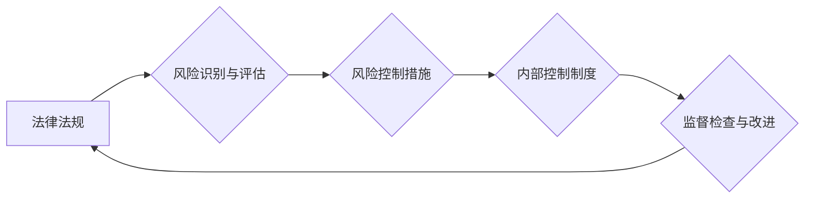

                 

## 合规管理：确保组织符合法律法规

> 关键词：合规管理、法律法规、风险管理、数据安全、人工智能、企业治理

> 摘要：随着科技的飞速发展，企业面临着越来越复杂的合规挑战。本文将深入探讨合规管理的概念、核心原则、关键技术以及在人工智能时代面临的新挑战，并提供一些实用的建议，帮助企业建立健全的合规管理体系，有效降低合规风险，确保持续健康发展。

## 1. 背景介绍

在当今数字化转型加速的时代，企业面临着前所未有的机遇和挑战。科技创新不断突破边界，为企业带来了新的增长点，但也带来了新的风险和不确定性。其中，合规风险日益突出，成为企业发展面临的重要挑战。

合规管理是指企业在经营活动中，遵守相关法律法规、行业标准和道德规范的行为规范和管理体系。它涵盖了企业在产品研发、运营管理、数据安全、知识产权保护等各个方面的合规行为。

近年来，随着互联网、大数据、人工智能等技术的快速发展，企业面临的合规挑战更加复杂。例如：

* **数据安全和隐私保护：**企业收集、存储和使用大量用户数据，需要确保数据的安全性和隐私性，遵守相关法律法规，例如 GDPR 和 CCPA。
* **人工智能伦理：**人工智能技术的应用引发了伦理和社会问题，例如算法偏见、数据歧视、责任归属等，企业需要在开发和应用人工智能技术时，遵循伦理原则，避免负面影响。
* **网络安全：**网络攻击和数据泄露事件频发，企业需要加强网络安全防护，保护自身和用户数据安全。
* **反洗钱和反恐融资：**金融科技的兴起，为洗钱和恐融资提供了新的途径，企业需要加强合规管理，防止被用于非法活动。

## 2. 核心概念与联系

合规管理是一个系统工程，涉及多个方面，包括法律法规、风险管理、内部控制、道德规范等。

**2.1 合规管理的核心概念**

* **法律法规：**合规管理的基础是遵守相关法律法规，包括国家法律、行业标准、国际公约等。
* **风险管理：**合规管理的核心是识别、评估和控制合规风险。企业需要建立健全的风险管理体系，对潜在的合规风险进行识别和评估，并制定相应的控制措施。
* **内部控制：**内部控制是确保企业合规行为的关键保障。企业需要建立完善的内部控制制度，包括组织架构、职责分工、流程管理、监督检查等，以确保合规行为的有效执行。
* **道德规范：**道德规范是企业合规管理的重要组成部分。企业需要建立健全的企业文化，倡导诚信、公平、正义等道德价值观，引导员工树立正确的合规意识。

**2.2 合规管理的架构**



## 3. 核心算法原理 & 具体操作步骤

合规管理涉及到许多算法和技术，例如风险评估算法、数据安全算法、人工智能伦理算法等。

**3.1 算法原理概述**

* **风险评估算法：**风险评估算法用于识别和评估企业面临的合规风险。常见的风险评估方法包括定量分析和定性分析。定量分析方法使用数据和统计模型来评估风险，而定性分析方法则依赖于专家经验和判断。
* **数据安全算法：**数据安全算法用于保护企业和用户数据安全。常见的算法包括加密算法、身份验证算法、访问控制算法等。
* **人工智能伦理算法：**人工智能伦理算法用于指导人工智能技术的开发和应用，确保其符合伦理原则。常见的算法包括公平性算法、透明度算法、可解释性算法等。

**3.2 算法步骤详解**

* **风险评估算法：**
    1. 识别潜在的合规风险。
    2. 评估风险的可能性和影响。
    3. 根据风险等级制定相应的控制措施。
* **数据安全算法：**
    1. 对敏感数据进行加密。
    2. 使用身份验证和授权机制控制数据访问。
    3. 实施数据备份和恢复机制。
* **人工智能伦理算法：**
    1. 识别潜在的伦理风险。
    2. 设计算法以避免或减轻伦理风险。
    3. 对算法进行透明度和可解释性评估。

**3.3 算法优缺点**

* **风险评估算法：**
    * 优点：可以量化风险，帮助企业制定更有效的控制措施。
    * 缺点：难以捕捉所有潜在的风险，结果可能存在偏差。
* **数据安全算法：**
    * 优点：可以有效保护数据安全，防止数据泄露。
    * 缺点：算法本身可能存在漏洞，需要不断更新和改进。
* **人工智能伦理算法：**
    * 优点：可以帮助企业开发和应用更负责任的人工智能技术。
    * 缺点：伦理问题复杂多变，算法难以完全解决所有问题。

**3.4 算法应用领域**

* **风险评估算法：**金融、保险、医疗、能源等行业。
* **数据安全算法：**所有行业都需要使用数据安全算法来保护数据安全。
* **人工智能伦理算法：**人工智能应用广泛的领域，例如医疗诊断、自动驾驶、金融交易等。

## 4. 数学模型和公式 & 详细讲解 & 举例说明

合规管理中涉及到许多数学模型和公式，例如风险评估模型、数据安全模型、人工智能伦理模型等。

**4.1 数学模型构建**

* **风险评估模型：**风险评估模型通常使用贝叶斯定理、决策树等数学工具来计算风险概率和影响。
* **数据安全模型：**数据安全模型通常使用概率论、信息论等数学工具来分析数据安全风险和评估安全措施的有效性。
* **人工智能伦理模型：**人工智能伦理模型通常使用博弈论、决策理论等数学工具来分析人工智能系统的行为和决策，并评估其伦理风险。

**4.2 公式推导过程**

* **贝叶斯定理：**

$$P(A|B) = \frac{P(B|A)P(A)}{P(B)}$$

其中：

* $P(A|B)$ 是事件 A 在事件 B 发生条件下的概率。
* $P(B|A)$ 是事件 B 在事件 A 发生条件下的概率。
* $P(A)$ 是事件 A 的概率。
* $P(B)$ 是事件 B 的概率。

* **决策树：**决策树是一种树形结构的模型，用于表示决策过程。决策树的节点表示决策，分支表示决策的结果，叶子节点表示最终的决策结果。

**4.3 案例分析与讲解**

* **风险评估案例：**一家金融机构需要评估其网络安全风险。可以使用贝叶斯定理来计算网络攻击发生的概率，并根据攻击的潜在影响，评估其风险等级。
* **数据安全案例：**一家医疗机构需要保护患者的医疗数据安全。可以使用加密算法和身份验证机制来控制数据的访问，并定期进行数据备份和恢复，以防止数据泄露。
* **人工智能伦理案例：**一家公司开发了一款自动驾驶汽车。需要使用博弈论来分析自动驾驶汽车在不同场景下的决策行为，并评估其伦理风险，例如在紧急情况下如何做出决策。

## 5. 项目实践：代码实例和详细解释说明

以下是一个简单的合规管理工具的代码实例，用于检测代码中是否存在敏感信息泄露。

**5.1 开发环境搭建**

* Python 3.x
* PyCharm IDE
* 必要的 Python 库，例如 `re`、`pandas` 等。

**5.2 源代码详细实现**

```python
import re

def detect_sensitive_info(text):
  """
  检测代码中是否存在敏感信息泄露。

  Args:
    text: 需要检测的代码文本。

  Returns:
    一个列表，包含检测到的敏感信息。
  """
  sensitive_keywords = [
    "API_KEY",
    "DATABASE_PASSWORD",
    "SECRET_KEY",
    "CUSTOMER_DATA",
  ]
  sensitive_info = []
  for keyword in sensitive_keywords:
    matches = re.findall(r"\b" + keyword + r"\b", text, re.IGNORECASE)
    if matches:
      sensitive_info.extend(matches)
  return sensitive_info

# 示例代码
code_text = """
# This is a sample code snippet.
API_KEY = "your_api_key"
DATABASE_PASSWORD = "your_password"
"""

sensitive_info = detect_sensitive_info(code_text)
if sensitive_info:
  print("Detected sensitive information:")
  for info in sensitive_info:
    print(info)
else:
  print("No sensitive information detected.")
```

**5.3 代码解读与分析**

* 该代码使用正则表达式来匹配代码文本中是否存在敏感信息。
* `sensitive_keywords` 列表包含一些常见的敏感信息关键字。
* `detect_sensitive_info` 函数遍历敏感信息关键字，使用 `re.findall` 函数查找代码文本中是否存在匹配的关键字。
* 如果找到匹配的关键字，则将其添加到 `sensitive_info` 列表中。
* 最后，代码打印出检测到的敏感信息。

**5.4 运行结果展示**

```
Detected sensitive information:
API_KEY
DATABASE_PASSWORD
```

## 6. 实际应用场景

合规管理在各个行业都有广泛的应用场景。

**6.1 金融行业**

* **反洗钱和反恐融资：**金融机构需要遵守反洗钱和反恐融资法规，使用合规管理工具来识别和预防洗钱和恐融资活动。
* **数据安全：**金融机构需要保护客户的财务数据安全，使用数据加密、身份验证和访问控制等技术来确保数据安全。

**6.2 医疗行业**

* **患者隐私保护：**医疗机构需要遵守 HIPAA 等法规，保护患者的医疗信息隐私。
* **医疗设备安全：**医疗设备需要符合安全标准，防止医疗事故发生。

**6.3 科技行业**

* **人工智能伦理：**科技公司需要在开发和应用人工智能技术时，遵循伦理原则，避免算法偏见和数据歧视。
* **数据安全：**科技公司需要保护用户数据安全，遵守 GDPR 等法规。

**6.4 未来应用展望**

随着科技的不断发展，合规管理将面临新的挑战和机遇。例如：

* **区块链技术：**区块链技术可以帮助企业建立更安全的合规管理体系，提高合规数据的可信度和透明度。
* **人工智能技术：**人工智能技术可以帮助企业自动化合规管理流程，提高效率和准确性。

## 7. 工具和资源推荐

**7.1 学习资源推荐**

* **书籍：**
    * 《合规管理》
    * 《数据安全与隐私保护》
    * 《人工智能伦理》
* **在线课程：**
    * Coursera 上的合规管理课程
    * edX 上的网络安全课程
    * Udemy 上的人工智能伦理课程

**7.2 开发工具推荐**

* **风险评估工具：**
    * RSA Archer
    * LogicManager
    * MetricStream
* **数据安全工具：**
    * Splunk
    * CrowdStrike
    * Palo Alto Networks
* **人工智能伦理工具：**
    * IBM Watson AI Ethics
    * Google AI Ethics

**7.3 相关论文推荐**

* **风险管理：**
    * COSO Enterprise Risk Management Framework
    * ISO 31000 Risk Management
* **数据安全：**
    * NIST Cybersecurity Framework
    * GDPR
* **人工智能伦理：**
    * Asilomar AI Principles
    * OECD AI Principles

## 8. 总结：未来发展趋势与挑战

**8.1 研究成果总结**

合规管理是一个不断发展的领域，近年来取得了显著的进展。例如：

* **风险评估模型的改进：**新的风险评估模型更加准确和高效，可以更好地识别和评估合规风险。
* **数据安全技术的进步：**新的数据安全技术，例如区块链技术和量子加密技术，可以提供更强大的数据保护能力。
* **人工智能伦理的深入研究：**越来越多的研究者关注人工智能伦理问题，并提出了新的解决方案。

**8.2 未来发展趋势**

* **自动化合规管理：**人工智能技术将被广泛应用于合规管理领域，自动化合规管理流程，提高效率和准确性。
* **区块链技术应用：**区块链技术将被用于构建更安全的合规管理体系，提高合规数据的可信度和透明度。
* **跨行业合规标准：**随着全球化程度的提高，跨行业合规标准将更加重要，帮助企业更好地应对全球合规挑战。

**8.3 面临的挑战**

* **技术发展速度快：**科技发展速度快，合规管理需要不断跟进新的技术发展，并制定相应的合规措施。
* **法律法规不断更新：**法律法规不断更新，合规管理需要及时了解最新的法律法规，并进行相应的调整。
* **人才短缺：**合规管理人才短缺，企业需要加强合规管理人才的培养和引进。

**8.4 研究展望**

未来，合规管理研究将更加注重以下方面：

* **人工智能伦理：**如何确保人工智能技术的应用符合伦理原则，避免算法偏见和数据歧视。
* **区块链技术应用：**如何利用区块链技术构建更安全的合规管理体系，提高合规数据的可信度和透明度。
* **跨行业合规标准：**如何制定跨行业合规标准，帮助企业更好地应对全球合规挑战。


## 9. 附录：常见问题与解答

**9.1 如何建立健全的合规管理体系？**

建立健全的合规管理体系需要从以下几个方面着手：

* **制定合规政策：**企业需要制定明确的合规政策，规定企业在经营活动中需要遵守的法律法规、行业标准和道德规范。
* **建立合规组织架构：**企业需要建立专门的合规管理部门，负责制定和实施合规管理政策，并监督执行合规行为。
* **加强合规培训：**企业需要定期对员工进行合规培训，提高员工的合规意识和合规技能。
* **建立合规监控机制：**企业需要建立有效的合规监控机制，定期检查和评估合规行为，并及时发现和解决合规问题。

**9.2 如何应对合规风险？**

应对合规风险需要采取以下措施：

* **识别合规风险：**企业需要定期识别和评估其面临的合规风险。
* **控制合规风险：**企业需要制定相应的控制措施，降低合规风险。
* **监控合规风险：**企业需要定期监控合规风险，并及时采取措施应对风险变化。

**9.3 如何利用人工智能技术加强合规管理？**

人工智能技术可以应用于以下方面，加强合规管理：

* **自动化合规流程：**人工智能可以自动化合规流程，例如合规文档审核、合规风险评估等。
* **智能合规监控：**人工智能可以分析海量数据，识别潜在的合规风险。
* **个性化合规培训：**人工智能可以根据员工的实际情况，提供个性化的合规培训。


作者：禅与计算机程序设计艺术 / Zen and the Art of Computer Programming<end_of_turn>

