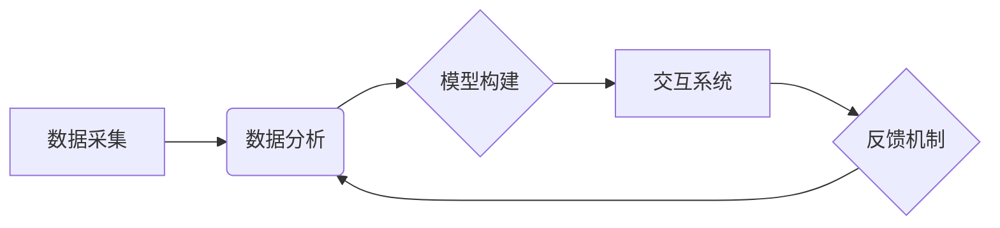

                 

## 回顾与展望：人类计算的发展历程与未来

> 关键词：人类计算、计算模型、认知科学、人工智能、机器学习、神经网络、未来趋势

### 1. 背景介绍

人类计算，作为一种将人类认知能力与计算能力相结合的新兴领域，近年来备受关注。它旨在通过模拟和增强人类的认知过程，构建更智能、更适应复杂环境的计算系统。从古老的算盘到现代的深度学习，人类一直在探索如何利用计算工具来解决问题、获取知识和创造价值。

随着计算机技术和人工智能的飞速发展，人类计算迎来了新的机遇和挑战。我们已经取得了令人瞩目的进展，例如语音识别、图像识别、自然语言处理等领域取得了突破性进展。然而，人类计算仍然面临着许多难题，例如如何更好地理解和模拟人类的复杂认知过程、如何构建更安全、更可靠的人类计算系统、如何将人类计算技术应用于更广泛的领域等。

### 2. 核心概念与联系

**2.1  人类计算的核心概念**

人类计算的核心概念是将人类的认知能力与计算能力相结合，构建一种新的计算模式。它涵盖了以下几个方面：

* **认知科学:** 研究人类认知过程，包括感知、记忆、推理、决策等。
* **人工智能:**  模拟和增强人类智能的计算机系统。
* **计算模型:**  用于表示和处理信息的数学模型，例如神经网络、符号逻辑等。
* **交互式计算:**  人类与计算机之间进行交互式计算，例如语音交互、手势识别等。

**2.2  人类计算的架构**

人类计算的架构通常包括以下几个部分：

* **数据采集:** 收集人类行为、认知过程等相关数据。
* **数据分析:** 利用机器学习等算法分析数据，提取人类认知模式。
* **模型构建:**  构建模拟人类认知过程的计算模型。
* **交互系统:**  实现人类与计算模型的交互。
* **反馈机制:**  根据交互结果反馈到模型，不断优化模型性能。



**2.3  人类计算与其他领域的联系**

人类计算与许多其他领域密切相关，例如：

* **教育:**  个性化学习、智能辅导等。
* **医疗:**  疾病诊断、个性化治疗等。
* **设计:**  创意设计、产品开发等。
* **娱乐:**  沉浸式体验、虚拟现实等。

### 3. 核心算法原理 & 具体操作步骤

**3.1  算法原理概述**

人类计算的核心算法原理是基于人工智能和机器学习的。其中，深度学习算法在人类计算领域发挥着重要作用。深度学习算法通过多层神经网络来模拟人类大脑的结构和功能，能够学习和处理复杂的数据模式。

**3.2  算法步骤详解**

深度学习算法的具体操作步骤如下：

1. **数据预处理:**  收集和清洗数据，将其转换为深度学习模型可以理解的格式。
2. **网络结构设计:**  根据任务需求设计神经网络的结构，包括层数、节点数、激活函数等。
3. **参数初始化:**  为神经网络中的参数赋予初始值。
4. **前向传播:**  将输入数据通过神经网络进行处理，得到输出结果。
5. **损失函数计算:**  计算模型输出结果与真实结果之间的误差。
6. **反向传播:**  根据损失函数的梯度，调整神经网络的参数，使模型输出结果更接近真实结果。
7. **迭代训练:**  重复前向传播、损失函数计算和反向传播的过程，直到模型性能达到预期的水平。

**3.3  算法优缺点**

**优点:**

* **强大的学习能力:**  能够学习和处理复杂的数据模式。
* **自动特征提取:**  无需人工提取特征，能够自动学习数据中的特征。
* **泛化能力强:**  能够将学习到的知识应用于新的数据。

**缺点:**

* **数据依赖性强:**  需要大量的训练数据才能达到良好的性能。
* **训练时间长:**  训练深度学习模型需要大量的计算资源和时间。
* **可解释性差:**  深度学习模型的决策过程难以理解。

**3.4  算法应用领域**

深度学习算法在许多领域都有广泛的应用，例如：

* **图像识别:**  人脸识别、物体检测、图像分类等。
* **语音识别:**  语音转文本、语音助手等。
* **自然语言处理:**  机器翻译、文本摘要、情感分析等。
* **推荐系统:**  商品推荐、内容推荐等。

### 4. 数学模型和公式 & 详细讲解 & 举例说明

**4.1  数学模型构建**

深度学习模型通常采用神经网络结构，其数学模型可以表示为多层感知机（MLP）。MLP由多个神经元组成的层级结构组成，每个神经元接收来自上一层的输入信号，并通过激活函数进行处理，输出到下一层。

**4.2  公式推导过程**

假设一个 MLP 包含输入层、隐藏层和输出层，分别有 $n_1$, $n_2$, $n_3$ 个神经元。每个神经元接收来自上一层的输入信号，并通过权重矩阵进行加权求和，再通过激活函数进行处理。

* **输入层:**  $x_i$ 表示第 $i$ 个输入神经元的激活值，$i = 1, 2, ..., n_1$。
* **隐藏层:**  $h_j$ 表示第 $j$ 个隐藏层神经元的激活值，$j = 1, 2, ..., n_2$。
* **输出层:**  $y_k$ 表示第 $k$ 个输出神经元的激活值，$k = 1, 2, ..., n_3$。

隐藏层神经元的激活值计算公式为：

$$h_j = f(\sum_{i=1}^{n_1} w_{ij}x_i + b_j)$$

其中，$w_{ij}$ 表示第 $i$ 个输入神经元到第 $j$ 个隐藏层神经元的权重，$b_j$ 表示第 $j$ 个隐藏层神经元的偏置，$f$ 表示激活函数。

输出层神经元的激活值计算公式为：

$$y_k = f(\sum_{j=1}^{n_2} w_{jk}h_j + b_k)$$

其中，$w_{jk}$ 表示第 $j$ 个隐藏层神经元到第 $k$ 个输出层神经元的权重，$b_k$ 表示第 $k$ 个输出层神经元的偏置。

**4.3  案例分析与讲解**

例如，在图像分类任务中，输入层接收图像像素值，隐藏层学习图像特征，输出层预测图像类别。通过训练，模型可以学习到图像特征与类别之间的映射关系，从而实现图像分类。

### 5. 项目实践：代码实例和详细解释说明

**5.1  开发环境搭建**

* **操作系统:**  Linux、macOS 或 Windows
* **编程语言:**  Python
* **深度学习框架:**  TensorFlow、PyTorch 或 Keras
* **其他工具:**  Git、Jupyter Notebook

**5.2  源代码详细实现**

以下是一个使用 TensorFlow 实现图像分类的简单代码示例：

```python
import tensorflow as tf

# 定义模型结构
model = tf.keras.models.Sequential([
  tf.keras.layers.Conv2D(32, (3, 3), activation='relu', input_shape=(28, 28, 1)),
  tf.keras.layers.MaxPooling2D((2, 2)),
  tf.keras.layers.Conv2D(64, (3, 3), activation='relu'),
  tf.keras.layers.MaxPooling2D((2, 2)),
  tf.keras.layers.Flatten(),
  tf.keras.layers.Dense(10, activation='softmax')
])

# 编译模型
model.compile(optimizer='adam',
              loss='sparse_categorical_crossentropy',
              metrics=['accuracy'])

# 训练模型
model.fit(x_train, y_train, epochs=5)

# 评估模型
loss, accuracy = model.evaluate(x_test, y_test)
print('Test loss:', loss)
print('Test accuracy:', accuracy)
```

**5.3  代码解读与分析**

* **模型结构:**  该代码定义了一个简单的卷积神经网络（CNN），包含两个卷积层、两个最大池化层、一个全连接层和一个输出层。
* **编译模型:**  使用 Adam 优化器、交叉熵损失函数和准确率作为评估指标编译模型。
* **训练模型:**  使用训练数据训练模型，训练 epochs 次。
* **评估模型:**  使用测试数据评估模型的性能。

**5.4  运行结果展示**

训练完成后，可以查看模型的测试损失和准确率。

### 6. 实际应用场景

**6.1  医疗诊断**

* **疾病识别:**  利用深度学习算法分析医学图像，例如 X 光片、CT 扫描、MRI 图像，识别疾病，例如癌症、肺炎等。
* **病症预测:**  根据患者的病史、症状和体征等数据，预测患者可能患有的疾病。

**6.2  金融风险管理**

* **欺诈检测:**  分析交易数据，识别异常交易，例如信用卡欺诈、网络钓鱼等。
* **信用评估:**  根据客户的财务数据，评估客户的信用风险。

**6.3  智能客服**

* **聊天机器人:**  利用自然语言处理技术，构建能够与用户进行自然对话的聊天机器人，提供客户服务。
* **语音助手:**  利用语音识别技术，构建能够理解用户语音指令的语音助手，例如 Siri、Alexa 等。

**6.4  未来应用展望**

人类计算技术将在未来发挥越来越重要的作用，例如：

* **个性化教育:**  根据学生的学习能力和兴趣，提供个性化的学习方案。
* **智能制造:**  利用机器学习算法，优化生产流程，提高生产效率。
* **自动驾驶:**  利用深度学习算法，训练自动驾驶汽车，实现无人驾驶。

### 7. 工具和资源推荐

**7.1  学习资源推荐**

* **书籍:**  《深度学习》、《人工智能：一个现代方法》
* **在线课程:**  Coursera、edX、Udacity 等平台上的深度学习课程
* **博客:**  机器之心、AI 算法等

**7.2  开发工具推荐**

* **深度学习框架:**  TensorFlow、PyTorch、Keras
* **编程语言:**  Python
* **数据可视化工具:**  Matplotlib、Seaborn

**7.3  相关论文推荐**

* **AlexNet:**  Krizhevsky, A., Sutskever, I., & Hinton, G. E. (2012). Imagenet classification with deep convolutional neural networks. In Advances in neural information processing systems (pp. 1097-1105).
* **ResNet:**  He, K., Zhang, X., Ren, S., & Sun, J. (2016). Deep residual learning for image recognition. In Proceedings of the IEEE conference on computer vision and pattern recognition (pp. 770-778).
* **BERT:**  Devlin, J., Chang, M. W., Lee, K., & Toutanova, K. (2018). Bert: Pre-training of deep bidirectional transformers for language understanding. arXiv preprint arXiv:1810.04805.

### 8. 总结：未来发展趋势与挑战

**8.1  研究成果总结**

近年来，人类计算领域取得了显著进展，例如：

* **深度学习算法的突破:**  深度学习算法在图像识别、语音识别、自然语言处理等领域取得了突破性进展。
* **计算模型的创新:**  提出了新的计算模型，例如 Transformer、Graph Neural Network 等，能够处理更复杂的数据类型。
* **硬件加速:**  GPU、TPU 等硬件加速器的发展，使得深度学习模型的训练速度和效率得到提升。

**8.2  未来发展趋势**

* **更强大的计算模型:**  研究更强大的计算模型，例如通用人工智能模型，能够解决更广泛的认知任务。
* **更有效的训练方法:**  研究更有效的训练方法，例如迁移学习、联邦学习等，降低训练成本和时间。
* **更安全的计算系统:**  研究更安全的计算系统，防止模型被攻击或滥用。

**8.3  面临的挑战**

* **数据获取和隐私问题:**  深度学习算法依赖于大量数据，如何获取高质量数据并保护用户隐私是一个挑战。
* **模型可解释性:**  深度学习模型的决策过程难以理解，如何提高模型的可解释性是一个重要问题。
* **伦理问题:**  人类计算技术可能带来一些伦理问题，例如算法偏见、工作岗位替代等，需要认真思考和解决。

**8.4  研究展望**

未来，人类计算将继续朝着更智能、更安全、更可解释的方向发展。随着技术的进步和应用的扩展，人类计算将深刻地改变我们的生活和工作方式。


### 9. 附录：常见问题与解答

**9.1  什么是人类计算？**

人类计算是一种将人类的认知能力与计算能力相结合的新兴领域，旨在构建更智能、更适应复杂环境的计算系统。

**9.2  人类计算有哪些应用场景？**

人类计算的应用场景非常广泛，例如医疗诊断、金融风险管理、智能客服、个性化教育、智能制造等。

**9.3  人类计算有哪些挑战？**

人类计算面临着数据获取和隐私问题、模型可解释性、伦理问题等挑战。


作者：禅与计算机程序设计艺术 / Zen and the Art of Computer Programming<end_of_turn>

