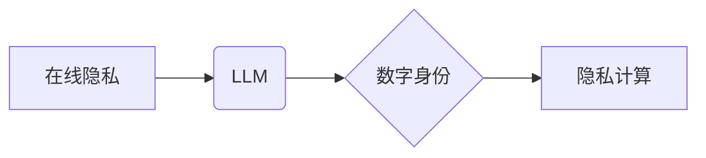

                 

## 在线隐私与 LLM：保障数字身份和数据

> 关键词：大型语言模型 (LLM)、在线隐私、数据安全、数字身份、联邦学习、同态加密、隐私计算

### 1. 背景介绍

随着人工智能技术的飞速发展，大型语言模型 (LLM) 在自然语言处理、文本生成、机器翻译等领域展现出强大的能力，并逐渐渗透到我们的日常生活。然而，LLM 的训练和应用也带来了新的挑战，其中在线隐私保护尤为重要。

LLM 的训练通常需要海量数据，这些数据往往包含用户敏感信息，如姓名、地址、电话号码、浏览记录等。如果这些数据被泄露或滥用，将对用户隐私造成严重威胁。此外，LLM 的应用场景也越来越广泛，例如在线聊天机器人、个性化推荐系统、智能客服等，这些应用都需要访问和处理用户的个人数据，进一步加剧了在线隐私保护的迫切性。

### 2. 核心概念与联系

**2.1 在线隐私**

在线隐私是指在互联网环境下，个人信息和行为不被未经授权的第三方收集、使用、披露或利用的权利。

**2.2 LLM**

大型语言模型 (LLM) 是指参数量巨大、训练数据海量的人工智能模型，能够理解和生成人类语言。

**2.3 数字身份**

数字身份是指在数字环境下，个人或实体的唯一标识和身份信息，用于认证、授权和数据访问控制。

**2.4 隐私计算**

隐私计算是指在不泄露原始数据的情况下，对数据进行分析和处理的技术。

**2.5 核心概念关系图**



### 3. 核心算法原理 & 具体操作步骤

**3.1 算法原理概述**

为了保障在线隐私，在 LLM 的训练和应用过程中，需要采用多种隐私保护技术，例如联邦学习、同态加密等。

**3.2 算法步骤详解**

**3.2.1 联邦学习**

联邦学习是一种分布式机器学习方法，它允许模型在多个设备上进行训练，而无需将原始数据传输到中央服务器。

1. **数据分发:** 将训练数据分散到各个设备上。
2. **模型训练:** 各个设备对本地数据进行模型训练，并更新模型参数。
3. **参数聚合:** 将各个设备更新的模型参数聚合到一起，生成全局模型。
4. **模型更新:** 将全局模型分发到各个设备，重复上述步骤，直到模型收敛。

**3.2.2 同态加密**

同态加密是一种加密技术，它允许对加密数据进行运算，而无需解密。

1. **数据加密:** 将原始数据加密成不可读的形式。
2. **加密数据运算:** 对加密数据进行运算，得到加密结果。
3. **解密结果:** 将加密结果解密，得到原始数据的结果。

**3.3 算法优缺点**

**3.3.1 联邦学习**

* **优点:** 保护原始数据隐私，提高数据安全。
* **缺点:** 训练速度较慢，模型性能可能不如集中式训练。

**3.3.2 同态加密**

* **优点:** 保护数据在整个计算过程中的隐私。
* **缺点:** 计算效率较低，应用场景有限。

**3.4 算法应用领域**

* **医疗保健:** 保护患者隐私，进行医疗数据分析。
* **金融服务:** 保护客户隐私，进行风险评估和欺诈检测。
* **电商:** 保护用户隐私，进行个性化推荐和广告投放。

### 4. 数学模型和公式 & 详细讲解 & 举例说明

**4.1 数学模型构建**

假设我们有一个包含 $n$ 个样本的数据集 $D = \{x_1, x_2, ..., x_n\}$, 每个样本 $x_i$ 包含 $d$ 个特征。我们想要训练一个 LLM 模型 $f(x)$ 来预测样本 $x$ 的标签 $y$.

**4.2 公式推导过程**

LLM 的训练目标通常是最小化预测值与真实值的损失函数。常用的损失函数包括交叉熵损失函数、均方误差损失函数等。

例如，对于分类任务，可以使用交叉熵损失函数：

$$
L(f(x), y) = - \sum_{i=1}^{n} y_i \log(f(x_i))
$$

其中，$y_i$ 是样本 $x_i$ 的真实标签，$f(x_i)$ 是模型预测的概率分布。

**4.3 案例分析与讲解**

假设我们训练一个 LLM 模型来识别文本中的情感倾向，例如判断文本是积极的、消极的还是中性的。我们可以使用交叉熵损失函数来训练模型，并使用测试集上的准确率来评估模型性能。

### 5. 项目实践：代码实例和详细解释说明

**5.1 开发环境搭建**

* Python 3.7+
* TensorFlow 或 PyTorch
* CUDA 和 cuDNN (可选)

**5.2 源代码详细实现**

```python
import tensorflow as tf

# 定义模型结构
model = tf.keras.Sequential([
    tf.keras.layers.Embedding(input_dim=vocab_size, output_dim=embedding_dim),
    tf.keras.layers.LSTM(units=128),
    tf.keras.layers.Dense(units=3, activation='softmax')
])

# 定义损失函数和优化器
model.compile(loss='categorical_crossentropy', optimizer='adam', metrics=['accuracy'])

# 训练模型
model.fit(train_data, train_labels, epochs=10)

# 评估模型
loss, accuracy = model.evaluate(test_data, test_labels)
print('Loss:', loss)
print('Accuracy:', accuracy)
```

**5.3 代码解读与分析**

* 该代码示例使用 TensorFlow 库构建了一个简单的 LLM 模型，用于文本情感分类任务。
* 模型结构包括 Embedding 层、LSTM 层和 Dense 层。
* Embedding 层将文本单词转换为向量表示。
* LSTM 层用于捕捉文本序列中的上下文信息。
* Dense 层用于输出情感倾向的概率分布。
* 训练模型时，使用交叉熵损失函数和 Adam 优化器。

**5.4 运行结果展示**

训练完成后，可以将模型应用于新的文本数据，预测其情感倾向。

### 6. 实际应用场景

**6.1 在线聊天机器人**

LLM 可以用于构建更智能、更自然的在线聊天机器人，能够理解用户的意图并提供更精准的回复。

**6.2 个性化推荐系统**

LLM 可以分析用户的行为数据和偏好，提供更个性化的商品或内容推荐。

**6.3 智能客服**

LLM 可以用于构建智能客服系统，自动处理用户常见问题，提高客户服务效率。

**6.4 未来应用展望**

* **更精准的医疗诊断:** LLM 可以帮助医生分析患者的病历和症状，提供更精准的诊断建议。
* **更有效的教育教学:** LLM 可以个性化学习内容，提供更有效的教育教学。
* **更安全的金融交易:** LLM 可以用于识别金融欺诈，提高金融交易安全。

### 7. 工具和资源推荐

**7.1 学习资源推荐**

* **书籍:**
    * Deep Learning by Ian Goodfellow, Yoshua Bengio, and Aaron Courville
    * Natural Language Processing with Python by Steven Bird, Ewan Klein, and Edward Loper
* **在线课程:**
    * Coursera: Machine Learning by Andrew Ng
    * Udacity: Deep Learning Nanodegree

**7.2 开发工具推荐**

* **TensorFlow:** https://www.tensorflow.org/
* **PyTorch:** https://pytorch.org/
* **Hugging Face Transformers:** https://huggingface.co/transformers/

**7.3 相关论文推荐**

* Attention Is All You Need (Vaswani et al., 2017)
* BERT: Pre-training of Deep Bidirectional Transformers for Language Understanding (Devlin et al., 2018)
* GPT-3: Language Models are Few-Shot Learners (Brown et al., 2020)

### 8. 总结：未来发展趋势与挑战

**8.1 研究成果总结**

近年来，LLM 在自然语言处理领域取得了显著进展，展现出强大的能力和应用潜力。

**8.2 未来发展趋势**

* **模型规模和能力的提升:** 未来，LLM 的模型规模和能力将继续提升，能够处理更复杂的任务。
* **多模态学习:** LLM 将与其他模态数据，例如图像、音频、视频等进行融合，实现更全面的理解和生成。
* **可解释性和透明性:** 研究者将致力于提高 LLM 的可解释性和透明性，使其决策过程更加可理解。

**8.3 面临的挑战**

* **数据隐私保护:** LLM 的训练和应用需要海量数据，如何保护用户隐私是一个重要挑战。
* **模型安全性:** LLM 可能被用于生成虚假信息、进行恶意攻击等，如何确保模型安全性是一个关键问题。
* **伦理问题:** LLM 的应用可能引发一些伦理问题，例如算法偏见、就业影响等，需要进行深入探讨和解决。

**8.4 研究展望**

未来，LLM 研究将继续朝着更安全、更可靠、更可解释的方向发展，为人类社会带来更多福祉。

### 9. 附录：常见问题与解答

**9.1 如何保护 LLM 训练数据隐私？**

可以使用联邦学习、同态加密等隐私保护技术来保护 LLM 训练数据隐私。

**9.2 如何评估 LLM 的性能？**

常用的评估指标包括准确率、召回率、F1-score等。

**9.3 如何部署 LLM 模型？**

可以使用云平台、边缘设备等多种方式部署 LLM 模型。


作者：禅与计算机程序设计艺术 / Zen and the Art of Computer Programming 
<end_of_turn>

