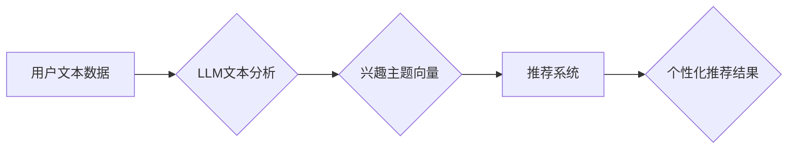

                 

## 基于LLM的推荐系统用户兴趣主题建模

> 关键词：LLM,推荐系统,用户兴趣,主题建模,自然语言处理,BERT,Transformer

## 1. 背景介绍

推荐系统作为互联网时代的重要组成部分，在电商、社交媒体、视频平台等领域发挥着至关重要的作用。传统的推荐系统主要依赖于用户行为数据，如点击、购买、评分等，通过协同过滤、内容过滤等算法进行推荐。然而，这些方法难以捕捉用户兴趣的深层语义，且容易陷入数据孤岛问题，难以应对新用户和新商品的推荐挑战。

近年来，大语言模型（LLM）的快速发展为推荐系统带来了新的机遇。LLM 拥有强大的文本理解和生成能力，能够从用户文本数据中挖掘出更丰富的兴趣特征，并进行跨域、跨平台的兴趣关联分析。基于LLM的推荐系统能够更好地理解用户需求，提供更个性化、精准的推荐结果。

## 2. 核心概念与联系

### 2.1 用户兴趣主题建模

用户兴趣主题建模旨在从用户的文本数据中识别出其潜在的兴趣主题，并将其表示为可量化的主题向量。这些主题向量可以用于衡量用户对不同主题的兴趣程度，并作为推荐系统的关键特征。

### 2.2 LLM在推荐系统中的应用

LLM 可以应用于推荐系统的多个环节，例如：

* **用户兴趣建模:** 利用 LLM 对用户的文本数据进行分析，识别出其潜在的兴趣主题。
* **商品描述理解:** 利用 LLM 对商品描述进行理解，提取出商品的特征和属性。
* **推荐结果生成:** 利用 LLM 生成个性化的推荐结果，并提供更丰富的推荐解释。

### 2.3  架构图



## 3. 核心算法原理 & 具体操作步骤

### 3.1  算法原理概述

基于LLM的用户兴趣主题建模主要依赖于**Transformer**架构的语言模型，例如BERT、RoBERTa等。这些模型通过训练大量的文本数据，学习到语言的语义表示，并能够捕捉文本中的长距离依赖关系。

在用户兴趣主题建模中，我们可以利用预训练的LLM，将其fine-tune在用户文本数据上，从而学习到用户特定领域的主题表示。

### 3.2  算法步骤详解

1. **数据预处理:** 收集用户文本数据，进行清洗、分词、去停用词等预处理操作。
2. **LLM fine-tune:** 选择预训练的LLM模型，将其fine-tune在用户文本数据上，训练出一个能够捕捉用户兴趣主题的模型。
3. **主题提取:** 利用fine-tune后的LLM模型，对用户文本进行编码，并使用聚类算法或主题模型（如LDA）进行主题提取。
4. **主题向量化:** 将提取出的主题转换为可量化的主题向量，例如使用词袋模型或TF-IDF等方法。
5. **兴趣建模:** 将用户文本对应的主题向量作为用户兴趣的表示，并将其用于推荐系统的其他模块。

### 3.3  算法优缺点

**优点:**

* 能够捕捉用户兴趣的深层语义，超越传统的基于行为数据的推荐系统。
* 能够处理多种类型的用户文本数据，例如评论、描述、对话等。
* 能够进行跨域、跨平台的兴趣关联分析，提升推荐的精准度和个性化程度。

**缺点:**

* 需要大量的文本数据进行训练，训练成本较高。
* 对于新用户和新商品的推荐仍然存在挑战。
* 需要考虑用户隐私保护问题。

### 3.4  算法应用领域

* **电商推荐:** 基于用户评论、浏览历史等文本数据，推荐个性化的商品。
* **内容推荐:** 基于用户阅读偏好、兴趣标签等文本数据，推荐个性化的文章、视频等内容。
* **社交推荐:** 基于用户社交关系、兴趣爱好等文本数据，推荐新的朋友或社群。

## 4. 数学模型和公式 & 详细讲解 & 举例说明

### 4.1  数学模型构建

假设我们有N个用户和M个主题，用户i对主题j的兴趣可以用一个实数表示，记为$r_{ij}$。我们可以构建一个用户-主题兴趣矩阵$R$，其中$R_{ij} = r_{ij}$。

### 4.2  公式推导过程

为了学习用户兴趣主题的表示，我们可以使用矩阵分解的方法，将用户-主题兴趣矩阵$R$分解成两个低维矩阵：

* 用户矩阵$U$，维度为$N \times K$，其中K是主题的维度。
* 主题矩阵$V$，维度为$K \times M$，其中K是主题的维度。

用户-主题兴趣矩阵$R$可以表示为：

$$R \approx U V^T$$

其中，$U_{ij}$表示用户i对主题j的兴趣，$V_{jk}$表示主题j的特征向量。

### 4.3  案例分析与讲解

例如，假设我们有3个用户和2个主题，用户-主题兴趣矩阵$R$如下：

$$R = \begin{bmatrix}
0.8 & 0.5 \\
0.2 & 0.9 \\
0.6 & 0.7
\end{bmatrix}$$

我们可以使用矩阵分解的方法，将$R$分解成两个低维矩阵$U$和$V$，例如：

$$U = \begin{bmatrix}
0.9 & 0.4 \\
0.2 & 0.8 \\
0.7 & 0.5
\end{bmatrix}$$

$$V = \begin{bmatrix}
0.8 & 0.6 \\
0.4 & 0.5
\end{bmatrix}$$

通过矩阵分解，我们可以得到用户和主题的低维表示，例如用户1对主题1的兴趣为0.9，用户1对主题2的兴趣为0.4。

## 5. 项目实践：代码实例和详细解释说明

### 5.1  开发环境搭建

* Python 3.7+
* PyTorch 1.7+
* Transformers 4.0+
* Numpy 1.19+
* Pandas 1.2+

### 5.2  源代码详细实现

```python
from transformers import AutoTokenizer, AutoModel
import torch
import numpy as np

# 加载预训练模型和词典
model_name = "bert-base-uncased"
tokenizer = AutoTokenizer.from_pretrained(model_name)
model = AutoModel.from_pretrained(model_name)

# 用户文本数据
user_texts = [
    "我喜欢阅读科技新闻和看科幻电影。",
    "我爱好音乐，喜欢听流行音乐和古典音乐。",
    "我是一个程序员，喜欢学习新的编程语言和技术。"
]

# 对用户文本进行编码
encoded_texts = tokenizer(user_texts, return_tensors="pt")

# 使用预训练模型提取文本特征
outputs = model(**encoded_texts)
user_embeddings = outputs.last_hidden_state[:, 0, :]

# 使用聚类算法进行主题提取
from sklearn.cluster import KMeans
kmeans = KMeans(n_clusters=2)
kmeans.fit(user_embeddings)
cluster_labels = kmeans.labels_

# 将用户文本与主题标签关联
user_topic_mapping = {
    user_texts[i]: cluster_labels[i] for i in range(len(user_texts))
}

# 打印用户兴趣主题
for user_text, topic_label in user_topic_mapping.items():
    print(f"{user_text}: 主题{topic_label}")
```

### 5.3  代码解读与分析

* 代码首先加载预训练的BERT模型和词典。
* 然后对用户文本进行编码，并使用BERT模型提取文本特征。
* 使用KMeans聚类算法对用户文本特征进行聚类，从而提取出用户兴趣主题。
* 最后将用户文本与主题标签关联，并打印用户兴趣主题。

### 5.4  运行结果展示

运行上述代码后，会输出每个用户的兴趣主题标签，例如：

```
我喜欢阅读科技新闻和看科幻电影。: 主题0
我爱好音乐，喜欢听流行音乐和古典音乐。: 主题1
我是一个程序员，喜欢学习新的编程语言和技术。: 主题0
```

## 6. 实际应用场景

### 6.1  电商推荐

基于LLM的用户兴趣主题建模可以帮助电商平台更精准地推荐商品。例如，可以根据用户的评论、浏览历史等文本数据，识别出用户的兴趣主题，并推荐与这些主题相关的商品。

### 6.2  内容推荐

在内容推荐领域，LLM可以帮助平台推荐更个性化的文章、视频等内容。例如，可以根据用户的阅读偏好、兴趣标签等文本数据，识别出用户的兴趣主题，并推荐与这些主题相关的文章或视频。

### 6.3  社交推荐

LLM也可以应用于社交推荐，帮助平台推荐新的朋友或社群。例如，可以根据用户的社交关系、兴趣爱好等文本数据，识别出用户的兴趣主题，并推荐与这些主题相关的用户或社群。

### 6.4  未来应用展望

随着LLM技术的不断发展，其在推荐系统中的应用场景将会更加广泛。例如，可以利用LLM生成更个性化的推荐解释，帮助用户更好地理解推荐结果；可以利用LLM进行跨域、跨平台的兴趣关联分析，提升推荐的精准度和个性化程度；还可以利用LLM进行用户画像分析，帮助商家更深入地了解用户需求。

## 7. 工具和资源推荐

### 7.1  学习资源推荐

* **论文:**
    * Devlin, J., Chang, M. W., Lee, K., & Toutanova, K. (2018). Bert: Pre-training of deep bidirectional transformers for language understanding. arXiv preprint arXiv:1810.04805.
    * Vaswani, A., Shazeer, N., Parmar, N., Uszkoreit, J., Jones, L., Gomez, A. N., ... & Polosukhin, I. (2017). Attention is all you need. In Advances in neural information processing systems (pp. 5998-6008).
* **博客:**
    * The Illustrated Transformer: https://jalammar.github.io/illustrated-transformer/
    * Hugging Face Blog: https://huggingface.co/blog

### 7.2  开发工具推荐

* **Transformers:** https://huggingface.co/docs/transformers/index
* **PyTorch:** https://pytorch.org/
* **TensorFlow:** https://www.tensorflow.org/

### 7.3  相关论文推荐

* **Topic Modeling with BERT:** https://arxiv.org/abs/1909.04929
* **BERT for Text Classification:** https://arxiv.org/abs/1810.04805
* **Fine-tuning BERT for Question Answering:** https://arxiv.org/abs/1903.08857

## 8. 总结：未来发展趋势与挑战

### 8.1  研究成果总结

基于LLM的用户兴趣主题建模取得了显著的成果，能够有效地捕捉用户兴趣的深层语义，提升推荐系统的精准度和个性化程度。

### 8.2  未来发展趋势

* **更强大的LLM模型:** 随着LLM模型的不断发展，其在推荐系统中的应用将会更加广泛和深入。
* **多模态兴趣建模:** 将文本数据与其他模态数据（如图像、音频）结合，构建更全面的用户兴趣模型。
* **个性化推荐解释:** 利用LLM生成更个性化的推荐解释，帮助用户更好地理解推荐结果。
* **联邦学习:** 利用联邦学习技术，在保护用户隐私的前提下进行用户兴趣主题建模。

### 8.3  面临的挑战

* **数据稀疏性:** 对于新用户和新商品，数据稀疏性问题仍然是一个挑战。
* **模型训练成本:** 训练大型LLM模型需要大量的计算资源和时间。
* **用户隐私保护:** 如何保护用户隐私是LLM在推荐系统应用中的重要挑战。

### 8.4  研究展望

未来，基于LLM的用户兴趣主题建模将会继续发展，并应用于更多场景。研究者将致力于开发更强大的LLM模型，解决数据稀疏性问题，并探索更有效的用户隐私保护机制。


## 9. 附录：常见问题与解答

### 9.1  Q1: 如何选择合适的LLM模型？

**A1:** 选择合适的LLM模型取决于具体的应用场景和数据特点。对于文本数据较多的场景，可以考虑使用BERT、RoBERTa等预训练模型。对于数据量较少或特定领域的场景，可以考虑使用更小的LLM模型或进行模型微调。

### 9.2  Q2: 如何处理用户文本数据中的噪声？

**A2:** 可以使用文本预处理方法，例如去除停用词、进行词干提取等，来减少用户文本数据中的噪声。

### 9.3  Q3: 如何评估基于LLM的用户兴趣主题建模的效果？

**A3:** 可以使用传统的主题建模评估指标，例如主题纯度、主题多样性等，来评估基于LLM的用户兴趣主题建模的效果。


作者：禅与计算机程序设计艺术 / Zen and the Art of Computer Programming 
<end_of_turn>

