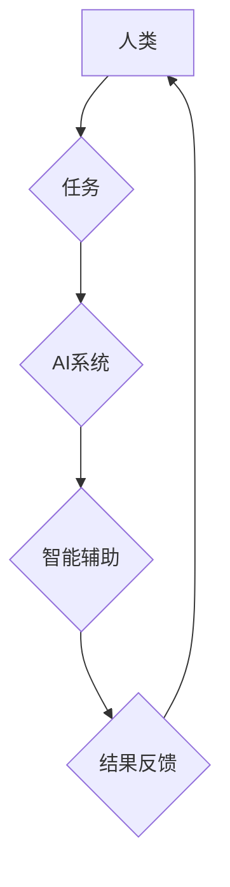

                 

## 增强智能时代：人机协作，提升人类潜能

> 关键词：增强智能、人机协作、人工智能、深度学习、自然语言处理、机器学习、认知增强

### 1. 背景介绍

人类文明的发展历程，始终伴随着技术的进步和应用。从石器时代到信息时代，每一次技术革命都深刻地改变着人类的生活方式和社会结构。如今，我们正站在一个新的历史节点上，人工智能（AI）技术正在以惊人的速度发展，并逐渐渗透到生活的方方面面。

增强智能（AI Augmentation）作为人工智能发展的新方向，旨在通过技术手段提升人类的认知能力、创造力、效率和解决问题的能力。它不再局限于简单的自动化，而是更侧重于与人类的协作和融合，共同创造更美好的未来。

### 2. 核心概念与联系

**2.1 增强智能的本质**

增强智能的核心概念是将人工智能技术与人类智能相结合，形成一个协同增益的系统。它旨在帮助人类克服自身的局限性，拓展认知边界，提升工作效率和生活质量。

**2.2 人机协作模式**

人机协作模式是增强智能实现的关键。它可以分为以下几种类型：

* **监督式协作:** 人类提供指导和反馈，AI系统根据反馈进行学习和改进。
* **自主式协作:** AI系统能够独立完成任务，并根据需要向人类请求帮助。
* **混合式协作:** 人类和AI系统共同完成任务，各自发挥各自的优势。

**2.3 增强智能的应用场景**

增强智能的应用场景非常广泛，包括：

* **医疗保健:** 辅助医生诊断疾病、制定治疗方案、加速药物研发。
* **教育:** 个性化学习辅导、智能答疑、提升教学效率。
* **科学研究:** 加速数据分析、模拟实验、发现新知识。
* **商业运营:** 优化决策、预测市场趋势、提高客户服务水平。

**2.4 Mermaid 流程图**



### 3. 核心算法原理 & 具体操作步骤

**3.1 算法原理概述**

增强智能的核心算法原理主要包括：

* **机器学习:** 训练AI系统从数据中学习，识别模式，并做出预测或决策。
* **深度学习:** 使用多层神经网络模拟人类大脑的学习过程，处理更复杂的数据和任务。
* **自然语言处理:** 理解和生成人类语言，使AI系统能够与人类进行自然流畅的对话。
* **计算机视觉:** 理解和解释图像和视频信息，使AI系统能够“看到”和理解世界。

**3.2 算法步骤详解**

以机器学习为例，其基本步骤包括：

1. **数据收集:** 收集大量相关数据，作为AI系统的训练素材。
2. **数据预处理:** 对数据进行清洗、转换和格式化，使其适合模型训练。
3. **模型选择:** 根据任务需求选择合适的机器学习模型。
4. **模型训练:** 使用训练数据训练模型，调整模型参数，使其能够准确地完成任务。
5. **模型评估:** 使用测试数据评估模型的性能，并进行调整和优化。
6. **模型部署:** 将训练好的模型部署到实际应用场景中。

**3.3 算法优缺点**

**优点:**

* 自动化能力强，可以解放人类的生产力。
* 能够处理海量数据，发现隐藏的模式和规律。
* 能够不断学习和改进，提升性能。

**缺点:**

* 需要大量的数据进行训练，数据质量直接影响模型性能。
* 模型训练过程复杂，需要专业的技术人员进行操作。
* 存在算法偏差和公平性问题，需要谨慎使用。

**3.4 算法应用领域**

机器学习算法广泛应用于各个领域，例如：

* **图像识别:** 人脸识别、物体检测、图像分类。
* **自然语言处理:** 机器翻译、文本摘要、情感分析。
* **推荐系统:** 产品推荐、内容推荐、个性化服务。
* **预测分析:** 销售预测、风险评估、市场趋势分析。

### 4. 数学模型和公式 & 详细讲解 & 举例说明

**4.1 数学模型构建**

增强智能的数学模型通常基于概率论、统计学和优化理论。例如，在机器学习中，常用的模型包括线性回归、逻辑回归、支持向量机等。这些模型都建立在特定的数学公式基础上，用于描述数据之间的关系和预测未来结果。

**4.2 公式推导过程**

以线性回归为例，其目标是找到一条直线，使得预测值与真实值之间的误差最小。

假设我们有n个样本数据，每个样本包含一个输入特征x和一个输出特征y。线性回归模型的数学公式如下：

$$y = wx + b$$

其中，w和b分别是模型的参数，需要通过训练数据进行学习。

为了找到最佳的w和b值，我们需要使用最小二乘法，其目标函数为：

$$J(w,b) = \frac{1}{n} \sum_{i=1}^{n} (y_i - wx_i - b)^2$$

通过对J(w,b)求导并令其等于零，可以得到w和b的更新公式。

**4.3 案例分析与讲解**

假设我们想要预测房价，输入特征为房屋面积，输出特征为房价。我们可以收集大量房屋面积和房价数据，并使用线性回归模型进行训练。

通过训练，模型会学习到房屋面积和房价之间的关系，并得到最佳的w和b值。

然后，我们可以使用训练好的模型预测新房子的房价。

### 5. 项目实践：代码实例和详细解释说明

**5.1 开发环境搭建**

为了实现增强智能应用，我们需要搭建一个合适的开发环境。

常用的开发工具包括：

* Python编程语言
* TensorFlow或PyTorch深度学习框架
* Jupyter Notebook交互式开发环境

**5.2 源代码详细实现**

以下是一个简单的机器学习项目代码示例，用于预测房价：

```python
import pandas as pd
from sklearn.model_selection import train_test_split
from sklearn.linear_model import LinearRegression
from sklearn.metrics import mean_squared_error

# 加载房价数据
data = pd.read_csv('house_price.csv')

# 将数据分为训练集和测试集
X = data[['area']]
y = data['price']
X_train, X_test, y_train, y_test = train_test_split(X, y, test_size=0.2)

# 创建线性回归模型
model = LinearRegression()

# 训练模型
model.fit(X_train, y_train)

# 预测测试集数据
y_pred = model.predict(X_test)

# 计算模型性能
mse = mean_squared_error(y_test, y_pred)
print('Mean Squared Error:', mse)
```

**5.3 代码解读与分析**

这段代码首先加载房价数据，然后将数据分为训练集和测试集。

接着，创建了一个线性回归模型，并使用训练集数据进行训练。

最后，使用训练好的模型预测测试集数据，并计算模型的性能指标。

**5.4 运行结果展示**

运行这段代码后，会输出模型的平均平方误差（MSE）值，该值越小，模型的预测性能越好。

### 6. 实际应用场景

**6.1 医疗保健**

* **辅助诊断:** AI系统可以分析患者的影像数据，例如X光片、CT扫描和MRI扫描，帮助医生更快、更准确地诊断疾病。
* **个性化治疗:** AI系统可以根据患者的基因信息、病史和生活方式等数据，制定个性化的治疗方案。
* **药物研发:** AI系统可以加速药物研发过程，例如预测药物的有效性、安全性以及潜在的副作用。

**6.2 教育**

* **个性化学习:** AI系统可以根据学生的学习进度和能力，提供个性化的学习辅导和练习。
* **智能答疑:** AI系统可以回答学生的疑问，帮助他们理解学习内容。
* **自动批改作业:** AI系统可以自动批改学生的作业，节省教师的时间和精力。

**6.3 科学研究**

* **数据分析:** AI系统可以处理海量数据，发现隐藏的模式和规律，帮助科学家进行更深入的研究。
* **模拟实验:** AI系统可以模拟复杂的实验场景，帮助科学家进行虚拟实验，节省时间和成本。
* **新知识发现:** AI系统可以帮助科学家发现新的知识和理论，推动科学进步。

**6.4 未来应用展望**

随着人工智能技术的不断发展，增强智能将在更多领域得到应用，例如：

* **自动驾驶:** AI系统可以帮助车辆自动驾驶，提高交通安全和效率。
* **机器人技术:** AI系统可以赋予机器人更强的智能和适应能力，使其能够更好地服务人类。
* **虚拟现实和增强现实:** AI系统可以增强虚拟现实和增强现实体验，创造更逼真的虚拟世界。

### 7. 工具和资源推荐

**7.1 学习资源推荐**

* **在线课程:** Coursera、edX、Udacity等平台提供丰富的AI课程。
* **书籍:** 《深度学习》、《人工智能：一种现代方法》等书籍是学习AI的基础教材。
* **开源项目:** TensorFlow、PyTorch等开源项目可以帮助你实践AI技术。

**7.2 开发工具推荐**

* **Python编程语言:** Python是AI开发最常用的编程语言。
* **TensorFlow或PyTorch深度学习框架:** TensorFlow和PyTorch是目前最流行的深度学习框架。
* **Jupyter Notebook交互式开发环境:** Jupyter Notebook可以方便地进行代码编写、运行和调试。

**7.3 相关论文推荐**

* **《ImageNet Classification with Deep Convolutional Neural Networks》:** 这篇论文介绍了AlexNet模型，标志着深度学习在图像识别领域的突破。
* **《Attention Is All You Need》:** 这篇论文介绍了Transformer模型，在自然语言处理领域取得了重大进展。

### 8. 总结：未来发展趋势与挑战

**8.1 研究成果总结**

近年来，增强智能领域取得了显著的进展，例如：

* 深度学习算法取得了突破性进展，在图像识别、自然语言处理等领域取得了优异的性能。
* 人机交互技术不断发展，使AI系统能够更自然地与人类进行交互。
* 增强智能应用场景不断拓展，覆盖医疗保健、教育、科学研究等多个领域。

**8.2 未来发展趋势**

未来，增强智能将朝着以下几个方向发展：

* **更强大的计算能力:** 随着计算能力的提升，AI系统将能够处理更复杂的数据和任务。
* **更智能的人机交互:** 人机交互将更加自然、智能和人性化。
* **更广泛的应用场景:** 增强智能将应用于更多领域，改变人们的生活方式和工作方式。

**8.3 面临的挑战**

增强智能的发展也面临着一些挑战：

* **数据安全和隐私保护:** AI系统需要大量数据进行训练，如何保证数据安全和隐私保护是一个重要问题。
* **算法偏见和公平性:** AI算法可能存在偏见，导致不公平的结果，需要解决算法公平性问题。
* **伦理道德问题:** 增强智能的应用可能会引发一些伦理道德问题，需要进行深入的探讨和研究。

**8.4 研究展望**

未来，我们需要继续加强对增强智能的理论研究和技术开发，并积极应对其带来的挑战，推动增强智能技术健康、可持续地发展，为人类社会创造更多价值。

### 9. 附录：常见问题与解答

**9.1 如何选择合适的增强智能工具？**

选择合适的增强智能工具需要根据具体的需求和应用场景进行选择。

例如，如果需要进行图像识别，可以选择使用TensorFlow或PyTorch等深度学习框架。

如果需要进行自然语言处理，可以选择使用spaCy或NLTK等自然语言处理库。

**9.2 如何保证增强智能系统的安全性和可靠性？**

保证增强智能系统的安全性和可靠性需要从多个方面进行考虑：

* 数据安全：采用加密、脱敏等技术保护数据安全。
* 算法安全：对算法进行安全评估，防止攻击和恶意利用。
* 系统安全：采用安全架构和安全机制，防止系统漏洞和攻击。

**9.3 增强智能会取代人类工作吗？**

增强智能的目标是帮助人类提高效率和解决问题的能力，而不是取代人类工作。

AI系统可以自动化一些重复性、低价值的工作，但人类的创造力、创新能力和情感智能仍然是不可替代的。


作者：禅与计算机程序设计艺术 / Zen and the Art of Computer Programming 
<end_of_turn>

