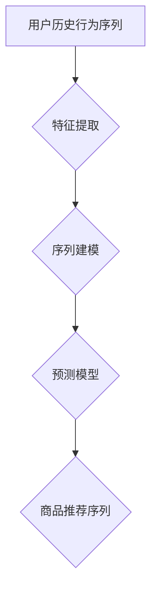

                 

## 大模型在商品推荐序列个性化中的应用

> 关键词：大模型、商品推荐、序列个性化、Transformer、预训练、微调、推荐系统

## 1. 背景介绍

在当今数据爆炸的时代，商品推荐系统已成为电商平台的核心竞争力之一。传统的基于协同过滤、内容过滤和基于规则的推荐方法，虽然取得了一定的效果，但难以满足用户日益增长的个性化需求。随着深度学习技术的快速发展，大模型在推荐系统领域展现出巨大的潜力。

大模型，是指参数规模庞大、训练数据海量的人工智能模型。其强大的学习能力和泛化能力，能够捕捉用户行为和商品特征之间的复杂关系，从而实现更精准、更个性化的商品推荐。

序列个性化推荐是指根据用户的历史行为序列，预测用户对未来商品的偏好，并生成个性化的商品推荐序列。传统的推荐系统往往只关注单个商品的推荐，而序列个性化推荐则考虑了用户行为的上下文信息，能够提供更符合用户需求的推荐结果。

## 2. 核心概念与联系

### 2.1  大模型的优势

大模型在商品推荐序列个性化中的应用，主要得益于以下优势：

* **强大的表示能力:** 大模型能够学习到更丰富的用户和商品特征表示，捕捉用户行为和商品属性之间的复杂关系。
* **泛化能力强:** 大模型在海量数据上进行预训练，能够更好地泛化到新的用户和商品场景。
* **序列建模能力:** 大模型能够有效地处理序列数据，捕捉用户行为序列中的时间依赖性，实现更精准的个性化推荐。

### 2.2  序列个性化推荐的原理

序列个性化推荐的核心思想是，通过学习用户历史行为序列，预测用户对未来商品的偏好。

**流程图:**



**核心概念:**

* **用户历史行为序列:** 包括用户浏览、点击、购买等历史行为数据，形成一个时间序列。
* **特征提取:** 将用户历史行为序列转换为可供模型学习的特征向量。
* **序列建模:** 使用序列建模模型，学习用户行为序列的潜在结构和规律。
* **预测模型:** 基于序列建模结果，预测用户对未来商品的偏好。
* **商品推荐序列:** 根据预测结果，生成个性化的商品推荐序列。

## 3. 核心算法原理 & 具体操作步骤

### 3.1  算法原理概述

Transformer模型是一种强大的序列建模模型，其自注意力机制能够有效地捕捉序列数据中的长距离依赖关系。在商品推荐序列个性化中，Transformer模型可以学习用户历史行为序列中的潜在结构和规律，从而实现更精准的个性化推荐。

### 3.2  算法步骤详解

1. **数据预处理:** 将用户历史行为序列数据清洗、格式化，并转换为可供模型学习的特征向量。
2. **模型构建:** 使用Transformer模型架构，构建商品推荐序列个性化模型。
3. **模型训练:** 使用训练数据对模型进行训练，优化模型参数，使其能够准确预测用户对未来商品的偏好。
4. **模型评估:** 使用测试数据对模型进行评估，衡量模型的推荐效果。
5. **模型部署:** 将训练好的模型部署到线上环境，实现商品推荐序列个性化的实时推荐。

### 3.3  算法优缺点

**优点:**

* 能够有效捕捉序列数据中的长距离依赖关系。
* 泛化能力强，能够应用于不同的商品推荐场景。
* 推荐效果优于传统的推荐方法。

**缺点:**

* 模型参数规模庞大，训练成本高。
* 需要大量的训练数据才能达到最佳效果。

### 3.4  算法应用领域

Transformer模型在商品推荐序列个性化领域具有广泛的应用场景，例如：

* **电商平台商品推荐:** 根据用户的浏览、购买历史，推荐个性化的商品序列。
* **内容平台推荐:** 根据用户的阅读、观看历史，推荐个性化的内容序列。
* **音乐平台推荐:** 根据用户的播放、收藏历史，推荐个性化的音乐序列。

## 4. 数学模型和公式 & 详细讲解 & 举例说明

### 4.1  数学模型构建

Transformer模型的核心是自注意力机制，其数学模型可以表示为：

$$
Attention(Q, K, V) = \frac{exp(Q \cdot K^T / \sqrt{d_k})}{exp(Q \cdot K^T / \sqrt{d_k})} \cdot V
$$

其中：

* $Q$：查询矩阵
* $K$：键矩阵
* $V$：值矩阵
* $d_k$：键向量的维度

### 4.2  公式推导过程

自注意力机制通过计算查询向量与键向量的点积，来衡量两个词语之间的相关性。然后通过softmax函数将相关性值归一化，得到每个词语对查询向量的加权平均值，即注意力权重。最后，将注意力权重与值矩阵相乘，得到最终的注意力输出。

### 4.3  案例分析与讲解

假设我们有一个句子：“我爱吃苹果”。

* $Q$：查询向量表示“我”
* $K$：键向量表示每个词语的语义信息
* $V$：值向量表示每个词语的语义信息

通过计算自注意力机制，我们可以得到“我”与每个词语之间的注意力权重，例如，“我”与“爱”的注意力权重最高，因为它们在语义上密切相关。

## 5. 项目实践：代码实例和详细解释说明

### 5.1  开发环境搭建

* Python 3.6+
* TensorFlow/PyTorch
* CUDA/cuDNN

### 5.2  源代码详细实现

```python
import tensorflow as tf

# 定义Transformer模型
class Transformer(tf.keras.Model):
    def __init__(self, vocab_size, embedding_dim, num_heads, num_layers):
        super(Transformer, self).__init__()
        self.embedding = tf.keras.layers.Embedding(vocab_size, embedding_dim)
        self.transformer_layers = tf.keras.layers.StackedRNNCells([
            tf.keras.layers.MultiHeadAttention(num_heads=num_heads, key_dim=embedding_dim)
            for _ in range(num_layers)
        ])

    def call(self, inputs):
        embeddings = self.embedding(inputs)
        outputs = self.transformer_layers(embeddings)
        return outputs

# 实例化模型
model = Transformer(vocab_size=10000, embedding_dim=128, num_heads=8, num_layers=6)

# 训练模型
model.compile(optimizer='adam', loss='mse')
model.fit(train_data, train_labels, epochs=10)

# 预测结果
predictions = model.predict(test_data)
```

### 5.3  代码解读与分析

* **模型定义:** 定义了一个Transformer模型，包含嵌入层、多头注意力层和堆叠的RNN单元。
* **模型实例化:** 实例化一个Transformer模型，设置模型参数。
* **模型训练:** 使用训练数据训练模型，优化模型参数。
* **模型预测:** 使用测试数据预测模型输出。

### 5.4  运行结果展示

运行结果展示模型的预测效果，例如，预测用户对未来商品的点击率、购买概率等。

## 6. 实际应用场景

### 6.1  电商平台商品推荐

* **个性化商品推荐:** 根据用户的浏览、购买历史，推荐个性化的商品序列。
* **新品推荐:** 推荐新上架的商品，提高用户发现新商品的概率。
* **关联推荐:** 根据用户购买的商品，推荐相关的商品。

### 6.2  内容平台推荐

* **个性化内容推荐:** 根据用户的阅读、观看历史，推荐个性化的内容序列。
* **热点内容推荐:** 推荐当前热门的内容，提高用户参与度。
* **内容分类推荐:** 根据用户的兴趣偏好，推荐相关的分类内容。

### 6.3  音乐平台推荐

* **个性化音乐推荐:** 根据用户的播放、收藏历史，推荐个性化的音乐序列。
* **新歌推荐:** 推荐新上架的歌曲，提高用户发现新音乐的概率。
* **音乐风格推荐:** 根据用户的音乐偏好，推荐相关的音乐风格。

### 6.4  未来应用展望

大模型在商品推荐序列个性化领域的应用前景广阔，未来可能发展方向包括：

* **多模态推荐:** 将文本、图像、音频等多模态数据融合，实现更全面的用户画像和商品理解。
* **实时个性化推荐:** 利用实时数据流，实现更精准、更动态的个性化推荐。
* **可解释性推荐:** 提高推荐模型的可解释性，帮助用户理解推荐结果背后的逻辑。

## 7. 工具和资源推荐

### 7.1  学习资源推荐

* **书籍:**
    * 《深度学习》
    * 《自然语言处理》
    * 《Transformer模型详解》
* **在线课程:**
    * Coursera: 深度学习
    * Udacity: 自然语言处理
    * fast.ai: 深度学习

### 7.2  开发工具推荐

* **TensorFlow:** 开源深度学习框架
* **PyTorch:** 开源深度学习框架
* **HuggingFace:** 提供预训练模型和工具

### 7.3  相关论文推荐

* 《Attention Is All You Need》
* 《BERT: Pre-training of Deep Bidirectional Transformers for Language Understanding》
* 《GPT-3: Language Models are Few-Shot Learners》

## 8. 总结：未来发展趋势与挑战

### 8.1  研究成果总结

大模型在商品推荐序列个性化领域取得了显著的成果，能够实现更精准、更个性化的推荐，提升用户体验。

### 8.2  未来发展趋势

未来，大模型在商品推荐序列个性化领域将朝着以下方向发展:

* **模型规模更大:** 参数规模更大的模型能够学习到更丰富的用户和商品特征，提升推荐效果。
* **多模态融合:** 将文本、图像、音频等多模态数据融合，实现更全面的用户画像和商品理解。
* **实时个性化推荐:** 利用实时数据流，实现更精准、更动态的个性化推荐。
* **可解释性增强:** 提高推荐模型的可解释性，帮助用户理解推荐结果背后的逻辑。

### 8.3  面临的挑战

大模型在商品推荐序列个性化领域也面临一些挑战:

* **训练成本高:** 大模型参数规模庞大，训练成本高昂。
* **数据隐私问题:** 大模型需要大量用户数据进行训练，如何保护用户数据隐私是一个重要问题。
* **模型可解释性:** 大模型的决策过程复杂，难以解释推荐结果背后的逻辑，这可能会导致用户对推荐结果的信任度降低。

### 8.4  研究展望

未来，需要进一步研究大模型在商品推荐序列个性化领域的应用，解决模型训练成本高、数据隐私问题和模型可解释性等挑战，推动大模型在推荐系统领域的落地应用。

## 9. 附录：常见问题与解答

* **Q: 大模型的训练需要多少数据？**

A: 大模型的训练需要海量数据，通常需要百万甚至数十亿条数据才能达到最佳效果。

* **Q: 如何评估大模型的推荐效果？**

A: 大模型的推荐效果可以通过点击率、转化率、用户满意度等指标进行评估。

* **Q: 如何解决大模型的训练成本问题？**

A: 可以采用模型压缩、知识蒸馏等技术，降低模型参数规模，从而降低训练成本。


作者：禅与计算机程序设计艺术 / Zen and the Art of Computer Programming 
<end_of_turn>

