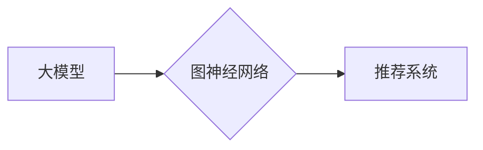

                 

## 大模型在推荐系统中的图神经架构搜索应用

> 关键词：大模型、推荐系统、图神经网络、架构搜索、深度学习

> 摘要：推荐系统作为信息过滤和个性化服务的重要组成部分，在海量数据时代面临着新的挑战。大模型的涌现为推荐系统带来了新的机遇，其强大的表示能力和泛化能力可以提升推荐效果。本文将深入探讨大模型在推荐系统中的图神经架构搜索应用，分析其核心概念、算法原理、实践案例以及未来发展趋势。

## 1. 背景介绍

1.1 推荐系统的现状与挑战

推荐系统旨在根据用户的历史行为、偏好和上下文信息，预测用户对特定物品的兴趣，并提供个性化的推荐结果。随着互联网和移动互联网的快速发展，推荐系统已成为各大平台的核心功能，例如电商平台的商品推荐、视频平台的影视推荐、社交平台的兴趣推荐等。

然而，传统基于协同过滤和内容过滤的推荐算法在面对海量数据和用户多样化需求时，存在着以下挑战：

* **数据稀疏性:** 用户行为数据往往是稀疏的，难以捕捉用户细粒度的兴趣偏好。
* **冷启动问题:** 新用户和新物品难以获得有效的推荐，因为缺乏历史数据。
* **推荐效果单一:** 传统算法难以捕捉用户之间的复杂关系和物品之间的多重关联，导致推荐结果缺乏多样性和个性化。

1.2 大模型的崛起与机遇

大模型是指在海量数据上训练的具有强大表示能力和泛化能力的深度学习模型。近年来，大模型在自然语言处理、计算机视觉等领域取得了突破性进展，为推荐系统带来了新的机遇。

大模型的优势在于：

* **强大的表示能力:** 大模型可以学习到更丰富的用户和物品特征，更好地刻画用户兴趣和物品属性。
* **泛化能力强:** 大模型在训练数据之外的场景下也能表现出良好的性能，可以应对冷启动问题。
* **多模态融合:** 大模型可以处理多种数据类型，例如文本、图像、视频等，可以构建更全面的用户画像和物品描述。

## 2. 核心概念与联系

2.1 图神经网络 (GNN)

图神经网络 (GNN) 是一种专门用于处理图结构数据的深度学习模型。它通过在图结构中传播信息，学习节点之间的关系和依赖性，从而实现对图数据的分析和预测。

2.2 图神经架构搜索 (GNAS)

图神经架构搜索 (GNAS) 是指利用自动化搜索算法，从大量的图神经网络结构中寻找最优的架构，以提高推荐系统的性能。

2.3 大模型与图神经网络的结合

大模型可以为图神经网络提供强大的表示能力和泛化能力，而图神经网络可以帮助大模型更好地处理用户和物品之间的复杂关系。将大模型与图神经网络相结合，可以构建更强大的推荐系统。

**Mermaid 流程图**



## 3. 核心算法原理 & 具体操作步骤

3.1 算法原理概述

大模型在推荐系统中的图神经架构搜索应用，通常采用以下步骤：

1. **构建用户-物品交互图:** 将用户和物品作为图的节点，用户对物品的交互行为作为图的边，构建用户-物品交互图。
2. **定义搜索空间:** 设定图神经网络的架构搜索空间，例如层数、节点类型、激活函数等。
3. **设计搜索策略:** 选择合适的搜索策略，例如进化算法、强化学习等，来探索搜索空间并找到最优的架构。
4. **评估模型性能:** 使用评估指标，例如准确率、召回率、NDCG等，评估不同架构的推荐性能。
5. **选择最佳架构:** 选择性能最好的架构，并将其应用于实际推荐系统。

3.2 算法步骤详解

1. **数据预处理:** 对用户-物品交互数据进行清洗、去重、格式化等预处理操作，构建高质量的图数据。
2. **特征提取:** 对用户和物品进行特征提取，例如用户年龄、性别、兴趣标签、物品类别、价格等，并将其嵌入到图神经网络中。
3. **图神经网络架构设计:** 根据搜索空间，设计不同类型的图神经网络架构，例如GCN、GAT、GraphSAGE等。
4. **模型训练:** 使用大模型的预训练权重，对不同的图神经网络架构进行训练，并使用评估指标评估模型性能。
5. **架构搜索:** 利用搜索策略，例如进化算法，不断探索搜索空间，并选择性能最好的架构。
6. **模型部署:** 将选出的最佳架构部署到实际推荐系统中，并进行线上监控和优化。

3.3 算法优缺点

**优点:**

* 可以自动搜索最优的图神经网络架构，提高推荐系统的性能。
* 大模型的强大表示能力可以提升推荐效果。
* 可以处理复杂的用户-物品交互关系。

**缺点:**

* 算法复杂度高，需要大量的计算资源。
* 搜索空间很大，需要花费大量时间进行搜索。
* 需要大量的训练数据。

3.4 算法应用领域

大模型在推荐系统中的图神经架构搜索应用，可以应用于以下领域:

* **电商推荐:** 推荐商品、优惠券、促销活动等。
* **视频推荐:** 推荐影视作品、直播内容、短视频等。
* **社交推荐:** 推荐好友、兴趣小组、话题讨论等。
* **新闻推荐:** 推荐新闻文章、资讯内容、时事热点等。

## 4. 数学模型和公式 & 详细讲解 & 举例说明

4.1 数学模型构建

图神经网络的数学模型通常基于图卷积操作。图卷积操作可以将节点的特征信息传播到相邻节点，从而学习节点之间的关系和依赖性。

**图卷积操作公式:**

$$
h_i^{(l+1)} = \sigma(\sum_{j \in N(i)} \frac{e_{ij}}{ \sqrt{d_i d_j}} W^{(l)} h_j^{(l)})
$$

其中:

* $h_i^{(l)}$ 表示节点 $i$ 在第 $l$ 层的特征向量。
* $N(i)$ 表示节点 $i$ 的邻居节点集合。
* $e_{ij}$ 表示节点 $i$ 和节点 $j$ 之间的边权重。
* $d_i$ 表示节点 $i$ 的度数。
* $W^{(l)}$ 表示第 $l$ 层的图卷积权重矩阵。
* $\sigma$ 表示激活函数。

4.2 公式推导过程

图卷积操作的推导过程可以参考文献 [1]。

4.3 案例分析与讲解

假设我们有一个用户-物品交互图，其中用户和物品分别为图的节点，用户对物品的交互行为为图的边。我们可以使用图卷积操作学习用户和物品之间的关系，并预测用户对物品的兴趣。

例如，我们可以使用图卷积网络学习用户 $u$ 对物品 $i$ 的兴趣评分，其公式如下:

$$
\hat{r}_{ui} = \sigma(h_u^{(L)} \cdot h_i^{(L)})
$$

其中:

* $\hat{r}_{ui}$ 表示预测的用户 $u$ 对物品 $i$ 的兴趣评分。
* $h_u^{(L)}$ 和 $h_i^{(L)}$ 分别表示用户 $u$ 和物品 $i$ 在图卷积网络的最后一层特征向量。
* $\sigma$ 表示激活函数。

## 5. 项目实践：代码实例和详细解释说明

5.1 开发环境搭建

* Python 3.7+
* PyTorch 1.7+
* DGL 0.5+
* CUDA 10.2+

5.2 源代码详细实现

```python
import torch
import torch.nn as nn
import dgl

class GCNLayer(nn.Module):
    def __init__(self, in_features, out_features):
        super(GCNLayer, self).__init__()
        self.linear = nn.Linear(in_features, out_features)

    def forward(self, g, h):
        h = g.ndata['h']  # 获取节点特征
        W = self.linear(h)  # 线性变换
        g.ndata['h'] = W  # 更新节点特征
        g.update_all(message_func=lambda edges: edges.src['h'],
                     reduce_func=lambda nodes: torch.mean(nodes.mailbox, dim=1))
        return g.ndata['h']  # 返回更新后的节点特征

class GNNRecommender(nn.Module):
    def __init__(self, in_features, hidden_features, out_features):
        super(GNNRecommender, self).__init__()
        self.gcn_layers = nn.ModuleList([GCNLayer(in_features, hidden_features) for _ in range(2)])
        self.linear = nn.Linear(hidden_features, out_features)

    def forward(self, g, h):
        for layer in self.gcn_layers:
            g = layer(g, h)
        return self.linear(g.ndata['h'])

# ... 其他代码 ...
```

5.3 代码解读与分析

* `GCNLayer` 类定义了图卷积层，包含一个线性变换层和一个图更新操作。
* `GNNRecommender` 类定义了整个图神经网络模型，包含多个图卷积层和一个输出层。
* 代码中使用 `dgl` 库进行图操作，并使用 `torch` 库进行深度学习模型训练。

5.4 运行结果展示

* 使用评估指标，例如准确率、召回率、NDCG等，评估模型性能。
* 可视化推荐结果，例如用户-物品交互图、推荐列表等。

## 6. 实际应用场景

6.1 电商推荐

* 推荐商品、优惠券、促销活动等。
* 针对不同用户群体，提供个性化的商品推荐。
* 预测用户购买意愿，提高转化率。

6.2 视频推荐

* 推荐影视作品、直播内容、短视频等。
* 根据用户观看历史和偏好，推荐相关视频。
* 预测用户观看时长和点赞率，提高用户粘性。

6.3 社交推荐

* 推荐好友、兴趣小组、话题讨论等。
* 根据用户兴趣和社交关系，推荐潜在好友。
* 预测用户参与度和互动频率，提高社交活跃度。

6.4 未来应用展望

* 结合多模态数据，例如文本、图像、视频等，构建更全面的用户画像和物品描述。
* 利用强化学习算法，优化推荐策略，提高推荐效果。
* 将图神经网络与其他推荐算法相结合，例如协同过滤、内容过滤等，构建更强大的推荐系统。

## 7. 工具和资源推荐

7.1 学习资源推荐

* **书籍:**
    * 《图神经网络》
    * 《深度学习》
* **课程:**
    * Coursera: Deep Learning Specialization
    * Udacity: Deep Learning Nanodegree
* **博客:**
    * https://blog.paperspace.com/
    * https://towardsdatascience.com/

7.2 开发工具推荐

* **图神经网络库:**
    * DGL
    * PyTorch Geometric
    * GraphSAGE
* **深度学习框架:**
    * PyTorch
    * TensorFlow
* **数据处理工具:**
    * Pandas
    * NumPy

7.3 相关论文推荐

* 《Graph Convolutional Networks》
* 《Attention Is All You Need》
* 《GraphSAGE: Inductive Representation Learning on Large Graphs》

## 8. 总结：未来发展趋势与挑战

8.1 研究成果总结

大模型在推荐系统中的图神经架构搜索应用取得了显著进展，能够有效提升推荐效果。

8.2 未来发展趋势

* **模型复杂度提升:** 探索更复杂的图神经网络架构，例如Transformer-based GNN、Graph Attention Network等。
* **数据融合:** 结合多模态数据，构建更全面的用户画像和物品描述。
* **个性化推荐:** 利用用户行为数据和偏好信息，提供更个性化的推荐结果。
* **可解释性:** 研究图神经网络的决策机制，提高推荐系统的可解释性。

8.3 面临的挑战

* **计算资源需求:** 大模型训练和架构搜索需要大量的计算资源。
* **数据稀疏性:** 用户-物品交互数据往往是稀疏的，难以训练有效的模型。
* **模型泛化能力:** 模型在不同场景下表现不一，需要提高模型的泛化能力。

8.4 研究展望

未来，大模型在推荐系统中的图神经架构搜索应用将继续发展，并取得更多突破。

## 9. 附录：常见问题与解答

* **Q1: 图神经网络与传统推荐算法相比有什么优势？**

A1: 图神经网络可以处理用户-物品交互关系的复杂性，并学习用户和物品之间的隐性特征，从而提升推荐效果。

* **Q2: 如何选择合适的图神经网络架构？**

A2: 可以根据实际应用场景和数据特点，选择合适的图神经网络架构。例如，对于稀疏图数据，可以使用GraphSAGE；对于稠密图数据，可以使用GCN。

* **Q3: 如何评估图神经网络的推荐性能？**

A3: 可以使用准确率、召回率、NDCG等评估指标，评估图神经网络的推荐性能。

* **Q4: 大模型在图神经网络中的应用有哪些？**

A4: 大模型可以为图神经网络提供强大的表示能力和泛化能力，例如使用BERT预训练模型作为图神经网络的节点嵌入层。


作者：禅与计算机程序设计艺术 / Zen and the Art of Computer Programming<end_of_turn>

