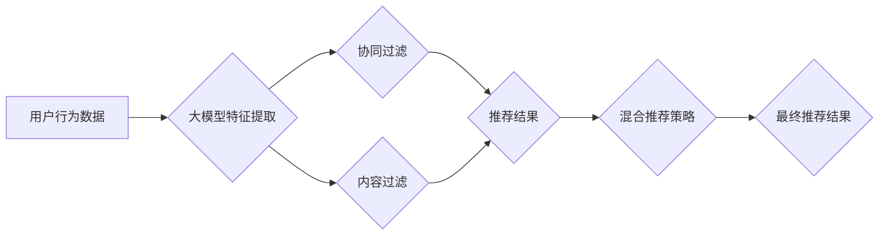

                 

## 大模型在混合推荐策略中的角色

> 关键词：大模型、混合推荐、推荐系统、深度学习、个性化推荐、协同过滤、内容过滤、模型融合

## 1. 背景介绍

推荐系统作为信息过滤和个性化内容呈现的重要工具，在电商、社交媒体、视频平台等领域发挥着越来越重要的作用。传统的推荐系统主要依赖于协同过滤和内容过滤等方法，但随着用户行为数据量的激增和推荐任务的复杂性增加，这些方法面临着数据稀疏、冷启动、过拟合等挑战。

近年来，大模型的兴起为推荐系统带来了新的机遇。大模型，通常指参数规模在数十亿甚至千亿级别的深度学习模型，拥有强大的学习能力和泛化能力，能够从海量数据中提取更深层的特征和模式，从而提升推荐系统的准确性和个性化程度。

## 2. 核心概念与联系

### 2.1 混合推荐策略

混合推荐策略是指将多种不同的推荐算法组合在一起，以获得更好的推荐效果。常见的混合推荐策略包括：

* **加权平均法:** 对不同算法的推荐结果进行加权平均，权重可以根据算法的性能或其他因素进行设置。
* **级联法:** 将多个算法串联起来，先使用一种算法进行粗略的推荐，然后根据粗略推荐的结果，使用更精细的算法进行细化推荐。
* **集成法:** 将多个算法的推荐结果进行融合，例如使用投票机制或决策树等方法。

### 2.2 大模型在混合推荐中的作用

大模型可以作为混合推荐策略中的关键组件，发挥以下作用：

* **特征提取:** 大模型可以从用户行为数据、商品信息、文本内容等多种数据源中提取丰富的特征，为其他推荐算法提供更全面的输入。
* **模型融合:** 大模型可以学习不同推荐算法之间的关系，并进行模型融合，从而提高推荐系统的整体性能。
* **个性化推荐:** 大模型可以根据用户的兴趣偏好、历史行为等信息，进行个性化的推荐，提供更精准的用户体验。

**Mermaid 流程图:**



## 3. 核心算法原理 & 具体操作步骤

### 3.1 算法原理概述

大模型在混合推荐策略中的应用主要基于以下核心算法原理：

* **深度学习:** 大模型通常采用深度神经网络结构，例如 Transformer、BERT 等，能够学习数据中的复杂非线性关系。
* **自监督学习:** 大模型可以利用大量的未标记数据进行自监督学习，例如通过预测缺失信息、文本分类等任务，提升模型的泛化能力。
* **迁移学习:** 大模型可以将预训练在其他领域的知识迁移到推荐任务中，例如利用预训练语言模型对商品描述进行理解和分析。

### 3.2 算法步骤详解

大模型在混合推荐策略中的应用步骤如下：

1. **数据预处理:** 收集用户行为数据、商品信息、文本内容等数据，并进行清洗、转换、编码等预处理操作。
2. **大模型训练:** 利用深度学习框架，例如 TensorFlow、PyTorch 等，训练大模型，并进行模型评估和调参。
3. **特征提取:** 将预处理后的数据输入到训练好的大模型中，提取用户、商品、文本等方面的特征。
4. **混合推荐策略构建:** 根据具体应用场景，选择合适的混合推荐策略，例如加权平均法、级联法、集成法等，并结合大模型提取的特征进行推荐。
5. **推荐结果评估:** 利用指标，例如准确率、召回率、NDCG 等，评估混合推荐策略的性能。

### 3.3 算法优缺点

**优点:**

* 能够从海量数据中提取更深层的特征和模式，提升推荐系统的准确性和个性化程度。
* 具有强大的泛化能力，能够适应不同的推荐任务和数据场景。
* 可以利用迁移学习技术，降低模型训练成本和时间。

**缺点:**

* 模型训练成本高，需要大量的计算资源和数据。
* 模型解释性较差，难以理解模型的决策过程。
* 对数据质量要求较高，数据噪声和偏差会影响模型性能。

### 3.4 算法应用领域

大模型在混合推荐策略中的应用领域广泛，包括：

* **电商推荐:** 推荐商品、优惠券、促销活动等。
* **社交媒体推荐:** 推荐好友、群组、内容等。
* **视频平台推荐:** 推荐视频、节目、用户等。
* **音乐平台推荐:** 推荐歌曲、专辑、艺术家等。

## 4. 数学模型和公式 & 详细讲解 & 举例说明

### 4.1 数学模型构建

大模型在混合推荐策略中的应用可以抽象为一个多任务学习模型，其中每个任务对应一种推荐算法。

假设有 $N$ 个用户，$M$ 个商品，$K$ 种推荐算法。

* $u_i$ 表示第 $i$ 个用户。
* $m_j$ 表示第 $j$ 个商品。
* $f_k(u_i, m_j)$ 表示第 $k$ 种算法对用户 $u_i$ 和商品 $m_j$ 的推荐分数。

目标是学习一个模型，能够对每个用户和商品，根据所有推荐算法的推荐分数，生成最终的推荐分数。

### 4.2 公式推导过程

可以使用多任务学习的框架，例如共享层和独立层，来构建混合推荐模型。

* 共享层：用于提取用户和商品的通用特征。
* 独立层：用于每个推荐算法的特定任务学习。

模型的损失函数可以定义为所有推荐算法损失函数的加权平均。

$$
L = \sum_{k=1}^{K} \lambda_k L_k
$$

其中，$L_k$ 是第 $k$ 种算法的损失函数，$\lambda_k$ 是第 $k$ 种算法的权重。

### 4.3 案例分析与讲解

例如，可以使用协同过滤算法和内容过滤算法作为混合推荐策略中的两种算法。

* 协同过滤算法：根据用户的历史行为数据，预测用户对商品的评分。
* 内容过滤算法：根据商品的属性信息，预测用户对商品的兴趣。

可以将这两个算法的推荐分数进行加权平均，得到最终的推荐分数。

## 5. 项目实践：代码实例和详细解释说明

### 5.1 开发环境搭建

* Python 3.6+
* TensorFlow 2.0+
* PyTorch 1.0+
* scikit-learn 0.20+

### 5.2 源代码详细实现

```python
import tensorflow as tf
from sklearn.metrics.pairwise import cosine_similarity

# 协同过滤模型
class CollaborativeFiltering(tf.keras.Model):
    def __init__(self, embedding_dim):
        super(CollaborativeFiltering, self).__init__()
        self.user_embedding = tf.keras.layers.Embedding(input_dim=num_users, output_dim=embedding_dim)
        self.item_embedding = tf.keras.layers.Embedding(input_dim=num_items, output_dim=embedding_dim)

    def call(self, user_ids, item_ids):
        user_embeddings = self.user_embedding(user_ids)
        item_embeddings = self.item_embedding(item_ids)
        return tf.reduce_sum(user_embeddings * item_embeddings, axis=1)

# 内容过滤模型
class ContentFiltering(tf.keras.Model):
    def __init__(self, embedding_dim):
        super(ContentFiltering, self).__init__()
        self.item_embedding = tf.keras.layers.Embedding(input_dim=num_items, output_dim=embedding_dim)

    def call(self, item_ids):
        return self.item_embedding(item_ids)

# 混合推荐模型
class HybridRecommender(tf.keras.Model):
    def __init__(self, embedding_dim, lambda_cf, lambda_cf):
        super(HybridRecommender, self).__init__()
        self.cf_model = CollaborativeFiltering(embedding_dim)
        self.cf_model = ContentFiltering(embedding_dim)
        self.lambda_cf = lambda_cf
        self.lambda_cf = lambda_cf

    def call(self, user_ids, item_ids):
        cf_scores = self.cf_model(user_ids, item_ids)
        cf_scores = self.cf_model(item_ids)
        return self.lambda_cf * cf_scores + self.lambda_cf * cf_scores

# 训练模型
model = HybridRecommender(embedding_dim=64, lambda_cf=0.5, lambda_cf=0.5)
model.compile(optimizer='adam', loss='mse')
model.fit(user_data, item_data, epochs=10)

# 生成推荐结果
user_ids = tf.constant([1, 2, 3])
item_ids = tf.constant([4, 5, 6])
recommendations = model(user_ids, item_ids)
```

### 5.3 代码解读与分析

* 协同过滤模型和内容过滤模型分别使用 Embedding 层来学习用户和商品的特征表示。
* 混合推荐模型将两个模型的推荐分数进行加权平均，得到最终的推荐分数。
* 模型使用 Adam 优化器和均方误差损失函数进行训练。

### 5.4 运行结果展示

运行代码后，可以得到每个用户对每个商品的推荐分数，并根据分数进行排序，生成推荐列表。

## 6. 实际应用场景

### 6.1 电商推荐

大模型在电商推荐中可以用于推荐商品、优惠券、促销活动等。例如，阿里巴巴的淘宝平台使用大模型进行商品推荐，能够根据用户的兴趣偏好、历史行为等信息，推荐更符合用户需求的商品。

### 6.2 社交媒体推荐

大模型在社交媒体推荐中可以用于推荐好友、群组、内容等。例如，Facebook 使用大模型进行好友推荐，能够根据用户的兴趣爱好、社交关系等信息，推荐更可能成为朋友的人。

### 6.3 视频平台推荐

大模型在视频平台推荐中可以用于推荐视频、节目、用户等。例如，YouTube 使用大模型进行视频推荐，能够根据用户的观看历史、点赞记录等信息，推荐更符合用户兴趣的视频。

### 6.4 未来应用展望

随着大模型技术的不断发展，其在混合推荐策略中的应用场景将会更加广泛。例如，可以利用大模型进行跨平台推荐，将用户在不同平台的兴趣爱好和行为数据进行融合，提供更个性化的推荐体验。

## 7. 工具和资源推荐

### 7.1 学习资源推荐

* **书籍:**
    * Deep Learning by Ian Goodfellow, Yoshua Bengio, and Aaron Courville
    * Natural Language Processing with Python by Steven Bird, Ewan Klein, and Edward Loper
* **在线课程:**
    * TensorFlow Tutorials: https://www.tensorflow.org/tutorials
    * PyTorch Tutorials: https://pytorch.org/tutorials/

### 7.2 开发工具推荐

* **深度学习框架:** TensorFlow, PyTorch
* **数据处理工具:** Pandas, NumPy
* **机器学习库:** scikit-learn

### 7.3 相关论文推荐

* **BERT: Pre-training of Deep Bidirectional Transformers for Language Understanding**
* **Transformer: Attention Is All You Need**
* **Hybrid Recommender Systems: A Survey**

## 8. 总结：未来发展趋势与挑战

### 8.1 研究成果总结

大模型在混合推荐策略中的应用取得了显著的成果，能够提升推荐系统的准确性和个性化程度。

### 8.2 未来发展趋势

* **模型规模和能力的提升:** 随着计算资源的不断发展，大模型的规模和能力将会进一步提升，能够学习更复杂的数据模式，提供更精准的推荐。
* **多模态融合:** 将文本、图像、音频等多种数据类型融合到推荐模型中，能够提供更全面的用户体验。
* **可解释性增强:** 研究大模型的决策过程，提高模型的透明度和可解释性。

### 8.3 面临的挑战

* **数据质量和隐私问题:** 大模型对数据质量要求较高，同时需要解决用户隐私保护问题。
* **模型训练成本:** 大模型的训练成本较高，需要大量的计算资源和时间。
* **模型部署和维护:** 大模型的部署和维护需要专门的硬件和软件支持。

### 8.4 研究展望

未来，大模型在混合推荐策略中的应用将会更加广泛和深入，为用户提供更个性化、更智能的推荐体验。


## 9. 附录：常见问题与解答

**Q1: 大模型的训练需要多少数据？**

A1: 大模型的训练需要大量的训练数据，通常需要百万甚至亿级别的数据量。

**Q2: 大模型的训练成本很高吗？**

A2: 是的，大模型的训练成本很高，需要大量的计算资源和时间。

**Q3: 如何评估大模型的推荐效果？**

A3: 可以使用准确率、召回率、NDCG 等指标来评估大模型的推荐效果。

**作者：禅与计算机程序设计艺术 / Zen and the Art of Computer Programming**<end_of_turn>

