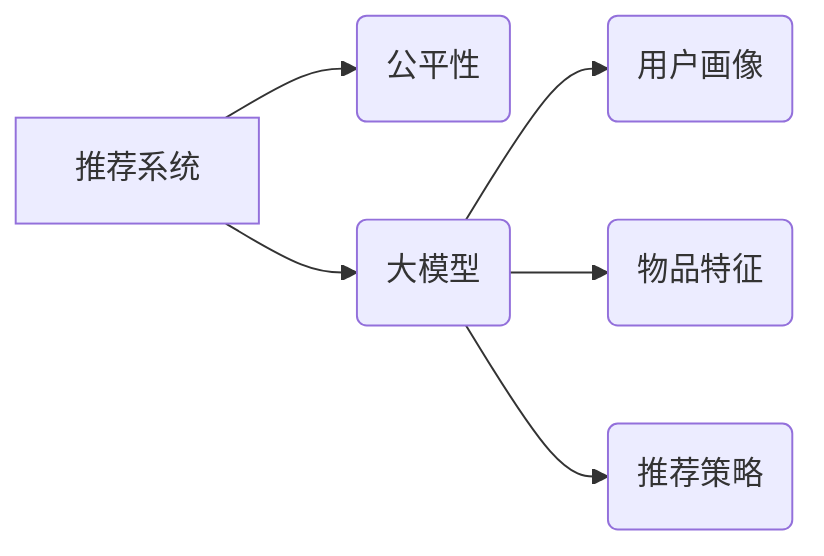

                 

## 大模型对推荐系统公平性的影响研究

> 关键词：大模型、推荐系统、公平性、偏见、算法解释、可解释性、伦理

## 1. 背景介绍

推荐系统作为信息过滤和个性化内容呈现的重要工具，已广泛应用于电商、社交媒体、新闻资讯等领域。其核心目标是根据用户的历史行为、偏好和上下文信息，预测用户对特定物品的兴趣，并推荐最相关的物品。近年来，大模型技术在自然语言处理、计算机视觉等领域取得了突破性进展，也逐渐应用于推荐系统，带来了更高的准确性和个性化程度。然而，大模型的应用也引发了关于推荐系统公平性的担忧。

大模型通常基于海量数据进行训练，而这些数据往往反映了社会中的各种偏见和歧视。如果大模型直接应用于推荐系统，很可能将这些偏见放大，导致推荐结果不公平，甚至加剧社会不平等。例如，一个基于用户性别进行训练的大模型，可能会推荐男性用户更多男性相关的商品，而推荐女性用户更多女性相关的商品，从而强化性别刻板印象。

## 2. 核心概念与联系

### 2.1 推荐系统与公平性

推荐系统公平性是指推荐结果对所有用户都是公平、公正的，不因用户性别、种族、年龄、地域等敏感属性而产生不公平的差别。公平性是一个多维概念，包括：

* **预测公平性:**  推荐模型对不同用户群体的预测结果应该具有相同的准确性和可靠性。
* **分配公平性:**  推荐系统应该为所有用户提供平等的机会，避免某些用户群体被过度推荐或被忽视。
* **过程公平性:**  推荐系统的训练数据和算法设计应该避免引入或放大社会偏见。

### 2.2 大模型与推荐系统

大模型是指参数量巨大、训练数据海量的人工智能模型。大模型通常具有强大的泛化能力和学习能力，能够从海量数据中提取复杂的模式和关系。大模型在推荐系统中可以应用于以下方面：

* **用户画像构建:**  利用大模型对用户的行为数据、文本数据等进行分析，构建更精准的用户画像。
* **物品特征提取:**  利用大模型对物品的描述信息、用户评论等进行分析，提取更丰富的物品特征。
* **推荐策略优化:**  利用大模型对推荐策略进行优化，提高推荐的准确性和个性化程度。

### 2.3 核心概念关系图



## 3. 核心算法原理 & 具体操作步骤

### 3.1 算法原理概述

大模型在推荐系统中的应用主要基于深度学习算法，例如Transformer、BERT等。这些算法能够学习用户和物品之间的复杂关系，并生成更精准的推荐结果。

### 3.2 算法步骤详解

1. **数据预处理:** 收集用户行为数据、物品信息数据等，并进行清洗、转换、编码等预处理操作。
2. **模型训练:** 利用深度学习算法对预处理后的数据进行训练，学习用户和物品之间的关系。
3. **模型评估:** 使用测试数据对训练好的模型进行评估，并根据评估结果进行模型调优。
4. **推荐生成:** 将训练好的模型应用于新的用户数据，预测用户对特定物品的兴趣，并生成推荐结果。

### 3.3 算法优缺点

**优点:**

* **高准确性:** 大模型能够学习用户和物品之间的复杂关系，生成更精准的推荐结果。
* **个性化程度高:** 大模型可以根据用户的历史行为、偏好等信息，生成个性化的推荐结果。
* **可扩展性强:** 大模型可以处理海量数据，并适应不断变化的用户需求。

**缺点:**

* **训练成本高:** 大模型的训练需要大量的计算资源和时间。
* **数据依赖性强:** 大模型的性能取决于训练数据的质量和数量。
* **可解释性差:** 大模型的决策过程复杂，难以解释其推荐结果背后的原因。

### 3.4 算法应用领域

大模型在推荐系统领域的应用非常广泛，例如：

* **电商推荐:**  推荐用户可能感兴趣的商品。
* **社交媒体推荐:**  推荐用户可能想关注的用户或内容。
* **新闻资讯推荐:**  推荐用户可能感兴趣的新闻文章。
* **音乐娱乐推荐:**  推荐用户可能喜欢的音乐或视频。

## 4. 数学模型和公式 & 详细讲解 & 举例说明

### 4.1 数学模型构建

推荐系统的核心是预测用户对物品的评分或点击概率。常用的数学模型包括协同过滤模型、内容基模型和混合模型。

* **协同过滤模型:**  基于用户的历史行为数据，预测用户对物品的评分。例如，用户A和用户B都喜欢电影X，那么用户A很可能也喜欢电影Y，因为用户B也喜欢电影Y。
* **内容基模型:**  基于物品的特征信息，预测用户对物品的评分。例如，如果用户喜欢动作片，那么系统会推荐更多动作片的电影。
* **混合模型:**  结合协同过滤模型和内容基模型的优点，提高推荐的准确性。

### 4.2 公式推导过程

协同过滤模型中常用的公式是基于矩阵分解的，例如：

$$
r_{ui} = p_u^T q_i + \epsilon
$$

其中：

* $r_{ui}$ 是用户u对物品i的评分。
* $p_u$ 是用户u的隐向量。
* $q_i$ 是物品i的隐向量。
* $\epsilon$ 是误差项。

### 4.3 案例分析与讲解

假设有一个电商平台，用户A喜欢购买运动鞋，用户B喜欢购买篮球。根据协同过滤模型，如果用户C购买了运动鞋，那么系统可能会推荐用户C购买篮球，因为用户A和用户C都喜欢运动鞋，而用户A和用户B都喜欢篮球。

## 5. 项目实践：代码实例和详细解释说明

### 5.1 开发环境搭建

推荐系统开发环境通常包括以下软件：

* Python 语言环境
* 深度学习框架 (例如 TensorFlow, PyTorch)
* 数据处理工具 (例如 Pandas, NumPy)
* 可视化工具 (例如 Matplotlib, Seaborn)

### 5.2 源代码详细实现

以下是一个基于协同过滤模型的推荐系统的简单代码示例：

```python
import numpy as np
from sklearn.metrics.pairwise import cosine_similarity

# 用户评分矩阵
ratings = np.array([
    [5, 4, 3, 2, 1],
    [4, 5, 2, 1, 3],
    [3, 2, 5, 4, 1],
    [2, 1, 4, 5, 3],
    [1, 3, 1, 3, 5]
])

# 计算用户之间的相似度
user_similarity = cosine_similarity(ratings)

# 获取用户1的评分
user1_ratings = ratings[0]

# 找到与用户1相似度最高的两个用户
similar_users = np.argsort(user_similarity[0])[::-1][1:3]

# 获取相似用户对物品的评分
similar_user_ratings = ratings[similar_users]

# 计算相似用户对物品的平均评分
average_ratings = np.mean(similar_user_ratings, axis=0)

# 推荐给用户1的物品
recommended_items = np.argsort(average_ratings)[::-1]
```

### 5.3 代码解读与分析

这段代码首先定义了一个用户评分矩阵，然后使用余弦相似度计算用户之间的相似度。接着，根据用户1的评分和与之相似用户的评分，计算出相似用户对物品的平均评分，并推荐给用户1评分最高的物品。

### 5.4 运行结果展示

运行这段代码后，会输出一个包含推荐物品索引的列表。

## 6. 实际应用场景

大模型在推荐系统中的应用场景非常广泛，例如：

* **个性化推荐:**  根据用户的兴趣爱好、购买历史等信息，推荐个性化的商品、内容或服务。
* **精准营销:**  根据用户的特征和行为，精准地推送广告和营销信息。
* **内容发现:**  帮助用户发现新的内容，例如音乐、电影、书籍等。
* **用户行为预测:**  预测用户的未来行为，例如购买意愿、浏览行为等。

### 6.4 未来应用展望

随着大模型技术的不断发展，其在推荐系统中的应用将更加广泛和深入。例如：

* **多模态推荐:**  结合文本、图像、音频等多模态数据，构建更全面的用户画像，并进行更精准的推荐。
* **动态推荐:**  根据用户的实时行为和上下文信息，动态调整推荐策略，提供更个性化和及时化的推荐。
* **解释性推荐:**  提高大模型的解释性，让用户能够理解推荐结果背后的原因，增强用户信任度。

## 7. 工具和资源推荐

### 7.1 学习资源推荐

* **书籍:**
    * 《深度学习》 by Ian Goodfellow, Yoshua Bengio, Aaron Courville
    * 《推荐系统实践》 by  Richard S. Sutton, Andrew G. Barto
* **在线课程:**
    * Coursera: Machine Learning by Andrew Ng
    * Udacity: Deep Learning Nanodegree
* **博客和网站:**
    * Towards Data Science
    * Machine Learning Mastery

### 7.2 开发工具推荐

* **深度学习框架:** TensorFlow, PyTorch, Keras
* **数据处理工具:** Pandas, NumPy
* **可视化工具:** Matplotlib, Seaborn

### 7.3 相关论文推荐

* **BERT:** Devlin, J., Chang, M. W., Lee, K., & Toutanova, K. (2018). BERT: Pre-training of deep bidirectional transformers for language understanding. arXiv preprint arXiv:1810.04805.
* **Transformer:** Vaswani, A., Shazeer, N., Parmar, N., Uszkoreit, J., Jones, L., Gomez, A. N., ... & Polosukhin, I. (2017). Attention is all you need. In Advances in neural information processing systems (pp. 5998-6008).

## 8. 总结：未来发展趋势与挑战

### 8.1 研究成果总结

大模型在推荐系统中的应用取得了显著的成果，提高了推荐的准确性和个性化程度。然而，大模型的应用也带来了新的挑战，例如公平性、可解释性和隐私保护。

### 8.2 未来发展趋势

未来，大模型在推荐系统领域的应用将朝着以下方向发展:

* **更强大的模型:**  研究更强大的大模型，例如多模态大模型、自监督学习大模型等。
* **更精准的推荐:**  利用大模型学习更复杂的用户行为模式，实现更精准的推荐。
* **更可解释的推荐:**  提高大模型的解释性，让用户能够理解推荐结果背后的原因。
* **更公平的推荐:**  研究和解决大模型带来的公平性问题，确保推荐结果对所有用户都是公平的。

### 8.3 面临的挑战

大模型在推荐系统中的应用也面临着一些挑战:

* **数据质量:**  大模型的性能取决于训练数据的质量和数量。
* **计算资源:**  训练大模型需要大量的计算资源。
* **公平性:**  大模型可能会放大社会偏见，导致推荐结果不公平。
* **可解释性:**  大模型的决策过程复杂，难以解释其推荐结果背后的原因。

### 8.4 研究展望

未来，需要进一步研究大模型在推荐系统中的应用，解决其面临的挑战，并使其更好地服务于用户。


## 9. 附录：常见问题与解答

### 9.1 如何评估大模型在推荐系统中的性能？

常用的评估指标包括：

* **准确率:**  推荐结果与实际用户行为的匹配程度。
* **召回率:**  推荐系统能够召回用户感兴趣的物品的比例。
* **NDCG:**  排序指标，衡量推荐结果的质量。
* **点击率:**  用户点击推荐结果的比例。

### 9.2 如何解决大模型带来的公平性问题？

一些方法可以用来解决大模型带来的公平性问题:

* **数据预处理:**  在训练数据中去除或平衡敏感属性信息。
* **算法设计:**  设计公平性约束的算法，例如公平排序算法。
* **模型评估:**  使用公平性指标评估模型的性能，并进行调整。
* **解释性分析:**  分析模型的决策过程，找出可能导致不公平的因素。

### 9.3 如何提高大模型的可解释性？

一些方法可以用来提高大模型的可解释性:

* **注意力机制:**  分析模型对哪些输入特征更加关注。
* **局部解释方法:**  解释模型对单个样本的预测结果。
* **全局解释方法:**  解释模型的整体决策过程。


作者：禅与计算机程序设计艺术 / Zen and the Art of Computer Programming 
<end_of_turn>

