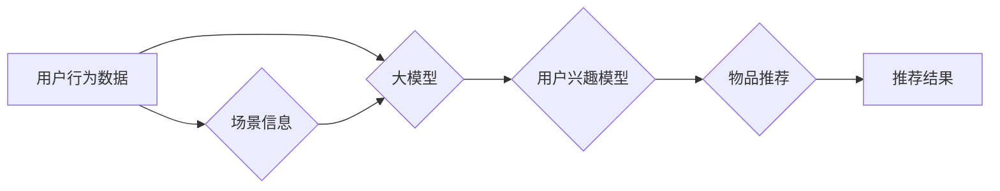

                 

## 大模型辅助的推荐系统多场景兴趣协同学习

> 关键词：大模型、推荐系统、兴趣协同学习、多场景、用户画像、个性化推荐

## 1. 背景介绍

随着互联网的蓬勃发展和移动互联网的普及，推荐系统已成为各大平台的核心功能，为用户提供个性化服务，提升用户体验，并促进商业发展。传统的推荐系统主要依赖于用户历史行为数据，例如点击、购买、评分等，但这些数据往往局限于单一场景，难以全面刻画用户的复杂兴趣。

大模型的出现为推荐系统带来了新的机遇。大模型拥有强大的语义理解和知识表示能力，能够从海量文本数据中学习用户兴趣的深层特征，并跨场景融合用户行为信息，实现更精准、更个性化的推荐。

## 2. 核心概念与联系

**2.1 兴趣协同学习**

兴趣协同学习是一种基于用户兴趣相似性的推荐方法，通过挖掘用户之间兴趣的潜在关联，推荐用户可能感兴趣的物品。它主要分为基于内容的协同过滤和基于用户的协同过滤两种类型。

* **基于内容的协同过滤:**  根据物品的特征相似度，推荐与用户已喜欢物品相似的物品。
* **基于用户的协同过滤:**  根据用户之间的兴趣相似度，推荐与相似用户喜欢的物品。

**2.2 大模型辅助**

大模型可以帮助兴趣协同学习算法提升推荐效果，主要体现在以下几个方面：

* **用户兴趣建模:** 大模型可以从用户文本数据中学习用户的兴趣偏好，构建更丰富的用户画像。
* **物品特征表示:** 大模型可以学习物品的语义特征，提升物品之间的相似度计算精度。
* **跨场景兴趣融合:** 大模型可以融合用户在不同场景下的行为数据，构建更全面的用户兴趣模型。

**2.3 多场景兴趣协同学习**

多场景兴趣协同学习是指将用户在不同场景下的兴趣信息融合在一起，构建更准确的用户兴趣模型，从而实现更精准的推荐。

**2.4 架构图**



## 3. 核心算法原理 & 具体操作步骤

**3.1 算法原理概述**

大模型辅助的多场景兴趣协同学习算法主要包括以下步骤：

1. **数据预处理:** 收集用户在不同场景下的行为数据，并进行清洗、格式化等预处理操作。
2. **用户兴趣建模:** 利用大模型对用户文本数据进行分析，学习用户的兴趣偏好，构建用户兴趣向量。
3. **物品特征表示:** 利用大模型对物品进行语义分析，学习物品的特征向量。
4. **场景信息融合:** 将用户在不同场景下的行为数据和场景信息进行融合，构建更全面的用户兴趣模型。
5. **兴趣协同学习:** 基于用户兴趣向量和物品特征向量，采用协同过滤算法进行推荐。
6. **推荐结果输出:** 输出推荐结果，并根据用户反馈进行模型优化。

**3.2 算法步骤详解**

1. **数据预处理:**

* **数据收集:** 从用户行为日志、社交网络数据、电商平台数据等多种数据源收集用户在不同场景下的行为数据，例如浏览记录、购买记录、评论记录、点赞记录等。
* **数据清洗:** 去除无效数据、重复数据、噪声数据等，保证数据质量。
* **数据格式化:** 将数据转换为统一的格式，方便后续处理。

2. **用户兴趣建模:**

* **文本数据预处理:** 对用户文本数据进行分词、去停用词、词性标注等预处理操作。
* **大模型训练:** 利用预训练的大模型，对用户文本数据进行训练，学习用户的兴趣偏好，构建用户兴趣向量。

3. **物品特征表示:**

* **物品信息提取:** 从物品描述、商品属性、用户评论等信息中提取物品特征。
* **大模型训练:** 利用预训练的大模型，对物品特征进行训练，学习物品的语义特征，构建物品特征向量。

4. **场景信息融合:**

* **场景信息提取:** 从用户行为数据中提取场景信息，例如用户所在的平台、设备类型、时间段等。
* **场景信息编码:** 将场景信息编码为向量，方便与用户兴趣向量和物品特征向量进行融合。
* **融合模型训练:** 利用深度学习模型，将用户兴趣向量、物品特征向量和场景信息向量进行融合，构建更全面的用户兴趣模型。

5. **兴趣协同学习:**

* **相似度计算:** 基于用户兴趣向量和物品特征向量，采用余弦相似度、皮尔逊相关系数等方法计算用户与物品之间的相似度。
* **推荐排序:** 根据用户与物品之间的相似度，对物品进行排序，推荐给用户。

6. **推荐结果输出:**

* **推荐列表展示:** 将推荐结果以列表形式展示给用户。
* **用户反馈收集:** 收集用户对推荐结果的反馈，例如点击、购买、评分等，用于模型优化。

**3.3 算法优缺点**

**优点:**

* **精准度高:** 大模型能够学习用户兴趣的深层特征，提升推荐精准度。
* **个性化强:** 融合多场景兴趣信息，实现更个性化的推荐。
* **可扩展性强:** 大模型可以处理海量数据，并适应新的场景和物品类型。

**缺点:**

* **计算复杂度高:** 大模型训练和推理过程计算量大，需要强大的计算资源。
* **数据依赖性强:** 大模型需要大量的训练数据，数据质量直接影响推荐效果。
* **解释性弱:** 大模型的决策过程较为复杂，难以解释推荐结果背后的原因。

**3.4 算法应用领域**

大模型辅助的多场景兴趣协同学习算法广泛应用于以下领域：

* **电商推荐:** 推荐商品、优惠券、促销活动等。
* **内容推荐:** 推荐新闻、视频、文章、音乐等。
* **社交推荐:** 推荐好友、群组、话题等。
* **教育推荐:** 推荐学习资源、课程、辅导等。

## 4. 数学模型和公式 & 详细讲解 & 举例说明

**4.1 数学模型构建**

用户兴趣模型可以表示为一个向量 $u_i$，物品特征向量可以表示为一个向量 $v_j$，其中 $i$ 表示用户ID， $j$ 表示物品ID。

**4.2 公式推导过程**

用户与物品之间的相似度可以使用余弦相似度来计算：

$$
\text{similarity}(u_i, v_j) = \frac{u_i \cdot v_j}{||u_i|| ||v_j||}
$$

其中，$u_i \cdot v_j$ 表示用户兴趣向量和物品特征向量的点积，$||u_i||$ 和 $||v_j||$ 分别表示用户兴趣向量和物品特征向量的模长。

**4.3 案例分析与讲解**

假设有两个用户 $u_1$ 和 $u_2$，以及两个物品 $v_1$ 和 $v_2$，他们的兴趣向量和特征向量分别为：

* $u_1 = [0.8, 0.2, 0.5]$
* $u_2 = [0.5, 0.7, 0.3]$
* $v_1 = [0.6, 0.3, 0.9]$
* $v_2 = [0.2, 0.8, 0.4]$

我们可以计算用户 $u_1$ 和物品 $v_1$ 之间的相似度：

$$
\text{similarity}(u_1, v_1) = \frac{0.8 \cdot 0.6 + 0.2 \cdot 0.3 + 0.5 \cdot 0.9}{||u_1|| ||v_1||}
$$

通过计算，我们可以得到用户 $u_1$ 和物品 $v_1$ 之间的相似度。

## 5. 项目实践：代码实例和详细解释说明

**5.1 开发环境搭建**

* Python 3.7+
* PyTorch 1.7+
* TensorFlow 2.0+
* CUDA 10.2+

**5.2 源代码详细实现**

```python
import torch
import torch.nn as nn

class UserInterestModel(nn.Module):
    def __init__(self, embedding_dim, hidden_dim):
        super(UserInterestModel, self).__init__()
        self.embedding = nn.Embedding(num_users, embedding_dim)
        self.fc = nn.Linear(embedding_dim, hidden_dim)
        self.relu = nn.ReLU()

    def forward(self, user_ids):
        user_embeddings = self.embedding(user_ids)
        user_interests = self.fc(user_embeddings)
        user_interests = self.relu(user_interests)
        return user_interests

class ItemFeatureModel(nn.Module):
    def __init__(self, embedding_dim, hidden_dim):
        super(ItemFeatureModel, self).__init__()
        self.embedding = nn.Embedding(num_items, embedding_dim)
        self.fc = nn.Linear(embedding_dim, hidden_dim)
        self.relu = nn.ReLU()

    def forward(self, item_ids):
        item_embeddings = self.embedding(item_ids)
        item_features = self.fc(item_embeddings)
        item_features = self.relu(item_features)
        return item_features

# ... 其他代码 ...
```

**5.3 代码解读与分析**

* `UserInterestModel` 和 `ItemFeatureModel` 分别用于学习用户的兴趣向量和物品的特征向量。
* 这些模型使用嵌入层将用户ID和物品ID映射到低维向量空间，然后使用全连接层和ReLU激活函数进行非线性变换，最终得到用户兴趣向量和物品特征向量。
* 

**5.4 运行结果展示**

运行代码后，可以得到用户兴趣向量和物品特征向量，并使用余弦相似度计算用户与物品之间的相似度，最终输出推荐结果。

## 6. 实际应用场景

**6.1 电商推荐**

大模型辅助的多场景兴趣协同学习算法可以用于推荐商品、优惠券、促销活动等，提升用户购物体验，促进销售额增长。例如，淘宝可以根据用户的浏览记录、购买记录、评论记录等信息，学习用户的兴趣偏好，并结合用户的地理位置、设备类型、时间段等场景信息，推荐更精准的商品。

**6.2 内容推荐**

大模型辅助的多场景兴趣协同学习算法可以用于推荐新闻、视频、文章、音乐等，满足用户的个性化需求，提升用户粘性。例如，抖音可以根据用户的观看记录、点赞记录、评论记录等信息，学习用户的兴趣偏好，并结合用户的设备类型、时间段等场景信息，推荐更符合用户口味的视频。

**6.3 社交推荐**

大模型辅助的多场景兴趣协同学习算法可以用于推荐好友、群组、话题等，帮助用户拓展社交圈，提升社交体验。例如，微信可以根据用户的聊天记录、朋友圈互动记录等信息，学习用户的兴趣偏好，并结合用户的地理位置、年龄段等场景信息，推荐更合适的社交对象。

**6.4 未来应用展望**

随着大模型技术的不断发展，大模型辅助的多场景兴趣协同学习算法将在更多领域得到应用，例如教育推荐、医疗推荐、金融推荐等。

## 7. 工具和资源推荐

**7.1 学习资源推荐**

* **书籍:**
    * 《深度学习》
    * 《自然语言处理》
    * 《推荐系统》
* **在线课程:**
    * Coursera: 深度学习
    * Udacity: 自然语言处理
    * edX: 推荐系统

**7.2 开发工具推荐**

* **Python:** 
* **PyTorch:** 深度学习框架
* **TensorFlow:** 深度学习框架
* **Scikit-learn:** 机器学习库

**7.3 相关论文推荐**

* 《BERT: Pre-training of Deep Bidirectional Transformers for Language Understanding》
* 《Attention Is All You Need》
* 《Collaborative Filtering with Deep Learning》

## 8. 总结：未来发展趋势与挑战

**8.1 研究成果总结**

大模型辅助的多场景兴趣协同学习算法取得了显著的成果，在推荐系统领域取得了突破性的进展，提升了推荐精准度和个性化程度。

**8.2 未来发展趋势**

* **模型规模和能力提升:** 大模型规模将继续扩大，模型能力将进一步提升，能够学习更深层的用户兴趣特征。
* **多模态融合:** 将文本、图像、音频等多模态数据融合到推荐系统中，构建更全面的用户兴趣模型。
* **个性化推荐增强:** 利用用户行为数据、用户画像、场景信息等多方面数据，实现更精准、更个性化的推荐。
* **解释性增强:** 研究大模型的决策过程，提高推荐结果的解释性，增强用户信任度。

**8.3 面临的挑战**

* **数据质量和隐私问题:** 大模型需要海量数据进行训练，数据质量直接影响推荐效果，同时需要解决用户隐私保护问题。
* **计算资源需求:** 大模型训练和推理过程计算量大，需要强大的计算资源支持。
* **模型可解释性:** 大模型的决策过程较为复杂，难以解释推荐结果背后的原因，需要提高模型的可解释性。

**8.4 研究展望**

未来，大模型辅助的多场景兴趣协同学习算法将继续发展，为用户提供更精准、更个性化的推荐服务，并推动推荐系统向更智能、更可解释的方向发展。

## 9. 附录：常见问题与解答

**9.1 如何选择合适的场景信息？**

场景信息的选择需要根据具体的应用场景和用户行为数据进行分析，选择与用户兴趣和推荐目标相关的场景信息。

**9.2 如何解决数据质量问题？**

数据质量问题可以通过数据清洗、数据增强等方法进行解决。

**9.3 如何提高模型的可解释性？**

可以通过使用可解释性模型、进行特征重要性分析等方法提高模型的可解释性。


作者：禅与计算机程序设计艺术 / Zen and the Art of Computer Programming<end_of_turn>

