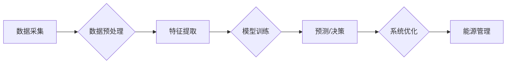

                 

## 如何利用技术能力进行清洁能源领域创新

> 关键词：清洁能源、人工智能、机器学习、数据分析、优化算法、可再生能源、能源存储、智能电网

## 1. 背景介绍

全球气候变化和能源安全问题日益严峻，清洁能源的开发和利用已成为世界各国共同关注的议题。传统能源的枯竭和环境污染问题迫使我们寻求更加可持续、环保的能源解决方案。清洁能源，包括太阳能、风能、水能、地热能和生物质能等，具有资源丰富、环境友好等优势，是实现碳中和目标和构建绿色未来的关键。

然而，清洁能源的应用也面临着诸多挑战，例如：

* **间歇性问题：** 许多清洁能源，如太阳能和风能，其发电量受天气条件影响，存在间歇性问题，难以稳定供电。
* **能源存储难题：** 清洁能源的间歇性特性导致能源存储成为一个关键问题，需要开发高效、经济的储能技术。
* **电网优化与管理：** 清洁能源的并网接入需要对现有电网进行优化和升级，以确保电网稳定运行。
* **成本问题：** 一些清洁能源技术，如核能和氢能，其前期投资成本较高，需要进一步降低成本才能大规模推广应用。

## 2. 核心概念与联系

清洁能源领域的创新离不开先进的技术支撑。人工智能（AI）、机器学习（ML）、数据分析、优化算法等技术为清洁能源的开发和应用提供了强大的工具。

**2.1  核心概念**

* **人工智能（AI）：** 人工智能是指模拟人类智能行为的计算机系统，包括学习、推理、决策、感知等能力。
* **机器学习（ML）：** 机器学习是人工智能的一个子领域，通过算法训练数据，使计算机能够从数据中学习并做出预测或决策。
* **数据分析：** 数据分析是指从数据中提取有价值信息的过程，包括数据清洗、数据挖掘、数据可视化等。
* **优化算法：** 优化算法是指用于寻找最优解的算法，在清洁能源领域，可以用于优化能源调度、能源存储、电网运行等。

**2.2  核心概念架构**



## 3. 核心算法原理 & 具体操作步骤

### 3.1  算法原理概述

在清洁能源领域，机器学习算法被广泛应用于预测、优化和控制等方面。例如，预测太阳能和风能发电量、优化能源调度、控制储能系统等。常见的机器学习算法包括：

* **线性回归：** 用于预测连续变量，例如太阳能发电量。
* **逻辑回归：** 用于预测分类变量，例如风力发电是否充足。
* **支持向量机（SVM）：** 用于分类和回归问题，可以处理高维数据。
* **决策树：** 用于分类和回归问题，易于理解和解释。
* **随机森林：** 结合多个决策树，提高预测精度。
* **神经网络：** 能够学习复杂关系，适用于大规模数据分析。

### 3.2  算法步骤详解

以预测太阳能发电量为例，使用线性回归算法的具体步骤如下：

1. **数据采集：** 收集历史太阳能辐照度、气温、湿度等数据。
2. **数据预处理：** 清洗数据，处理缺失值，标准化数据。
3. **特征提取：** 选择与太阳能发电量相关的特征，例如历史辐照度、气温等。
4. **模型训练：** 使用训练数据训练线性回归模型，找到最佳模型参数。
5. **模型评估：** 使用测试数据评估模型精度，例如使用均方误差（MSE）或R-squared值。
6. **模型部署：** 将训练好的模型部署到实际系统中，用于预测未来太阳能发电量。

### 3.3  算法优缺点

**优点：**

* 预测精度高
* 算法简单易懂
* 可解释性强

**缺点：**

* 对数据质量要求高
* 难以处理非线性关系

### 3.4  算法应用领域

* **太阳能发电量预测**
* **风能发电量预测**
* **能源需求预测**
* **能源价格预测**
* **储能系统优化**

## 4. 数学模型和公式 & 详细讲解 & 举例说明

### 4.1  数学模型构建

在清洁能源领域，数学模型被广泛用于描述能源系统行为、优化能源调度、预测能源需求等。例如，可以构建一个太阳能发电量预测模型，将太阳能辐照度、气温、湿度等因素作为输入变量，预测太阳能发电量作为输出变量。

### 4.2  公式推导过程

假设太阳能发电量 $P$ 与太阳能辐照度 $I$、气温 $T$、湿度 $H$ 之间存在线性关系，可以表示为：

$$P = aI + bT + cH + d$$

其中，$a$、$b$、$c$、$d$ 为模型参数，需要通过训练数据进行估计。

### 4.3  案例分析与讲解

假设训练数据包含历史太阳能辐照度、气温、湿度和太阳能发电量数据，可以使用最小二乘法估计模型参数。最小二乘法旨在找到使模型预测值与实际值误差最小化的参数值。

通过最小二乘法估计，得到模型参数 $a$、$b$、$c$、$d$ 的值，即可构建出太阳能发电量预测模型。

## 5. 项目实践：代码实例和详细解释说明

### 5.1  开发环境搭建

可以使用 Python 语言和相关库进行开发，例如：

* **NumPy:** 用于数值计算
* **Pandas:** 用于数据处理
* **Scikit-learn:** 用于机器学习算法

### 5.2  源代码详细实现

```python
import numpy as np
from sklearn.linear_model import LinearRegression

# 数据加载
data = pd.read_csv('solar_data.csv')

# 特征选择
X = data[['辐照度', '气温', '湿度']]
y = data['发电量']

# 模型训练
model = LinearRegression()
model.fit(X, y)

# 模型评估
# ...

# 模型预测
new_data = pd.DataFrame({'辐照度': [1000], '气温': [25], '湿度': [60]})
prediction = model.predict(new_data)
print(prediction)
```

### 5.3  代码解读与分析

* 数据加载：使用 Pandas 库加载太阳能数据。
* 特征选择：选择与太阳能发电量相关的特征，例如辐照度、气温、湿度。
* 模型训练：使用 Scikit-learn 库的 LinearRegression 类训练线性回归模型。
* 模型评估：使用测试数据评估模型精度，例如使用均方误差（MSE）或R-squared值。
* 模型预测：使用训练好的模型预测未来太阳能发电量。

### 5.4  运行结果展示

运行代码后，将输出未来太阳能发电量的预测值。

## 6. 实际应用场景

### 6.1  智能电网

人工智能可以用于优化智能电网的运行，例如：

* **预测负荷需求：** 利用机器学习算法预测未来电力需求，帮助电网调度人员优化电力供应。
* **控制分布式能源：** 利用人工智能控制分布式能源，例如太阳能发电系统和储能系统，提高电网的稳定性和可靠性。
* **故障诊断和预警：** 利用机器学习算法分析电网运行数据，识别潜在故障并进行预警，提高电网的安全性。

### 6.2  能源存储

人工智能可以用于优化能源存储系统的运行，例如：

* **预测储能需求：** 利用机器学习算法预测未来储能需求，帮助优化储能系统的充放电策略。
* **控制储能系统：** 利用人工智能控制储能系统，例如电池储能系统和 pumped hydro storage 系统，提高储能系统的效率和寿命。
* **预测电池寿命：** 利用机器学习算法分析电池运行数据，预测电池寿命，帮助延长电池的使用寿命。

### 6.3  可再生能源发电

人工智能可以用于提高可再生能源发电的效率，例如：

* **预测太阳能和风能发电量：** 利用机器学习算法预测太阳能和风能发电量，帮助电网调度人员优化电力供应。
* **控制风力发电机组：** 利用人工智能控制风力发电机组，例如调整风轮角度和转速，提高发电效率。
* **优化光伏发电系统：** 利用人工智能优化光伏发电系统的布局和角度，提高发电效率。

### 6.4  未来应用展望

随着人工智能技术的不断发展，其在清洁能源领域的应用将更加广泛和深入。例如：

* **智能能源管理系统：** 利用人工智能构建智能能源管理系统，实现能源的智能调度、优化和控制。
* **个性化能源服务：** 利用人工智能提供个性化能源服务，例如根据用户的能源需求和习惯，提供定制化的能源方案。
* **可持续能源发展规划：** 利用人工智能辅助制定可持续能源发展规划，实现能源的清洁、高效和可持续利用。

## 7. 工具和资源推荐

### 7.1  学习资源推荐

* **在线课程：** Coursera、edX、Udacity 等平台提供人工智能、机器学习等相关课程。
* **书籍：** 《深度学习》、《机器学习实战》等书籍。
* **开源项目：** TensorFlow、PyTorch 等开源机器学习框架。

### 7.2  开发工具推荐

* **Python:** 广泛用于人工智能和机器学习开发。
* **Jupyter Notebook:** 用于编写和运行 Python 代码，方便数据分析和可视化。
* **Scikit-learn:** Python 机器学习库，提供各种机器学习算法。
* **TensorFlow/PyTorch:** 深度学习框架，用于构建和训练深度神经网络。

### 7.3  相关论文推荐

* **Nature:** https://www.nature.com/
* **Science:** https://www.science.org/
* **arXiv:** https://arxiv.org/

## 8. 总结：未来发展趋势与挑战

### 8.1  研究成果总结

人工智能技术在清洁能源领域取得了显著进展，例如：

* **提高能源预测精度：** 机器学习算法能够准确预测太阳能和风能发电量，帮助电网调度人员优化电力供应。
* **优化能源存储系统：** 人工智能可以优化储能系统的充放电策略，提高储能系统的效率和寿命。
* **提高可再生能源发电效率：** 人工智能可以控制风力发电机组和光伏发电系统，提高发电效率。

### 8.2  未来发展趋势

* **更强大的机器学习算法：** 深度学习算法将进一步发展，能够处理更复杂的数据，提高预测精度。
* **更广泛的应用场景：** 人工智能将应用于更多清洁能源领域，例如能源交易、碳排放管理等。
* **更智能的能源系统：** 人工智能将构建更智能的能源系统，实现能源的智能调度、优化和控制。

### 8.3  面临的挑战

* **数据质量问题：** 人工智能算法对数据质量要求高，需要高质量的训练数据。
* **算法解释性问题：** 一些深度学习算法难以解释，其决策过程难以理解。
* **伦理和安全问题：** 人工智能的应用需要考虑伦理和安全问题，例如数据隐私、算法偏见等。

### 8.4  研究展望

未来，需要继续研究更强大的机器学习算法、更广泛的应用场景、更智能的能源系统，并解决数据质量、算法解释性和伦理安全等挑战，推动人工智能技术在清洁能源领域的创新发展。

## 9. 附录：常见问题与解答

**Q1：人工智能技术在清洁能源领域有哪些应用？**

**A1：** 人工智能技术在清洁能源领域应用广泛，例如：

* **预测太阳能和风能发电量**
* **优化能源存储系统**
* **控制风力发电机组和光伏发电系统**
* **智能电网运行优化**
* **能源需求预测**

**Q2：如何评估人工智能模型的性能？**

**A2：** 可以使用各种指标评估人工智能模型的性能，例如：

* **均方误差（MSE）**
* **R-squared值**
* **准确率**
* **召回率**
* **F1-score**

**Q3：人工智能技术在清洁能源领域面临哪些挑战？**

**A3：** 人工智能技术在清洁能源领域面临的挑战包括：

* **数据质量问题**
* **算法解释性问题**
* **伦理和安全问题**


作者：禅与计算机程序设计艺术 / Zen and the Art of Computer Programming 
<end_of_turn>

