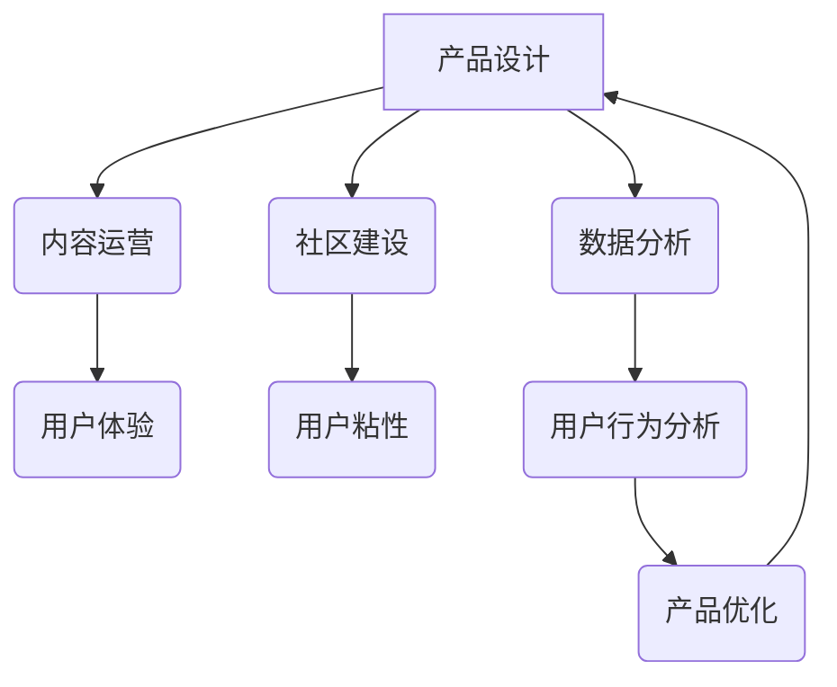

                 

## 如何提高知识付费产品的用户活跃度

> 关键词：知识付费、用户活跃度、产品设计、用户体验、内容运营、社区建设、数据分析

> 摘要：知识付费市场蓬勃发展，但用户活跃度一直是制约其长远发展的关键问题。本文将从产品设计、内容运营、社区建设、数据分析等多个维度，深入探讨如何提高知识付费产品的用户活跃度，并结合实际案例，提供可行的解决方案。

## 1. 背景介绍

知识付费作为一种新型的商业模式，近年来发展迅速，涵盖了在线课程、付费咨询、电子书等多种形式。其核心价值在于通过知识和技能的分享，为用户提供价值，并实现商业化收益。然而，知识付费产品的用户活跃度普遍偏低，用户流失率高，成为行业面临的共同挑战。

**1.1 知识付费用户活跃度低下的原因分析**

* **内容质量参差不齐:** 部分知识付费产品内容缺乏深度和实用性，难以满足用户的学习需求。
* **用户体验不足:** 产品界面设计、交互体验、学习流程等方面存在问题，影响用户学习体验。
* **缺乏互动和粘性:** 知识付费产品往往以单向的知识输出为主，缺乏互动和交流，难以形成用户粘性。
* **用户付费意愿不高:** 部分用户对知识付费产品的价值认知不足，付费意愿不高。

## 2. 核心概念与联系

知识付费产品的用户活跃度提升，需要从产品设计、内容运营、社区建设、数据分析等多个维度进行综合考虑。

**2.1 用户活跃度模型**

用户活跃度可以从以下几个方面进行衡量：

* **DAU（日活跃用户数）:** 指每天至少访问一次产品的用户数量。
* **MAU（月活跃用户数）:** 指每月至少访问一次产品的用户数量。
* **Retention Rate（留存率）:** 指在一段时间内，用户持续使用产品的比例。
* **Engagement（参与度）:** 指用户在产品内进行互动、学习、分享等行为的频率和深度。

**2.2 核心概念关系图**



## 3. 核心算法原理 & 具体操作步骤

**3.1 算法原理概述**

用户活跃度提升是一个复杂的系统工程，需要结合多种算法和技术手段进行优化。其中，推荐算法、个性化学习路径、用户画像分析等算法在提升用户活跃度方面发挥着重要作用。

**3.2 算法步骤详解**

* **用户行为分析:** 收集用户在产品内的行为数据，例如学习时长、课程进度、互动频率等，并进行分析，了解用户的学习习惯、兴趣偏好等。
* **用户画像构建:** 基于用户行为数据，构建用户画像，将用户进行细分，例如根据学习目标、学习进度、学习风格等进行分类。
* **个性化推荐:** 根据用户的学习目标、兴趣偏好、学习进度等信息，推荐个性化的课程、学习资源和学习计划。
* **学习路径优化:** 根据用户的学习进度和学习效果，动态调整学习路径，提供更有效的学习体验。
* **社区互动:** 建立用户社区，鼓励用户之间进行交流、讨论、分享学习经验，提升用户粘性。

**3.3 算法优缺点**

* **优点:** 可以根据用户的实际情况，提供更精准、更有效的学习体验，提升用户活跃度和学习效果。
* **缺点:** 需要大量的用户数据进行训练和分析，算法模型的复杂度较高，需要专业的技术人员进行维护和优化。

**3.4 算法应用领域**

* 在线教育平台
* 知识付费平台
* 个人学习工具

## 4. 数学模型和公式 & 详细讲解 & 举例说明

**4.1 数学模型构建**

用户活跃度模型可以采用以下数学模型进行构建：

$$
ActiveRate = \frac{DAU}{MAU}
$$

其中：

* ActiveRate：用户活跃度
* DAU：日活跃用户数
* MAU：月活跃用户数

**4.2 公式推导过程**

用户活跃度模型的推导过程如下：

* 用户活跃度可以看作是用户在一段时间内持续使用产品的比例。
* DAU和MAU分别代表了用户在一天和一个月内访问产品的数量。
* 因此，ActiveRate可以用来衡量用户在一段时间内持续使用产品的比例。

**4.3 案例分析与讲解**

假设一个知识付费平台，其MAU为10000，DAU为2000，则其用户活跃度为：

$$
ActiveRate = \frac{2000}{10000} = 0.2
$$

这意味着该平台的20%的用户在每天都会访问该平台。

## 5. 项目实践：代码实例和详细解释说明

**5.1 开发环境搭建**

* Python 3.x
* Django 或 Flask 框架
* MySQL 或 PostgreSQL 数据库
* Redis 或 Memcached 缓存

**5.2 源代码详细实现**

```python
# 用户行为分析模型
from sklearn.cluster import KMeans

# 用户行为数据
user_data = [
    {'user_id': 1, 'learning_time': 120, 'course_progress': 0.8},
    {'user_id': 2, 'learning_time': 60, 'course_progress': 0.5},
    # ...
]

# 训练KMeans模型
kmeans = KMeans(n_clusters=3)
kmeans.fit(user_data)

# 获取用户聚类结果
user_clusters = kmeans.labels_

# ...
```

**5.3 代码解读与分析**

* 上述代码示例展示了如何使用KMeans算法进行用户行为分析，将用户进行聚类。
* 具体实现细节需要根据实际情况进行调整，例如聚类数量、特征选择等。

**5.4 运行结果展示**

* 运行结果将显示每个用户的聚类标签，可以根据聚类标签进行用户画像构建和个性化推荐。

## 6. 实际应用场景

**6.1 在线教育平台**

* 通过用户行为分析，推荐个性化的学习课程和学习计划。
* 建立用户社区，鼓励用户之间进行交流和讨论。
* 根据用户学习进度和学习效果，动态调整学习路径。

**6.2 知识付费平台**

* 根据用户兴趣偏好，推荐相关的付费课程和知识产品。
* 提供付费咨询服务，帮助用户解决学习和工作中的问题。
* 建立用户社区，分享学习经验和交流学习心得。

**6.3 个人学习工具**

* 提供个性化的学习计划和学习提醒。
* 记录用户的学习进度和学习成果。
* 推荐相关的学习资源和学习工具。

**6.4 未来应用展望**

* 人工智能技术将进一步提升知识付费产品的用户体验和学习效果。
* 虚拟现实和增强现实技术将为用户提供更沉浸式的学习体验。
* 区块链技术将为知识付费产品提供更安全、更透明的交易机制。

## 7. 工具和资源推荐

**7.1 学习资源推荐**

* **书籍:** 《用户体验设计》、《产品经理手册》、《数据分析实战》
* **在线课程:** Coursera、edX、Udemy
* **博客:** Hacker News、Medium、TechCrunch

**7.2 开发工具推荐**

* **Python:** Django、Flask、Scikit-learn
* **数据库:** MySQL、PostgreSQL、MongoDB
* **缓存:** Redis、Memcached

**7.3 相关论文推荐**

* **用户活跃度模型:** 《A Survey of User Activity Modeling in Social Networks》
* **推荐算法:** 《Collaborative Filtering: Methods and Applications》
* **个性化学习路径:** 《Personalized Learning Paths: A Survey》

## 8. 总结：未来发展趋势与挑战

**8.1 研究成果总结**

* 知识付费产品的用户活跃度提升是一个复杂的系统工程，需要从产品设计、内容运营、社区建设、数据分析等多个维度进行综合考虑。
* 推荐算法、个性化学习路径、用户画像分析等算法在提升用户活跃度方面发挥着重要作用。

**8.2 未来发展趋势**

* 人工智能技术将进一步提升知识付费产品的用户体验和学习效果。
* 虚拟现实和增强现实技术将为用户提供更沉浸式的学习体验。
* 区块链技术将为知识付费产品提供更安全、更透明的交易机制。

**8.3 面临的挑战**

* 如何提高知识付费产品的用户粘性，防止用户流失。
* 如何保证知识付费产品的质量和价值，满足用户的学习需求。
* 如何平衡知识付费产品的商业化收益和用户体验。

**8.4 研究展望**

* 深入研究用户行为分析和个性化推荐算法，提供更精准、更有效的学习体验。
* 探索虚拟现实和增强现实技术在知识付费领域的应用，打造更沉浸式的学习体验。
* 研究区块链技术在知识付费领域的应用，构建更安全、更透明的知识付费生态系统。

## 9. 附录：常见问题与解答

**9.1 如何提高知识付费产品的用户活跃度？**

* 提供高质量、实用性强的知识内容。
* 设计用户友好的产品界面和交互体验。
* 建立用户社区，鼓励用户互动和交流。
* 利用数据分析，进行用户画像构建和个性化推荐。

**9.2 如何保证知识付费产品的质量和价值？**

* 邀请行业专家和学者进行内容创作。
* 对知识内容进行严格审核和评估。
* 提供用户反馈机制，不断改进知识内容。

**9.3 如何平衡知识付费产品的商业化收益和用户体验？**

* 提供多种付费模式，满足不同用户的需求。
* 定期推出优惠活动，吸引新用户。
* 关注用户体验，不断优化产品功能和服务。


作者：禅与计算机程序设计艺术 / Zen and the Art of Computer Programming<end_of_turn>

