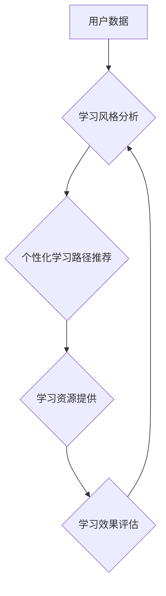

                 

## 学习风格：个性化知识获取的策略

> 关键词：学习风格、个性化学习、知识获取、认知科学、人工智能、机器学习、教育技术

### 1. 背景介绍

在当今信息爆炸的时代，获取知识变得越来越容易，但如何有效地学习和吸收知识却成为一个新的挑战。每个人都有独特的学习风格，不同的学习风格对应着不同的认知机制和信息处理方式。传统的教育模式往往采用一种“一刀切”的教学方法，忽视了个体差异，导致许多人难以找到适合自己的学习方式，从而影响学习效率和效果。

个性化学习旨在根据个体的学习风格、兴趣、目标等因素，定制化的提供学习内容、学习路径和学习资源，以提高学习效率和效果。近年来，随着人工智能、机器学习等技术的快速发展，个性化学习迎来了新的机遇。

### 2. 核心概念与联系

#### 2.1 学习风格

学习风格是指个体在学习过程中倾向于采用的一种或多种特定的认知策略和信息处理方式。常见的学习风格包括：

* **视觉学习型:** 这种学习者更倾向于通过视觉信息，如图片、图表、视频等来理解和记忆知识。
* **听觉学习型:** 这种学习者更倾向于通过听觉信息，如演讲、录音、讨论等来理解和记忆知识。
* **动觉学习型:** 这种学习者更倾向于通过实践操作、动手活动等来理解和记忆知识。
* **阅读/写作学习型:** 这种学习者更倾向于通过阅读和写作来理解和记忆知识。

#### 2.2 个性化学习

个性化学习是指根据个体的学习风格、兴趣、目标等因素，定制化的提供学习内容、学习路径和学习资源，以提高学习效率和效果。

#### 2.3 人工智能与机器学习

人工智能（AI）和机器学习（ML）技术可以帮助我们更好地理解个体的学习风格和需求，并根据这些信息提供个性化的学习建议和支持。

**Mermaid 流程图**



### 3. 核心算法原理 & 具体操作步骤

#### 3.1 算法原理概述

个性化学习系统通常采用机器学习算法来分析用户的学习数据，并根据分析结果推荐个性化的学习内容和学习路径。常见的机器学习算法包括：

* **协同过滤:** 基于用户的历史学习行为和其他用户的相似学习行为，推荐用户可能感兴趣的学习内容。
* **内容过滤:** 基于学习内容的主题、标签、关键词等信息，推荐与用户兴趣相符的学习内容。
* **混合推荐:** 结合协同过滤和内容过滤算法，提高推荐的准确性和个性化程度。

#### 3.2 算法步骤详解

1. **数据收集:** 收集用户的学习数据，包括学习历史、学习偏好、学习成绩等。
2. **数据预处理:** 对收集到的数据进行清洗、转换和特征提取，以便于机器学习算法的训练和使用。
3. **模型训练:** 选择合适的机器学习算法，并使用预处理后的数据进行模型训练。
4. **模型评估:** 使用测试数据评估模型的性能，并根据评估结果进行模型调优。
5. **个性化推荐:** 将训练好的模型应用于新的用户数据，并根据模型的预测结果推荐个性化的学习内容和学习路径。

#### 3.3 算法优缺点

**优点:**

* **个性化:** 可以根据用户的学习风格和需求提供个性化的学习建议和支持。
* **效率:** 可以帮助用户更快地找到感兴趣和适合自己的学习内容。
* **效果:** 可以提高用户的学习效率和学习效果。

**缺点:**

* **数据依赖:** 需要大量的用户学习数据才能训练出准确的模型。
* **算法复杂:** 训练和使用机器学习模型需要一定的技术门槛。
* **伦理问题:** 需要考虑个性化学习系统可能带来的伦理问题，例如数据隐私和算法偏见。

#### 3.4 算法应用领域

个性化学习算法广泛应用于教育、培训、在线学习等领域，例如：

* **在线教育平台:** 为用户提供个性化的学习路径和学习资源。
* **学习管理系统:** 根据用户的学习进度和成绩，提供个性化的学习建议和反馈。
* **智能辅导系统:** 为用户提供个性化的学习辅导和答疑服务。

### 4. 数学模型和公式 & 详细讲解 & 举例说明

#### 4.1 数学模型构建

个性化学习系统通常采用基于用户的协同过滤算法，其核心思想是：如果用户A和用户B在某些学习内容上的喜好相似，那么用户A可能也喜欢用户B喜欢的其他学习内容。

**用户-项目评分矩阵:**

假设有N个用户和M个学习项目，我们可以用一个用户-项目评分矩阵来表示用户的学习偏好。矩阵中的每个元素$r_{ui}$表示用户$u$对项目$i$的评分，其中$1 \leq u \leq N$，$1 \leq i \leq M$。

#### 4.2 公式推导过程

协同过滤算法通常使用以下公式来预测用户对项目的评分：

$$
\hat{r}_{ui} = \bar{r}_u + \frac{\sum_{v \in N(u)} (r_{v i} - \bar{r}_v) \cdot s_{uv}}{\sum_{v \in N(u)} s_{uv}}
$$

其中：

* $\hat{r}_{ui}$ 是算法预测的用户$u$对项目$i$的评分。
* $\bar{r}_u$ 是用户$u$的平均评分。
* $r_{vi}$ 是用户$v$对项目$i$的评分。
* $\bar{r}_v$ 是用户$v$的平均评分。
* $s_{uv}$ 是用户$u$和用户$v$之间的相似度。

#### 4.3 案例分析与讲解

假设有两个用户A和B，他们对三个学习项目进行了评分，评分矩阵如下：

| 用户 | 项目1 | 项目2 | 项目3 |
|---|---|---|---|
| A | 4 | 3 | 5 |
| B | 3 | 5 | 4 |

我们可以使用协同过滤算法来预测用户A对项目2的评分。

首先，我们需要计算用户A和用户B之间的相似度。可以使用余弦相似度来度量两个用户的相似度：

$$
\text{cosine}(A, B) = \frac{A \cdot B}{||A|| ||B||}
$$

其中：

* $A$ 和 $B$ 是两个用户的评分向量。
* $A \cdot B$ 是两个向量之间的点积。
* $||A||$ 和 $||B||$ 是两个向量的模长。

计算得到用户A和用户B之间的相似度为0.707。

然后，我们可以使用公式来预测用户A对项目2的评分：

$$
\hat{r}_{A2} = \bar{r}_A + \frac{(r_{B2} - \bar{r}_B) \cdot s_{AB}}{\sum_{v \in N(A)} s_{AV}}
$$

其中：

* $\bar{r}_A$ 是用户A的平均评分，为4。
* $r_{B2}$ 是用户B对项目2的评分，为5。
* $\bar{r}_B$ 是用户B的平均评分，为4。
* $s_{AB}$ 是用户A和用户B之间的相似度，为0.707。

计算得到用户A对项目2的预测评分为3.707。

### 5. 项目实践：代码实例和详细解释说明

#### 5.1 开发环境搭建

* **操作系统:** Linux/macOS/Windows
* **编程语言:** Python
* **库:** pandas, numpy, scikit-learn

#### 5.2 源代码详细实现

```python
import pandas as pd
from sklearn.metrics.pairwise import cosine_similarity

# 加载用户-项目评分矩阵
ratings_data = pd.read_csv('ratings.csv')

# 计算用户之间的相似度
user_similarity = cosine_similarity(ratings_data)

# 预测用户对项目的评分
def predict_rating(user_id, item_id):
    # 获取用户A的平均评分
    user_avg_rating = ratings_data[ratings_data['user_id'] == user_id]['rating'].mean()

    # 获取与用户A相似度最高的N个用户
    similar_users = user_similarity[user_id].argsort()[:-6:-1]

    # 计算预测评分
    predicted_rating = user_avg_rating + sum(
        (ratings_data.loc[similar_users, item_id] - ratings_data.loc[similar_users, 'rating'].mean()) * user_similarity[user_id][similar_users]
    ) / sum(user_similarity[user_id][similar_users])
    return predicted_rating

# 预测用户1对项目2的评分
predicted_rating = predict_rating(1, 2)
print(f'Predicted rating for user 1 on item 2: {predicted_rating}')
```

#### 5.3 代码解读与分析

* **数据加载:** 使用pandas库加载用户-项目评分矩阵。
* **相似度计算:** 使用scikit-learn库的cosine_similarity函数计算用户之间的相似度。
* **评分预测:** 定义predict_rating函数，根据用户ID和项目ID，预测用户对项目的评分。
* **运行结果展示:** 打印预测的用户对项目的评分。

#### 5.4 运行结果展示

运行代码后，会输出预测的用户对项目的评分。

### 6. 实际应用场景

个性化学习系统已经应用于许多实际场景，例如：

* **在线教育平台:** 

例如 Coursera, edX 等平台，根据用户的学习历史和偏好，推荐个性化的课程和学习路径。
* **学习管理系统:** 

例如 Moodle, Canvas 等平台，根据学生的学习进度和成绩，提供个性化的学习建议和反馈。
* **智能辅导系统:** 

例如 Wolfram Alpha, Khan Academy 等平台，根据学生的提问和学习需求，提供个性化的学习辅导和答疑服务。

#### 6.4 未来应用展望

随着人工智能和机器学习技术的不断发展，个性化学习系统将更加智能化、个性化和高效化。未来，个性化学习系统可能具备以下特点：

* **更精准的个性化推荐:** 利用更先进的机器学习算法和数据分析技术，更加精准地预测用户的学习需求和偏好，提供更个性化的学习建议和支持。
* **更丰富的学习资源:** 

整合各种学习资源，包括视频、音频、文本、互动练习等，为用户提供更丰富的学习体验。
* **更智能的学习辅导:** 利用自然语言处理和对话系统技术，提供更智能的学习辅导和答疑服务，帮助用户更好地理解和掌握知识。
* **更沉浸式的学习体验:** 利用虚拟现实和增强现实技术，创造更沉浸式的学习体验，提高用户的学习兴趣和效率。

### 7. 工具和资源推荐

#### 7.1 学习资源推荐

* **书籍:**
    * 《个性化学习：理论与实践》
    * 《机器学习实战》
    * 《深度学习》
* **在线课程:**
    * Coursera: 个性化学习
    * edX: 机器学习
    * Udacity: 深度学习

#### 7.2 开发工具推荐

* **编程语言:** Python
* **机器学习库:** scikit-learn, TensorFlow, PyTorch
* **数据分析库:** pandas, numpy
* **云平台:** AWS, Azure, Google Cloud

#### 7.3 相关论文推荐

* **个性化学习的文献综述:**
    * [A Survey of Personalized Learning Systems](https://ieeexplore.ieee.org/document/8809871)
* **协同过滤算法的论文:**
    * [Collaborative Filtering: A User-Based Approach](https://dl.acm.org/doi/10.1145/306013.306018)

### 8. 总结：未来发展趋势与挑战

#### 8.1 研究成果总结

个性化学习系统已经取得了显著的成果，能够有效地提高用户的学习效率和学习效果。

#### 8.2 未来发展趋势

未来，个性化学习系统将朝着以下方向发展：

* **更精准的个性化推荐:** 利用更先进的机器学习算法和数据分析技术，更加精准地预测用户的学习需求和偏好，提供更个性化的学习建议和支持。
* **更丰富的学习资源:** 整合各种学习资源，包括视频、音频、文本、互动练习等，为用户提供更丰富的学习体验。
* **更智能的学习辅导:** 利用自然语言处理和对话系统技术，提供更智能的学习辅导和答疑服务，帮助用户更好地理解和掌握知识。
* **更沉浸式的学习体验:** 利用虚拟现实和增强现实技术，创造更沉浸式的学习体验，提高用户的学习兴趣和效率。

#### 8.3 面临的挑战

个性化学习系统也面临着一些挑战：

* **数据隐私:** 个性化学习系统需要收集大量的用户数据，如何保护用户的隐私安全是一个重要的挑战。
* **算法偏见:** 机器学习算法可能会受到训练数据的偏见影响，导致个性化推荐不公平或不准确。
* **技术复杂性:** 开发和维护个性化学习系统需要复杂的技术知识和资源。

#### 8.4 研究展望

未来，我们需要继续研究个性化学习系统的算法、技术和应用，以更好地解决上述挑战，并推动个性化学习的发展。

### 9. 附录：常见问题与解答

* **Q: 个性化学习系统真的能提高学习效率吗？**

A: 理论上，个性化学习系统可以提高学习效率，因为它们可以根据用户的学习风格和需求提供更合适的学习内容和学习路径。

* **Q: 个性化学习系统会取代传统的教育模式吗？**

A: 个性化学习系统可以作为一种补充，而不是替代传统的教育模式。传统的教育模式仍然有其独特的价值，例如培养学生的社交能力和批判性思维能力。

* **Q: 如何选择适合自己的个性化学习系统？**

A: 选择个性化学习系统时，需要考虑以下因素：

* **学习目标:** 你想通过学习系统达到什么目标？
* **学习风格:** 你更倾向于哪种学习方式？
* **预算:** 你愿意为学习系统支付多少费用？
* **平台:** 你更喜欢使用哪种平台？

作者：禅与计算机程序设计艺术 / Zen and the Art of Computer Programming


<end_of_turn>

