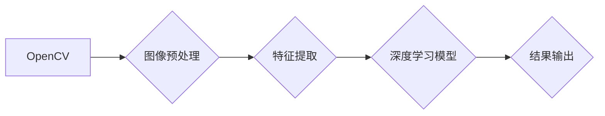

                 

## 实时视频分析：OpenCV与深度学习模型的结合

> 关键词：OpenCV, 深度学习, 实时视频分析, 图像处理, 对象检测, 计算机视觉, 算法, 应用

## 1. 背景介绍

随着计算机视觉技术的飞速发展，实时视频分析已成为一个炙手可热的领域。它在安防监控、智能交通、医疗诊断、工业自动化等众多领域有着广泛的应用前景。实时视频分析的核心是能够快速、准确地理解视频内容，并根据理解结果做出相应的决策或操作。

传统的视频分析方法主要依赖于手工设计的特征和规则，但这些方法往往难以应对复杂场景下的视频变化，并且难以实现高精度识别。近年来，深度学习技术的兴起为实时视频分析带来了新的机遇。深度学习模型能够自动学习视频特征，并实现更准确、更鲁棒的视频理解。

OpenCV是一个开源的计算机视觉库，提供了丰富的图像处理和视频分析功能。它为深度学习模型的应用提供了强大的基础。结合OpenCV和深度学习模型，可以实现更智能、更高效的实时视频分析。

## 2. 核心概念与联系

### 2.1 OpenCV

OpenCV（Open Source Computer Vision Library）是一个开源的计算机视觉库，提供了广泛的图像处理、视频分析和机器学习算法。它支持多种编程语言，包括C++、Python、Java等。OpenCV的优势在于：

* **功能丰富:** 提供了图像处理、视频分析、特征检测、物体识别、机器学习等众多功能。
* **性能高:** 基于GPU加速，能够实现高效的图像处理和视频分析。
* **开源免费:** 可以自由使用、修改和分发。
* **社区活跃:** 拥有庞大的用户社区，提供丰富的学习资源和技术支持。

### 2.2 深度学习

深度学习是一种机器学习的子领域，它利用多层神经网络来学习数据特征。深度学习模型能够自动学习复杂的数据模式，并实现更准确的预测和识别。深度学习在图像识别、语音识别、自然语言处理等领域取得了突破性的进展。

### 2.3 OpenCV与深度学习的结合

OpenCV和深度学习模型可以相互补充，共同实现更强大的实时视频分析功能。OpenCV提供图像处理和视频分析的基础功能，而深度学习模型则能够学习更复杂的视频特征，实现更准确的识别和理解。

**Mermaid 流程图**



## 3. 核心算法原理 & 具体操作步骤

### 3.1 算法原理概述

实时视频分析的算法原理主要基于以下几个方面：

* **图像预处理:** 对视频帧进行预处理，例如调整亮度、对比度、去除噪声等，以提高后续算法的性能。
* **特征提取:** 从预处理后的图像中提取关键特征，例如边缘、纹理、颜色等，这些特征能够描述图像的结构和内容。
* **目标检测:** 利用深度学习模型对视频帧进行目标检测，识别视频中存在的物体，例如人、车、动物等。
* **跟踪:** 对检测到的目标进行跟踪，跟踪目标在视频中的运动轨迹。
* **行为分析:** 分析目标的运动轨迹和行为模式，识别目标的行为，例如行走、跑步、停等。

### 3.2 算法步骤详解

1. **视频采集:** 从摄像头或视频文件获取视频流。
2. **图像分割:** 将视频帧分割成多个区域，例如将人脸区域从背景中分离出来。
3. **特征提取:** 对每个区域提取关键特征，例如人脸特征、车牌特征等。
4. **目标检测:** 利用深度学习模型对提取的特征进行识别，检测视频中存在的目标。
5. **目标跟踪:** 对检测到的目标进行跟踪，跟踪目标在视频中的运动轨迹。
6. **行为分析:** 分析目标的运动轨迹和行为模式，识别目标的行为，例如行走、跑步、停等。
7. **结果输出:** 将分析结果输出到用户界面或其他系统。

### 3.3 算法优缺点

**优点:**

* **高精度:** 深度学习模型能够学习复杂的视频特征，实现更准确的识别和理解。
* **鲁棒性强:** 深度学习模型能够适应不同的视频场景和光照条件。
* **自动化程度高:** 深度学习模型能够自动学习特征和规则，无需人工设计。

**缺点:**

* **计算量大:** 深度学习模型的训练和推理需要大量的计算资源。
* **数据依赖性强:** 深度学习模型需要大量的训练数据才能达到较高的精度。
* **解释性差:** 深度学习模型的决策过程难以解释，难以理解模型是如何做出决策的。

### 3.4 算法应用领域

实时视频分析算法在众多领域有着广泛的应用，例如：

* **安防监控:** 人脸识别、行为分析、入侵检测等。
* **智能交通:** 车辆识别、交通流量分析、违章行为检测等。
* **医疗诊断:** 病人行为分析、疾病早期诊断等。
* **工业自动化:** 机器视觉检测、缺陷识别、生产过程监控等。

## 4. 数学模型和公式 & 详细讲解 & 举例说明

### 4.1 数学模型构建

深度学习模型的数学模型主要基于神经网络。神经网络由多个层组成，每一层包含多个神经元。神经元之间通过连接进行信息传递，每个连接都有一个权重。

**神经网络结构**

* **输入层:**接收原始数据，例如图像像素值。
* **隐藏层:**对输入数据进行特征提取和学习。
* **输出层:**输出最终结果，例如目标类别或行为标签。

**激活函数**

激活函数用于引入非线性，使神经网络能够学习复杂的模式。常见的激活函数包括ReLU、Sigmoid、Tanh等。

### 4.2 公式推导过程

深度学习模型的训练过程是通过优化模型参数来最小化损失函数。损失函数衡量模型预测结果与真实结果之间的差异。常用的损失函数包括均方误差、交叉熵等。

**均方误差损失函数:**

$$
L = \frac{1}{N} \sum_{i=1}^{N} (y_i - \hat{y}_i)^2
$$

其中：

* $L$ 是损失函数值。
* $N$ 是样本数量。
* $y_i$ 是真实标签。
* $\hat{y}_i$ 是模型预测结果。

**梯度下降算法:**

梯度下降算法用于优化模型参数。算法的基本思想是沿着损失函数的梯度方向更新模型参数，直到损失函数达到最小值。

### 4.3 案例分析与讲解

**人脸识别**

人脸识别是实时视频分析的一个典型应用场景。深度学习模型可以学习人脸特征，并将其与数据库中的人脸特征进行匹配，从而识别出视频中的目标人物。

**举例说明:**

假设我们有一个深度学习模型，它能够将人脸图像映射到一个特征空间。我们训练这个模型使用大量的标注人脸图像，使其能够学习人脸特征。然后，当我们对视频帧进行人脸检测时，模型会提取每个检测到的脸部图像的特征，并将这些特征与数据库中的人脸特征进行比较。如果找到匹配度最高的特征，则认为该人脸被识别成功。

## 5. 项目实践：代码实例和详细解释说明

### 5.1 开发环境搭建

* **操作系统:** Ubuntu 18.04 或更高版本
* **编程语言:** Python 3.6 或更高版本
* **深度学习框架:** TensorFlow 或 PyTorch
* **OpenCV 库:** 安装 OpenCV 库，可以使用 pip 安装：`pip install opencv-python`

### 5.2 源代码详细实现

```python
import cv2
import numpy as np

# 加载深度学习模型
model = ...

# 打开摄像头
cap = cv2.VideoCapture(0)

while True:
    # 读取视频帧
    ret, frame = cap.read()

    # 图像预处理
    gray = cv2.cvtColor(frame, cv2.COLOR_BGR2GRAY)
    blur = cv2.GaussianBlur(gray, (5, 5), 0)

    # 检测目标
    detections = model.detect(blur)

    # 绘制检测结果
    for detection in detections:
        x, y, w, h = detection
        cv2.rectangle(frame, (x, y), (x + w, y + h), (0, 255, 0), 2)

    # 显示视频帧
    cv2.imshow('Video', frame)

    # 退出条件
    if cv2.waitKey(1) & 0xFF == ord('q'):
        break

# 释放资源
cap.release()
cv2.destroyAllWindows()
```

### 5.3 代码解读与分析

* **加载深度学习模型:** 使用 TensorFlow 或 PyTorch 加载预训练的深度学习模型。
* **打开摄像头:** 使用 OpenCV 打开摄像头，获取视频流。
* **图像预处理:** 对视频帧进行预处理，例如灰度化、模糊化等，以提高目标检测的精度。
* **检测目标:** 使用深度学习模型对预处理后的图像进行目标检测。
* **绘制检测结果:** 在视频帧上绘制检测到的目标的边界框。
* **显示视频帧:** 使用 OpenCV 显示处理后的视频帧。
* **退出条件:** 按下 'q' 键退出程序。

### 5.4 运行结果展示

运行代码后，将显示实时视频流，并对视频帧中的目标进行检测和标注。

## 6. 实际应用场景

### 6.1 安防监控

* **人脸识别:** 在监控视频中识别特定人员，例如嫌疑人、重要人物等。
* **行为分析:** 分析人员的行为模式，例如异常行为、入侵行为等。
* **入侵检测:** 检测视频中是否存在入侵行为，例如非法进入、破坏等。

### 6.2 智能交通

* **车辆识别:** 在道路监控视频中识别车辆类型、车牌号码等信息。
* **交通流量分析:** 分析道路上的车辆流量，预测交通拥堵情况。
* **违章行为检测:** 检测车辆违章行为，例如超速、闯红灯等。

### 6.3 医疗诊断

* **病人行为分析:** 分析病人的行为模式，例如跌倒、异常动作等，及时提醒医护人员。
* **疾病早期诊断:** 通过分析病人的生理特征，例如面部表情、呼吸频率等，识别疾病的早期症状。

### 6.4 未来应用展望

随着深度学习技术的不断发展，实时视频分析的应用场景将更加广泛。例如：

* **自动驾驶:** 利用实时视频分析技术，帮助自动驾驶汽车识别道路环境、预测车辆运动轨迹等。
* **机器人交互:** 利用实时视频分析技术，帮助机器人理解人类的行为和意图，实现更自然的交互。
* **虚拟现实:** 利用实时视频分析技术，增强虚拟现实体验，例如识别用户的动作和表情，实时调整虚拟场景。

## 7. 工具和资源推荐

### 7.1 学习资源推荐

* **书籍:**
    * "Deep Learning" by Ian Goodfellow, Yoshua Bengio, and Aaron Courville
    * "Computer Vision: Algorithms and Applications" by Richard Szeliski
* **在线课程:**
    * Coursera: Deep Learning Specialization
    * Udacity: Intro to Computer Vision Nanodegree
* **博客和论坛:**
    * OpenCV 官方博客: https://opencv.org/blog/
    * PyTorch 官方博客: https://pytorch.org/blog/
    * TensorFlow 官方博客: https://blog.tensorflow.org/

### 7.2 开发工具推荐

* **深度学习框架:** TensorFlow, PyTorch, Keras
* **图像处理库:** OpenCV, Pillow
* **IDE:** VS Code, PyCharm

### 7.3 相关论文推荐

* "You Only Look Once: Unified, Real-Time Object Detection" by Joseph Redmon et al.
* "Mask R-CNN" by Kaiming He et al.
* "Faster R-CNN: Towards Real-Time Object Detection with Region Proposal Networks" by Shaoqing Ren et al.

## 8. 总结：未来发展趋势与挑战

### 8.1 研究成果总结

近年来，实时视频分析领域取得了显著的进展，深度学习模型的性能不断提升，应用场景也越来越广泛。

### 8.2 未来发展趋势

* **模型轻量化:** 开发更轻量化的深度学习模型，降低计算资源需求，实现更快速的实时分析。
* **边缘计算:** 将深度学习模型部署到边缘设备，实现更低延迟的实时分析。
* **多模态融合:** 将视频分析与其他模态数据，例如音频、文本等进行融合，实现更全面的理解。

### 8.3 面临的挑战

* **数据标注:** 深度学习模型需要大量的标注数据，数据标注成本高，效率低。
* **模型解释性:** 深度学习模型的决策过程难以解释，难以理解模型是如何做出决策的。
* **隐私保护:** 实时视频分析涉及到个人隐私，需要采取有效的隐私保护措施。

### 8.4 研究展望

未来，实时视频分析领域将继续朝着更智能、更高效、更安全的方向发展。研究者将继续探索新的算法、模型和技术，以解决当前面临的挑战，并推动实时视频分析技术的应用。

## 9. 附录：常见问题与解答

**Q1: 如何选择合适的深度学习模型？**

**A1:** 选择合适的深度学习模型取决于具体的应用场景和数据特点。例如，对于人脸识别任务，可以考虑使用FaceNet、VGGFace等模型；对于目标检测任务，可以考虑使用YOLO、Faster R-CNN等模型。

**Q2: 如何解决数据标注问题？**

**A2:** 可以采用一些自动化数据标注工具，例如LabelImg、CVAT等，提高标注效率。也可以利用数据增强技术，生成更多训练数据。

**Q3: 如何保证实时视频分析的安全性？**

**A3:** 可以采用加密技术保护视频数据，并进行身份验证和授权控制，防止未授权人员访问视频数据。


作者：禅与计算机程序设计艺术 / Zen and the Art of Computer Programming<end_of_turn>

