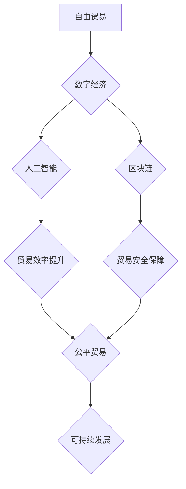

                 

## 2050年的全球贸易：从自由化到公平化的经济秩序

> 关键词：全球贸易、公平贸易、人工智能、区块链、数字经济、数据隐私、跨境合作、可持续发展

### 1. 背景介绍

21世纪初，全球化浪潮席卷全球，自由贸易成为主导思想，国际贸易体系日益完善。然而，随着经济发展的不平衡和科技进步的加速，自由贸易模式也逐渐暴露其弊端。

一方面，自由贸易导致发达国家对发展中国家资源的过度依赖，加剧了贫富差距，引发了社会不稳定。另一方面，数字经济的兴起带来了新的挑战，数据隐私、算法偏见等问题日益突出，加剧了全球贸易的不确定性。

面对这些挑战，2050年全球贸易体系将迎来一场深刻变革，从单纯的自由化向更加公平、可持续的方向发展。

### 2. 核心概念与联系

**2.1  公平贸易**

公平贸易是指在贸易过程中，所有参与者都能获得公平的待遇，并确保贸易活动对环境和社会具有积极影响。它强调贸易的伦理性和可持续性，旨在构建更加公正、包容的全球经济秩序。

**2.2  数字经济**

数字经济是指以数字技术为基础，以数据为核心要素，以网络为平台，以智能化和数字化为特征的经济形态。数字经济的快速发展，为全球贸易带来了新的机遇和挑战。

**2.3  人工智能**

人工智能（AI）是指模拟人类智能的计算机系统，它能够学习、推理、决策等，在全球贸易中，AI将被广泛应用于物流、供应链管理、贸易结算等领域，提高效率和降低成本。

**2.4  区块链**

区块链是一种分布式账本技术，它能够实现数据安全、透明和不可篡改，在全球贸易中，区块链可以用于贸易融资、供应链追踪、知识产权保护等领域，提高贸易效率和安全性。

**2.5  数据隐私**

数据隐私是指个人信息在收集、使用、存储和传输过程中受到保护的权利。随着数字经济的发展，数据隐私问题日益突出，全球贸易体系需要建立更加完善的数据隐私保护机制。

**2.6  跨境合作**

跨境合作是指不同国家和地区之间在经济、科技、文化等领域的合作。在全球贸易体系的变革过程中，跨境合作将发挥越来越重要的作用，共同应对全球挑战。

**2.7  可持续发展**

可持续发展是指满足当前需求，同时不损害后代满足其自身需求的能力。在全球贸易体系的变革过程中，可持续发展将成为核心目标，推动贸易活动更加环保和社会责任感。

**Mermaid 流程图**



### 3. 核心算法原理 & 具体操作步骤

**3.1  算法原理概述**

在2050年的全球贸易体系中，人工智能算法将发挥关键作用，例如：

* **预测算法**: 利用历史数据和市场趋势，预测商品价格、需求量等，帮助企业制定更精准的贸易策略。
* **优化算法**: 优化物流路线、仓储管理、运输调度等，提高贸易效率和降低成本。
* **风险评估算法**: 分析贸易伙伴的信用风险、政治风险等，帮助企业规避风险。

**3.2  算法步骤详解**

以预测算法为例，其具体操作步骤如下：

1. **数据收集**: 收集历史商品价格、市场需求、经济指标等相关数据。
2. **数据预处理**: 对收集到的数据进行清洗、转换、归一化等处理，使其适合算法训练。
3. **模型选择**: 选择合适的机器学习模型，例如线性回归、决策树、神经网络等。
4. **模型训练**: 利用训练数据训练模型，使其能够学习到数据中的规律。
5. **模型评估**: 利用测试数据评估模型的预测精度，并进行调整优化。
6. **预测**: 将模型应用于新的数据，预测未来商品价格、需求量等。

**3.3  算法优缺点**

* **优点**: 能够提高预测精度，帮助企业做出更明智的决策。
* **缺点**: 依赖于数据质量，数据偏差会导致预测结果不准确。

**3.4  算法应用领域**

* 商品价格预测
* 需求量预测
* 贸易风险评估
* 物流优化
* 供应链管理

### 4. 数学模型和公式 & 详细讲解 & 举例说明

**4.1  数学模型构建**

在预测算法中，常用的数学模型是线性回归模型，其数学表达式如下：

$$y = mx + c$$

其中：

* $y$ 是预测值
* $x$ 是输入变量
* $m$ 是斜率
* $c$ 是截距

**4.2  公式推导过程**

线性回归模型的目的是找到一条直线，使得预测值与实际值之间的误差最小。可以使用最小二乘法来推导模型参数 $m$ 和 $c$。

**4.3  案例分析与讲解**

假设我们想要预测商品价格，输入变量是商品的历史价格，输出变量是未来商品价格。我们可以收集历史商品价格数据，并使用线性回归模型进行训练。训练完成后，我们可以使用模型预测未来商品价格。

### 5. 项目实践：代码实例和详细解释说明

**5.1  开发环境搭建**

* Python 3.x
* Jupyter Notebook
* scikit-learn

**5.2  源代码详细实现**

```python
import pandas as pd
from sklearn.linear_model import LinearRegression

# 加载数据
data = pd.read_csv('商品价格数据.csv')

# 分割数据
X = data[['历史价格']]
y = data['未来价格']

# 创建线性回归模型
model = LinearRegression()

# 训练模型
model.fit(X, y)

# 预测未来价格
future_price = model.predict([[100]])

# 打印预测结果
print(future_price)
```

**5.3  代码解读与分析**

* 首先，我们使用 pandas 库加载商品价格数据。
* 然后，我们使用 scikit-learn 库中的 LinearRegression 类创建线性回归模型。
* 接着，我们使用模型的 fit() 方法训练模型，并将训练数据输入模型。
* 最后，我们使用模型的 predict() 方法预测未来商品价格，并将预测结果打印出来。

**5.4  运行结果展示**

运行代码后，将输出预测的未来商品价格。

### 6. 实际应用场景

**6.1  跨境电商平台**

跨境电商平台可以利用预测算法预测商品需求量，优化库存管理，提高销售效率。

**6.2  国际贸易金融机构**

国际贸易金融机构可以利用风险评估算法评估贸易伙伴的信用风险，降低贷款风险。

**6.3  物流企业**

物流企业可以利用优化算法优化物流路线，提高运输效率，降低运输成本。

**6.4  未来应用展望**

随着人工智能技术的不断发展，其在全球贸易中的应用场景将更加广泛，例如：

* **智能合同**: 利用区块链技术和人工智能技术，自动执行贸易合同，提高交易效率和安全性。
* **贸易数据分析**: 利用大数据分析技术，挖掘贸易数据中的价值，为企业提供更精准的决策支持。
* **个性化贸易服务**: 利用人工智能技术，为不同客户提供个性化的贸易服务，提高客户满意度。

### 7. 工具和资源推荐

**7.1  学习资源推荐**

* **Coursera**: 提供人工智能、机器学习等相关课程。
* **edX**: 提供区块链、数据科学等相关课程。
* **Udacity**: 提供人工智能、数据分析等相关课程。

**7.2  开发工具推荐**

* **Python**: 广泛应用于人工智能、数据科学等领域。
* **Jupyter Notebook**: 用于编写和运行Python代码，并可视化数据。
* **TensorFlow**: 开源深度学习框架。
* **PyTorch**: 开源深度学习框架。

**7.3  相关论文推荐**

* **Attention Is All You Need**: 提出Transformer模型，用于自然语言处理任务。
* **Deep Learning**: 深度学习入门书籍。
* **Blockchain Revolution**: 区块链技术应用书籍。

### 8. 总结：未来发展趋势与挑战

**8.1  研究成果总结**

2050年的全球贸易体系将更加智能化、数字化、公平化。人工智能、区块链等新技术将推动贸易活动更加高效、安全、可持续。

**8.2  未来发展趋势**

* **智能化贸易**: 利用人工智能技术，实现贸易流程的自动化和智能化。
* **数据驱动贸易**: 利用大数据分析技术，挖掘贸易数据中的价值，为企业提供更精准的决策支持。
* **去中心化贸易**: 利用区块链技术，构建更加透明、安全、可信的贸易平台。

**8.3  面临的挑战**

* **数据安全**: 随着数据量的增加，数据安全问题日益突出。
* **算法偏见**: 人工智能算法可能存在偏见，导致不公平的贸易结果。
* **跨境合作**: 不同国家和地区的法律法规、文化差异等，可能阻碍跨境合作。

**8.4  研究展望**

未来研究需要关注以下几个方面：

* **开发更加安全、可靠的人工智能算法。**
* **建立更加完善的数据隐私保护机制。**
* **促进跨境合作，构建更加公平、可持续的全球贸易体系。**

### 9. 附录：常见问题与解答

**9.1  Q: 人工智能是否会取代人类在贸易中的角色？**

**A:** 人工智能可以提高贸易效率，但不会完全取代人类。人类仍然需要发挥创造力、判断力和沟通能力，在贸易中扮演重要的角色。

**9.2  Q: 区块链技术如何应用于全球贸易？**

**A:** 区块链技术可以用于贸易融资、供应链追踪、知识产权保护等领域，提高贸易效率和安全性。

**9.3  Q: 如何应对数据安全和隐私问题？**

**A:** 需要建立更加完善的数据隐私保护机制，并加强数据安全技术的研究和应用。


作者：禅与计算机程序设计艺术 / Zen and the Art of Computer Programming 
<end_of_turn>

