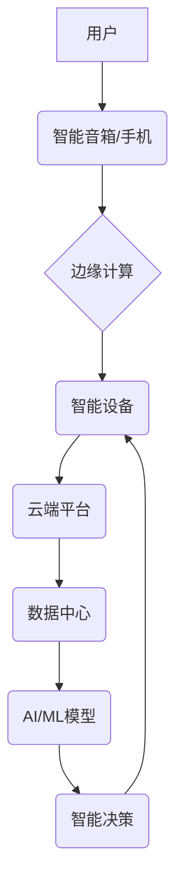

                 

## 2050年的智能家居：从便利到智慧的生活方式

> 关键词：智能家居、人工智能、机器学习、自然语言处理、物联网、边缘计算、预测分析、用户体验

### 1. 背景介绍

智能家居的概念已经不再新鲜，从简单的智能照明和温控系统，到如今的语音控制、场景联动和远程管理，智能家居技术已经渗透到我们的日常生活。然而，我们所处的时代正处于一个飞速发展的阶段，人工智能、机器学习、自然语言处理等技术的进步将彻底改变智能家居的形态，使其不再仅仅是“智能”，而是真正成为“智慧”。

2050年，智能家居将不再是简单的设备连接和自动化控制，而是成为一个高度个性化、自适应、预见未来的智慧生活平台。它将深度融入我们的生活，理解我们的需求，预测我们的行为，并主动提供解决方案，最终实现“人机协同”的智慧生活方式。

### 2. 核心概念与联系

**2.1 核心概念**

* **人工智能 (AI):**  人工智能是赋予机器人类智能的能力，包括学习、推理、决策、感知和理解等。在智能家居中，AI将用于理解用户的需求，预测用户的行为，并提供个性化的服务。
* **机器学习 (ML):** 机器学习是人工智能的一个子领域，它通过算法学习数据，并从中发现模式和规律。在智能家居中，机器学习可以用于个性化推荐、行为预测、异常检测等。
* **自然语言处理 (NLP):** 自然语言处理是让计算机理解和处理人类语言的技术。在智能家居中，NLP可以用于语音控制、文本对话、情感识别等。
* **物联网 (IoT):** 物联网是指各种设备通过网络互联互通，形成一个庞大的数据网络。智能家居的核心是物联网，它连接了各种智能设备，并通过数据交换实现智能化控制。
* **边缘计算:** 边缘计算是指将计算任务从云端转移到更靠近数据源的设备上，例如智能家居中的路由器、智能音箱等。边缘计算可以提高计算效率，降低延迟，并增强智能家居的安全性。

**2.2 架构图**



**2.3 核心联系**

智能家居的核心是将以上核心概念有机结合，形成一个闭环的智慧生活系统。用户通过智能音箱或手机与系统交互，边缘计算平台负责数据处理和本地决策，智能设备根据指令执行控制，云端平台提供数据存储、分析和模型训练服务，AI/ML模型则负责学习用户行为，提供个性化服务和预测未来需求。

### 3. 核心算法原理 & 具体操作步骤

**3.1 算法原理概述**

智能家居的核心算法主要包括：

* **机器学习算法:** 用于学习用户行为模式，预测用户需求，例如推荐个性化内容、自动调节温度和灯光等。常见的机器学习算法包括决策树、支持向量机、神经网络等。
* **自然语言处理算法:** 用于理解用户的语音指令和文本输入，并将其转换为机器可执行的指令。常见的自然语言处理算法包括词性标注、依存句法分析、情感识别等。
* **预测分析算法:** 用于分析历史数据，预测未来的事件，例如预测用户的用电量、用水量等，并根据预测结果进行提前预警或优化资源分配。常见的预测分析算法包括ARIMA、LSTM等。

**3.2 算法步骤详解**

以机器学习算法为例，其具体操作步骤如下：

1. **数据收集:** 收集用户行为数据，例如使用时间、设备操作、环境参数等。
2. **数据预处理:** 对收集到的数据进行清洗、转换、特征提取等操作，使其适合机器学习算法的训练。
3. **模型选择:** 根据具体应用场景选择合适的机器学习算法，例如回归算法用于预测连续值，分类算法用于分类问题。
4. **模型训练:** 使用训练数据训练选择的机器学习模型，调整模型参数，使其能够准确预测用户需求。
5. **模型评估:** 使用测试数据评估模型的性能，例如准确率、召回率、F1-score等。
6. **模型部署:** 将训练好的模型部署到智能家居系统中，使其能够实时预测用户需求并提供相应的服务。

**3.3 算法优缺点**

* **优点:**

    * 能够学习用户行为模式，提供个性化服务。
    * 能够预测用户需求，提前预警和优化资源分配。
    * 能够不断学习和改进，提高服务质量。

* **缺点:**

    * 需要大量的数据进行训练，数据质量直接影响模型性能。
    * 模型训练需要一定的时间和计算资源。
    * 模型解释性较差，难以理解模型的决策过程。

**3.4 算法应用领域**

* **个性化推荐:** 推荐用户喜欢的音乐、电影、书籍等内容。
* **场景联动:** 根据用户的指令或行为，自动联动智能设备，例如打开灯光、调节温度等。
* **异常检测:** 检测设备故障或安全威胁，并及时报警。
* **资源优化:** 根据用户的用电、用水等情况，优化资源分配，降低能源消耗。

### 4. 数学模型和公式 & 详细讲解 & 举例说明

**4.1 数学模型构建**

智能家居中的预测分析模型通常采用时间序列分析模型，例如ARIMA模型。ARIMA模型假设时间序列数据具有自相关性，即未来的值与过去的某个时间点的值相关。

**4.2 公式推导过程**

ARIMA模型的数学公式如下：

$$
y_t = c + \phi_1 y_{t-1} + \phi_2 y_{t-2} + ... + \phi_p y_{t-p} + \theta_1 \epsilon_{t-1} + \theta_2 \epsilon_{t-2} + ... + \theta_q \epsilon_{t-q} + \epsilon_t
$$

其中：

* $y_t$ 是时间t的观测值。
* $c$ 是截距项。
* $\phi_i$ 是自回归系数。
* $p$ 是自回归阶数。
* $\theta_i$ 是移动平均系数。
* $q$ 是移动平均阶数。
* $\epsilon_t$ 是白噪声项。

**4.3 案例分析与讲解**

假设我们想要预测用户的用电量。我们可以收集用户的过去一段时间内的用电数据，并使用ARIMA模型对其进行建模。通过训练模型，我们可以得到模型的参数，例如自回归系数和移动平均系数。然后，我们可以使用这些参数预测未来的用电量。

### 5. 项目实践：代码实例和详细解释说明

**5.1 开发环境搭建**

* 操作系统: Ubuntu 20.04
* Python 版本: 3.8
* 必要的库: TensorFlow, PyTorch, scikit-learn, Flask

**5.2 源代码详细实现**

```python
# 使用 TensorFlow 建立一个简单的 ARIMA 模型
import tensorflow as tf

# 定义模型结构
model = tf.keras.Sequential([
    tf.keras.layers.Input(shape=(timesteps,)),
    tf.keras.layers.LSTM(units=64),
    tf.keras.layers.Dense(units=1)
])

# 编译模型
model.compile(loss='mean_squared_error', optimizer='adam')

# 训练模型
model.fit(X_train, y_train, epochs=100)

# 预测未来时间步长的值
predictions = model.predict(X_test)
```

**5.3 代码解读与分析**

* 代码首先使用 TensorFlow 库建立一个简单的 ARIMA 模型。
* 模型结构采用 LSTM 层，用于学习时间序列数据中的长期依赖关系。
* 模型使用均方误差作为损失函数，Adam 优化器进行训练。
* 训练完成后，可以使用模型预测未来时间步长的值。

**5.4 运行结果展示**

运行结果可以展示模型的预测精度，例如使用均方根误差 (RMSE) 评估模型的预测性能。

### 6. 实际应用场景

**6.1 智能家居场景**

* **个性化照明:** 根据用户的活动时间和喜好，自动调节灯光亮度和色温，营造舒适的氛围。
* **智能温控:** 根据用户的温度偏好和环境温度，自动调节空调温度，节省能源。
* **场景联动:** 根据用户的指令或行为，自动联动智能设备，例如打开灯光、调节温度、播放音乐等。
* **安全保障:** 通过智能摄像头和传感器，检测异常情况，例如入侵、火灾等，并及时报警。

**6.2 其他应用场景**

* **智慧医疗:** 监测用户的健康数据，例如血压、心率等，并提供个性化的健康建议。
* **智慧教育:** 根据学生的学习进度和需求，提供个性化的学习内容和辅导。
* **智慧城市:** 优化城市资源分配，提高城市管理效率。

**6.4 未来应用展望**

随着人工智能技术的不断发展，智能家居将更加智能化、个性化和人性化。未来，智能家居将能够：

* 更深入地理解用户的需求，提供更精准的个性化服务。
* 更主动地预测用户的行为，并提前提供解决方案。
* 更智能地管理家庭资源，提高能源效率和生活质量。
* 更安全可靠地保护用户的隐私和安全。

### 7. 工具和资源推荐

**7.1 学习资源推荐**

* **书籍:**
    * 《深度学习》
    * 《机器学习实战》
    * 《自然语言处理入门》
* **在线课程:**
    * Coursera: 深度学习、机器学习
    * edX: 自然语言处理、人工智能
* **开源项目:**
    * TensorFlow
    * PyTorch
    * scikit-learn

**7.2 开发工具推荐**

* **编程语言:** Python
* **机器学习框架:** TensorFlow, PyTorch
* **物联网平台:** AWS IoT, Azure IoT, Google Cloud IoT
* **云计算平台:** AWS, Azure, Google Cloud

**7.3 相关论文推荐**

* 《Attention Is All You Need》
* 《BERT: Pre-training of Deep Bidirectional Transformers for Language Understanding》
* 《Generative Adversarial Networks》

### 8. 总结：未来发展趋势与挑战

**8.1 研究成果总结**

近年来，人工智能、机器学习、自然语言处理等技术的快速发展，为智能家居的构建提供了强大的技术支撑。智能家居已经从简单的自动化控制发展到能够理解用户需求、预测用户行为、提供个性化服务的智慧生活平台。

**8.2 未来发展趋势**

* **更强的智能化:** 智能家居将更加智能化，能够更深入地理解用户的需求，提供更精准的个性化服务。
* **更广泛的应用场景:** 智能家居将应用于更多场景，例如智慧医疗、智慧教育、智慧城市等。
* **更安全的隐私保护:** 智能家居将更加注重用户的隐私保护，采用更安全的加密和数据处理技术。

**8.3 面临的挑战**

* **数据安全和隐私保护:** 智能家居收集大量用户数据，如何确保数据的安全和隐私保护是重要的挑战。
* **算法解释性和可信度:** 许多机器学习算法的决策过程难以解释，如何提高算法的解释性和可信度是重要的研究方向。
* **技术标准和互操作性:** 不同厂商的智能家居设备缺乏统一的标准和互操作性，如何实现设备之间的互联互通是重要的挑战。

**8.4 研究展望**

未来，智能家居的研究将更加注重以下几个方面:

* **发展更安全、更可靠的机器学习算法:** 研究更可解释、更鲁棒的机器学习算法，提高算法的安全性、可靠性和可信度。
* **探索更深入的用户行为理解:** 研究更有效的用户行为建模方法，更深入地理解用户的需求和行为模式。
* **推动智能家居标准化和互操作性:** 推动智能家居行业标准的制定和推广，实现不同厂商设备的互联互通。


### 9. 附录：常见问题与解答

**9.1 如何确保智能家居的安全性？**

智能家居的安全是一个重要的考虑因素。为了确保安全，建议采取以下措施：

* 使用强密码保护智能家居设备。
* 定期更新设备的固件和软件。
* 使用安全的网络连接，例如 WPA2 加密。
* 谨慎选择智能家居设备的品牌和供应商。

**9.2 如何保护智能家居中的用户数据？**

智能家居收集大量用户数据，因此保护用户数据安全至关重要。建议采取以下措施：

* 选择支持数据加密和匿名化的智能家居设备。
* 了解智能家居设备的数据收集和使用政策。
* 限制智能家居设备对用户数据的访问权限。

**9.3 智能家居的未来发展趋势是什么？**

智能家居的未来发展趋势包括：

* 更强的智能化
* 更广泛的应用场景
* 更安全的隐私保护

**9.4 如何学习智能家居开发？**

学习智能家居开发需要掌握以下知识和技能：

* 编程语言 (例如 Python)
* 机器学习
* 自然语言处理
* 物联网技术
* 云计算技术


作者：禅与计算机程序设计艺术 / Zen and the Art of Computer Programming 
<end_of_turn>

