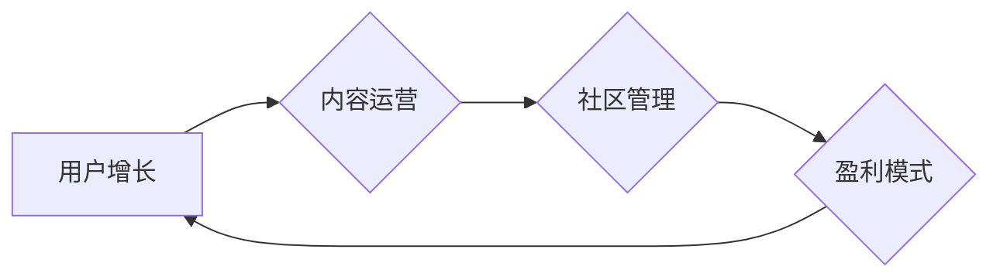

                 

## 技术社区运营：从管理到盈利模式

> 关键词：技术社区、社区运营、盈利模式、用户增长、内容运营、商业化

> 摘要：本文探讨了技术社区运营的本质，从社区建设、用户增长、内容运营到盈利模式，详细分析了各个环节的关键要素和最佳实践。通过案例分析和数学模型构建，阐述了社区运营的科学性和可持续发展之道，并展望了未来技术社区的发展趋势和挑战。

## 1. 背景介绍

1.1 技术社区的兴起

随着互联网的普及和科技的飞速发展，技术社区作为一种新型的社交平台和知识共享平台，迅速崛起。技术社区为开发者、工程师、爱好者等提供了一个交流学习、分享经验、解决问题和探索创新的平台。

1.2 技术社区的价值

技术社区为个人和企业都带来了巨大的价值：

* **个人价值:**  
    * 拓展人脉，结识志同道合的朋友。
    * 学习新技术，提升专业技能。
    * 分享经验，获得反馈和帮助。
    * 参与开源项目，贡献自己的力量。
* **企业价值:**
    * 吸引和留住人才。
    * 了解用户需求，收集反馈意见。
    * 推广产品和服务，建立品牌形象。
    * 挖掘创新点，促进技术发展。

1.3 技术社区运营的挑战

尽管技术社区具有巨大的价值，但运营一个成功的技术社区也面临着诸多挑战：

* **用户增长:** 如何吸引和留住用户，构建活跃的社区氛围。
* **内容运营:** 如何提供高质量、有价值的内容，满足用户的需求。
* **社区管理:** 如何维护社区秩序，营造良好的社区环境。
* **盈利模式:** 如何实现社区的可持续发展，探索合理的盈利模式。

## 2. 核心概念与联系

技术社区运营是一个复杂的系统工程，涉及到多个核心概念和环节之间的相互联系。

**Mermaid 流程图:**



2.1 用户增长

用户增长是技术社区运营的核心目标之一。通过有效的营销策略、内容推广和社区活动，吸引更多用户加入社区，并提高用户活跃度。

2.2 内容运营

高质量的内容是吸引和留住用户的关键因素。技术社区需要提供有价值、丰富多彩的内容，满足用户的学习、交流和娱乐需求。

2.3 社区管理

良好的社区管理环境是社区可持续发展的基础。社区运营者需要制定合理的社区规则，维护社区秩序，营造良好的社区氛围。

2.4 盈利模式

技术社区的盈利模式可以多种多样，例如会员制度、广告投放、赞助合作、知识付费等。

## 3. 核心算法原理 & 具体操作步骤

3.1 算法原理概述

用户增长算法是技术社区运营中常用的算法之一，其目的是通过分析用户行为数据，预测用户增长趋势，并制定相应的策略。

3.2 算法步骤详解

1. 收集用户行为数据：包括用户注册、登录、浏览、评论、点赞等行为。
2. 数据清洗和预处理：去除无效数据，处理缺失值，将数据转换为算法可处理的格式。
3. 特征工程：提取用户行为数据中的特征，例如用户活跃度、参与度、兴趣标签等。
4. 模型训练：使用机器学习算法，例如回归模型、分类模型等，对用户行为数据进行建模，预测用户增长趋势。
5. 模型评估：使用测试数据评估模型的准确性，并进行模型调优。
6. 推理和策略制定：根据模型预测结果，制定相应的用户增长策略，例如精准营销、内容推荐、社区活动策划等。

3.3 算法优缺点

* **优点:**
    * 可以准确预测用户增长趋势，为社区运营提供数据支持。
    * 可以根据用户行为数据，制定个性化的用户增长策略。
* **缺点:**
    * 需要大量的用户行为数据进行训练。
    * 模型的准确性受数据质量和算法选择的影响。

3.4 算法应用领域

用户增长算法广泛应用于技术社区运营、电商平台运营、社交媒体运营等领域。

## 4. 数学模型和公式 & 详细讲解 & 举例说明

4.1 数学模型构建

用户增长模型可以采用Logistic增长模型来描述：

$$
\frac{dN}{dt} = rN\left(1-\frac{N}{K}\right)
$$

其中：

* $N$：用户数量
* $t$：时间
* $r$：增长率
* $K$：承载容量

4.2 公式推导过程

Logistic增长模型假设用户增长率与当前用户数量成正比，但随着用户数量的增加，增长率会逐渐减缓，最终趋于稳定。

4.3 案例分析与讲解

假设一个技术社区的初始用户数量为100人，增长率为0.1，承载容量为1000人。

根据Logistic增长模型，我们可以计算出该社区的用户增长趋势：

* 当用户数量较少时，增长率较高，用户数量增长迅速。
* 当用户数量接近承载容量时，增长率逐渐减缓，用户数量增长趋于稳定。

## 5. 项目实践：代码实例和详细解释说明

5.1 开发环境搭建

* 语言：Python
* 库：NumPy、Pandas、Scikit-learn

5.2 源代码详细实现

```python
import numpy as np
from sklearn.linear_model import LogisticRegression

# 数据加载和预处理
# ...

# 模型训练
model = LogisticRegression()
model.fit(X_train, y_train)

# 模型评估
# ...

# 推理和策略制定
# ...
```

5.3 代码解读与分析

* 数据加载和预处理：将用户行为数据加载到内存，并进行清洗和预处理。
* 模型训练：使用LogisticRegression模型对用户行为数据进行训练，学习用户增长趋势。
* 模型评估：使用测试数据评估模型的准确性，并进行模型调优。
* 推理和策略制定：根据模型预测结果，制定相应的用户增长策略。

5.4 运行结果展示

* 用户增长趋势预测图
* 用户增长策略建议

## 6. 实际应用场景

6.1 案例分析

* GitHub：开源代码托管平台，通过社区运营吸引了大量开发者，形成了庞大的开源生态系统。
* Stack Overflow：技术问答网站，通过高质量的内容和活跃的社区氛围，成为了开发者求助和交流的必备平台。

6.2 未来应用展望

* 人工智能技术将进一步提升技术社区运营的效率和智能化水平。
* 社区运营将更加注重用户体验和个性化服务。
* 技术社区将成为更多领域知识共享和创新孵化的平台。

## 7. 工具和资源推荐

7.1 学习资源推荐

* 书籍：《社区运营实战》、《用户增长黑客》
* 网站：社区运营博客、技术社区论坛

7.2 开发工具推荐

* 社区平台搭建工具：Discourse、NodeBB
* 数据分析工具：Google Analytics、Matomo
* 社区管理工具：Slack、Discord

7.3 相关论文推荐

* 《The Anatomy of a Successful Online Community》
* 《Growth Hacking: A Practical Guide to User Acquisition》

## 8. 总结：未来发展趋势与挑战

8.1 研究成果总结

技术社区运营是一个不断发展和演进的领域，通过对用户行为数据分析、算法模型构建和实践案例研究，我们对技术社区运营的本质、关键要素和最佳实践有了更深入的理解。

8.2 未来发展趋势

* 人工智能技术将更加广泛地应用于技术社区运营，例如智能内容推荐、个性化社区管理、自动用户客服等。
* 社区运营将更加注重用户体验和社区生态建设，例如打造更友好的社区氛围、提供更丰富的社区活动、鼓励用户参与社区建设等。
* 技术社区将成为更多领域知识共享和创新孵化的平台，例如教育、医疗、金融等领域。

8.3 面临的挑战

* 如何应对用户增长放缓的挑战，保持社区活跃度。
* 如何有效管理社区规模的增长，维护社区秩序和用户体验。
* 如何探索新的盈利模式，实现社区的可持续发展。

8.4 研究展望

未来研究将更加关注以下几个方面：

* 人工智能技术在技术社区运营中的应用研究。
* 社区生态建设和用户参与度提升的研究。
* 技术社区的商业化模式和盈利策略研究。


## 9. 附录：常见问题与解答

9.1 如何吸引用户加入社区？

* 提供有价值、有吸引力的内容。
* 举办线下和线上活动，增强用户互动。
* 利用社交媒体平台进行推广。
* 与其他社区合作，互推用户。

9.2 如何维护社区秩序？

* 制定合理的社区规则，并进行宣传和引导。
* 建立有效的举报机制，及时处理违规行为。
* 培养社区志愿者，协助维护社区秩序。

9.3 如何实现社区盈利？

* 会员制度：提供付费会员服务，享受更多权益。
* 广告投放：在社区平台上投放广告。
* 赞助合作：与企业合作，提供赞助和推广服务。
* 知识付费：提供付费课程、咨询服务等。


作者：禅与计算机程序设计艺术 / Zen and the Art of Computer Programming 
<end_of_turn>

