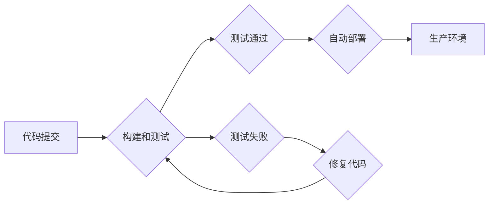

                 

## 持续部署策略：自动化和手动部署的选择

> 关键词：持续部署、自动化部署、手动部署、DevOps、CI/CD、软件发布

### 1. 背景介绍

在当今快速迭代的软件开发环境中，持续部署 (Continuous Deployment) 已成为一种至关重要的实践，它旨在将代码更改自动部署到生产环境，从而加速软件交付，提高可靠性和降低风险。持续部署策略的核心是自动化，它通过自动化构建、测试和部署流程，将软件发布流程简化，并确保每次发布都经过严格的质量控制。

然而，并非所有项目都适合完全自动化部署。一些项目可能需要人工干预，例如部署到特定环境、进行安全审查或处理复杂的环境依赖关系。因此，选择合适的持续部署策略，既要考虑自动化部署的优势，又要兼顾手动部署的必要性，是实现高效软件交付的关键。

### 2. 核心概念与联系

#### 2.1 持续集成 (Continuous Integration)

持续集成 (CI) 是持续部署的基础，它强调频繁地将代码更改合并到主分支，并通过自动化构建和测试流程验证代码质量。CI 旨在早期发现和解决代码错误，从而减少集成问题和降低软件风险。

#### 2.2 持续交付 (Continuous Delivery)

持续交付 (CD) 是 CI 的延伸，它将自动化部署流程扩展到生产环境，但仍然保留人工审批步骤。这意味着代码更改经过 CI 流程验证后，可以自动部署到测试环境和预生产环境，最终通过人工审批部署到生产环境。

#### 2.3 持续部署 (Continuous Deployment)

持续部署 (CD) 是 CD 的进一步发展，它将所有部署步骤自动化，包括人工审批步骤。这意味着代码更改经过 CI 流程验证后，将自动部署到生产环境，无需人工干预。

**Mermaid 流程图**

### 3. 核心算法原理 & 具体操作步骤

#### 3.1 算法原理概述

持续部署策略的核心算法原理是自动化和反馈机制。自动化通过脚本和工具实现构建、测试和部署流程，减少人为错误和提高效率。反馈机制通过监控和日志记录，及时发现问题并触发相应的修复措施。

#### 3.2 算法步骤详解

1. **代码提交:** 开发人员将代码更改提交到版本控制系统 (例如 Git)。
2. **构建和测试:** 构建系统自动构建代码，并运行自动化测试用例，验证代码质量。
3. **测试通过:** 如果所有测试用例都通过，则代码更改将自动部署到下一个环境。
4. **测试失败:** 如果测试用例失败，则需要修复代码并重新提交。
5. **自动部署:** 代码更改经过测试验证后，将自动部署到测试环境、预生产环境和最终生产环境。
6. **监控和日志记录:** 持续监控生产环境，收集日志信息，并触发相应的报警机制，以便及时发现和解决问题。

#### 3.3 算法优缺点

**优点:**

* **加速软件交付:** 自动化部署流程可以显著缩短软件发布周期。
* **提高软件质量:** 自动化测试可以帮助早期发现和解决代码错误，提高软件质量。
* **降低风险:** 自动化部署可以减少人为错误，降低软件发布风险。
* **提高效率:** 自动化部署可以解放开发人员的时间，让他们专注于核心业务逻辑。

**缺点:**

* **初始成本较高:** 建立持续部署系统需要投入一定的成本，包括工具、培训和维护。
* **需要专业技能:** 持续部署需要具备一定的自动化运维和软件开发技能。
* **可能存在安全风险:** 自动化部署需要确保安全措施到位，防止恶意代码或错误配置导致安全漏洞。

#### 3.4 算法应用领域

持续部署策略广泛应用于各种软件开发领域，例如：

* **Web 应用开发:** 持续部署可以帮助快速迭代和发布 Web 应用，满足用户不断变化的需求。
* **移动应用开发:** 持续部署可以帮助快速发布移动应用更新，并及时修复 bug。
* **云计算平台:** 持续部署可以帮助快速部署和管理云计算资源，提高平台的弹性和可靠性。

### 4. 数学模型和公式 & 详细讲解 & 举例说明

持续部署策略可以利用数学模型来分析和优化软件发布流程。例如，可以使用 **蒙特卡罗模拟** 来评估不同部署策略的风险和收益，并选择最优的部署策略。

**4.1 数学模型构建**

假设一个软件项目有 N 个代码更改，每个代码更改的发布风险为 p。我们可以构建一个二项分布模型来模拟软件发布过程中的风险。

**4.2 公式推导过程**

二项分布的概率质量函数为：

$$P(X=k) = \binom{N}{k} p^k (1-p)^{N-k}$$

其中：

* X 是随机变量，表示发布过程中出现错误的代码更改数量。
* k 是错误代码更改的数量。
* N 是总代码更改数量。
* p 是每个代码更改的发布风险。

**4.3 案例分析与讲解**

假设一个软件项目有 100 个代码更改，每个代码更改的发布风险为 0.01。我们可以使用二项分布模型来计算发布过程中出现 0、1、2 个错误代码更改的概率。

* P(X=0) =  $\binom{100}{0} 0.01^0 (0.99)^{100}$
* P(X=1) =  $\binom{100}{1} 0.01^1 (0.99)^{99}$
* P(X=2) =  $\binom{100}{2} 0.01^2 (0.99)^{98}$

通过计算这些概率，我们可以评估软件发布过程中的风险，并选择合适的部署策略。

### 5. 项目实践：代码实例和详细解释说明

#### 5.1 开发环境搭建

持续部署系统通常需要以下开发环境：

* 版本控制系统 (例如 Git)
* 构建工具 (例如 Jenkins, GitLab CI)
* 测试框架 (例如 JUnit, pytest)
* 部署工具 (例如 Ansible, Docker)

#### 5.2 源代码详细实现

持续部署系统的源代码实现通常包括以下部分：

* **构建脚本:** 用于构建软件项目，例如编译代码、打包应用程序。
* **测试脚本:** 用于运行自动化测试用例，验证软件质量。
* **部署脚本:** 用于将软件部署到不同的环境，例如测试环境、预生产环境和生产环境。

#### 5.3 代码解读与分析

持续部署系统的代码需要清晰易懂，并遵循一定的编码规范。代码注释应该详细说明代码的功能和逻辑，以便其他开发人员能够理解和维护代码。

#### 5.4 运行结果展示

持续部署系统的运行结果应该能够清晰地展示软件构建、测试和部署的状态，例如构建成功或失败、测试通过或失败、部署成功或失败。

### 6. 实际应用场景

#### 6.1 实际应用场景

持续部署策略广泛应用于各种软件开发场景，例如：

* **电商平台:** 持续部署可以帮助电商平台快速迭代和发布新功能，并及时修复 bug，以满足用户不断变化的需求。
* **金融系统:** 持续部署可以帮助金融系统提高软件可靠性和安全性，并确保系统能够及时响应市场变化。
* **医疗软件:** 持续部署可以帮助医疗软件快速发布更新，并及时修复 bug，以确保患者安全和医疗服务质量。

#### 6.2 未来应用展望

随着云计算、容器化和微服务架构的普及，持续部署策略将变得更加重要。未来，持续部署将更加智能化、自动化和安全，并与人工智能、机器学习等新技术深度融合。

### 7. 工具和资源推荐

#### 7.1 学习资源推荐

* **书籍:**
    * "The Phoenix Project: A Novel About IT, DevOps, and Helping Your Business Win" by Gene Kim, Kevin Behr, and George Spafford
    * "Continuous Delivery: Reliable Software Releases through Build, Test, and Deployment Automation" by Jez Humble and David Farley
* **在线课程:**
    * Udemy: Continuous Integration and Continuous Delivery (CI/CD)
    * Coursera: DevOps Fundamentals

#### 7.2 开发工具推荐

* **版本控制系统:** Git
* **构建工具:** Jenkins, GitLab CI, CircleCI
* **测试框架:** JUnit, pytest, Selenium
* **部署工具:** Ansible, Docker, Kubernetes

#### 7.3 相关论文推荐

* "Continuous Delivery: A Practical Guide to Automated Software Releases" by Jez Humble and David Farley
* "The DevOps Handbook: How to Create World-Class Agility, Reliability, and Security in Technology Organizations" by Gene Kim, Jez Humble, Patrick Debois, and John Willis

### 8. 总结：未来发展趋势与挑战

#### 8.1 研究成果总结

持续部署策略已经成为现代软件开发的重要实践，它可以显著提高软件交付效率、降低软件风险和提高软件质量。

#### 8.2 未来发展趋势

未来，持续部署策略将更加智能化、自动化和安全，并与人工智能、机器学习等新技术深度融合。

#### 8.3 面临的挑战

持续部署策略的实施仍然面临一些挑战，例如：

* **文化转变:** 持续部署需要组织文化和流程的转变，需要团队成员具备协作精神和持续改进意识。
* **技术复杂性:** 持续部署系统需要具备一定的技术复杂性，需要具备相应的技术技能和经验。
* **安全风险:** 持续部署需要确保安全措施到位，防止恶意代码或错误配置导致安全漏洞。

#### 8.4 研究展望

未来研究方向包括：

* **人工智能驱动的持续部署:** 利用人工智能技术自动优化部署策略、预测部署风险和自动修复问题。
* **安全持续部署:** 研究和开发更加安全的持续部署系统，防止恶意攻击和数据泄露。
* **持续部署的最佳实践:** 研究和总结不同行业和项目类型的最佳持续部署实践，并提供相应的指导和建议。

### 9. 附录：常见问题与解答

#### 9.1 常见问题

* **持续部署和持续交付有什么区别？**

持续交付 (CD) 是 CI 的延伸，它将自动化部署流程扩展到生产环境，但仍然保留人工审批步骤。持续部署 (CD) 是 CD 的进一步发展，它将所有部署步骤自动化，包括人工审批步骤。

* **如何选择合适的持续部署工具？**

选择合适的持续部署工具需要考虑项目的具体需求，例如项目规模、技术栈、团队规模和预算等因素。

* **如何实施持续部署？**

实施持续部署需要进行以下步骤：

1. 建立持续集成流程。
2. 选择合适的持续部署工具。
3. 编写构建、测试和部署脚本。
4. 配置持续部署系统。
5. 进行测试和验证。
6. 部署到生产环境。

* **持续部署有哪些风险？**

持续部署的风险包括：

* 软件发布失败
* 安全漏洞
* 数据丢失

* **如何降低持续部署的风险？**

降低持续部署的风险可以通过以下措施：

* 完善测试流程
* 加强安全措施
* 进行充分的风险评估和应急预案

作者：禅与计算机程序设计艺术 / Zen and the Art of Computer Programming 
<end_of_turn>

