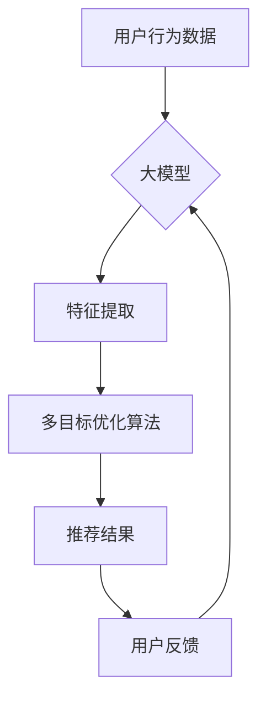

                 

## 推荐系统中的多目标优化：大模型的新突破

> 关键词：推荐系统、多目标优化、大模型、深度学习、强化学习、个性化推荐、协同过滤、内容过滤

## 1. 背景介绍

推荐系统作为信息过滤和个性化内容呈现的关键技术，在电商、社交媒体、视频平台等领域发挥着越来越重要的作用。传统的推荐系统主要基于协同过滤和内容过滤算法，但随着用户行为数据量的激增和推荐场景的多样化，这些算法面临着越来越多的挑战。

近年来，大模型的兴起为推荐系统带来了新的机遇。大模型凭借其强大的学习能力和泛化能力，能够从海量数据中学习到更丰富的用户偏好和物品特征，从而提供更精准、更个性化的推荐结果。然而，大模型的训练和部署也带来了新的挑战，例如模型规模庞大、计算资源消耗高、训练效率低等。

多目标优化作为一种解决复杂问题的新方法，能够有效地平衡不同目标之间的冲突，从而提高推荐系统的整体性能。在推荐系统中，多目标优化可以用来平衡推荐的准确性、多样性、新鲜度等多个目标，从而提供更符合用户需求的推荐结果。

## 2. 核心概念与联系

### 2.1 推荐系统中的多目标优化

推荐系统中的多目标优化是指在推荐过程中同时优化多个目标函数，例如：

* **准确性:** 推荐结果与用户真实偏好之间的匹配程度。
* **多样性:** 推荐结果的种类和范围。
* **新鲜度:** 推荐结果的时效性和新颖性。
* **覆盖率:** 推荐结果能够覆盖的用户群体范围。

这些目标往往相互冲突，例如提高准确性可能会降低多样性。多目标优化算法可以帮助我们找到一个 Pareto 最优解，即在不损害其他目标的情况下，尽可能地提高一个目标的性能。

### 2.2 大模型在推荐系统中的应用

大模型在推荐系统中的应用主要体现在以下几个方面：

* **特征提取:** 大模型能够从用户行为数据、物品描述等多种数据源中提取更丰富的特征，从而提高推荐的准确性。
* **个性化推荐:** 大模型可以学习到每个用户的个性化偏好，并根据用户的历史行为和当前上下文提供个性化的推荐结果。
* **跨模态推荐:** 大模型可以处理多种类型的输入数据，例如文本、图像、视频等，从而实现跨模态的推荐。

### 2.3 多目标优化与大模型的结合

将多目标优化与大模型结合，可以进一步提高推荐系统的性能。例如，我们可以使用多目标强化学习算法训练大模型，使其能够在多个目标之间进行平衡，从而提供更精准、更个性化的推荐结果。



## 3. 核心算法原理 & 具体操作步骤

### 3.1 算法原理概述

多目标优化算法旨在找到一个 Pareto 最优解，即在不损害其他目标的情况下，尽可能地提高一个目标的性能。常见的多目标优化算法包括：

* **NSGA-II (Non-dominated Sorting Genetic Algorithm II):** 基于遗传算法，通过非支配排序和交叉变异操作，逐步逼近 Pareto 最优解。
* **MOEA/D (Multiobjective Evolutionary Algorithm based on Decomposition):** 将多个目标分解成多个子目标，然后分别优化每个子目标，最终得到一个 Pareto 最优解。
* **TPOT (Tree-based Pipeline Optimization Tool):** 基于机器学习，自动搜索最佳的机器学习模型和超参数组合，以实现多目标优化。

### 3.2 算法步骤详解

以 NSGA-II 算法为例，其具体步骤如下：

1. **初始化种群:** 生成一个初始的种群，每个个体代表一个可能的解决方案。
2. **评估适应度:** 对每个个体进行评估，计算其在所有目标函数上的值。
3. **非支配排序:** 将个体按照其非支配性进行排序，即找到那些没有被其他个体支配的个体。
4. **选择操作:** 从非支配排序的各个层级中选择个体进行交叉变异操作。
5. **交叉变异操作:** 将两个父代个体进行交叉和变异操作，生成新的子代个体。
6. **重复步骤 2-5:** 重复上述步骤，直到达到预设的迭代次数或收敛条件。
7. **输出 Pareto 最优解:** 从最终的种群中选择出 Pareto 最优解。

### 3.3 算法优缺点

**优点:**

* 能够找到多个 Pareto 最优解，提供更丰富的解决方案。
* 适用于复杂的多目标优化问题。
* 具有较强的鲁棒性。

**缺点:**

* 计算复杂度较高，需要大量的计算资源。
* 难以找到全局最优解。
* 需要设置多个参数，需要进行大量的调参工作。

### 3.4 算法应用领域

多目标优化算法广泛应用于各个领域，例如：

* **推荐系统:** 优化推荐的准确性、多样性、新鲜度等多个目标。
* **机器学习:** 优化模型的性能、鲁棒性和可解释性等多个目标。
* **控制系统:** 优化系统的稳定性、响应速度和能源效率等多个目标。
* **金融投资:** 优化投资组合的风险和收益等多个目标。

## 4. 数学模型和公式 & 详细讲解 & 举例说明

### 4.1 数学模型构建

假设我们有一个推荐系统，需要同时优化以下三个目标：

* **准确性:**  $f_1(x)$，表示推荐结果与用户真实偏好之间的匹配程度。
* **多样性:** $f_2(x)$，表示推荐结果的种类和范围。
* **新鲜度:** $f_3(x)$，表示推荐结果的时效性和新颖性。

其中，$x$ 代表推荐系统的参数。

我们的目标是找到一个参数组合 $x^*$，使得 $f_1(x^*)$，$f_2(x^*)$ 和 $f_3(x^*)$ 都达到最大值。

### 4.2 公式推导过程

由于三个目标函数之间存在冲突，因此我们需要使用多目标优化算法来解决这个问题。

例如，我们可以使用 NSGA-II 算法，其目标函数可以定义为：

$$
f(x) = [f_1(x), f_2(x), f_3(x)]
$$

其中，$f(x)$ 是一个三维向量，代表三个目标函数的值。

NSGA-II 算法通过非支配排序和交叉变异操作，逐步逼近 Pareto 最优解。

### 4.3 案例分析与讲解

假设我们有一个电商平台，需要推荐商品给用户。

* **准确性:**  可以使用点击率、购买率等指标来衡量推荐结果的准确性。
* **多样性:**  可以使用推荐商品的种类和范围来衡量推荐结果的多样性。
* **新鲜度:**  可以使用推荐商品的上市时间来衡量推荐结果的新鲜度。

我们可以使用 NSGA-II 算法来优化这三个目标，找到一个 Pareto 最优解，从而提供更精准、更个性化的商品推荐。

## 5. 项目实践：代码实例和详细解释说明

### 5.1 开发环境搭建

* Python 3.7+
* TensorFlow 2.0+
* PyTorch 1.0+
* scikit-learn 0.20+

### 5.2 源代码详细实现

```python
# 导入必要的库
import numpy as np
from sklearn.model_selection import train_test_split
from tensorflow.keras.models import Sequential
from tensorflow.keras.layers import Dense

# 定义数据
X = np.array([[1, 2], [3, 4], [5, 6], [7, 8]])
y = np.array([[0, 1], [1, 0], [0, 1], [1, 0]])

# 将数据分成训练集和测试集
X_train, X_test, y_train, y_test = train_test_split(X, y, test_size=0.2)

# 定义模型
model = Sequential()
model.add(Dense(10, activation='relu', input_shape=(2,)))
model.add(Dense(2, activation='sigmoid'))

# 编译模型
model.compile(loss='binary_crossentropy', optimizer='adam', metrics=['accuracy'])

# 训练模型
model.fit(X_train, y_train, epochs=100)

# 评估模型
loss, accuracy = model.evaluate(X_test, y_test)
print('Loss:', loss)
print('Accuracy:', accuracy)
```

### 5.3 代码解读与分析

* 首先，我们导入必要的库，并定义数据。
* 然后，我们将数据分成训练集和测试集。
* 接下来，我们定义一个简单的深度学习模型，并使用 Adam 优化器和二元交叉熵损失函数进行训练。
* 最后，我们评估模型的性能，并打印损失和准确率。

### 5.4 运行结果展示

运行上述代码后，我们可以看到模型的损失和准确率。

## 6. 实际应用场景

### 6.1 个性化推荐

多目标优化可以用于个性化推荐，例如根据用户的兴趣、偏好、历史行为等信息，推荐个性化的商品、内容、服务等。

### 6.2 内容推荐

多目标优化可以用于内容推荐，例如根据用户的阅读习惯、观看记录、点赞行为等信息，推荐个性化的文章、视频、音乐等内容。

### 6.3 搜索结果排序

多目标优化可以用于搜索结果排序，例如根据用户的搜索关键词、历史搜索记录、地理位置等信息，排序搜索结果，提供更精准、更相关的搜索结果。

### 6.4 未来应用展望

随着大模型的不断发展，多目标优化在推荐系统中的应用将会更加广泛。例如，我们可以使用多目标强化学习算法训练大模型，使其能够在多个目标之间进行平衡，从而提供更精准、更个性化的推荐结果。

## 7. 工具和资源推荐

### 7.1 学习资源推荐

* **书籍:**
    * 《推荐系统》
    * 《机器学习》
    * 《深度学习》
* **在线课程:**
    * Coursera: Recommender Systems
    * Udacity: Machine Learning Engineer Nanodegree
* **博客:**
    * Towards Data Science
    * Machine Learning Mastery

### 7.2 开发工具推荐

* **Python:** 
    * TensorFlow
    * PyTorch
    * scikit-learn
* **云平台:**
    * AWS
    * Azure
    * Google Cloud

### 7.3 相关论文推荐

* **NSGA-II:** Deb, K., Pratap, A., T. Meyarivan, and S. Kumar. "A fast and elitist multiobjective genetic algorithm: NSGA-II." IEEE transactions on evolutionary computation 6.2 (2002): 182-197.
* **MOEA/D:**  Li, H., & Zhang, J. (2009). MOEA/D: A multiobjective evolutionary algorithm based on decomposition. IEEE Transactions on Evolutionary Computation, 13(6), 1116-1135.

## 8. 总结：未来发展趋势与挑战

### 8.1 研究成果总结

多目标优化与大模型的结合为推荐系统带来了新的机遇，能够有效地平衡不同目标之间的冲突，从而提高推荐系统的整体性能。

### 8.2 未来发展趋势

* **更强大的大模型:** 随着大模型的不断发展，其学习能力和泛化能力将会进一步提升，为多目标优化提供更强大的支持。
* **更有效的算法:** 研究人员将继续开发更有效的多目标优化算法，以更好地解决复杂的多目标优化问题。
* **更个性化的推荐:** 多目标优化将被用于提供更个性化的推荐，例如根据用户的实时状态、上下文信息等进行个性化推荐。

### 8.3 面临的挑战

* **计算资源消耗:** 大模型的训练和部署需要大量的计算资源，这对于资源有限的机构来说是一个挑战。
* **数据隐私保护:** 多目标优化算法需要访问用户的个人数据，因此需要考虑数据隐私保护问题。
* **算法解释性:** 大模型的决策过程往往难以解释，这对于多目标优化算法的应用带来了挑战。

### 8.4 研究展望

未来，我们将继续研究多目标优化与大模型的结合，探索更有效的算法、更强大的模型和更个性化的推荐方案，为用户提供更优质的推荐体验。

## 9. 附录：常见问题与解答

### 9.1 如何选择合适的多目标优化算法？

选择合适的多目标优化算法需要根据具体的问题和数据特点进行选择。例如，对于离散型问题，可以使用遗传算法；对于连续型问题，可以使用粒子群算法或进化策略算法。

### 9.2 如何评估多目标优化算法的性能？

评估多目标优化算法的性能可以使用多种指标，例如：

* **Pareto fronts:** Pareto fronts 可以直观地展示算法找到的 Pareto 最优解。
* **IGD (Inverted Generational Distance):** IGD 可以衡量算法找到的 Pareto 最优解与理想解之间的距离。
* **Spread:** Spread 可以衡量 Pareto 最优解的分布情况。

### 9.3 如何处理多目标优化中的冲突？

多目标优化中的冲突可以通过多种方法处理，例如：

* **权重法:** 为每个目标赋予不同的权重，从而平衡不同目标之间的冲突。
* **层次规划法:** 将多个目标划分为不同的层次，并分别优化每个层次的目标。
* **多目标进化算法:** 使用多目标进化算法，例如 NSGA-II，来找到 Pareto 最优解。


作者：禅与计算机程序设计艺术 / Zen and the Art of Computer Programming 
<end_of_turn>

