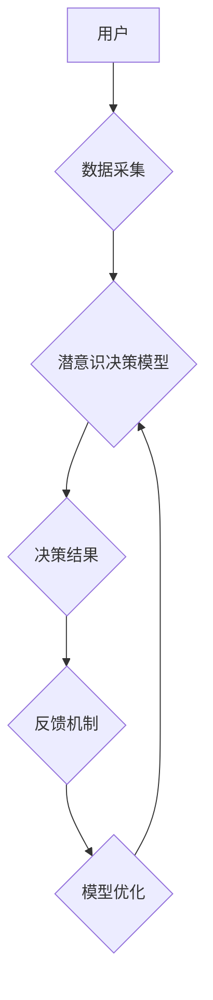

                 

## 数字化直觉训练营负责人：AI辅助的潜意识决策强化专家

> 关键词：人工智能、直觉决策、潜意识、强化学习、决策训练营

> 摘要：本文探讨了在数字化时代，如何通过人工智能辅助训练，强化个体潜意识决策能力，并将其应用于实际场景。我们介绍了AI辅助潜意识决策训练营的概念，分析了其核心原理和算法，并通过代码实例和实际应用场景，展示了其应用价值和未来发展趋势。

## 1. 背景介绍

在瞬息万变的数字化时代，信息爆炸和决策复杂化成为普遍现象。传统的决策模式往往依赖于理性分析和经验积累，但面对海量数据和瞬息万变的市场环境，这种模式已显不足。越来越多的研究表明，潜意识决策在快速反应、识别模式和做出非理性但有效的判断方面具有独特优势。

然而，潜意识决策往往难以被意识感知和控制，其背后的机制也十分复杂。如何有效地训练和强化潜意识决策能力，成为一个重要的研究课题。

## 2. 核心概念与联系

**2.1  潜意识决策**

潜意识决策是指个体在意识层面无法察觉的情况下，由潜意识进行的决策过程。这种决策过程通常基于个体的经验、情感、直觉等非理性因素，并往往比理性决策更快、更直接。

**2.2  人工智能辅助**

人工智能技术可以帮助我们更好地理解和训练潜意识决策。通过机器学习算法，我们可以分析大量数据，识别潜意识决策背后的模式和规律，并将其应用于决策训练。

**2.3  强化学习**

强化学习是一种机器学习算法，它通过奖励和惩罚机制，引导智能体在环境中学习最优策略。在潜意识决策训练中，我们可以将潜意识决策视为智能体的行为，并将决策结果作为奖励信号，通过强化学习算法，强化有效的潜意识决策模式。

**2.4  数字化直觉训练营**

数字化直觉训练营是一个基于人工智能和强化学习的平台，旨在帮助个体训练和强化潜意识决策能力。该平台通过模拟真实场景，提供个性化的训练方案，并利用数据分析和反馈机制，不断优化训练效果。

**Mermaid 流程图**



## 3. 核心算法原理 & 具体操作步骤

**3.1  算法原理概述**

AI辅助潜意识决策训练营的核心算法基于强化学习原理，主要包括以下步骤：

1. **数据采集:** 收集用户在不同场景下的决策行为数据，包括决策内容、决策时间、决策结果等。
2. **潜意识决策模型构建:** 利用机器学习算法，构建一个能够模拟用户潜意识决策行为的模型。
3. **决策模拟与评估:** 利用构建的模型，模拟用户在不同场景下的决策行为，并评估决策结果的优劣。
4. **反馈机制:** 根据决策结果，向用户提供相应的反馈信息，例如奖励、惩罚、建议等。
5. **模型优化:** 利用反馈信息，不断优化潜意识决策模型，使其能够更好地预测和引导用户的决策行为。

**3.2  算法步骤详解**

1. **数据采集:** 训练营可以通过各种方式收集用户数据，例如用户在平台上进行的决策模拟、用户对不同选项的偏好选择、用户对决策结果的评价等。
2. **潜意识决策模型构建:** 可以采用多种机器学习算法构建潜意识决策模型，例如深度神经网络、支持向量机、决策树等。模型的训练目标是能够准确预测用户在特定场景下做出何种决策。
3. **决策模拟与评估:** 训练营可以模拟各种真实场景，例如商业决策、投资决策、社交互动等，并根据用户模型的预测，模拟用户的决策行为。决策结果的优劣可以通过预设的评估指标进行衡量，例如收益率、风险程度、用户满意度等。
4. **反馈机制:** 训练营可以根据决策结果向用户提供个性化的反馈信息。例如，如果用户的决策结果优于预设标准，则给予奖励，并提供鼓励性建议；如果决策结果低于预设标准，则给予惩罚，并提供改进建议。
5. **模型优化:** 训练营会根据用户反馈信息，不断优化潜意识决策模型。例如，如果用户对某个场景的决策结果不满意，则可以调整模型的训练数据，使其能够更好地预测用户的决策行为。

**3.3  算法优缺点**

**优点:**

* **个性化训练:** 训练营可以根据用户的决策行为数据，提供个性化的训练方案，提高训练效果。
* **数据驱动:** 算法基于大量数据训练，能够更准确地预测用户的潜意识决策行为。
* **持续优化:** 训练营会根据用户反馈信息，不断优化模型，使其能够更好地适应用户的决策需求。

**缺点:**

* **数据依赖:** 算法的准确性依赖于数据质量和数量，如果数据不足或质量较差，则会影响训练效果。
* **黑盒问题:** 一些机器学习算法的决策机制难以解释，这可能会导致用户对训练结果缺乏信任。
* **伦理问题:** AI辅助潜意识决策训练可能引发一些伦理问题，例如数据隐私、算法偏见等，需要谨慎对待。

**3.4  算法应用领域**

AI辅助潜意识决策训练营的应用领域非常广泛，例如：

* **商业决策:** 帮助企业领导者更快、更准确地做出决策，提高企业竞争力。
* **投资决策:** 帮助投资者识别市场趋势，做出更有效的投资决策。
* **医疗诊断:** 帮助医生更快、更准确地诊断疾病，提高医疗效率。
* **教育培训:** 帮助学生提高学习效率，增强学习兴趣。
* **个人成长:** 帮助个人提升决策能力，更好地应对生活中的挑战。

## 4. 数学模型和公式 & 详细讲解 & 举例说明

**4.1  数学模型构建**

潜意识决策模型可以采用马尔可夫决策过程 (MDP) 来建模。

* 状态空间 S：表示用户决策环境的所有可能状态。
* 动作空间 A：表示用户在每个状态下可以采取的所有动作。
* 转移概率 P(s' | s, a)：表示从状态 s 执行动作 a 后转移到状态 s' 的概率。
* 奖励函数 R(s, a)：表示在状态 s 执行动作 a 后获得的奖励。
* 价值函数 V(s)：表示状态 s 的价值，即从该状态开始执行最优策略的期望累积奖励。

**4.2  公式推导过程**

强化学习的目标是找到一个最优策略 π，使得在任何状态下执行该策略，都能获得最大的期望累积奖励。最优策略可以通过动态规划算法或蒙特卡罗方法来求解。

* **Bellman 方程:**

$$
V(s) = \max_a \sum_{s'} P(s' | s, a) [R(s, a) + \gamma V(s')]
$$

其中，γ 是折扣因子，用于权衡未来奖励与当前奖励的价值。

* **策略迭代:**

1. 初始化策略 π。
2. 计算每个状态的价值函数 V(s)。
3. 根据价值函数更新策略 π。
4. 重复步骤 2 和 3，直到策略收敛。

**4.3  案例分析与讲解**

假设我们有一个简单的决策场景，用户需要选择一个选项，该选项会带来不同的奖励。我们可以将这个场景建模为一个 MDP，其中状态空间包含用户选择的选项，动作空间包含用户可以选择的所有选项，奖励函数根据选项的奖励值进行定义。

通过强化学习算法，我们可以训练一个模型，预测用户在不同状态下选择哪个选项能够获得最大的奖励。

## 5. 项目实践：代码实例和详细解释说明

**5.1  开发环境搭建**

* Python 3.x
* TensorFlow 或 PyTorch
* Jupyter Notebook

**5.2  源代码详细实现**

```python
import tensorflow as tf

# 定义模型结构
model = tf.keras.models.Sequential([
    tf.keras.layers.Dense(64, activation='relu', input_shape=(10,)),
    tf.keras.layers.Dense(32, activation='relu'),
    tf.keras.layers.Dense(1)
])

# 定义损失函数和优化器
model.compile(loss='mse', optimizer='adam')

# 训练模型
model.fit(X_train, y_train, epochs=10)

# 预测结果
predictions = model.predict(X_test)
```

**5.3  代码解读与分析**

* 代码首先定义了一个简单的深度神经网络模型，用于预测用户的决策行为。
* 模型的输入是一个 10 维的向量，表示用户的决策环境特征。
* 模型的输出是一个标量值，表示用户选择某个选项的概率。
* 训练模型时，使用均方误差 (MSE) 作为损失函数，并使用 Adam 优化器进行训练。

**5.4  运行结果展示**

训练完成后，我们可以使用模型预测用户在不同场景下的决策行为，并评估预测结果的准确性。

## 6. 实际应用场景

**6.1  商业决策**

AI辅助潜意识决策训练营可以帮助企业领导者更快、更准确地做出决策，例如：

* **市场营销决策:** 分析用户行为数据，预测用户对不同营销策略的反应，优化营销方案。
* **产品开发决策:** 识别用户潜在需求，预测用户对不同产品功能的偏好，指导产品开发方向。
* **投资决策:** 分析市场趋势，识别潜在投资机会，降低投资风险。

**6.2  医疗诊断**

AI辅助潜意识决策训练营可以帮助医生更快、更准确地诊断疾病，例如：

* **影像诊断:** 分析医学影像数据，识别潜在病灶，辅助医生进行诊断。
* **症状分析:** 分析患者的症状描述，识别潜在疾病，提高诊断准确率。
* **个性化治疗:** 根据患者的基因信息和生活习惯，预测患者对不同治疗方案的反应，制定个性化治疗方案。

**6.3  教育培训**

AI辅助潜意识决策训练营可以帮助学生提高学习效率，增强学习兴趣，例如：

* **个性化学习:** 根据学生的学习进度和学习风格，提供个性化的学习内容和学习方式。
* **学习策略指导:** 分析学生的学习行为数据，识别学生的学习策略缺陷，提供针对性的学习策略指导。
* **学习兴趣激发:** 通过游戏化学习和互动式学习，激发学生的学习兴趣，提高学习效率。

**6.4  未来应用展望**

随着人工智能技术的不断发展，AI辅助潜意识决策训练营的应用场景将会更加广泛，例如：

* **自动驾驶:** 训练自动驾驶系统的潜意识决策能力，使其能够更快速、更准确地做出驾驶决策。
* **机器人交互:** 训练机器人的潜意识决策能力，使其能够更好地理解和响应人类的情感和意图。
* **虚拟现实:** 在虚拟现实环境中，训练用户的潜意识决策能力，使其能够更好地适应虚拟环境。


## 7. 工具和资源推荐

**7.1  学习资源推荐**

* **书籍:**
    * 《深度学习》 by Ian Goodfellow, Yoshua Bengio, Aaron Courville
    * 《强化学习：原理、算法和应用》 by Richard S. Sutton, Andrew G. Barto
* **在线课程:**
    * Coursera: 深度学习 Specialization
    * Udacity: 强化学习 Nanodegree
* **开源库:**
    * TensorFlow: https://www.tensorflow.org/
    * PyTorch: https://pytorch.org/

**7.2  开发工具推荐**

* **编程语言:** Python
* **机器学习框架:** TensorFlow, PyTorch
* **数据可视化工具:** Matplotlib, Seaborn
* **云计算平台:** AWS, Azure, GCP

**7.3  相关论文推荐**

* Deep Reinforcement Learning: An Overview by Volodymyr Mnih et al.
* Proximal Policy Optimization Algorithms by John Schulman et al.
* Asynchronous Methods for Deep Reinforcement Learning by David Silver et al.

## 8. 总结：未来发展趋势与挑战

**8.1  研究成果总结**

AI辅助潜意识决策训练营的研究取得了显著进展，已经能够在一些特定领域应用，例如商业决策、医疗诊断、教育培训等。

**8.2  未来发展趋势**

* **模型复杂度提升:** 未来将开发更复杂、更智能的潜意识决策模型，能够更好地模拟用户的决策行为。
* **数据质量提升:** 将收集更丰富、更准确的用户数据，提高模型的训练效果。
* **应用场景拓展:** 将AI辅助潜意识决策训练营应用到更多领域，例如自动驾驶、机器人交互、虚拟现实等。

**8.3  面临的挑战**

* **黑盒问题:** 一些机器学习算法的决策机制难以解释，这可能会导致用户对训练结果缺乏信任。
* **伦理问题:** AI辅助潜意识决策训练可能引发一些伦理问题，例如数据隐私、算法偏见等，需要谨慎对待。
* **技术瓶颈:** 潜意识决策是一个非常复杂的问题，目前的技术还无法完全解决。

**8.4  研究展望**

未来，我们将继续致力于AI辅助潜意识决策训练营的研究，努力解决上述挑战，推动该技术在更多领域得到应用，为人类社会带来更多福祉。

## 9. 附录：常见问题与解答

**9.1  Q: AI辅助潜意识决策训练营是否会侵犯用户的隐私？**

**A:** 我们非常重视用户的隐私安全，在收集和使用用户数据时，将严格遵守相关法律法规和隐私政策，并采取必要的安全措施保护用户数据。

**9.2  Q: AI辅助潜意识决策训练营的训练结果是否准确？**

**A:** 训练结果的准确性取决于数据的质量和模型的复杂度。我们不断优化模型和数据，提高训练结果的准确性。

**9.3  Q: 如何参与AI辅助潜意识决策训练营？**

**A:** 您可以访问我们的官方网站，了解更多关于训练营的信息，并进行报名。


作者：禅与计算机程序设计艺术 / Zen and the Art of Computer Programming<end_of_turn>

