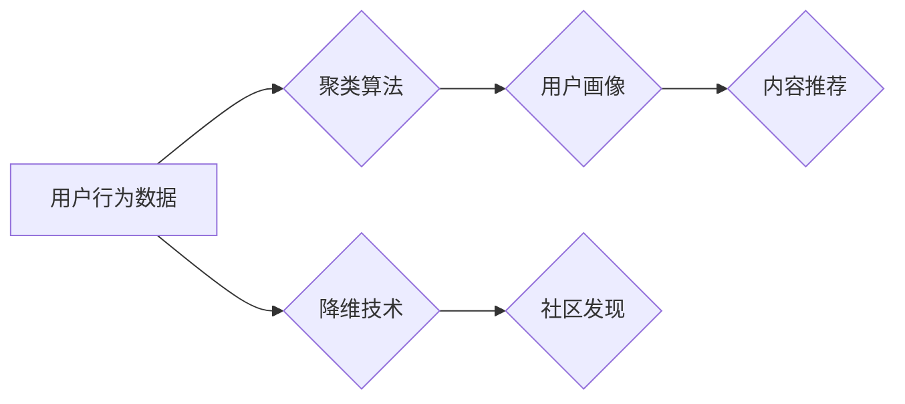

                 

## 无监督学习的应用拓展:社交网络分析和推荐系统

> 关键词：无监督学习、社交网络分析、推荐系统、聚类算法、降维技术、社区发现、用户画像、协同过滤

## 1. 背景介绍

社交网络已经成为现代社会不可或缺的一部分，它连接着数以亿计的用户，并为我们提供了丰富的社交互动、信息获取和娱乐体验。随着社交网络规模的不断扩大，如何有效地分析和理解用户行为、关系和内容成为了一个重要的研究课题。推荐系统作为一种重要的应用，旨在根据用户的历史行为和偏好，推荐他们可能感兴趣的内容或服务，从而提升用户体验和平台活跃度。

传统推荐系统主要依赖于用户的显式反馈，例如评分、点赞等，但这些反馈往往稀缺且不全面。无监督学习作为一种无需人工标注数据就能从数据中学习模式和结构的机器学习方法，为社交网络分析和推荐系统提供了新的思路和可能性。

## 2. 核心概念与联系

无监督学习的核心思想是，从未标记的数据中学习数据本身的内在结构和规律。在社交网络分析和推荐系统中，无监督学习可以用于以下几个方面：

* **用户画像构建:** 通过分析用户的社交行为、兴趣爱好等信息，构建用户画像，以便更好地理解用户的需求和偏好。
* **社区发现:** 挖掘社交网络中的用户社区，识别用户之间的潜在关系和兴趣相似性。
* **内容推荐:** 基于用户的行为和社交关系，推荐用户可能感兴趣的内容，即使用户没有显式表达过自己的偏好。

**Mermaid 流程图:**



## 3. 核心算法原理 & 具体操作步骤

### 3.1  算法原理概述

无监督学习算法主要包括聚类算法和降维技术。

* **聚类算法:** 将数据点根据相似性进行分组，每个分组称为一个簇。常用的聚类算法包括k-means、DBSCAN、层次聚类等。
* **降维技术:** 将高维数据映射到低维空间，同时尽量保留数据的原始信息。常用的降维技术包括主成分分析(PCA)、t-SNE等。

### 3.2  算法步骤详解

**聚类算法步骤:**

1. **数据预处理:** 对用户行为数据进行清洗、转换和特征工程，例如将文本数据转换为词向量。
2. **选择聚类算法:** 根据数据的特点和应用场景选择合适的聚类算法。
3. **确定聚类数量:** 使用肘部法则等方法确定最佳的聚类数量。
4. **执行聚类:** 使用选定的聚类算法对数据进行聚类。
5. **评估聚类结果:** 使用聚类指标，例如Silhouette score、Dunn index等，评估聚类结果的质量。

**降维技术步骤:**

1. **数据预处理:** 对数据进行标准化或归一化处理。
2. **选择降维技术:** 根据数据的特点和应用场景选择合适的降维技术。
3. **确定降维维度:** 根据降维效果和应用需求确定降维后的维度。
4. **执行降维:** 使用选定的降维技术对数据进行降维。
5. **评估降维效果:** 使用PCA解释率等指标评估降维效果。

### 3.3  算法优缺点

**聚类算法:**

* **优点:** 能够发现数据中的潜在结构，无需人工标注数据。
* **缺点:** 聚类结果的 interpretability 较低，难以解释每个簇的含义。

**降维技术:**

* **优点:** 可以有效地降低数据维度，提高计算效率。
* **缺点:** 可能导致数据信息损失。

### 3.4  算法应用领域

* **用户画像构建:** 将用户聚类为不同的用户群体，例如兴趣爱好相似的用户、消费习惯相似的用户等。
* **社区发现:** 识别社交网络中的用户社区，例如兴趣小组、专业社群等。
* **内容推荐:** 根据用户的聚类结果和降维后的特征向量，推荐用户可能感兴趣的内容。

## 4. 数学模型和公式 & 详细讲解 & 举例说明

### 4.1  数学模型构建

**聚类算法:**

k-means 算法的目标是将数据点划分为 k 个簇，使得每个数据点到其所属簇中心的距离最小。

**数学模型:**

* **簇中心:**  $c_i = \frac{1}{n_i} \sum_{x \in C_i} x$
* **距离度量:**  $d(x, c_i) = ||x - c_i||$

**公式推导过程:**

k-means 算法通过迭代的方式来更新簇中心和数据点的所属簇。

1. **初始化:** 随机选择 k 个数据点作为初始簇中心。
2. **分配:** 将每个数据点分配到距离其最近的簇中心。
3. **更新:** 更新每个簇的中心点，使其成为簇内所有数据点的均值。
4. **重复:** 重复步骤 2 和 3，直到簇中心不再变化或达到最大迭代次数。

**举例说明:**

假设我们有 5 个数据点，想要将其聚类为 2 个簇。我们可以随机选择 2 个数据点作为初始簇中心，然后将每个数据点分配到距离其最近的簇中心。接着，更新每个簇的中心点，并重复上述步骤，直到簇中心不再变化。

**降维技术:**

主成分分析 (PCA) 的目标是找到数据中最重要的方向，并将其投影到低维空间。

**数学模型:**

* **协方差矩阵:**  $C = \frac{1}{n-1} \sum_{i=1}^{n} (x_i - \bar{x})(x_i - \bar{x})^T$
* **特征值和特征向量:**  求解协方差矩阵的特征值和特征向量。
* **主成分:**  特征值最大的特征向量对应于数据中最重要的方向，称为主成分。

**公式推导过程:**

PCA 算法通过计算数据协方差矩阵的特征值和特征向量来找到数据的主要方向。然后，将数据投影到由特征向量组成的低维空间，从而实现降维。

**举例说明:**

假设我们有 2 个特征变量，想要将其降维到 1 维。我们可以计算特征变量的协方差矩阵，并求解其特征值和特征向量。特征值最大的特征向量对应于数据中最重要的方向，我们可以将其作为新的特征变量，从而实现降维。

### 4.2  公式推导过程

**聚类算法:**

k-means 算法的公式推导过程已经在上文中详细说明。

**降维技术:**

PCA 算法的公式推导过程已经在上文中详细说明。

### 4.3  案例分析与讲解

**聚类算法:**

我们可以使用 k-means 算法对社交网络用户进行聚类，例如根据用户的兴趣爱好、社交关系等信息进行聚类。

**降维技术:**

我们可以使用 PCA 算法对用户行为数据进行降维，例如将用户行为数据从高维空间降维到低维空间，从而提高推荐系统的效率。

## 5. 项目实践：代码实例和详细解释说明

### 5.1  开发环境搭建

* Python 3.x
* scikit-learn 库
* pandas 库
* matplotlib 库

### 5.2  源代码详细实现

```python
import pandas as pd
from sklearn.cluster import KMeans
from sklearn.preprocessing import StandardScaler

# 加载用户行为数据
data = pd.read_csv('user_behavior.csv')

# 数据预处理
# 将文本数据转换为词向量
# ...

# 标准化数据
scaler = StandardScaler()
data_scaled = scaler.fit_transform(data)

# 选择聚类算法
kmeans = KMeans(n_clusters=5, random_state=42)

# 执行聚类
kmeans.fit(data_scaled)

# 获取聚类结果
labels = kmeans.labels_

# 将聚类结果添加到数据中
data['cluster'] = labels

# 保存聚类结果
data.to_csv('user_clusters.csv', index=False)
```

### 5.3  代码解读与分析

* **数据加载和预处理:** 首先，我们加载用户行为数据，并进行必要的预处理，例如将文本数据转换为词向量。
* **数据标准化:** 为了使不同特征的尺度一致，我们使用 StandardScaler 对数据进行标准化。
* **聚类算法选择:** 我们选择 KMeans 算法作为聚类算法，并设置聚类数量为 5。
* **聚类执行:** 我们使用 kmeans.fit() 方法对数据进行聚类。
* **聚类结果获取:** 我们使用 kmeans.labels_ 属性获取每个数据点的所属簇。
* **结果保存:** 我们将聚类结果添加到数据中，并保存为新的 CSV 文件。

### 5.4  运行结果展示

运行上述代码后，我们将得到一个包含用户行为数据和聚类结果的 CSV 文件。我们可以使用 matplotlib 库绘制聚类结果的散点图，直观地观察不同簇的用户分布情况。

## 6. 实际应用场景

### 6.1  社交网络分析

* **用户画像构建:** 通过聚类算法将用户分为不同的群体，例如兴趣爱好相似的用户、消费习惯相似的用户等，从而构建用户画像。
* **社区发现:** 通过聚类算法和网络分析算法，识别社交网络中的用户社区，例如兴趣小组、专业社群等。
* **舆情监测:** 通过分析用户评论和社交媒体内容，识别潜在的舆情风险和热点话题。

### 6.2  推荐系统

* **内容推荐:** 基于用户的聚类结果和降维后的特征向量，推荐用户可能感兴趣的内容。
* **用户匹配:** 基于用户的兴趣爱好和社交关系，推荐用户可能感兴趣的其他人。
* **个性化广告:** 基于用户的画像和行为数据，推送个性化的广告。

### 6.3  其他应用场景

* **市场营销:** 分析用户行为数据，识别潜在的客户群体，制定精准的营销策略。
* **教育:** 分析学生的学习行为数据，个性化推荐学习资源和教学方法。
* **医疗:** 分析患者的医疗数据，预测疾病风险和个性化治疗方案。

### 6.4  未来应用展望

随着社交网络规模的不断扩大和数据量的不断增长，无监督学习在社交网络分析和推荐系统中的应用将更加广泛和深入。未来，我们可能会看到以下趋势:

* **更复杂的无监督学习算法:** 随着算法的不断发展，我们将看到更复杂的无监督学习算法被应用于社交网络分析和推荐系统，例如深度学习算法。
* **更个性化的推荐:** 基于用户的更细粒度的特征和行为数据，我们将看到更个性化的推荐系统，能够更准确地预测用户的需求和偏好。
* **更智能的社交网络:** 无监督学习将帮助我们构建更智能的社交网络，能够自动识别用户关系、推荐好友和内容，以及提供更丰富的社交体验。

## 7. 工具和资源推荐

### 7.1  学习资源推荐

* **书籍:**
    * "Pattern Recognition and Machine Learning" by Christopher M. Bishop
    * "The Elements of Statistical Learning" by Trevor Hastie, Robert Tibshirani, and Jerome Friedman
* **在线课程:**
    * Coursera: Machine Learning by Andrew Ng
    * edX: Introduction to Machine Learning by Columbia University

### 7.2  开发工具推荐

* **Python:** 
    * scikit-learn: 机器学习库
    * pandas: 数据分析库
    * matplotlib: 数据可视化库
* **R:** 
    * caret: 机器学习库
    * ggplot2: 数据可视化库

### 7.3  相关论文推荐

* "K-Means Clustering" by Stuart Lloyd
* "Principal Component Analysis" by J. Hotelling
* "Community Detection in Social Networks" by M. Girvan and M. E. J. Newman

## 8. 总结：未来发展趋势与挑战

### 8.1  研究成果总结

无监督学习在社交网络分析和推荐系统领域取得了显著的成果，例如用户画像构建、社区发现、内容推荐等。这些成果为我们更好地理解用户行为、挖掘社交网络中的潜在结构和提供个性化服务提供了新的思路和方法。

### 8.2  未来发展趋势

* **更复杂的无监督学习算法:** 深度学习算法将被更多地应用于社交网络分析和推荐系统，例如图神经网络、自编码器等。
* **更个性化的推荐:** 基于用户的更细粒度的特征和行为数据，我们将看到更个性化的推荐系统，能够更准确地预测用户的需求和偏好。
* **更智能的社交网络:** 无监督学习将帮助我们构建更智能的社交网络，能够自动识别用户关系、推荐好友和内容，以及提供更丰富的社交体验。

### 8.3  面临的挑战

* **数据质量:** 社交网络数据往往是高维、稀疏、噪声的，这给无监督学习算法带来了挑战。
* **算法 interpretability:** 许多无监督学习算法的决策过程难以解释，这使得其应用在一些敏感领域受到限制。
* **隐私保护:** 社交网络数据包含大量的用户隐私信息，如何保护用户隐私是无监督学习应用中需要考虑的重要问题。

### 8.4  研究展望

未来，我们将继续探索无监督学习在社交网络分析和推荐系统中的应用，并致力于解决上述挑战，推动该领域的发展。


## 9. 附录：常见问题与解答

**Q1: 如何选择合适的聚类算法？**

**A1:** 选择合适的聚类算法需要根据数据的特点和应用场景来决定。例如，对于高维数据，可以使用 DBSCAN 算法；对于数据分布较为均匀的情况，可以使用 k-means 算法。

**Q2: 如何确定最佳的聚类数量？**

**A2:** 可以使用肘部法则等方法来确定最佳的聚类数量。肘部法则是指绘制聚类数量与聚类结果的误差平方和之间的关系曲线，找到曲线的拐点作为最佳聚类数量。

**Q3: 如何评估聚类结果的质量？**

**A3:** 可以使用聚类指标，例如Silhouette score、Dunn index等，评估聚类结果的质量。这些指标可以衡量聚类结果的紧密性和分离性。


作者：禅与计算机程序设计艺术 / Zen and the Art of Computer Programming 
<end_of_turn>

