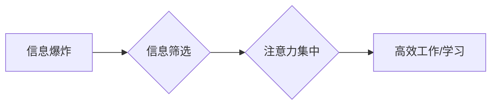

                 

## 1. 背景介绍

在当今信息爆炸的时代，我们每天都被来自互联网、社交媒体、新闻等渠道的海量信息淹没。如何有效地筛选信息，集中精力处理重要内容，成为了每个人都面临的挑战。这便是“注意力经济”的核心问题。

注意力经济指的是在信息过剩的时代，人们对信息的获取和处理能力有限，而注意力成为了稀缺的资源。拥有和控制注意力，就拥有了获取信息、做出决策、创造价值的优势。

然而，随着信息量的不断增长，人们的注意力也被不断地分割和分散。我们习惯于快速浏览信息，缺乏深度思考和理解。这不仅影响了我们的学习效率和工作成果，也让我们难以保持专注力和创造力。

## 2. 核心概念与联系

### 2.1 注意力经济

注意力经济的核心概念是：

* **注意力是稀缺资源:**  在信息爆炸的时代，人们的注意力受到来自各个方向的信息的竞争，而注意力本身是一个有限的资源。
* **注意力价值:**  拥有和控制注意力意味着拥有获取信息、做出决策、创造价值的优势。
* **注意力竞争:**  各种信息平台和内容创作者都在争夺用户的注意力，这导致了注意力资源的过度竞争。

### 2.2 个人信息过滤能力

个人信息过滤能力是指个体在海量信息中，能够有效地识别、筛选和处理重要信息的能力。它包括以下几个方面：

* **信息识别:**  能够快速识别出与自己需求相关的关键信息。
* **信息筛选:**  能够有效地过滤掉无关或低价值的信息。
* **信息处理:**  能够深度理解和处理筛选出的重要信息。

### 2.3  注意力经济与信息过滤能力的联系

注意力经济和个人信息过滤能力是相互关联的。

* **信息过滤能力是注意力经济的核心竞争力:**  拥有强大的信息过滤能力，能够有效地集中注意力，获取高质量的信息，从而在注意力经济中获得优势。
* **注意力经济的竞争加剧了信息过滤能力的需求:**  随着信息量的不断增长，人们对信息过滤能力的需求也越来越高。

**Mermaid 流程图**



## 3. 核心算法原理 & 具体操作步骤

### 3.1 算法原理概述

信息过滤算法的核心原理是利用机器学习和自然语言处理技术，对用户的信息行为进行分析，并根据用户的兴趣和偏好，推荐和过滤相关信息。

常见的算法包括：

* **协同过滤:**  根据用户的历史行为和相似用户的行为，推荐相关信息。
* **内容过滤:**  根据信息的主题、关键词等内容特征，推荐相关信息。
* **深度学习:**  利用深度神经网络，对用户的行为和信息进行更深入的分析，提供更精准的推荐和过滤。

### 3.2 算法步骤详解

1. **数据收集:**  收集用户的行为数据，例如浏览历史、点击记录、评分等。
2. **数据预处理:**  对收集到的数据进行清洗、转换和特征提取。
3. **模型训练:**  利用机器学习算法，对预处理后的数据进行训练，构建信息过滤模型。
4. **模型评估:**  使用测试数据对模型进行评估，并根据评估结果进行模型优化。
5. **信息推荐和过滤:**  将训练好的模型应用于新的信息流，对信息进行推荐和过滤。

### 3.3 算法优缺点

**优点:**

* **个性化推荐:**  能够根据用户的兴趣和偏好，提供个性化的信息推荐。
* **提高效率:**  能够有效地过滤掉无关信息，提高用户获取信息效率。
* **持续优化:**  随着数据的积累和模型的训练，算法能够不断优化，提供更精准的信息过滤。

**缺点:**

* **数据依赖:**  算法的性能依赖于数据的质量和数量。
* **算法偏差:**  算法可能会存在偏差，导致推荐结果不准确或不公平。
* **隐私问题:**  信息过滤算法需要收集和分析用户的个人数据，可能会引发隐私问题。

### 3.4 算法应用领域

信息过滤算法广泛应用于以下领域:

* **搜索引擎:**  根据用户的搜索关键词，推荐相关网页结果。
* **社交媒体:**  根据用户的兴趣和好友关系，推荐相关内容和用户。
* **电商平台:**  根据用户的浏览历史和购买记录，推荐相关商品。
* **新闻资讯:**  根据用户的阅读习惯，推荐相关新闻和资讯。

## 4. 数学模型和公式 & 详细讲解 & 举例说明

### 4.1 数学模型构建

信息过滤算法通常使用矩阵分解模型，例如协同过滤算法中的矩阵分解模型。

**用户-物品交互矩阵:**  

假设有 $m$ 个用户和 $n$ 个物品，用户-物品交互矩阵 $R$ 是一个 $m \times n$ 的矩阵，其中 $R_{ij}$ 表示用户 $i$ 对物品 $j$ 的评分或交互行为。

**矩阵分解模型:**  

将用户-物品交互矩阵 $R$ 分解成两个低维矩阵 $U$ 和 $V$，其中 $U$ 是一个 $m \times k$ 的用户特征矩阵，$V$ 是一个 $n \times k$ 的物品特征矩阵，$k$ 是隐特征维度。

$$R \approx U V^T$$

### 4.2 公式推导过程

目标是找到最优的用户特征矩阵 $U$ 和物品特征矩阵 $V$，使得 $U V^T$ 与真实的用户-物品交互矩阵 $R$ 的误差最小。

常用的损失函数是均方误差 (MSE):

$$Loss = \frac{1}{m n} \sum_{i=1}^{m} \sum_{j=1}^{n} (R_{ij} - U_{i} V_{j}^T)^2$$

使用梯度下降算法优化损失函数，更新 $U$ 和 $V$ 的值。

### 4.3 案例分析与讲解

假设有一个用户-物品交互矩阵，其中用户对电影的评分。

可以使用矩阵分解模型将用户和电影的特征进行提取，例如：

* 用户特征：喜剧、动作、爱情等电影类型偏好。
* 电影特征：类型、导演、演员等信息。

通过训练模型，可以预测用户对未观看的电影的评分，并推荐用户可能感兴趣的电影。

## 5. 项目实践：代码实例和详细解释说明

### 5.1 开发环境搭建

* Python 3.x
* TensorFlow 或 PyTorch 等深度学习框架
* NumPy、Pandas 等数据处理库

### 5.2 源代码详细实现

```python
import tensorflow as tf

# 定义用户-物品交互矩阵
R = tf.constant([[5, 4, 3],
                 [4, 5, 2],
                 [3, 2, 5]])

# 定义用户特征矩阵和物品特征矩阵
U = tf.Variable(tf.random.normal([3, 2]))
V = tf.Variable(tf.random.normal([3, 2]))

# 计算预测评分
predictions = tf.matmul(U, V, transpose_b=True)

# 定义损失函数
loss = tf.reduce_mean(tf.square(R - predictions))

# 定义优化器
optimizer = tf.keras.optimizers.Adam()

# 训练模型
for epoch in range(100):
    with tf.GradientTape() as tape:
        loss_value = loss
    gradients = tape.gradient(loss_value, [U, V])
    optimizer.apply_gradients(zip(gradients, [U, V]))

# 打印训练结果
print(loss_value)
```

### 5.3 代码解读与分析

* 代码首先定义了用户-物品交互矩阵 $R$。
* 然后定义了用户特征矩阵 $U$ 和物品特征矩阵 $V$，并使用随机值初始化。
* 计算预测评分 $predictions$，并使用均方误差 (MSE) 作为损失函数。
* 使用 Adam 优化器训练模型，更新 $U$ 和 $V$ 的值。
* 最后打印训练结果，即损失函数的值。

### 5.4 运行结果展示

训练完成后，可以将训练好的 $U$ 和 $V$ 应用于新的用户和物品，预测用户对物品的评分。

## 6. 实际应用场景

### 6.1 搜索引擎

搜索引擎使用信息过滤算法，根据用户的搜索关键词，从海量网页中筛选出相关结果，提高用户搜索效率。

### 6.2 社交媒体

社交媒体平台使用信息过滤算法，根据用户的兴趣和好友关系，推荐相关内容和用户，增强用户粘性和互动性。

### 6.3 电商平台

电商平台使用信息过滤算法，根据用户的浏览历史和购买记录，推荐相关商品，提高用户购买转化率。

### 6.4 未来应用展望

随着人工智能技术的不断发展，信息过滤算法将应用于更多领域，例如：

* **个性化教育:**  根据学生的学习进度和兴趣，推荐个性化的学习内容。
* **医疗诊断:**  根据患者的症状和病史，推荐相关的医疗方案。
* **金融投资:**  根据用户的风险偏好和投资目标，推荐合适的投资产品。

## 7. 工具和资源推荐

### 7.1 学习资源推荐

* **书籍:**
    * 《推荐系统》
    * 《深度学习》
* **在线课程:**
    * Coursera:  推荐系统
    * edX:  机器学习
* **博客和论坛:**
    * Towards Data Science
    * Kaggle

### 7.2 开发工具推荐

* **Python:**  Python 是机器学习和深度学习的常用编程语言。
* **TensorFlow:**  TensorFlow 是 Google 开发的开源深度学习框架。
* **PyTorch:**  PyTorch 是 Facebook 开发的开源深度学习框架。

### 7.3 相关论文推荐

* **Collaborative Filtering for Implicit Feedback Datasets**
* **Matrix Factorization Techniques for Recommender Systems**
* **Deep Learning for Recommender Systems**

## 8. 总结：未来发展趋势与挑战

### 8.1 研究成果总结

信息过滤算法在信息推荐、用户体验提升等方面取得了显著成果，但也面临着一些挑战。

### 8.2 未来发展趋势

* **个性化推荐的进一步提升:**  利用更丰富的用户数据和更先进的算法，提供更精准、更个性化的信息推荐。
* **跨平台信息过滤:**  实现不同平台的信息融合，提供更全面的信息过滤服务。
* **解释性推荐:**  提高信息过滤算法的透明度，让用户了解推荐结果背后的逻辑。

### 8.3 面临的挑战

* **数据隐私保护:**  信息过滤算法需要收集和分析用户的个人数据，如何保护用户隐私是一个重要的挑战。
* **算法公平性:**  信息过滤算法可能会存在偏差，导致推荐结果不公平，需要研究如何构建公平的算法。
* **用户信任:**  用户需要信任信息过滤算法的推荐结果，如何建立用户信任是一个重要的课题。

### 8.4 研究展望

未来，信息过滤算法的研究将更加注重个性化、跨平台、解释性等方面，并更加关注数据隐私保护、算法公平性和用户信任等问题。


## 9. 附录：常见问题与解答

### 9.1 如何提高信息过滤能力？

* **明确自己的信息需求:**  了解自己需要获取哪些类型的、哪些主题的信息。
* **善用信息过滤工具:**  利用搜索引擎的筛选功能、社交媒体的关注列表、新闻订阅等工具，过滤掉无关信息。
* **培养批判性思维:**  对获取的信息进行分析和判断，避免被信息误导。
* **定期清理信息:**  定期清理不必要的邮件、文件、社交媒体关注等，减少信息负担。

### 9.2 信息过滤算法会取代人类吗？

信息过滤算法可以帮助人类更高效地处理信息，但它不会取代人类。人类的创造力、批判性思维和情感理解能力，是信息过滤算法无法替代的。

### 9.3 信息过滤算法的未来发展方向？

信息过滤算法的未来发展方向包括：

* **更精准的个性化推荐:**  利用更丰富的用户数据和更先进的算法，提供更精准、更个性化的信息推荐。
* **跨平台信息过滤:**  实现不同平台的信息融合，提供更全面的信息过滤服务。
* **解释性推荐:**  提高信息过滤算法的透明度，让用户了解推荐结果背后的逻辑。


作者：禅与计算机程序设计艺术 / Zen and the Art of Computer Programming 
<end_of_turn>

