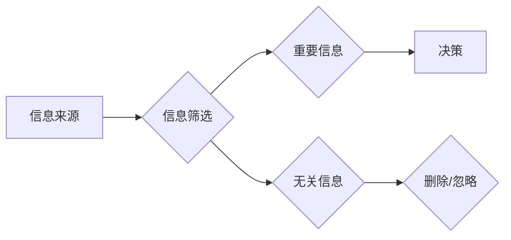

                 

## 注意力经济与个人信息过滤能力的培养

> 关键词：注意力经济，信息过滤，个人信息管理，深度学习，认知科学，信息过载

> 摘要：本文探讨了当今信息爆炸时代，注意力经济的概念及其对个人信息过滤能力的影响。我们分析了信息过载带来的挑战，并深入探讨了深度学习等技术在信息过滤领域的应用。此外，文章还提出了培养个人信息过滤能力的策略，帮助读者在纷繁的信息海洋中保持专注，提升效率和幸福感。

## 1. 背景介绍

### 1.1 信息时代与注意力经济

我们生活在一个信息爆炸的时代，每天接收的海量信息呈指数级增长。从社交媒体的推送，新闻网站的滚动更新，到电子邮件的轰炸，信息无处不在，无时不刻地冲击着我们的感官和认知。这种信息过载现象导致了注意力力的下降，人们难以集中精力处理重要信息，效率和生产力受到严重影响。

在这种背景下，“注意力经济”的概念应运而生。注意力经济认为，注意力是当今社会最宝贵的资源，而信息生产者和平台则争夺着用户的注意力。他们通过各种手段，例如个性化推荐、推送通知、内容碎片化等，试图吸引用户的注意力，并从中获取利益。

### 1.2 个人信息过滤能力的缺失

在信息时代，个人信息过滤能力显得尤为重要。它指的是个体能够有效地识别、筛选、组织和处理信息的能力，从而从海量信息中提取有价值的信息，并做出明智的决策。然而，由于信息过载和注意力力的下降，许多人缺乏有效的个人信息过滤能力，导致信息焦虑、决策困难、认知疲劳等问题。

## 2. 核心概念与联系

### 2.1 信息过滤的原理

信息过滤的核心在于识别和筛选信息，将重要的信息保留下来，将无关的信息过滤掉。这需要对信息的类型、来源、价值等进行判断和分析。

**Mermaid 流程图：**



### 2.2 个人信息过滤能力的构成

个人信息过滤能力的培养是一个多方面的工作，涉及认知能力、信息处理能力、学习能力、自我管理能力等多个方面。

* **认知能力:** 包括注意力、记忆、理解、分析等能力，是信息过滤的基础。
* **信息处理能力:** 包括信息检索、信息组织、信息整合等能力，是有效处理信息的必要条件。
* **学习能力:** 包括学习新知识、掌握新技能、适应新环境的能力，是不断提升信息过滤能力的关键。
* **自我管理能力:** 包括时间管理、情绪管理、目标设定等能力，是保持专注和高效工作的重要保障。

## 3. 核心算法原理 & 具体操作步骤

### 3.1 算法原理概述

深度学习算法在信息过滤领域发挥着越来越重要的作用。通过训练大量的文本数据，深度学习模型能够学习到语言的结构和语义，并识别出不同类型的信息，从而实现对信息的自动分类和过滤。

### 3.2 算法步骤详解

1. **数据收集和预处理:** 收集大量文本数据，并进行清洗、分词、词向量化等预处理操作。
2. **模型选择和训练:** 选择合适的深度学习模型，例如循环神经网络（RNN）、长短期记忆网络（LSTM）或Transformer，并使用训练数据进行模型训练。
3. **模型评估和优化:** 使用测试数据评估模型的性能，并根据评估结果调整模型参数，优化模型效果。
4. **部署和应用:** 将训练好的模型部署到实际应用场景中，例如信息流过滤、垃圾邮件识别、新闻分类等。

### 3.3 算法优缺点

**优点:**

* **高准确率:** 深度学习算法能够学习到复杂的语义关系，实现对信息的精准过滤。
* **自动化程度高:** 模型训练完成后，可以自动对信息进行过滤，无需人工干预。
* **可扩展性强:** 深度学习模型可以处理海量数据，并随着数据量的增加不断提升性能。

**缺点:**

* **训练数据依赖性强:** 深度学习模型的性能取决于训练数据的质量和数量。
* **计算资源需求高:** 深度学习模型的训练需要大量的计算资源和时间。
* **可解释性差:** 深度学习模型的决策过程较为复杂，难以解释其过滤机制。

### 3.4 算法应用领域

深度学习算法在信息过滤领域有着广泛的应用，例如:

* **社交媒体信息过滤:** 识别和过滤垃圾信息、恶意评论、虚假新闻等。
* **电子邮件垃圾邮件识别:** 自动识别和过滤垃圾邮件，提高用户邮箱的可用性。
* **新闻分类和推荐:** 根据用户的兴趣爱好，推荐相关新闻，过滤无关信息。
* **搜索引擎结果排序:** 根据用户的搜索意图，排序搜索结果，提高搜索效率。

## 4. 数学模型和公式 & 详细讲解 & 举例说明

### 4.1 数学模型构建

在深度学习模型中，信息过滤通常采用分类模型，将信息分为不同的类别。例如，将邮件分类为“垃圾邮件”或“正常邮件”。

一个典型的分类模型是逻辑回归模型，其目标函数为：

$$
L(w,b) = -\frac{1}{N}\sum_{i=1}^{N} y_i \log(p_i) + (1-y_i) \log(1-p_i)
$$

其中：

* $w$ 和 $b$ 是模型的参数。
* $N$ 是样本数量。
* $y_i$ 是第 $i$ 个样本的真实标签（0 或 1）。
* $p_i$ 是模型预测第 $i$ 个样本属于正类的概率。

### 4.2 公式推导过程

逻辑回归模型的目标函数是最大化似然函数，即找到参数 $w$ 和 $b$ 使得模型预测的概率与真实标签尽可能一致。

通过求解目标函数的梯度，可以得到模型参数的更新公式：

$$
w = w - \alpha \frac{1}{N}\sum_{i=1}^{N} (p_i - y_i) x_i
$$

$$
b = b - \alpha \frac{1}{N}\sum_{i=1}^{N} (p_i - y_i)
$$

其中：

* $\alpha$ 是学习率。
* $x_i$ 是第 $i$ 个样本的特征向量。

### 4.3 案例分析与讲解

例如，在垃圾邮件识别任务中，我们可以将邮件的特征向量包括邮件主题、邮件内容、发送者地址等信息。通过训练逻辑回归模型，可以学习到这些特征与垃圾邮件的关联性，并预测新邮件是否为垃圾邮件。

## 5. 项目实践：代码实例和详细解释说明

### 5.1 开发环境搭建

* Python 3.x
* TensorFlow 或 PyTorch 深度学习框架
* Jupyter Notebook 或 VS Code 开发环境

### 5.2 源代码详细实现

```python
import tensorflow as tf

# 定义模型结构
model = tf.keras.models.Sequential([
    tf.keras.layers.Embedding(input_dim=vocab_size, output_dim=embedding_dim),
    tf.keras.layers.LSTM(units=128),
    tf.keras.layers.Dense(units=1, activation='sigmoid')
])

# 编译模型
model.compile(optimizer='adam',
              loss='binary_crossentropy',
              metrics=['accuracy'])

# 训练模型
model.fit(x_train, y_train, epochs=10)

# 评估模型
loss, accuracy = model.evaluate(x_test, y_test)
print('Loss:', loss)
print('Accuracy:', accuracy)
```

### 5.3 代码解读与分析

* 代码首先定义了模型结构，包括嵌入层、LSTM层和全连接层。
* 嵌入层将单词转换为向量表示。
* LSTM层用于处理文本序列数据。
* 全连接层输出预测结果，并使用sigmoid激活函数将结果映射到0到1之间。
* 模型使用Adam优化器、二元交叉熵损失函数和准确率作为评估指标进行训练。

### 5.4 运行结果展示

训练完成后，可以评估模型的性能，并使用模型对新数据进行预测。

## 6. 实际应用场景

### 6.1 信息过滤应用

* **个性化新闻推荐:** 根据用户的阅读历史和兴趣爱好，推荐相关新闻，过滤无关信息。
* **社交媒体内容过滤:** 识别和过滤垃圾信息、恶意评论、虚假新闻等，营造良好的社交环境。
* **电子邮件垃圾邮件识别:** 自动识别和过滤垃圾邮件，提高用户邮箱的可用性。

### 6.2 其他应用场景

* **医疗诊断辅助:** 辅助医生识别疾病，提高诊断准确率。
* **金融风险控制:** 识别潜在的金融风险，降低损失。
* **智能客服:** 自动处理用户咨询，提高客服效率。

### 6.4 未来应用展望

随着深度学习技术的不断发展，信息过滤技术将更加智能化、个性化和自动化。未来，信息过滤将更加深入地融入到我们的生活各个方面，帮助我们更好地管理信息，提高效率和幸福感。

## 7. 工具和资源推荐

### 7.1 学习资源推荐

* **书籍:**
    * 深度学习
    * 自然语言处理
* **在线课程:**
    * Coursera
    * edX
    * Udacity

### 7.2 开发工具推荐

* **Python:** 
* **TensorFlow:** 
* **PyTorch:** 
* **Jupyter Notebook:** 

### 7.3 相关论文推荐

* Attention Is All You Need
* BERT: Pre-training of Deep Bidirectional Transformers for Language Understanding

## 8. 总结：未来发展趋势与挑战

### 8.1 研究成果总结

信息过滤技术在深度学习的推动下取得了显著进展，能够有效地识别和过滤信息，提高信息处理效率。

### 8.2 未来发展趋势

* **更精准的过滤:** 利用更先进的深度学习算法和模型，实现更精准的信息过滤。
* **更个性化的过滤:** 根据用户的个性化需求，定制化的信息过滤方案。
* **更智能的过滤:** 结合自然语言理解、知识图谱等技术，实现更智能的信息过滤。

### 8.3 面临的挑战

* **数据质量问题:** 深度学习模型的性能依赖于训练数据的质量，如何获取高质量的训练数据是一个挑战。
* **模型解释性问题:** 深度学习模型的决策过程较为复杂，难以解释其过滤机制，这可能会导致用户对模型结果的信任度下降。
* **伦理问题:** 信息过滤技术可能会被用于审查和控制信息，因此需要关注其伦理问题，确保其公平、公正和透明。

### 8.4 研究展望

未来，信息过滤技术将继续朝着更精准、更个性化、更智能的方向发展，并与其他技术融合，为我们提供更便捷、更高效的信息服务。

## 9. 附录：常见问题与解答

* **Q1: 如何选择合适的深度学习模型？**

* **A1:** 选择合适的深度学习模型需要根据具体任务和数据特点进行选择。例如，对于文本分类任务，可以使用LSTM或Transformer模型；对于图像识别任务，可以使用卷积神经网络（CNN）模型。

* **Q2: 如何评估信息过滤模型的性能？**

* **A2:** 信息过滤模型的性能通常使用准确率、召回率、F1-score等指标进行评估。

* **Q3: 如何解决信息过滤模型的过拟合问题？**

* **A3:** 信息过滤模型的过拟合问题可以通过正则化、数据增强、交叉验证等方法进行解决。


作者：禅与计算机程序设计艺术 / Zen and the Art of Computer Programming 
<end_of_turn>

