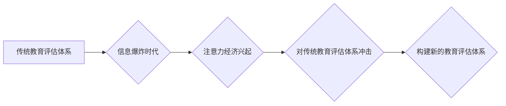

                 

## 1. 背景介绍

在当今信息爆炸的时代，人们面临着前所未有的信息过载。如何有效地获取、处理和利用信息成为了一个至关重要的挑战。在这种背景下，“注意力经济”的概念应运而生，它强调了注意力作为一种稀缺资源的重要性，并指出在竞争激烈的市场中，获取和保持用户的注意力是至关重要的。

传统教育评估体系主要基于考试和作业等形式，侧重于知识的积累和记忆。然而，随着互联网和移动技术的普及，人们的学习方式和习惯发生了根本性的改变。传统的评估体系已经难以适应新时代的需求，无法有效地衡量学生的学习能力、创新能力和解决问题的能力。

## 2. 核心概念与联系

### 2.1 注意力经济

注意力经济是指在信息爆炸的时代，注意力作为一种稀缺资源，其价值被越来越重视。人们为了获取和保持用户的注意力，会投入大量的时间、精力和资源。

**注意力经济的核心要素：**

* **注意力：** 指的是人们对特定信息或事件的集中和持续的关注。
* **稀缺性：** 注意力是一种有限的资源，人们每天只能集中注意力在有限的时间和范围内。
* **竞争：** 在信息爆炸的时代，各种信息和内容都在争夺人们的注意力。
* **价值：** 获取和保持用户的注意力具有巨大的商业价值。

### 2.2 传统教育评估体系

传统教育评估体系主要基于以下几个方面：

* **考试：** 考察学生的知识掌握程度和记忆能力。
* **作业：** 考察学生的学习能力和完成任务的能力。
* **课堂表现：** 考察学生的参与度和课堂表现。

**传统教育评估体系的局限性：**

* **单一维度：** 仅侧重于知识的积累和记忆，无法全面衡量学生的学习能力和综合素质。
* **静态评估：** 无法反映学生的学习过程和动态变化。
* **缺乏个性化：** 无法满足不同学生个体差异的需求。

### 2.3  注意力经济与传统教育评估体系的联系

注意力经济的兴起对传统教育评估体系提出了新的挑战和机遇。

* **挑战：** 传统教育评估体系难以适应新时代的需求，无法有效地衡量学生的学习能力、创新能力和解决问题的能力。
* **机遇：** 注意力经济的理念可以为教育评估体系提供新的思路和方法，帮助构建更加灵活、个性化和有效的评估体系。

**Mermaid 流程图：**



## 3. 核心算法原理 & 具体操作步骤

### 3.1 算法原理概述

在注意力经济背景下，构建新的教育评估体系需要考虑以下几个核心算法原理：

* **个性化推荐算法：** 根据学生的学习兴趣、学习习惯和学习目标，推荐个性化的学习内容和评估方式。
* **行为分析算法：** 分析学生的学习行为数据，例如学习时间、学习内容、学习进度等，识别学生的学习模式和学习难点。
* **智能反馈算法：** 提供及时、个性化的反馈，帮助学生了解自己的学习情况，并改进学习策略。

### 3.2 算法步骤详解

**个性化推荐算法步骤：**

1. 收集学生的学习数据，包括学习兴趣、学习习惯、学习目标等。
2. 利用机器学习算法，构建个性化推荐模型。
3. 根据学生的学习数据，推荐个性化的学习内容和评估方式。

**行为分析算法步骤：**

1. 收集学生的学习行为数据，例如学习时间、学习内容、学习进度等。
2. 利用数据挖掘和机器学习算法，分析学生的学习行为模式。
3. 识别学生的学习难点和学习优势。

**智能反馈算法步骤：**

1. 收集学生的学习数据和评估结果。
2. 利用自然语言处理和机器学习算法，生成个性化的反馈信息。
3. 通过多种方式，例如文本、语音、视频等，向学生提供及时、个性化的反馈。

### 3.3 算法优缺点

**优点：**

* **个性化：** 可以根据学生的个体差异，提供个性化的学习内容和评估方式。
* **效率性：** 可以帮助学生更高效地学习，并更快地掌握知识。
* **反馈性：** 可以及时、个性化的反馈，帮助学生了解自己的学习情况，并改进学习策略。

**缺点：**

* **数据依赖：** 需要大量的学习数据才能训练有效的算法模型。
* **算法复杂性：** 构建和维护复杂的算法模型需要专业的技术人员。
* **伦理问题：** 需要关注算法的公平性、透明性和可解释性。

### 3.4 算法应用领域

* **在线教育平台：** 为学生提供个性化的学习内容和评估方式。
* **学习管理系统：** 分析学生的学习行为，识别学习难点和学习优势。
* **智能辅导系统：** 提供个性化的学习辅导和反馈。

## 4. 数学模型和公式 & 详细讲解 & 举例说明

### 4.1 数学模型构建

在构建新的教育评估体系时，可以利用以下数学模型：

* **贝叶斯网络：** 用于表示学生学习过程中的因果关系和依赖关系。
* **隐马尔可夫模型：** 用于分析学生的学习行为模式，识别学习状态的转移。
* **深度学习模型：** 用于处理海量学习数据，构建更复杂的学习模型。

### 4.2 公式推导过程

**贝叶斯网络公式：**

$$P(A|B) = \frac{P(B|A)P(A)}{P(B)}$$

其中：

* $P(A|B)$ 是在已知事件 B 发生的情况下，事件 A 发生的概率。
* $P(B|A)$ 是在已知事件 A 发生的情况下，事件 B 发生的概率。
* $P(A)$ 是事件 A 发生的概率。
* $P(B)$ 是事件 B 发生的概率。

**隐马尔可夫模型公式：**

$$P(O|λ) = \sum_{Q} P(O|Q)P(Q|λ)$$

其中：

* $P(O|λ)$ 是观测序列 O 在模型 λ 下的概率。
* $P(O|Q)$ 是在状态序列 Q 下观测序列 O 的概率。
* $P(Q|λ)$ 是状态序列 Q 在模型 λ 下的概率。

### 4.3 案例分析与讲解

**案例：**

假设我们想要构建一个个性化推荐学习内容的系统。我们可以利用贝叶斯网络模型，根据学生的学习兴趣、学习习惯和学习目标，预测学生对不同学习内容的偏好。

**分析：**

我们可以将学生的学习兴趣、学习习惯和学习目标作为贝叶斯网络中的节点，并将不同学习内容作为另一个节点。通过收集学生的学习数据，我们可以训练贝叶斯网络模型，并利用模型预测学生对不同学习内容的偏好。

## 5. 项目实践：代码实例和详细解释说明

### 5.1 开发环境搭建

* **操作系统：** Ubuntu 20.04 LTS
* **编程语言：** Python 3.8
* **开发工具：** Jupyter Notebook
* **库依赖：**

```
pip install numpy pandas scikit-learn matplotlib
```

### 5.2 源代码详细实现

```python
import pandas as pd
from sklearn.model_selection import train_test_split
from sklearn.linear_model import LogisticRegression

# 加载学习数据
data = pd.read_csv('learning_data.csv')

# 提取特征和目标变量
features = ['interest', 'habit', 'goal']
target = 'preference'

# 将数据分割为训练集和测试集
X_train, X_test, y_train, y_test = train_test_split(data[features], data[target], test_size=0.2)

# 训练逻辑回归模型
model = LogisticRegression()
model.fit(X_train, y_train)

# 对测试集进行预测
y_pred = model.predict(X_test)

# 评估模型性能
from sklearn.metrics import accuracy_score
accuracy = accuracy_score(y_test, y_pred)
print(f'模型准确率：{accuracy}')
```

### 5.3 代码解读与分析

* **数据加载:** 使用 pandas 库加载学习数据。
* **特征和目标变量提取:** 提取学习兴趣、学习习惯和学习目标作为特征，以及学习偏好作为目标变量。
* **数据分割:** 将数据分割为训练集和测试集，用于训练和评估模型。
* **模型训练:** 使用逻辑回归模型训练，并使用训练集数据进行训练。
* **模型预测:** 使用训练好的模型对测试集数据进行预测。
* **模型评估:** 使用准确率作为评估指标，衡量模型的性能。

### 5.4 运行结果展示

运行代码后，会输出模型的准确率。

## 6. 实际应用场景

### 6.1 在线教育平台

在线教育平台可以利用注意力经济的理念，构建更加个性化和有效的学习体验。例如，可以根据学生的学习兴趣和学习进度，推荐个性化的学习内容和评估方式。

### 6.2 学习管理系统

学习管理系统可以利用行为分析算法，分析学生的学习行为数据，识别学习难点和学习优势。可以根据学生的学习情况，提供个性化的学习辅导和反馈。

### 6.3 智能辅导系统

智能辅导系统可以利用智能反馈算法，提供及时、个性化的学习辅导和反馈。例如，可以根据学生的学习错误，提供针对性的解释和建议。

### 6.4 未来应用展望

随着人工智能技术的不断发展，注意力经济对教育评估体系的影响将会更加深远。未来，我们可以期待看到更加智能、个性化和有效的教育评估体系，帮助学生更好地学习和成长。

## 7. 工具和资源推荐

### 7.1 学习资源推荐

* **Coursera:** https://www.coursera.org/
* **edX:** https://www.edx.org/
* **Udacity:** https://www.udacity.com/

### 7.2 开发工具推荐

* **Jupyter Notebook:** https://jupyter.org/
* **TensorFlow:** https://www.tensorflow.org/
* **PyTorch:** https://pytorch.org/

### 7.3 相关论文推荐

* **Attention Is All You Need:** https://arxiv.org/abs/1706.03762
* **BERT: Pre-training of Deep Bidirectional Transformers for Language Understanding:** https://arxiv.org/abs/1810.04805

## 8. 总结：未来发展趋势与挑战

### 8.1 研究成果总结

注意力经济对传统教育评估体系的冲击，促使人们探索更加个性化、高效和智能的评估方法。基于人工智能技术的个性化推荐算法、行为分析算法和智能反馈算法，为构建新的教育评估体系提供了新的思路和方法。

### 8.2 未来发展趋势

* **更加个性化的评估:** 利用人工智能技术，根据学生的个体差异，提供更加个性化的学习内容和评估方式。
* **更加动态的评估:** 不仅关注学生的学习成果，还关注学生的学习过程和学习能力的提升。
* **更加全面的评估:** 不仅评估学生的知识掌握程度，还评估学生的创新能力、解决问题的能力和合作能力。

### 8.3 面临的挑战

* **数据隐私和安全:** 教育数据涉及学生的个人信息，需要保障数据的隐私和安全。
* **算法公平性和透明性:** 算法模型需要公平、透明和可解释，避免出现偏见和歧视。
* **技术可访问性:** 确保所有学生都能平等地享受人工智能技术带来的教育资源。

### 8.4 研究展望

未来，需要进一步研究如何构建更加公平、透明和可解释的教育评估体系，并探索人工智能技术在教育领域的更多应用场景。

## 9. 附录：常见问题与解答

**常见问题:**

* **注意力经济对教育评估体系的影响是什么？**

**解答:** 注意力经济的兴起对传统教育评估体系提出了新的挑战和机遇。它强调了注意力作为一种稀缺资源的重要性，促使人们探索更加个性化、高效和智能的评估方法。

* **如何利用人工智能技术构建新的教育评估体系？**

**解答:** 可以利用人工智能技术构建个性化推荐算法、行为分析算法和智能反馈算法，为学生提供更加个性化和有效的学习体验。

* **如何保障教育数据隐私和安全？**

**解答:** 需要采取相应的技术措施和政策法规，保障教育数据的隐私和安全。


作者：禅与计算机程序设计艺术 / Zen and the Art of Computer Programming 
<end_of_turn>

