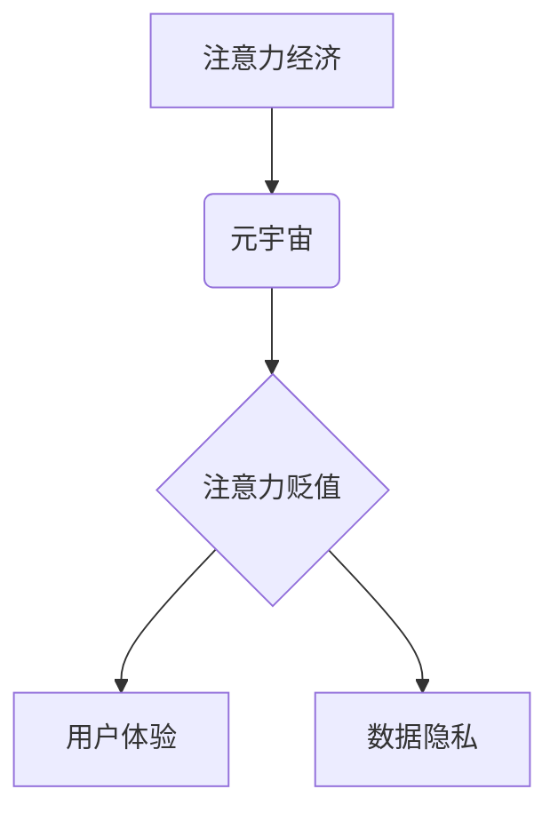

                 

## 注意力经济的通货膨胀:元宇宙中的注意力贬值现象

> 关键词：元宇宙、注意力经济、注意力贬值、用户体验、沉浸式交互、数据隐私

> 摘要：本文探讨了元宇宙时代注意力经济的通货膨胀现象及其对用户体验和数据隐私的影响。随着元宇宙技术的不断发展，虚拟世界将更加沉浸式和交互式，这将导致用户在虚拟空间中花费更多时间和精力，从而加剧注意力经济的竞争。同时，元宇宙平台将收集和利用用户的注意力数据，引发数据隐私和安全问题。本文分析了元宇宙中注意力贬值现象的成因、机制和潜在影响，并提出了应对策略，以促进元宇宙的可持续发展和用户权益保护。

## 1. 背景介绍

1.1  注意力经济的兴起

在信息爆炸的时代，人们面临着来自各方信息的冲击，注意力成为了稀缺的资源。注意力经济的概念应运而生，它认为，获取和控制用户的注意力是商业和技术发展的关键。互联网平台通过各种手段，例如个性化推荐、推送通知、社交互动等，来吸引用户的注意力，并将其转化为商业价值。

1.2  元宇宙的来临

元宇宙的概念是指一个基于互联网、虚拟现实和增强现实技术的虚拟世界，它将融合现实世界和虚拟世界，提供更加沉浸式和交互式的体验。元宇宙的出现，将对注意力经济产生深远的影响。

## 2. 核心概念与联系

2.1  注意力经济

注意力经济是指在信息时代，注意力作为一种稀缺资源，被商业和技术力量所争夺和利用的经济模式。

2.2  元宇宙

元宇宙是一个基于互联网、虚拟现实和增强现实技术的虚拟世界，它将融合现实世界和虚拟世界，提供更加沉浸式和交互式的体验。

2.3  注意力贬值

注意力贬值是指在信息过载和竞争激烈的环境下，用户对信息的注意力持续下降，难以集中和保持，从而影响学习、工作和生活效率。

2.4  关系图



## 3. 核心算法原理 & 具体操作步骤

3.1  算法原理概述

注意力机制是一种模仿人类注意力机制的算法，它能够学习到输入数据中最重要的部分，并对这些部分给予更多的关注。在元宇宙中，注意力机制可以应用于各种场景，例如：

* **沉浸式交互:** 通过注意力机制，元宇宙平台可以根据用户的行为和兴趣，提供更加个性化和沉浸式的交互体验。
* **虚拟环境建模:** 注意力机制可以帮助元宇宙平台更好地理解用户的感知和行为，从而构建更加逼真的虚拟环境。
* **内容推荐:** 注意力机制可以帮助元宇宙平台推荐更加符合用户兴趣的内容，提高用户粘性和参与度。

3.2  算法步骤详解

注意力机制的具体操作步骤通常包括以下几个阶段：

* **输入数据处理:** 将输入数据转换为适合注意力机制处理的格式。
* **注意力权重计算:** 计算每个输入数据元素的注意力权重，权重越高表示该元素越重要。
* **加权求和:** 根据注意力权重，对输入数据进行加权求和，得到最终的输出结果。

3.3  算法优缺点

注意力机制的优点包括：

* **能够学习到输入数据中最重要的部分:** 注意力机制能够有效地聚焦于输入数据中关键信息，提高模型的学习效率。
* **能够处理长序列数据:** 注意力机制能够有效地处理长序列数据，例如文本和音频。
* **能够解释模型的决策过程:** 注意力权重可以直观地反映模型对输入数据的关注程度，帮助我们理解模型的决策过程。

注意力机制的缺点包括：

* **计算复杂度较高:** 注意力机制的计算复杂度较高，尤其是在处理长序列数据时。
* **参数量较大:** 注意力机制的参数量较大，需要大量的训练数据才能达到良好的效果。

3.4  算法应用领域

注意力机制在元宇宙中具有广泛的应用领域，例如：

* **虚拟角色交互:** 注意力机制可以帮助虚拟角色更好地理解用户的意图和情感，从而提供更加自然和真实的交互体验。
* **虚拟环境导航:** 注意力机制可以帮助用户在虚拟环境中更有效地导航，并找到目标地点。
* **虚拟物品交互:** 注意力机制可以帮助用户更精准地控制虚拟物品，并进行更加细致的操作。

## 4. 数学模型和公式 & 详细讲解 & 举例说明

4.1  数学模型构建

注意力机制的数学模型通常基于以下公式：

$$
\text{Attention}(Q, K, V) = \text{softmax}\left(\frac{Q K^T}{\sqrt{d_k}}\right) V
$$

其中：

* $Q$：查询矩阵
* $K$：键矩阵
* $V$：值矩阵
* $d_k$：键向量的维度
* $\text{softmax}$：softmax函数

4.2  公式推导过程

注意力机制的核心思想是计算每个输入数据元素与查询向量之间的相似度，并根据相似度分配注意力权重。

* **计算相似度:** 使用点积运算计算查询向量与每个键向量的相似度。
* **归一化:** 使用softmax函数将相似度转换为注意力权重，使得权重之和为1。
* **加权求和:** 根据注意力权重，对值矩阵进行加权求和，得到最终的输出结果。

4.3  案例分析与讲解

例如，在机器翻译任务中，查询向量表示目标语言的词语，键向量和值向量分别表示源语言词语的嵌入向量。注意力机制可以计算每个源语言词语与目标语言词语之间的相似度，并根据相似度分配注意力权重。最终，注意力机制将根据注意力权重，对源语言词语进行加权求和，得到目标语言的词语翻译结果。

## 5. 项目实践：代码实例和详细解释说明

5.1  开发环境搭建

* Python 3.7+
* TensorFlow 2.0+
* PyTorch 1.0+

5.2  源代码详细实现

```python
import tensorflow as tf

# 定义注意力机制层
class AttentionLayer(tf.keras.layers.Layer):
    def __init__(self, units):
        super(AttentionLayer, self).__init__()
        self.Wq = tf.keras.layers.Dense(units)
        self.Wk = tf.keras.layers.Dense(units)
        self.Wv = tf.keras.layers.Dense(units)
        self.softmax = tf.keras.layers.Softmax()

    def call(self, inputs):
        Q = self.Wq(inputs)
        K = self.Wk(inputs)
        V = self.Wv(inputs)
        attention_weights = self.softmax(tf.matmul(Q, K, transpose_b=True) / tf.math.sqrt(tf.cast(units, tf.float32)))
        output = tf.matmul(attention_weights, V)
        return output

# 实例化注意力机制层
attention_layer = AttentionLayer(units=128)

# 输入数据
inputs = tf.random.normal(shape=(32, 10, 64))

# 通过注意力机制层进行处理
output = attention_layer(inputs)
```

5.3  代码解读与分析

* `AttentionLayer` 类定义了一个注意力机制层，包含三个稠密层 (`Wq`, `Wk`, `Wv`) 用于计算查询、键和值向量的嵌入表示。
* `call` 方法实现注意力机制的计算过程，包括计算相似度、归一化和加权求和。
* `softmax` 函数将相似度转换为注意力权重，使得权重之和为1。
* `tf.matmul` 函数用于计算矩阵乘法。

5.4  运行结果展示

运行上述代码，将输出注意力机制处理后的数据，可以观察到注意力权重如何分配到输入数据中不同的元素。

## 6. 实际应用场景

6.1  元宇宙游戏

在元宇宙游戏中，注意力机制可以用于：

* **NPC交互:** 增强NPC的交互能力，使其能够更好地理解玩家的意图和情感。
* **游戏剧情设计:** 根据玩家的注意力分布，动态调整游戏剧情和任务，提供更加个性化的游戏体验。
* **游戏物品设计:** 设计更加吸引玩家注意力的游戏物品，提高玩家的参与度和粘性。

6.2  元宇宙社交

在元宇宙社交平台，注意力机制可以用于：

* **个性化推荐:** 根据用户的兴趣和行为，推荐更加符合用户需求的社交内容和好友。
* **沉浸式社交体验:** 通过注意力机制，模拟现实世界中的社交互动方式，提供更加真实和自然的社交体验。
* **虚拟身份构建:** 帮助用户构建更加个性化的虚拟身份，并与其他用户进行更深层次的互动。

6.3  元宇宙教育

在元宇宙教育场景，注意力机制可以用于：

* **个性化学习:** 根据学生的学习进度和兴趣，提供更加个性化的学习内容和教学方式。
* **沉浸式学习体验:** 通过虚拟现实和增强现实技术，构建更加沉浸式的学习环境，提高学生的学习兴趣和效率。
* **互动式教学:** 利用注意力机制，增强学生与老师和同学的互动，提高课堂参与度。

6.4  未来应用展望

随着元宇宙技术的不断发展，注意力机制将在元宇宙中发挥更加重要的作用，例如：

* **元宇宙内容创作:** 利用注意力机制，帮助内容创作者更好地理解用户的需求，创作更加吸引人的内容。
* **元宇宙商业模式创新:** 开发基于注意力机制的新型商业模式，例如注意力交易平台和注意力货币。
* **元宇宙伦理规范:** 研究注意力机制在元宇宙中的伦理问题，例如数据隐私、信息操控和用户依赖。

## 7. 工具和资源推荐

7.1  学习资源推荐

* **书籍:**
    * 《深度学习》
    * 《自然语言处理》
    * 《机器学习》
* **在线课程:**
    * Coursera
    * edX
    * Udacity

7.2  开发工具推荐

* **TensorFlow:** 开源深度学习框架
* **PyTorch:** 开源深度学习框架
* **Keras:** 高级深度学习API

7.3  相关论文推荐

* 《Attention Is All You Need》
* 《BERT: Pre-training of Deep Bidirectional Transformers for Language Understanding》
* 《Transformer-XL: Attentive Language Models Beyond a Fixed-Length Context》

## 8. 总结：未来发展趋势与挑战

8.1  研究成果总结

注意力机制在元宇宙中具有广泛的应用前景，能够提升用户体验、丰富交互方式、促进内容创作和商业模式创新。

8.2  未来发展趋势

未来，注意力机制的研究将更加深入，例如：

* **自注意力机制:** 能够更好地处理长序列数据，并提高模型的效率。
* **多模态注意力机制:** 能够融合文本、图像、音频等多种模态数据，提供更加全面的用户体验。
* **可解释性注意力机制:** 能够解释模型的决策过程，提高模型的可信度和透明度。

8.3  面临的挑战

元宇宙中注意力机制的应用也面临一些挑战，例如：

* **数据隐私:** 元宇宙平台收集和利用用户的注意力数据，可能会引发数据隐私和安全问题。
* **信息操控:** 注意力机制可以被用于操控用户的注意力，例如推送虚假信息或诱导用户进行不理智的消费。
* **用户依赖:** 过度依赖注意力机制可能会导致用户注意力分散，难以集中精力进行其他活动。

8.4  研究展望

未来研究需要关注以下几个方面：

* **开发更加安全和隐私保护的注意力机制算法。**
* **制定相应的伦理规范，规范注意力机制在元宇宙中的应用。**
* **提高用户对注意力机制的认知和理解，引导用户健康地使用元宇宙。**


## 9. 附录：常见问题与解答

9.1  Q: 注意力机制的计算复杂度较高，如何提高效率？

A: 可以使用一些优化技术，例如：

* **局部注意力机制:** 只计算部分输入数据之间的注意力权重，减少计算量。
* **稀疏注意力机制:** 只计算重要的注意力权重，忽略不重要的权重，减少计算量。
* **并行计算:** 利用多核处理器或GPU进行并行计算，提高计算效率。

9.2  Q: 注意力机制容易受到噪声数据的影响，如何解决这个问题？

A: 可以使用一些噪声抑制技术，例如：

* **数据清洗:** 在训练数据中去除噪声数据。
* **正则化:** 在模型训练过程中添加正则化项，抑制模型对噪声数据的敏感性。
* **鲁棒性注意力机制:** 设计更加鲁棒的注意力机制算法，能够更好地抵抗噪声数据的影响。


作者：禅与计算机程序设计艺术 / Zen and the Art of Computer Programming<end_of_turn>

