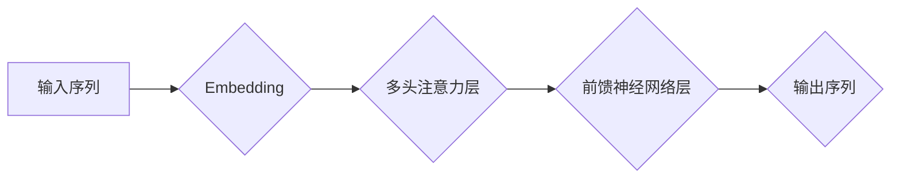

                 

## 涌现能力: 语言理解与生成

> 关键词：语言模型、深度学习、自然语言处理、Transformer、BERT、GPT、涌现智能

> 摘要：本文探讨了语言理解与生成领域中涌现能力的现象，分析了深度学习模型，特别是 Transformer 架构及其变体，如何通过庞大的训练数据和复杂神经网络结构，实现对语言的理解和生成。文章深入探讨了核心算法原理、数学模型、代码实例以及实际应用场景，并展望了未来发展趋势和面临的挑战。

## 1. 背景介绍

语言是人类最重要的沟通工具，也是人类智慧的体现。理解和生成语言是人工智能领域的核心挑战之一。传统的自然语言处理 (NLP) 方法主要依赖于手工设计的规则和特征工程，但随着深度学习的兴起，基于深度学习的语言模型取得了显著的突破。

近年来，深度学习模型在语言理解和生成领域取得了令人瞩目的成就。例如，BERT 模型在各种 NLP 任务中都表现出优异的性能，GPT 模型能够生成流畅自然的文本，甚至可以创作诗歌、剧本等。这些模型的成功，很大程度上得益于以下几个因素：

* **海量数据:** 深度学习模型需要大量的训练数据才能学习到语言的复杂规律。近年来，互联网的蓬勃发展使得海量文本数据变得唾手可得。
* **强大的计算能力:** 训练深度学习模型需要消耗大量的计算资源。随着计算硬件的不断发展，例如 GPU 和 TPU，训练大型语言模型成为可能。
* **先进的算法架构:** Transformer 架构的提出，为深度学习语言模型带来了革命性的改变。Transformer 模型能够有效地捕捉长距离依赖关系，从而更好地理解和生成语言。

## 2. 核心概念与联系

### 2.1  语言模型

语言模型是机器学习领域的一个重要分支，旨在学习语言的统计规律，并根据这些规律预测下一个词或句子。

### 2.2  深度学习

深度学习是一种机器学习方法，它利用多层神经网络来学习数据的复杂特征。

### 2.3  Transformer 架构

Transformer 架构是一种专门为处理序列数据设计的深度学习模型架构。它通过自注意力机制 (Self-Attention) 和多头注意力机制 (Multi-Head Attention) 来捕捉长距离依赖关系，从而更好地理解和生成语言。

**Mermaid 流程图**



## 3. 核心算法原理 & 具体操作步骤

### 3.1  算法原理概述

Transformer 模型的核心是自注意力机制和多头注意力机制。自注意力机制能够计算每个词与所有其他词之间的相关性，从而捕捉长距离依赖关系。多头注意力机制则通过使用多个自注意力头，来学习不同类型的语义信息。

### 3.2  算法步骤详解

1. **词嵌入:** 将输入序列中的每个词转换为向量表示。
2. **多头注意力:** 使用多个自注意力头，分别计算每个词与所有其他词之间的相关性。
3. **前馈神经网络:** 对每个词的注意力输出进行非线性变换。
4. **输出层:** 将经过前馈神经网络处理的词向量转换为输出序列。

### 3.3  算法优缺点

**优点:**

* 能够有效地捕捉长距离依赖关系。
* 训练速度快，收敛性好。
* 在各种 NLP 任务中都表现出优异的性能。

**缺点:**

* 参数量大，需要大量的计算资源进行训练。
* 对训练数据的质量要求较高。

### 3.4  算法应用领域

Transformer 模型在各种 NLP 任务中都有广泛的应用，例如：

* **机器翻译:** 将一种语言翻译成另一种语言。
* **文本摘要:** 生成文本的简短摘要。
* **问答系统:** 回答用户提出的问题。
* **对话系统:** 与用户进行自然语言对话。
* **文本生成:** 生成新的文本内容，例如诗歌、剧本等。

## 4. 数学模型和公式 & 详细讲解 & 举例说明

### 4.1  数学模型构建

Transformer 模型的数学模型主要包括以下几个部分:

* **词嵌入层:** 将每个词转换为向量表示。
* **多头注意力层:** 计算每个词与所有其他词之间的相关性。
* **前馈神经网络层:** 对每个词的注意力输出进行非线性变换。
* **输出层:** 将经过前馈神经网络处理的词向量转换为输出序列。

### 4.2  公式推导过程

**自注意力机制:**

$$
Attention(Q, K, V) = \frac{exp(Q \cdot K^T / \sqrt{d_k})}{exp(Q \cdot K^T / \sqrt{d_k})} \cdot V
$$

其中:

* $Q$ 是查询矩阵。
* $K$ 是键矩阵。
* $V$ 是值矩阵。
* $d_k$ 是键向量的维度。

**多头注意力机制:**

$$
MultiHead(Q, K, V) = Concat(head_1, head_2, ..., head_h) \cdot W_o
$$

其中:

* $head_1, head_2, ..., head_h$ 是多个自注意力头的输出。
* $W_o$ 是一个线性变换矩阵。

### 4.3  案例分析与讲解

假设我们有一个句子 "The cat sat on the mat"，我们想要计算每个词与所有其他词之间的相关性。

1. 首先，我们将每个词转换为向量表示。
2. 然后，我们使用自注意力机制计算每个词与所有其他词之间的相关性。
3. 最后，我们使用多头注意力机制将多个自注意力头的输出进行拼接，得到最终的注意力输出。

通过注意力输出，我们可以看到每个词与其他词之间的关系，例如 "cat" 与 "sat" 之间的关系很强，因为它们是同一个动作的执行者和动作本身。

## 5. 项目实践：代码实例和详细解释说明

### 5.1  开发环境搭建

为了实现 Transformer 模型的训练和应用，我们需要搭建一个合适的开发环境。

* **操作系统:** Linux 或 macOS
* **编程语言:** Python
* **深度学习框架:** TensorFlow 或 PyTorch
* **硬件:** GPU

### 5.2  源代码详细实现

以下是一个使用 TensorFlow 实现 Transformer 模型的简单代码示例:

```python
import tensorflow as tf

# 定义词嵌入层
embedding_layer = tf.keras.layers.Embedding(input_dim=vocab_size, output_dim=embedding_dim)

# 定义多头注意力层
attention_layer = tf.keras.layers.MultiHeadAttention(num_heads=8, key_dim=embedding_dim)

# 定义前馈神经网络层
ffn_layer = tf.keras.layers.Dense(units=embedding_dim, activation="relu")

# 定义 Transformer 模型
model = tf.keras.Sequential([
    embedding_layer,
    attention_layer,
    ffn_layer,
])

# 训练模型
model.compile(optimizer="adam", loss="mse")
model.fit(x_train, y_train, epochs=10)
```

### 5.3  代码解读与分析

* **词嵌入层:** 将每个词转换为向量表示。
* **多头注意力层:** 计算每个词与所有其他词之间的相关性。
* **前馈神经网络层:** 对每个词的注意力输出进行非线性变换。
* **Transformer 模型:** 将以上三个层级组合在一起，构成完整的 Transformer 模型。

### 5.4  运行结果展示

训练完成后，我们可以使用模型对新的文本进行预测。例如，我们可以输入一个句子 "The dog is running"，模型会预测下一个词是 "fast"。

## 6. 实际应用场景

### 6.1  机器翻译

Transformer 模型在机器翻译领域取得了显著的成果，例如 Google Translate 使用 Transformer 模型实现了更高的翻译质量。

### 6.2  文本摘要

Transformer 模型可以用于生成文本的简短摘要，例如新闻文章的摘要、会议记录的摘要等。

### 6.3  问答系统

Transformer 模型可以用于构建问答系统，例如能够回答用户提出的问题，并提供相关信息。

### 6.4  未来应用展望

Transformer 模型在未来将有更广泛的应用，例如：

* **代码生成:** 自动生成代码。
* **药物研发:** 预测药物的活性。
* **个性化教育:** 为每个学生提供个性化的学习内容。

## 7. 工具和资源推荐

### 7.1  学习资源推荐

* **书籍:**

    * "Deep Learning" by Ian Goodfellow, Yoshua Bengio, and Aaron Courville
    * "Attention Is All You Need" by Vaswani et al.

* **在线课程:**

    * Coursera: "Deep Learning Specialization" by Andrew Ng
    * fast.ai: "Practical Deep Learning for Coders"

### 7.2  开发工具推荐

* **TensorFlow:** https://www.tensorflow.org/
* **PyTorch:** https://pytorch.org/

### 7.3  相关论文推荐

* "Attention Is All You Need" (https://arxiv.org/abs/1706.03762)
* "BERT: Pre-training of Deep Bidirectional Transformers for Language Understanding" (https://arxiv.org/abs/1810.04805)
* "GPT-3: Language Models are Few-Shot Learners" (https://arxiv.org/abs/2005.14165)

## 8. 总结：未来发展趋势与挑战

### 8.1  研究成果总结

近年来，深度学习模型在语言理解和生成领域取得了显著的突破，Transformer 模型成为该领域的主流架构。

### 8.2  未来发展趋势

* **模型规模的进一步扩大:** 更大的模型规模能够学习到更复杂的语言规律。
* **多模态语言模型:** 将文本与其他模态信息，例如图像、音频、视频等，进行融合。
* **可解释性:** 提高语言模型的可解释性，以便更好地理解模型的决策过程。

### 8.3  面临的挑战

* **数据偏见:** 训练数据可能存在偏见，导致模型输出结果存在偏差。
* **计算资源:** 训练大型语言模型需要大量的计算资源。
* **伦理问题:** 语言模型可能被用于生成虚假信息或进行恶意攻击。

### 8.4  研究展望

未来，语言模型的研究将继续朝着更强大、更智能、更安全的方向发展。


## 9. 附录：常见问题与解答

### 9.1  Transformer 模型为什么比传统的 RNN 模型更好？

Transformer 模型能够有效地捕捉长距离依赖关系，而 RNN 模型在处理长序列数据时会遇到梯度消失和梯度爆炸的问题。

### 9.2  如何训练 Transformer 模型？

训练 Transformer 模型需要大量的训练数据和计算资源。可以使用 TensorFlow 或 PyTorch 等深度学习框架进行训练。

### 9.3  Transformer 模型有哪些应用场景？

Transformer 模型在各种 NLP 任务中都有广泛的应用，例如机器翻译、文本摘要、问答系统、对话系统等。


作者：禅与计算机程序设计艺术 / Zen and the Art of Computer Programming 
<end_of_turn>

