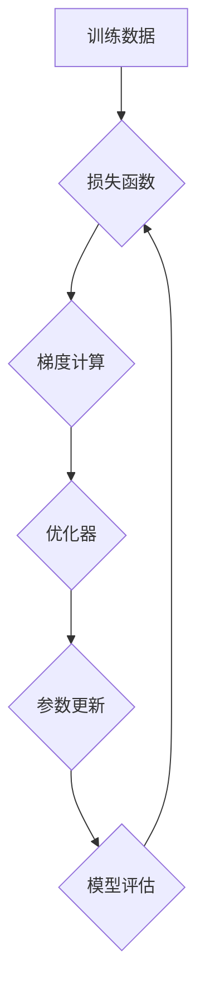

                 

## 深度学习优化技巧：初始化、AdamW优化器等

> 关键词：深度学习、优化器、初始化、AdamW、学习率、梯度下降、训练效率、模型性能

## 1. 背景介绍

深度学习近年来取得了令人瞩目的成就，在图像识别、自然语言处理、语音识别等领域展现出强大的能力。然而，深度学习模型的训练过程仍然面临着诸多挑战，其中优化算法和参数初始化策略尤为重要。

优化算法负责更新模型参数，使其朝着最小化损失函数的方向前进。而参数初始化则决定了模型训练的初始状态，直接影响着训练的收敛速度和最终性能。

选择合适的优化算法和初始化策略可以显著提高训练效率，提升模型性能，并避免训练过程中的常见问题，例如梯度消失、梯度爆炸等。

## 2. 核心概念与联系

深度学习模型的训练本质上是一个寻找最优参数的过程，目标是找到一组参数，使得模型在训练数据上的损失函数最小化。

**2.1 梯度下降算法**

梯度下降算法是深度学习中最常用的优化算法之一。其核心思想是通过计算损失函数对参数的梯度，沿着梯度负方向更新参数，逐步逼近损失函数的最小值。

**2.2 参数初始化**

参数初始化是指在训练开始之前，为模型参数赋予初始值的过程。不同的初始化策略会对模型训练产生不同的影响。

**2.3 优化器**

优化器是深度学习训练中用于更新模型参数的算法。常见的优化器包括梯度下降、Momentum、RMSprop、Adam等。

**2.4 学习率**

学习率是优化算法中的一个重要超参数，控制着参数更新的步长。学习率过大可能会导致模型训练不稳定，学习率过小则会延长训练时间。

**2.5 损失函数**

损失函数用于衡量模型预测结果与真实值的差距。常用的损失函数包括均方误差、交叉熵等。

**Mermaid 流程图**



## 3. 核心算法原理 & 具体操作步骤

### 3.1 算法原理概述

AdamW 优化器是 Adam 优化器的改进版本，它结合了 Momentum 和 Weight Decay 的优点，能够更有效地训练深度学习模型。

AdamW 优化器基于梯度下降算法，通过积累梯度和梯度平方来调整学习率，并引入权重衰减来防止模型过拟合。

### 3.2 算法步骤详解

1. **初始化参数:** 初始化模型参数，并设置学习率、衰减率等超参数。

2. **计算梯度:** 计算损失函数对模型参数的梯度。

3. **更新梯度积累:** 将当前梯度累积到相应的变量中，并对梯度平方进行累积。

4. **计算自适应学习率:** 根据梯度积累和梯度平方积累，计算每个参数的自适应学习率。

5. **更新模型参数:** 使用自适应学习率更新模型参数。

6. **应用权重衰减:** 对模型参数进行权重衰减，防止模型过拟合。

7. **重复步骤2-6:** 重复上述步骤，直到模型训练完成或达到预设的性能指标。

### 3.3 算法优缺点

**优点:**

* 训练速度快，收敛性好。
* 对超参数设置的鲁棒性强。
* 可以有效防止模型过拟合。

**缺点:**

* 计算复杂度较高。
* 需要更多的内存空间。

### 3.4 算法应用领域

AdamW 优化器广泛应用于各种深度学习任务，例如图像识别、自然语言处理、语音识别等。

## 4. 数学模型和公式 & 详细讲解 & 举例说明

### 4.1 数学模型构建

AdamW 优化器的核心思想是利用动量和自适应学习率来加速训练过程。

**动量:**

动量可以看作是梯度历史信息的累积，它可以帮助模型跳过局部最优解，更快地收敛到全局最优解。

**自适应学习率:**

自适应学习率根据梯度信息动态调整每个参数的学习率，可以使模型在不同参数上学习更有效。

### 4.2 公式推导过程

AdamW 优化器的公式如下：

$$
\begin{aligned}
v_t &= \beta_1 v_{t-1} + (1 - \beta_1) g_t \\
s_t &= \beta_2 s_{t-1} + (1 - \beta_2) g_t^2 \\
\hat{v}_t &= v_t / (1 - \beta_1^t) \\
\hat{s}_t &= s_t / (1 - \beta_2^t) \\
\theta_t &= \theta_{t-1} - \frac{\alpha}{\sqrt{\hat{s}_t} + \epsilon} (\hat{v}_t + \lambda \theta_{t-1})
\end{aligned}
$$

其中：

* $\theta_t$ 是模型参数在时间步 $t$ 的值。
* $g_t$ 是损失函数对参数 $\theta_t$ 的梯度。
* $\alpha$ 是学习率。
* $\beta_1$ 和 $\beta_2$ 是动量衰减率。
* $\epsilon$ 是一个小常数，用于避免分母为零。
* $\lambda$ 是权重衰减率。

### 4.3 案例分析与讲解

假设我们有一个简单的线性回归模型，目标是预测房价。

我们可以使用 AdamW 优化器来训练这个模型。

在训练过程中，AdamW 优化器会根据梯度信息动态调整每个参数的学习率，并应用动量和权重衰减来加速训练过程。

最终，我们得到一个能够准确预测房价的模型。

## 5. 项目实践：代码实例和详细解释说明

### 5.1 开发环境搭建

为了实现 AdamW 优化器，我们需要使用深度学习框架，例如 TensorFlow 或 PyTorch。

以下是一个使用 PyTorch 搭建开发环境的示例：

```bash
pip install torch torchvision torchaudio
```

### 5.2 源代码详细实现

以下是一个使用 AdamW 优化器训练线性回归模型的 PyTorch 代码示例：

```python
import torch
import torch.nn as nn
import torch.optim as optim

# 定义线性回归模型
class LinearRegression(nn.Module):
    def __init__(self, input_size, output_size):
        super(LinearRegression, self).__init__()
        self.linear = nn.Linear(input_size, output_size)

    def forward(self, x):
        return self.linear(x)

# 创建模型实例
model = LinearRegression(input_size=1, output_size=1)

# 定义损失函数和优化器
criterion = nn.MSELoss()
optimizer = optim.AdamW(model.parameters(), lr=0.01, weight_decay=0.01)

# 训练模型
for epoch in range(100):
    # 前向传播
    outputs = model(inputs)
    loss = criterion(outputs, targets)

    # 反向传播
    optimizer.zero_grad()
    loss.backward()

    # 更新参数
    optimizer.step()

    # 打印损失
    print(f'Epoch [{epoch+1}/{100}], Loss: {loss.item():.4f}')
```

### 5.3 代码解读与分析

* **模型定义:** 我们定义了一个简单的线性回归模型，包含一个线性层。
* **损失函数:** 我们使用均方误差 (MSE) 作为损失函数，衡量模型预测结果与真实值的差距。
* **优化器:** 我们使用 AdamW 优化器来更新模型参数。
* **训练循环:** 我们使用一个训练循环，迭代训练模型。
* **前向传播:** 在每个迭代中，我们首先将输入数据传递到模型中，得到模型的预测结果。
* **反向传播:** 然后，我们计算损失函数对模型参数的梯度。
* **参数更新:** 最后，我们使用优化器更新模型参数，使其朝着最小化损失函数的方向前进。

### 5.4 运行结果展示

训练完成后，我们可以使用测试数据评估模型的性能。

例如，我们可以计算模型在测试数据上的均方误差 (MSE) 值。

## 6. 实际应用场景

AdamW 优化器在各种深度学习任务中都有广泛的应用，例如：

* **图像识别:** 在图像分类、目标检测、图像分割等任务中，AdamW 优化器可以帮助模型更快地收敛到更高的准确率。
* **自然语言处理:** 在文本分类、机器翻译、文本生成等任务中，AdamW 优化器可以帮助模型更好地学习语言的复杂结构。
* **语音识别:** 在语音识别任务中，AdamW 优化器可以帮助模型更好地识别语音信号中的语音特征。

### 6.4 未来应用展望

随着深度学习技术的不断发展，AdamW 优化器和类似的优化器将继续在深度学习领域发挥重要作用。

未来，我们可能会看到以下方面的进展：

* **更有效的优化算法:** 研究人员将继续探索新的优化算法，以提高训练效率和模型性能。
* **自适应学习率的改进:** 自适应学习率机制将继续改进，以更好地适应不同的模型和任务。
* **混合优化器:** 将不同的优化算法组合在一起，以获得更好的性能。

## 7. 工具和资源推荐

### 7.1 学习资源推荐

* **深度学习书籍:**

    * 《深度学习》 - Ian Goodfellow, Yoshua Bengio, Aaron Courville
    * 《动手学深度学习》 -  李沐

* **在线课程:**

    * Coursera: 深度学习 Specialization
    * Udacity: Deep Learning Nanodegree

### 7.2 开发工具推荐

* **深度学习框架:**

    * TensorFlow
    * PyTorch
    * Keras

* **编程语言:**

    * Python

### 7.3 相关论文推荐

* Adam: A Method for Stochastic Optimization
* On the Variance of the Adaptive Learning Rate Method

## 8. 总结：未来发展趋势与挑战

### 8.1 研究成果总结

深度学习优化算法的研究取得了显著进展，AdamW 优化器是其中一个重要的成果。

AdamW 优化器结合了动量和自适应学习率的优点，能够有效地训练深度学习模型。

### 8.2 未来发展趋势

未来，深度学习优化算法的研究将继续朝着以下方向发展：

* **更有效的优化算法:** 研究人员将继续探索新的优化算法，以提高训练效率和模型性能。
* **自适应学习率的改进:** 自适应学习率机制将继续改进，以更好地适应不同的模型和任务。
* **混合优化器:** 将不同的优化算法组合在一起，以获得更好的性能。

### 8.3 面临的挑战

深度学习优化算法的研究仍然面临着一些挑战：

* **理论分析:** 许多优化算法的理论分析仍然不够完善，需要进一步的研究。
* **算法设计:** 设计出能够有效地解决各种深度学习任务的优化算法仍然是一个难题。
* **计算资源:** 训练大型深度学习模型需要大量的计算资源，这对于资源有限的机构或个人来说是一个挑战。

### 8.4 研究展望

尽管面临着挑战，但深度学习优化算法的研究前景仍然广阔。

随着理论研究的深入和计算资源的不断增加，我们相信未来将会出现更多更有效的深度学习优化算法，推动深度学习技术的进一步发展。

## 9. 附录：常见问题与解答

**问题 1:** AdamW 优化器与 Adam 优化器有什么区别？

**答案:** AdamW 优化器是 Adam 优化器的改进版本，它引入了权重衰减，可以有效防止模型过拟合。

**问题 2:** 如何选择 AdamW 优化器的超参数？

**答案:** AdamW 优化器的超参数包括学习率、动量衰减率和权重衰减率。

学习率通常设置为 0.001 或 0.01，动量衰减率设置为 0.9 或 0.99，权重衰减率设置为 0.01 或 0.001。

**问题 3:** AdamW 优化器适用于哪些深度学习任务？

**答案:** AdamW 优化器适用于各种深度学习任务，例如图像识别、自然语言处理、语音识别等。


作者：禅与计算机程序设计艺术 / Zen and the Art of Computer Programming 
<end_of_turn>

